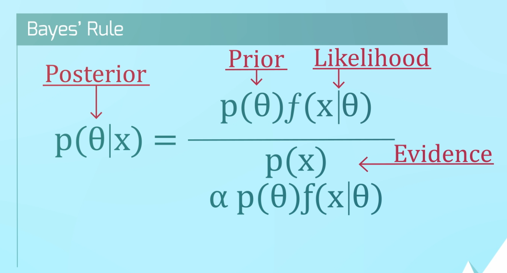
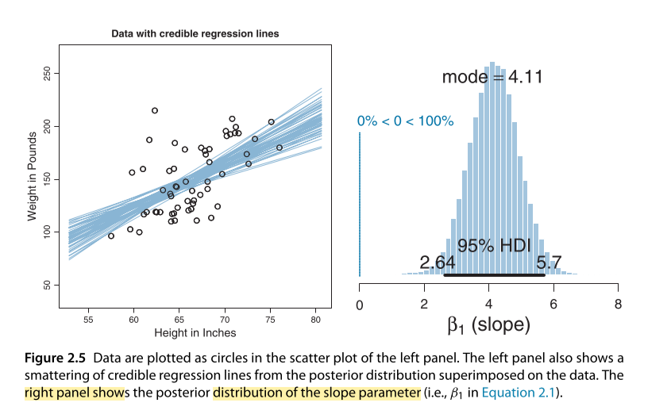
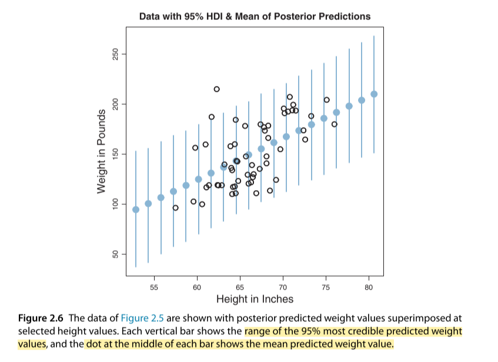

# Ch 1 & 2 - Intro / Credibility Models

## Overview
1. Two Paradigms of Stats
2. Bayes Theorom Simple Overview
3. Credible Models

## 1. Two Major Paradigms of Stats

Paradigm  | Description
----------|------------
Classical | Data *given the* parameter
Bayesian  | Paramter *given the* data

## 2. Bayes Rule

Concept    | Side of Equation | Meaning
-----------|------------------|----------
Posterior  | Left             | Density
Prior      | Top Left         | Prior beliefs of parameter
Likelihood | Top Right        | How data enter into the analysis
Evidence   | Bottom           | Prior * the likelihood

 

 

---

## 3. Credible Models
* 3.1 Can reallocate credibility by assigning new probabilities 
* 3.2 Can create a distribution using only the mean and standard deviation (Similar to `NORM.INV()`)

### 3.3 Credible Regression and `Variability of Slope Distributions`
> Distribution of possible `slope` values  

 

 

#### `HDI (highest density interval)`
*Higher density = more credible*

**Overview**  
* Summarize uncertainty by marking the span of values that are most credible and cover 95% of the distribution.
* Values within the 95% HDI are more credible (i.e., have higher probability “density”) than values outside the HDI, 
* Values *inside* the HDI have a *total probability of 95%*. 

**Interpretation**  
* Given the 57 data points, the 95% HDI goes from
a slope ofabout 2.6 pounds per inch to a slope ofabout 5.7 pounds per inch. 

---

### 3.4 Credible Regression: `HDI` at *Varying Heights*

 

 

**Overview**  
* Each vertical bar shows the range of the `95% most credible` predicted weight values `at selected height values`
* Dot at the middle of each bar shows the `mean` predictedweight value.

**Interpretation**
* Predicted data describes the actual data well since most points fall within the lines at all heights
* The actual data `do not appear to deviate` systematically from the trend or band predicted from the model.