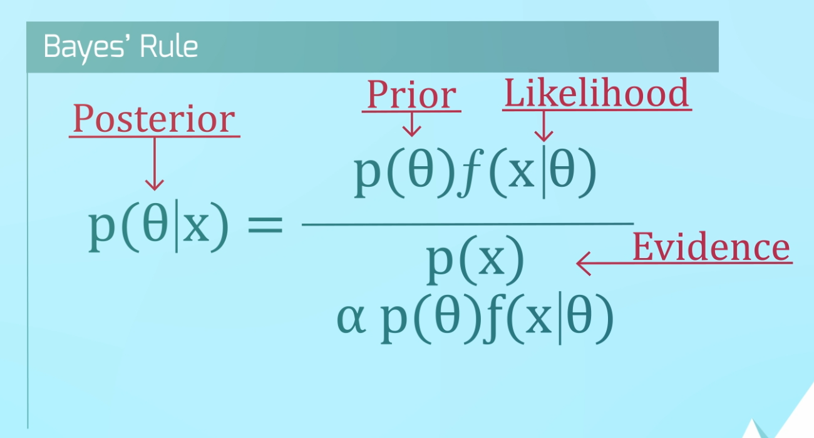

# Ch 1/2 - Credibility Models

## Two Major Paradigms of Stats

Paradigm  | Description
----------|------------
Classical | Data *given the* parameter
Bayesian  | Paramter *given the* data

## Bayes Rule

Concept    | Side of Equation | Meaning
-----------|------------------|----------
Posterior  | Left             | Density
Prior      | Top Left         | Prior beliefs of parameter
Likelihood | Top Right        | How data enter into the analysis
Evidence   | Bottom           | Prior * the likelihood

 

