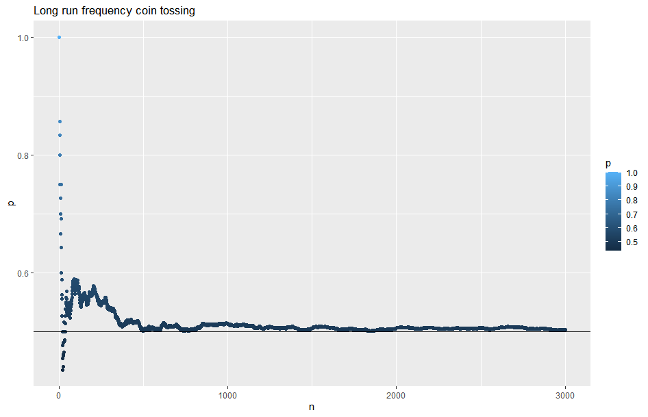
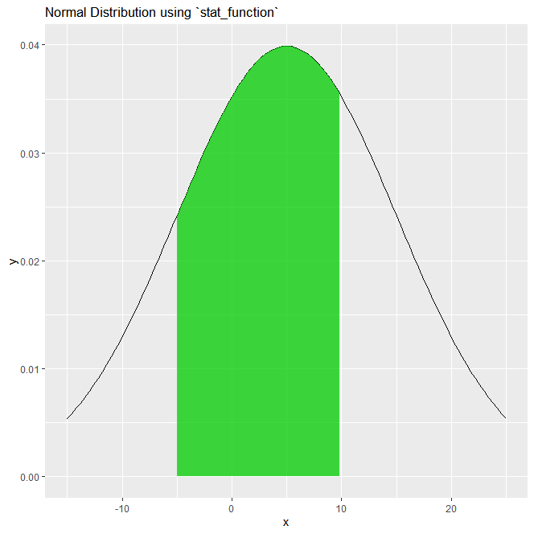
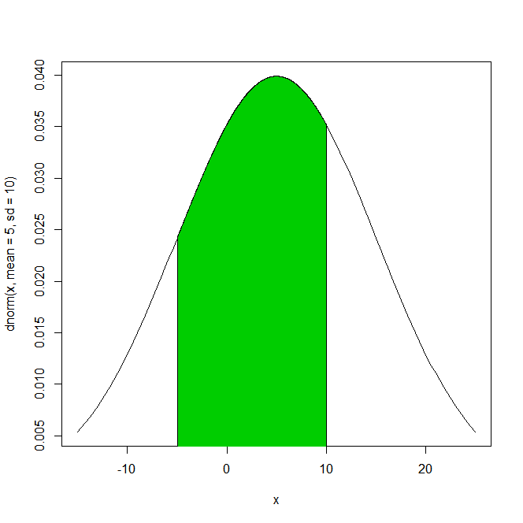
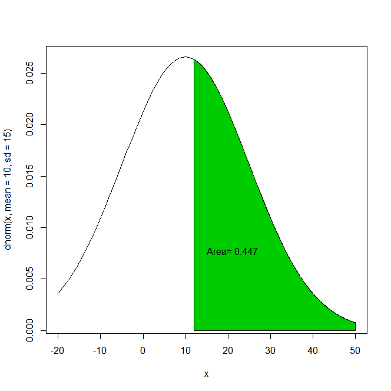
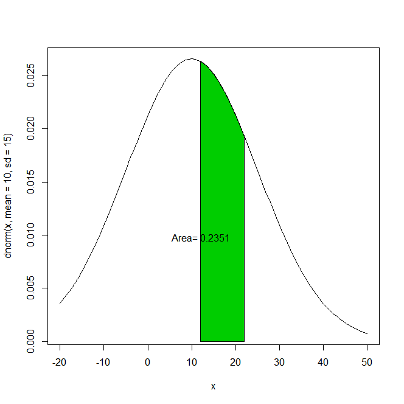

# Probability

## Resources

## Outline
1. Distributions
2. Running Probability
3. Plotting Probability Distributions
4. Calculating Probabilities

## Types of Probabilities
1. Inside the Head (Personal Belief)
2. Outside the Head (Long Run Frequency)

## 1. Distributions Overview

Type | Description
-----|--------------
`Bernoulli Distribution` | Probability of getting a *head*
`Binomial Distribution`  | Random variable `X` that takes `N` bernoulli trials

---
<br>

## 2. Running Probability of Success
```R
# Function for running Probability of success (head)
mycoin = function(iter,pr=1/2)
{
  if(!require(ggplot2)) {install.packages(ggplot2)}
  
  # 1 = head (success), 0 = tail
  face = rbinom(iter,size = 1, prob = pr) # size 1 = Bernoulli Dist 
  
  # Cumulative Sum of successes
  x = cumsum(face)
  n = 1:iter
  p = x/n # running probability of a success
  p.df=data.frame(p = p, n = n)
  
  dev.new(noRStudioGD = TRUE)
  
  # Plot the running probability
  g = ggplot(p.df, aes(x= n , y = p, col = p )) + geom_point()
  g = g + geom_hline(yintercept = pr)  + ggtitle("Long run frequency coin tossing")
  
  print(g)
}

# Flip a coin 3000 times and see the running probability of a head (success)
mycoin(3000)
```
> Output  
 <br>

## 3. Plotting Probability Distributions
> Common plots: `plot()`, `curve()`

### `ggplot2` Method
* Normal distribution and shade between x values of -5 and 10

```R
# plotting areas in ggplot

dev.new(noRStudioGD = TRUE)
library(ggplot2)

q <- ggplot(data.frame(x = c(-15, 25)), 
            aes(x = x)) +
  stat_function(fun = dnorm, 
                args = list(mean=5, sd = 10)) +
  labs(title = "Normal Distribution using `stat_function`")
q

# Shade the function so that you see the range between -5 and 10
shade <- function(x) {
  y <- dnorm(x, mean = 5, sd = 10)
  y[x < -5 | x > 10.00] <- NA
  y
}
# Add to plot and print
q <- q + stat_function(fun=shade, geom="area", fill="green3", alpha=0.5)
print(q)
```

> Output  
 <br>

---
<br>

### `base` R Method
* Normal distribution and shade between x values of -5 and 10

```R
# Base R
# Learn how to use polygon()
dev.new(noRStudioGD = TRUE)
curve(dnorm(x, mean= 5 , sd =10), xlim = c(-15,25))
xcurve = seq(-5,10, length = 1000)
ycurve = dnorm(xcurve, mean = 5, sd =10)
polygon(x = c(-5,xcurve,10), y = c(0,ycurve,0), col = "green3")
```

> Output  
 <br>

---
<br>

## 4. Calculating Probabilities

### What is the probability `x > 12`, given mean and standard deviation
```R
# Calculating probabilities
# Area under density is the probability
# 
# X ~ N(10,15), want P(X>12)
dev.new(noRStudioGD = TRUE)

# Curves, given mean and standard deviation
curve(dnorm(x, mean= 10 , sd =15), xlim = c(-20,50))
xcurve = seq(12,50, length = 1000)
ycurve = dnorm(xcurve, mean = 10, sd =15)

# Plot area greater than 12
polygon(x = c(12,xcurve,50), y = c(0,ycurve,0), col = "green3")
area = 1- pnorm(12,10,15) # 1-lower tail
area = round(area,4) # round

# Make a tooltip that displays the area on click
text(locator(1), paste("Area=", area)) #locator waits for a left click
```

> Output  
 <br>

---
<br>

### What is the probabilityof x `between 12 and 22`, given mean and standard deviation
```R
# X ~ N(10,15), want P(12 <X<=22)
dev.new(noRStudioGD = TRUE)

# Curves, given mean and standard deviation
curve(dnorm(x, mean= 10 , sd =15), xlim = c(-20,50))
xcurve = seq(12,22, length = 1000)
ycurve = dnorm(xcurve, mean = 10, sd =15)

# Plot area between 12 and 22
polygon(x = c(12,xcurve,22), y = c(0,ycurve,0), col = "green3")
area = pnorm(22,10,15)-pnorm(12,10,15) # 1-lower tail
area = round(area,4) # round

# Make a tooltip that displays the area on click
text(locator(1), paste("Area=", area)) #locator waits for a left click
```

> Output  
 <br>