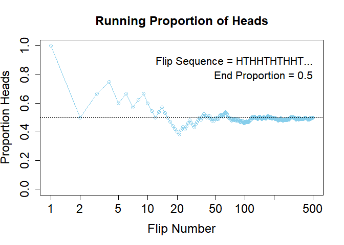

## Example of Running Proportion

```r
N = 500 # Specify the total number of flips, denoted N.
pHeads = 0.5 # Specify underlying probability of heads.]

# Flip a coin N times and compute the running proportion of heads at each flip.
# Generate a random sample of N flips (heads=1, tails=0):
  flipSequence = sample( x=c(0,1), prob=c(1-pHeads,pHeads), size=N, replace=TRUE )

# Compute the running proportion of heads:
  r = cumsum( flipSequence ) # Cumulative sum: Number of heads at each step.
  n = 1:N                    # Number of flips at each step.
  runProp = r / n            # Component by component division.

# Graph the running proportion:
  plot( n , runProp , type="o" , log="x" , col="skyblue" ,
        xlim=c(1,N) , ylim=c(0.0,1.0) , cex.axis=1.5 ,
        xlab="Flip Number" , ylab="Proportion Heads" , cex.lab=1.5 ,
        main="Running Proportion of Heads" , cex.main=1.5 )

# Plot a dotted horizontal reference line:
  abline( h=pHeads , lty="dotted" )

# Display the beginning of the flip sequence:
  flipLetters = paste( c("T","H")[flipSequence[1:10]+1] , collapse="" )
  displayString = paste0( "Flip Sequence = " , flipLetters , "..." )
  text( N , .9 , displayString , adj=c(1,0.5) , cex=1.3 )

# Display the relative frequency at the end of the sequence.
  text( N , .8 , paste("End Proportion =",runProp[N]) , adj=c(1,0.5) , cex=1.3 )
```


