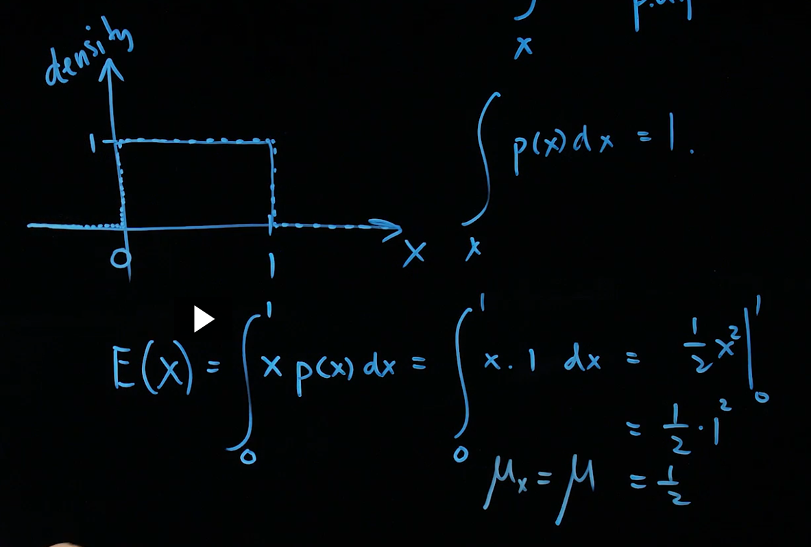
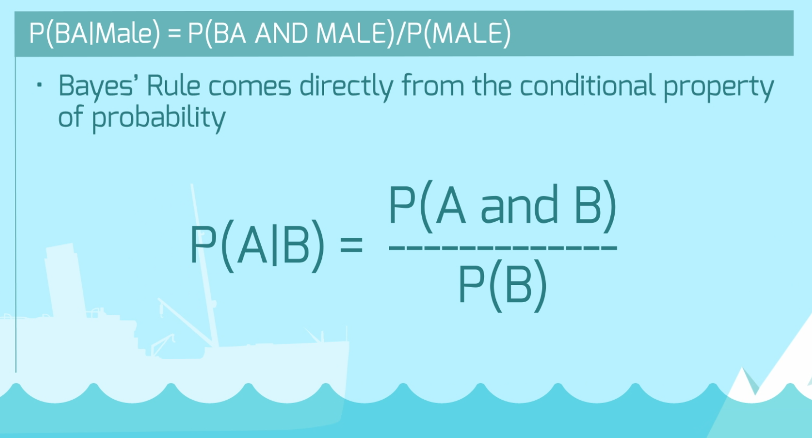
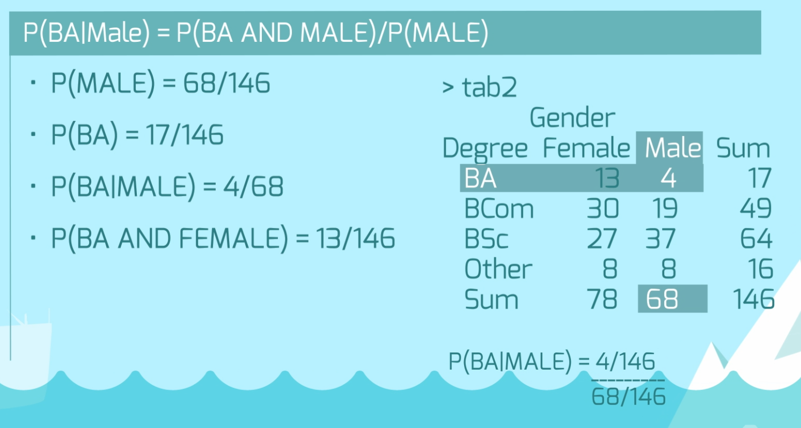
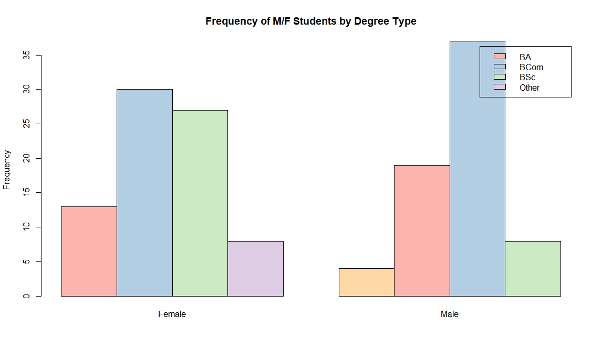
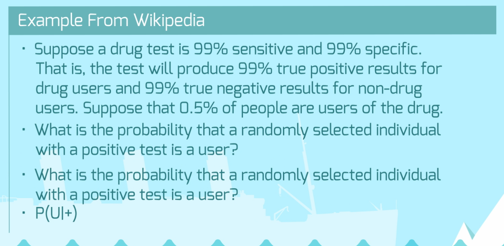
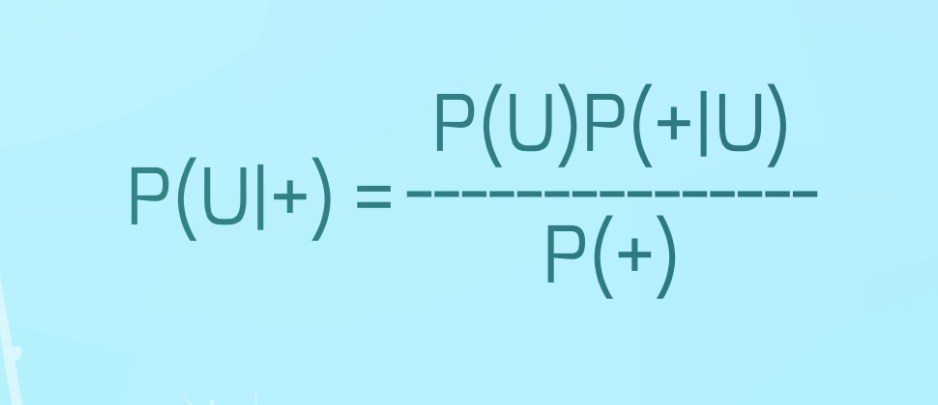

# Bayes Rule

## Outline
1. Mean & Variance for `Discrete` *vs.* `Continuous` Variables
2. Bayes Rule Overview

---
<br>

## 1. Mean & Variance for `Discrete` *vs.* `Continuous` Variables

### Discrete Variables

*Sum of the expected values x probability*  
* E(x) = &sum;<sub>n=1</sub> [x<sub>n</sub> &times; p<sub>n</sub>]
* Variance is same, but using variance formula

### Continuous Variables
* `Mean`: Get the *area* of the density for the range you wish to find. Area under entire curve always 1.
* The expected value of `x` is found via a `probability density function`. Use an integral to get the area from 0 to 1.  
  E(x) = &int;<sub>0</sub><sup>1</sup>[x p(x) dx]

   <br>

---
<br>

## 2. `Bayes Rule` Overview

### Definition
> Probability of A, given B

* Note that in most situations in the real world, computing the integral using bayes can be `impossible`. 
* Real world uses `Monte Carlo Simulation` more often, which future notes will contain examples

 <br>

### Example using Table
 <br>

### Viewing Frequency via Bar Chart (*`Example.R`*)
```R
library(s20x)         # Data for course.df
library(RColorBrewer) # Colors in R

# Get the data
data("course.df")

# Create table of Degree and Gender
tab = with(course.df, table(Degree, Gender))
tab2 = addmargins(tab)

# Create Bar Plot
barplot(tab, beside=TRUE, 
        col = brewer.`pal(5, "Pastel1"),
        legend = TRUE,
        ylab = 'Frequency',
        main = 'Frequency of M/F Students by Degree Type')
```

> Output
 <br>

<br>

### Create Relative `Proportion Table`
```R
# Make a prop table

## Show the original Frequency Table
tab2

## Create a Relative Proportion Table using tab
tab3 = round(prop.table(tab), 3)
tab3

## Add Row and Column Sums
addmargins(tab3)
```

> Output  
```R
> ## Show the original Frequency Table
> tab2
       Gender
Degree  Female Male Sum
  BA        13    4  17
  BCom      30   19  49
  BSc       27   37  64
  Other      8    8  16
  Sum       78   68 146

> ## Create a Relative Proportion Table using tab
> tab3 = round(prop.table(tab), 3)

> tab3
       Gender
Degree  Female  Male
  BA     0.089 0.027
  BCom   0.205 0.130
  BSc    0.185 0.253
  Other  0.055 0.055

> ## Add Row and Column Sums
> addmargins(tab3)
       Gender
Degree  Female  Male   Sum
  BA     0.089 0.027 0.116
  BCom   0.205 0.130 0.335
  BSc    0.185 0.253 0.438
  Other  0.055 0.055 0.110
  Sum    0.534 0.465 0.999
```

### Use Probability Table for `Bayes Rule`
```
Find P(BA | Male)
```

## Real-World Example using Bayes Rule

 <br>
 <br>

```R
## Calculation for testing

userPopulation = 0.005
truePositive   = 0.99
trueNegative   = 0.99
posNotUser      = 1 - trueNegative


# What is the probability of a false positive?
(truePositive * userPopulation) / (trueNegative * userPopulation + posNotUser * 0.995)

0.99*0.005/(0.99*0.005+0.01*0.995)
```

```
[1] 0.3322148
```
