# Inference with Binomal Probability

## Outline
1. Likelihood Function
2. Beta Distribution
3. Theta (mu)
4. The posterior

## 1. Likelihood Function using the Bernoulli (Not Binomial)
* Can keep record of each event

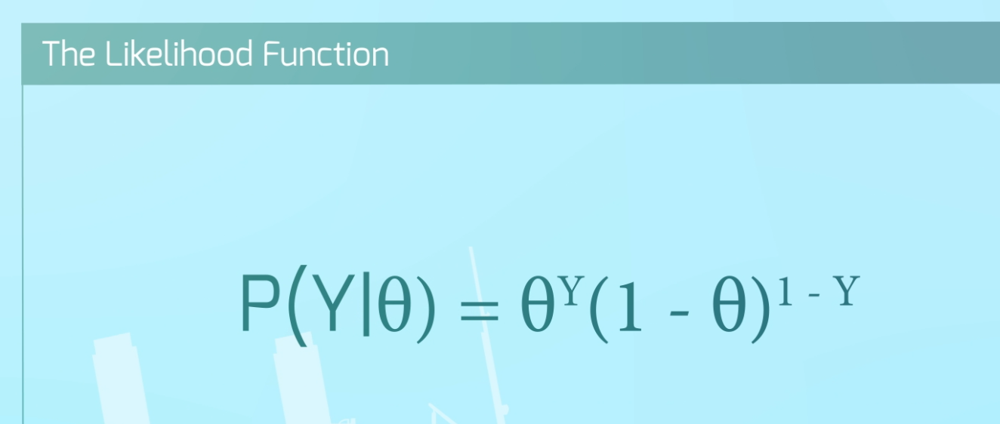 <br>
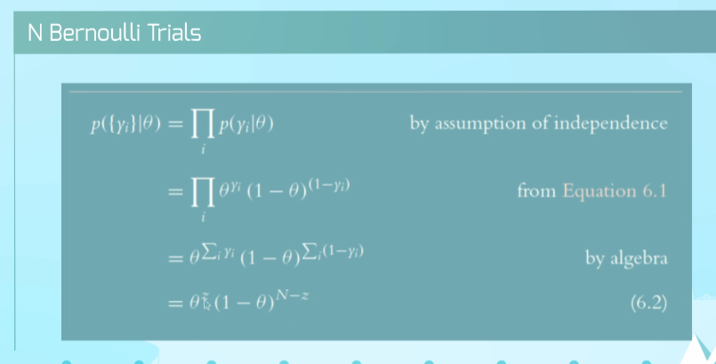 <br>

## 2. Beta Distribution
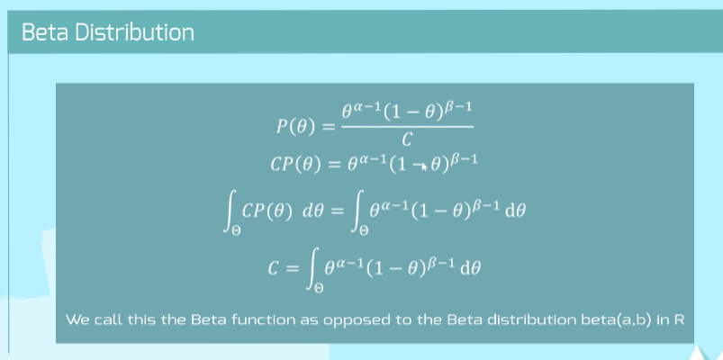 <br>
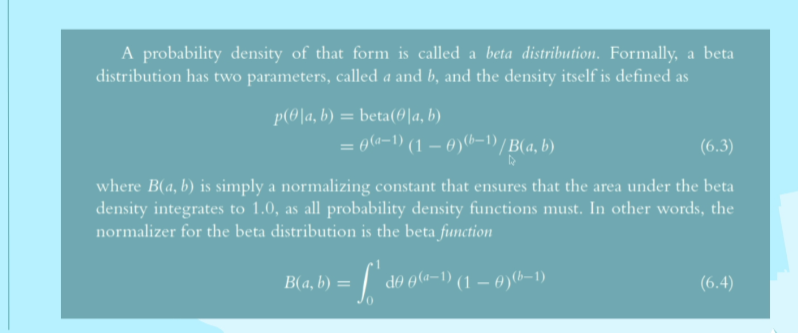 <br>

* Beta parameter betwen `0` and `1`

---

## Beta Conjugates
> Hyper paramters (alpha and theta) control the shape of the beta distribution

---

## Beta in R

### R Functions to Find Area Under Beta Distributions

#### Less Than/Greater Than
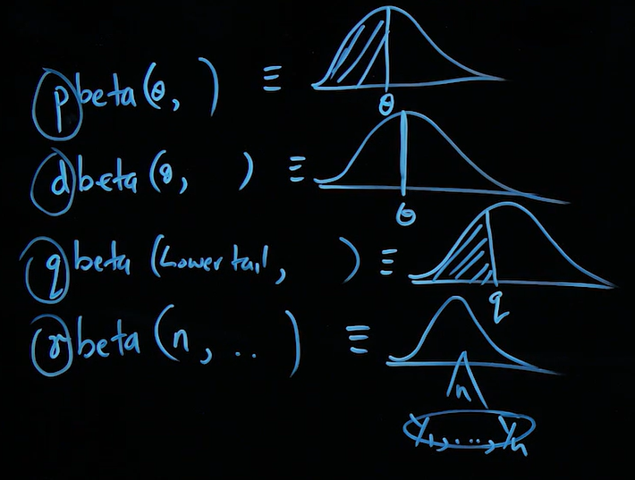 <br>

#### Between Two Thetas
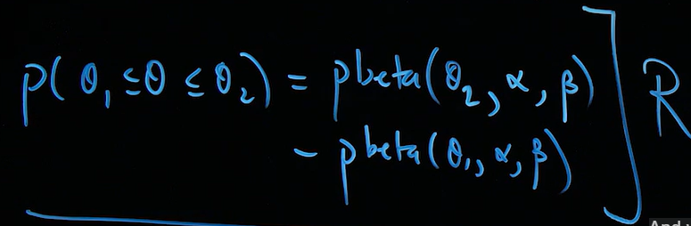 <br>

### Call `beta(a,b)`
```R
# Plot Beta
alpha = 2
beta  = 2

curve(dbeta(x, alpha, beta), xlim = c(0,1), 
      main = paste("alpha =", alpha,",", "beta=", beta),
      ylab = "Density", lwd =2)
```
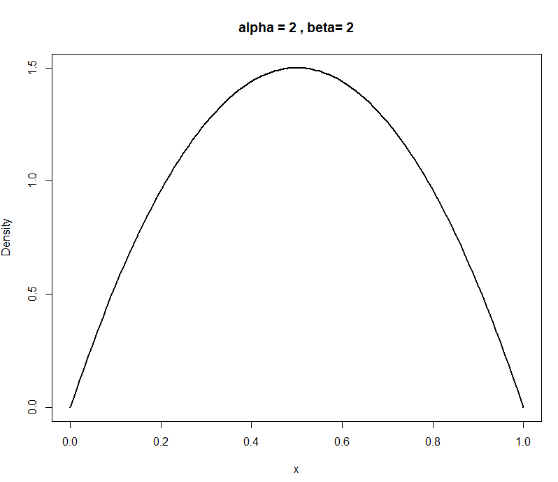 <br>

### How beta distribution varies with paramters
```R
n=5
layout(matrix(1:((n-1)*(n-1)), nr =(n-1), nc = (n-1), byrow = TRUE))
alpha = 2:n
beta  = 2:n

for(i in 1:(n-1))
{
  for(j in 1:(n-1))
  {
    curve(dbeta(x, alpha[i], beta[j]), xlim = c(0,1), 
          main = paste("alpha =", alpha[i],",", "beta=", beta[j]),
          ylab = "Density", lwd =2) 
  }
}
```

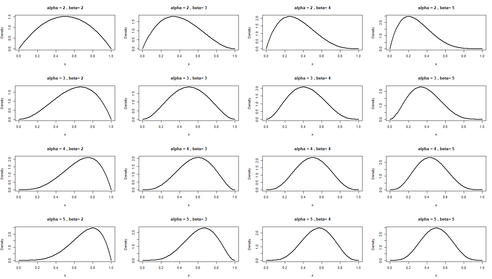 <br>

### Mix Betas
```r
# Make mixture betas

mixbeta = function(x, r, alpha1,beta1, alpha2, beta2) # r of beta density 1
{
  r*dbeta(x, alpha1, beta1) +(1-r)*dbeta(x, alpha2,beta2)
  
}

dev.new(noRStudioGD = TRUE)
curve(mixbeta(x, 0.5, 10,2,3,50))

dev.new(noRStudioGD = TRUE)
curve(mixbeta(x, 0.1, 4,40,2,2))

dev.new(noRStudioGD = TRUE)
curve(mixbeta(x, 0.9, 4,40,2,2))
```
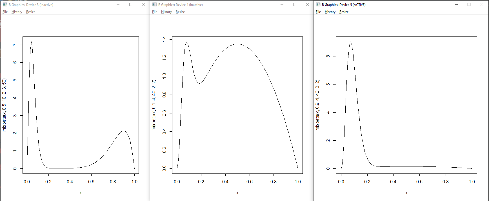 <br>

## Theta (mu)
 <br>
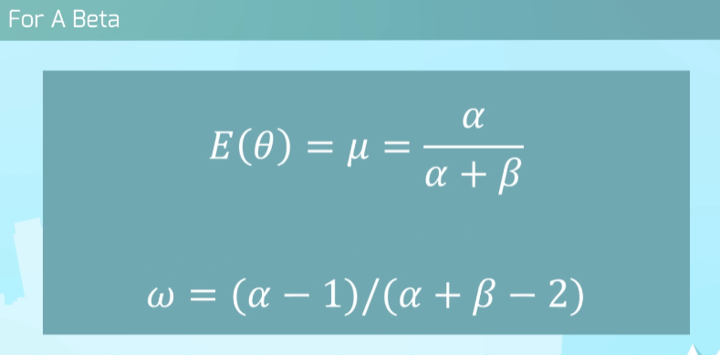 <br>

### Kappa and Algebra
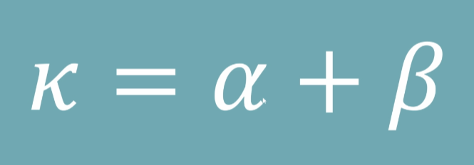 <br>
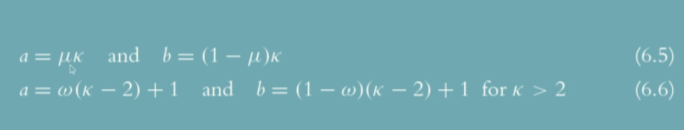 <br>
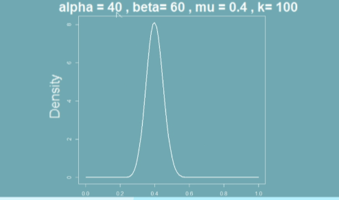 <br>

---

## Get the Posterior

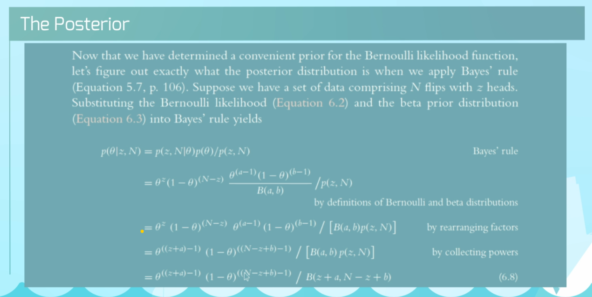 <br>
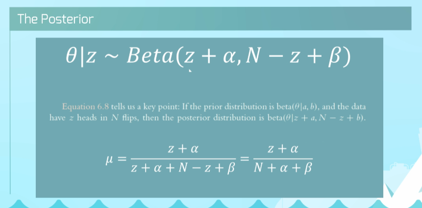 <br>

