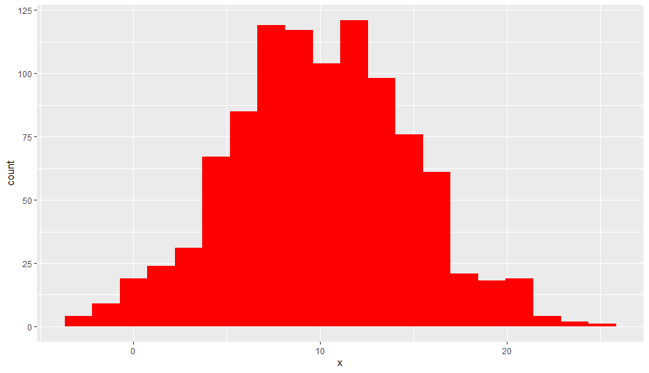
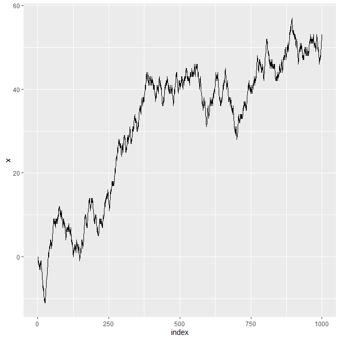

# Monte Carlo

## Outline
1. Approximate distribution with a large sample
2. Metropolis Algorithm (Example)
3. Metropolis Algorithm (general)
4. Gibbs Sampling
5. MCMC Representativeness

---

<br>

## 1. Approximate Distribution with a Large Sample

### `Normal` Distribution
```R
windows()
curve(dnorm(x,mean = 10,sd=5), col = "Red", lwd =3, xlim = c(10-4*5, 10+4*5))
```
 <br>


### `Gamma` Distribution
```R
windows()
curve(dgamma(x, shape = 4,scale = 2), xlim = c(0,20))
```
 <br>


### Random Samples and Histograms
```R
# Base R
x = rnorm(1000, mean = 10, sd = 5)
hist(x, col = "Red")

# Use as ggplot
df = as.data.frame(x=x)
library(ggplot2)

g = ggplot(df, aes(x, fill = I("Red"))) +  geom_histogram(bins = 20)
g
```
 <br>
 <br>

```R
# kernal density
g = ggplot(df, aes(x, fill = I("Red")))  + geom_density(aes(x=x,color = I("Black") ))
g
```
 <br>

---

<br>

## 2. Metropolis Algorithm (Example)
* Random Walk = The Proposal Distribution

### Hueristic Accept Reject using Random Walk
> Get a proposal distribution to suggest a random variable  
> According to a hueristic, accept or reject the proposal

* Use a random number generator to move to the left or right, then move on to recreate the posterior distribution
* For example data table function in excel uses something similar

 <br>

<br>

### `Single Dimension Random Walk`

```r
# Random walk
# 
myrwalk = function(x0=5, iter = 1000, p=0.5) # x0 initial value
{
  if(!require(ggplot2)) {install.packages(ggplot2)}
  graphics.off()
  x = c()
  x[1] = x0
  mat = matrix(sample(c(-1,1),size = iter, prob = c(p,1-p), replace = TRUE), nr = iter, nc=1, byrow = TRUE)
  for ( i in 2:iter)
  {
   x[i] = x[i-1] + mat[i,1]
    
  }
  
  df = data.frame(index = 1:iter, x = x)
  
  dev.new(noRStudioGD = TRUE)
  
 plot(1:iter, x, type = "s")
 
 dev.new(noRStudioGD = TRUE)
 
 g = ggplot(df, aes(x = index, y = x )) + geom_line()
 
 print(g)
 write.csv(df, "df.csv", row.names=FALSE)
 list(x=x, x0 = x0, mat = mat, mean = mean(x))
}
obj = myrwalk(x0=0,iter =1000, p=0.5)
obj$
```
 <br>

---

### `2-Dimension Random Walk`

```r
myrwalk2 = function(x0=0, y0=0, iter = 1000, px=0.5, py=0.5) 
{
  if(!require(ggplot2)) {install.packages(ggplot2)}
  graphics.off()
  x = c()
  y = c()
  x[1] = x0
  y[1] = y0
  
  xr = sample(c(-1,1),size = iter, prob = c(px,1-px), replace = TRUE)
  yr = sample(c(-1,1),size = iter, prob = c(py,1-py), replace = TRUE)
  
  mat = matrix(c(xr,yr), nr = iter, nc=2, byrow = TRUE)
  for ( i in 2:iter)
  {
    x[i] = x[i-1] + mat[i,1]
    y[i] = y[i-1] + mat[i,2]
  }
  x
  df = data.frame( x = x, y = y)
  
  dev.new(noRStudioGD = TRUE)
  
  plot( x, y,type = "s", main = "Random walk", las =1)
  text(x0,y0, "Start")
  text(x[iter], y[iter], "End")
  
  dev.new(noRStudioGD = TRUE)
  
  g = ggplot(df, aes(x = x, y = y )) + geom_point(alpha=0.3, color = "Blue")
  g = g + geom_text(aes(x = x0,y = y0, label = "Start"), color = "Green") + geom_text(aes(x = x[iter],y = y[iter], label = "End"), color = "Red")
  g = g + ggtitle("Random walk")
  print(g)
  write.csv(df, "df.csv", row.names=FALSE)
  list(df = df, x0 = x0, y0=y0, mat = mat)
}
obj = myrwalk2(iter=10000)
```
 <br>

---

### `Random Walk Using MCMC`


```r
# Random walk Island problem FROM JK
# 
myrwmcmc = function( x0=5,iter = 1000,   h = 1:7, p = 0.5) 
{
  graphics.off()
  library(ggplot2)
  hmin = min(h)
  hmax = max(h)
  
  x = c()
  x[1] = x0
  for( i in 2:iter)
  {
    xprop = sample(c(-1,1), size = 1, prob = c(p,1-p), replace = TRUE)
    x[i] = x[i-1] +xprop
    if(x[i]< hmin | x[i]> hmax) {alpha <- 0} else{ alpha <- min(1, h[x[i]]/h[x[i-1]])}
    if(runif(1,0,1)<= alpha ) 
      {
      x[i] <- x[i]
    }
    else
      {
      x[i]<-x[i-1]
    }
  }
  windows()
  barplot(table(factor(x)),col = rainbow(length(h)))
  windows()
  plot(x,1:iter, type = "l")
  df = data.frame(x = x, y = 1:iter  )
  
  list(x=x)
}

# 7 Bars
myrwmcmc(iter = 1000, h = c(1:7))
```
 <br>

---

<br>

### `More General MCMC Random Walk`

```R
## more general MCMC random walk
## must be discrete values and  xo in the domain of xd

myrwmcmcg = function( xd = 1:10, x0=5, iter = 1000, h = function(x) x, p = 0.5) 
{
  graphics.off()
  library(ggplot2)
  

  
  dmin = min(xd)
  dmax = max(xd)
  delta = dmax - xd[length(xd)-1]
  
  x = c()
  x[1] = x0
  for( i in 2:iter)
  {
    xprop = sample(c(-delta,delta), size = 1, prob = c(p,1-p), replace = TRUE)
    x[i] = x[i-1] +xprop
    if(x[i]< dmin | x[i]> dmax) {alpha <- 0} else{ alpha <- min(1, h(x[i])/h(x[i-1]))}
    if(runif(1,0,1)<= alpha ) 
    {
      x[i] <- x[i]
    }
    else
    {
      x[i]<-x[i-1]
    }
  }
  windows()
  barplot(table(factor(x, levels = xd))/iter,col = rainbow(length(xd)),las = 1)
  
  windows()
  plot(x,1:iter, type = "l")
  df = data.frame(x = x, y = 1:iter  )
  windows()
  g = ggplot(df, aes(x=x, fill = I("Blue"))) + geom_bar(color = I("Red"))
  print(g)
  list(x=x)
}

prior = rep(1/11,11)

obj = myrwmcmcg(xd = seq(0,1,by = 0.1),iter = 10000,x0=0.5,h = function(x) prior*dbinom(4,size=10,prob=x)) 

table(obj$x)/10000


hist(obj$x, breaks = seq(0,1,by = 0.1),freq=FALSE )
```
```
 [1] 0.09090909 0.09090909 0.09090909 0.09090909 0.09090909 0.09090909 0.09090909 0.09090909 0.09090909
[10] 0.09090909 0.09090909
```
 <br>

<br>

### `Bayes Box Using MCMC`
```R
## Bayes box

bbox=function(theta,prior,lik){  # Three vectors
  
  post=prior*lik/sum(prior*lik) # post by discrete Bayes
  
  # tmp (temp) contains the matrix which will be the Bbox
  tmp=matrix(c(theta,prior,lik,prior*lik,post),nr=length(prior),nc=5,byrow=FALSE)
  colnames(tmp)=c("theta","prior","lik","prior*lik","post")
  lr=c(NA,sum(prior),NA ,sum(prior*lik),sum(post)) # a last row of NA's and sums
  tmp=rbind(tmp,lr) # bind it to the existing matrix
  # Make a window for graphics
  if(.Platform$OS.type == "windows") { 
    windows()
  } else {
    quartz()
  }
  
  # plot prior posyt and lik
  plot(theta,post,type="b",lwd=2,pch=19,main="Bayes box",ylim=c(0,max(prior,lik,post)),col="Red")
  lines(theta,lik,type="b",lwd=2,col="Blue")
  lines(theta,prior,type="b",lwd=2,col="black")
  legend("topleft",legend=c("Prior","Posterior","Likelihood"),fill=c("black","red","blue"))
  
  # the last tmp will release the matrix to the command line.
  tmp
}
### End of function

theta=seq(0,1,by =0.1)
theta
length(theta)
prior=rep(1/11,11) # uniform

prior
lik=dbinom(x=4,prob=theta,size=10)  # binomial likelihood
bbox(theta,prior,lik)    # invoke the function 

prior = dbeta()
```
```
theta      prior         lik    prior*lik         post
  0.0 0.09090909 0.000000000 0.000000e+00 0.0000000000
  0.1 0.09090909 0.011160261 1.014569e-03 0.0122756401
  0.2 0.09090909 0.088080384 8.007308e-03 0.0968833159
  0.3 0.09090909 0.200120949 1.819281e-02 0.2201214418
  0.4 0.09090909 0.250822656 2.280206e-02 0.2758903801
  0.5 0.09090909 0.205078125 1.864347e-02 0.2255740481
  0.6 0.09090909 0.111476736 1.013425e-02 0.1226179467
  0.7 0.09090909 0.036756909 3.341537e-03 0.0404304689
  0.8 0.09090909 0.005505024 5.004567e-04 0.0060552072
  0.9 0.09090909 0.000137781 1.252555e-05 0.0001515511
  1.0 0.09090909 0.000000000 0.000000e+00 0.0000000000
lr    NA 1.00000000          NA 8.264898e-02 1.0000000000
```
 <br>

---

<br>

### Using the `Transition Matrix` and the Posterior
 <br>
 <br>

```r
# Transition matrix
# Island problem
# 1 -> 2 0.5

T=matrix(0,nr=7,nc=7)
T[1,1]<-0.5
T[1,2]<-0.5
T[2,1]<- 0.5*1/2
T[2,3]<-0.5
T[2,2]<- 1-(T[2,1]+T[2,3])
T[3,2]<- 0.5*2/3
T[3,4]<-0.5
T[3,3]<- 1-(T[3,2]+T[3,4])
T[4,3]<-0.5*3/4
T[4,5]<-0.5
T[4,4]<-1-(T[4,3]+T[4,5])
T[5,4]<-0.5*4/5
T[5,6]<-0.5
T[5,5]<-1-(T[5,4]+T[5,6])
T[6,5]<-0.5*5/6
T[6,7]<-0.5
T[6,6]<-1-(T[6,5]+T[6,7])
T[7,6]<-0.5*6/7
T[7,7]<-1-T[7,6]

T
```
```
     [,1]      [,2]      [,3]  [,4]      [,5]       [,6]      [,7]
[1,] 0.50 0.5000000 0.0000000 0.000 0.0000000 0.00000000 0.0000000
[2,] 0.25 0.2500000 0.5000000 0.000 0.0000000 0.00000000 0.0000000
[3,] 0.00 0.3333333 0.1666667 0.500 0.0000000 0.00000000 0.0000000
[4,] 0.00 0.0000000 0.3750000 0.125 0.5000000 0.00000000 0.0000000
[5,] 0.00 0.0000000 0.0000000 0.400 0.1000000 0.50000000 0.0000000
[6,] 0.00 0.0000000 0.0000000 0.000 0.4166667 0.08333333 0.5000000
[7,] 0.00 0.0000000 0.0000000 0.000 0.0000000 0.42857143 0.5714286
```

### How to Plot the `Transition Matrix`

```R
v=matrix(0,nr=7,nc=1)
v[4]=1
v
t(v)%*%T

myT = function(v,t, T)
{
  cat("Wayne's Bayesian Course\n")
  if(!require(ggplot2)) install.packages(ggplot2)
  graphics.off()
  dev.new(noRStudioGD = TRUE)
  x=T
  
  if(t==1) {tmp = t(as.matrix(v))} 
  else
  {
      if(t==2) {tmp = v%*%T}
  
  else
    if(t>2)
  {
  for(i in 1:(t-2))
  {
    x = T%*%x
  }}
  tmp = v%*%x
  }
  #plot(tmp[1,], type = "h", ylab = "Probability of theta", xlab = "theta")
  tab = as.table(tmp[1,])
  names(tab)=1:length(tab)
  coll = rainbow(length(v))
  barplot(tab, col = coll)
  list(v=v,table = tab, x=x, T = T)
}

myT(v=c(0,0,0,1,0,0,0), t=100, T=T)
```
 <br>

---

<br>

## 3. Metropolis Algorithm (*`general`*)
> Use `Beta Distrubtion` as an Example  

### General Form of Metropolis Alg.
 <br>
 <br>


### General Form of Bayes Rule
 <br>
 <br>

---

<br>

## 4. Gibbs Sampling
> Flexible way to get a sample of the posterior

 <br>
 <br>
 <br>

---

<br>

## 5. MCMC Representativeness
> Low sample sizes (first 500) usually do not represent actual distribution

* Can throw away the first 500 then use the next
* If higher autocorrelation, then more sampling needed

### Effects of Sample Size
 <br>
 <br>


### If higher autocorrelation, then more sampling needed
 <br>
