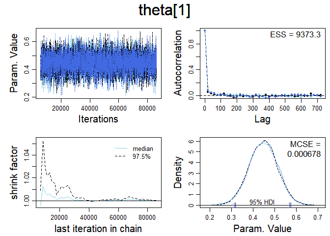
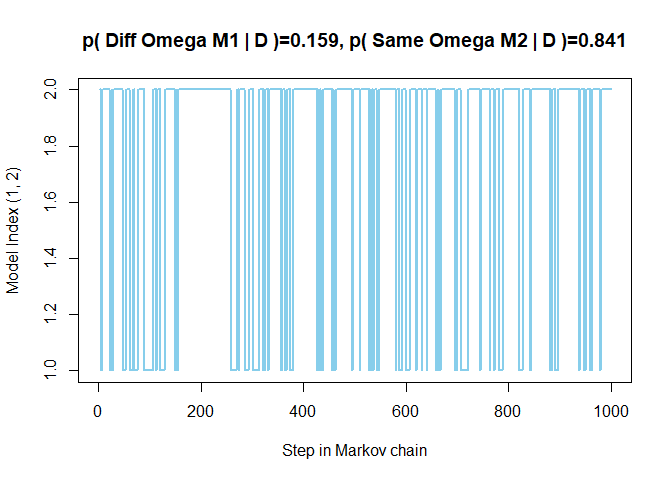
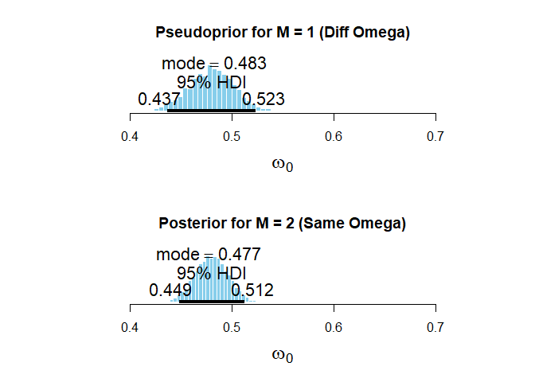
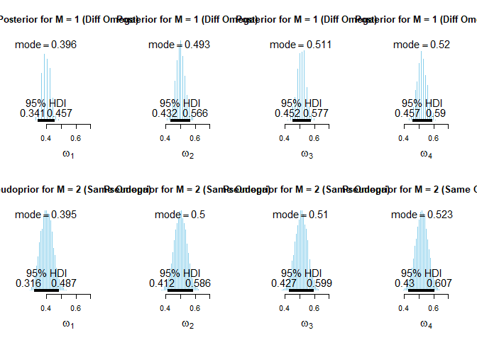
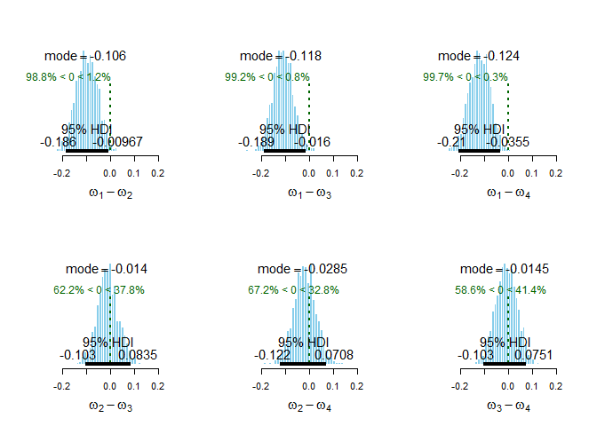

Comparing Models
================
Daniel Carpenter
4/3/2022

``` r
# OneOddGroupModelComp2E.R
# Accompanies the book:
#   Kruschke, J. K. (2014). Doing Bayesian Data Analysis: 
#   A Tutorial with R, JAGS, and Stan. 2nd Edition. Academic Press / Elsevier.
graphics.off()
rm(list=ls(all=TRUE))
source("DBDA2E-utilities.R")
```

    ## 
    ## *********************************************************************
    ## Kruschke, J. K. (2015). Doing Bayesian Data Analysis, Second Edition:
    ## A Tutorial with R, JAGS, and Stan. Academic Press / Elsevier.
    ## *********************************************************************

    ## Loading required package: coda

    ## Linked to JAGS 4.3.0

    ## Loaded modules: basemod,bugs

``` r
#require(rjags)
#require(runjags)
fileNameRoot="OneOddGroupModelComp2E-" 

#------------------------------------------------------------------------------
# THE DATA.

# Randomly generated fictitious data.
# For each subject, specify the condition s/he was in,
# the number of trials s/he experienced, and the number correct.
npg = 20  # number of subjects per group
ntrl = 20 # number of trials per subject
CondOfSubj = c( rep(1,npg) , rep(2,npg) , rep(3,npg) , rep(4,npg) )
nTrlOfSubj = rep( ntrl , 4*npg )
set.seed(47405)
condMeans = c(.40,.50,.51,.52)
nCorrOfSubj = c( rbinom(npg,ntrl,condMeans[1]) , rbinom(npg,ntrl,condMeans[2]) ,
                 rbinom(npg,ntrl,condMeans[3]) , rbinom(npg,ntrl,condMeans[4]) )
nCond = length(unique(CondOfSubj))
nSubj = length(CondOfSubj)
# jitter the data to be as close as possible to desired condition means:
for ( cIdx in 1:nCond ) {
  nToAdd = round(condMeans[cIdx]*npg*ntrl)-sum(nCorrOfSubj[CondOfSubj==cIdx])
  if ( nToAdd > 0 ) {
    for ( i in 1:nToAdd ) {
      thisNcorr = ntrl
      while ( thisNcorr == ntrl ) {
        randSubjIdx = sample(which(CondOfSubj==cIdx),size=1)
        thisNcorr = nCorrOfSubj[randSubjIdx]
      }
      nCorrOfSubj[randSubjIdx] = nCorrOfSubj[randSubjIdx]+1
    }
  } 
  if ( nToAdd < 0 ) {
    for ( i in 1:abs(nToAdd) ) {
      thisNcorr = 0
      while ( thisNcorr == 0 ) {
        randSubjIdx = sample(which(CondOfSubj==cIdx),size=1)
        thisNcorr = nCorrOfSubj[randSubjIdx]
      }
      nCorrOfSubj[randSubjIdx] = nCorrOfSubj[randSubjIdx]-1
    }
  }
}


show( aggregate( nCorrOfSubj , by=list(CondOfSubj) , FUN=mean ) / ntrl )
```

    ##   Group.1    x
    ## 1    0.05 0.40
    ## 2    0.10 0.50
    ## 3    0.15 0.51
    ## 4    0.20 0.52

``` r
# Package the data:
dataList = list(
  nCond = nCond ,
  nSubj = nSubj ,
  CondOfSubj = CondOfSubj ,
  nTrlOfSubj = nTrlOfSubj ,
  nCorrOfSubj = nCorrOfSubj
)

#------------------------------------------------------------------------------
# THE MODEL.

modelString = "
model {
  for ( s in 1:nSubj ) {
    nCorrOfSubj[s] ~ dbin( theta[s] , nTrlOfSubj[s] )
    theta[s] ~ dbeta( aBeta[CondOfSubj[s]] , bBeta[CondOfSubj[s]] ) 
  }

#   for ( j in 1:nCond ) {
#     # Use omega[j] for model index 1, omega0 for model index 2:
#     aBeta[j] <-       ( equals(mdlIdx,1)*omega[j] 
#                       + equals(mdlIdx,2)*omega0  )   * (kappa[j]-2)+1
#     bBeta[j] <- ( 1 - ( equals(mdlIdx,1)*omega[j] 
#                       + equals(mdlIdx,2)*omega0  ) ) * (kappa[j]-2)+1
#   }
#   for ( j in 1:2 ) {
#     omega[j] ~ dbeta( a[j,mdlIdx] , b[j,mdlIdx] )
#   }
#   omega[3] <- omega[2]
#   omega[4] <- omega[2]

  for ( j in 1:nCond ) {
    # Use omega[j] for model index 1, omega0 for model index 2:
    aBeta[j] <-       ( equals(mdlIdx,1)*omega[j] 
                      + equals(mdlIdx,2)*omega0  )   * (kappa[j]-2)+1
    bBeta[j] <- ( 1 - ( equals(mdlIdx,1)*omega[j] 
                      + equals(mdlIdx,2)*omega0  ) ) * (kappa[j]-2)+1
    omega[j] ~ dbeta( a[j,mdlIdx] , b[j,mdlIdx] )
  }

  omega0 ~ dbeta( a0[mdlIdx] , b0[mdlIdx] )
  for ( j in 1:nCond ) {
    kappa[j] <- kappaMinusTwo[j] + 2
    kappaMinusTwo[j] ~ dgamma( 2.618 , 0.0809 ) # mode 20 , sd 20
  }
  # Constants for prior and pseudoprior:
  aP <- 1
  bP <- 1
  # a0[model] and b0[model]
  a0[1] <- .48*500       # pseudo
  b0[1] <- (1-.48)*500   # pseudo 
  a0[2] <- aP            # true
  b0[2] <- bP            # true
  # a[condition,model] and b[condition,model]
  a[1,1] <- aP           # true
  a[2,1] <- aP           # true
  a[3,1] <- aP           # true
  a[4,1] <- aP           # true
  b[1,1] <- bP           # true
  b[2,1] <- bP           # true
  b[3,1] <- bP           # true
  b[4,1] <- bP           # true
  a[1,2] <- .40*125      # pseudo
  a[2,2] <- .50*125      # pseudo
  a[3,2] <- .51*125      # pseudo
  a[4,2] <- .52*125      # pseudo
  b[1,2] <- (1-.40)*125  # pseudo
  b[2,2] <- (1-.50)*125  # pseudo
  b[3,2] <- (1-.51)*125  # pseudo
  b[4,2] <- (1-.52)*125  # pseudo
  # Prior on model index:
  mdlIdx ~ dcat( modelProb[] )
  modelProb[1] <- .5
  modelProb[2] <- .5
}
" # close quote for modelstring
writeLines( modelString , con="TEMPmodel.txt" )

#------------------------------------------------------------------------------
# INTIALIZE THE CHAINS.

# Let JAGS do it...

#------------------------------------------------------------------------------
# RUN THE CHAINS.

parameters = c("omega","kappa","omega0","theta","mdlIdx")
adaptSteps = 1000            # Number of steps to "tune" the samplers.
burnInSteps = 5000           # Number of steps to "burn-in" the samplers.
nChains = 3                  # Number of chains to run.
numSavedSteps=12000          # Total number of steps in chains to save.
thinSteps=20                 # Number of steps to "thin" (1=keep every step).

# nPerChain = ceiling( ( numSavedSteps * thinSteps ) / nChains ) # Steps per chain.
# # Create, initialize, and adapt the model:
# jagsModel = jags.model( "TEMPmodel.txt" , data=dataList , # inits=initsList , 
#                         n.chains=nChains , n.adapt=adaptSteps )
# # Burn-in:
# cat( "Burning in the MCMC chain...\n" )
# update( jagsModel , n.iter=burnInSteps )
# # The saved MCMC chain:
# cat( "Sampling final MCMC chain...\n" )
# codaSamples = coda.samples( jagsModel , variable.names=parameters , 
#                             n.iter=nPerChain , thin=thinSteps )

runJagsOut <- run.jags( method=c("rjags","parallel")[2] ,
                        model="TEMPmodel.txt" , 
                        monitor=parameters , 
                        data=dataList ,  
                        #inits=initsList , 
                        n.chains=nChains ,
                        adapt=adaptSteps ,
                        burnin=burnInSteps , 
                        sample=ceiling(numSavedSteps/nChains) ,
                        thin=thinSteps ,
                        summarise=FALSE ,
                        plots=FALSE )
```

    ## Calling 3 simulations using the parallel method...
    ## Following the progress of chain 1 (the program will wait for all chains
    ## to finish before continuing):
    ## Welcome to JAGS 4.3.0 on Sun Apr 03 17:07:17 2022
    ## JAGS is free software and comes with ABSOLUTELY NO WARRANTY
    ## Loading module: basemod: ok
    ## Loading module: bugs: ok
    ## . . Reading data file data.txt
    ## . Compiling model graph
    ##    Resolving undeclared variables
    ##    Allocating nodes
    ## Graph information:
    ##    Observed stochastic nodes: 80
    ##    Unobserved stochastic nodes: 90
    ##    Total graph size: 406
    ## . Reading parameter file inits1.txt
    ## . Initializing model
    ## . Adapting 1000
    ## -------------------------------------------------| 1000
    ## ++++++++++++++++++++++++++++++++++++++++++++++++++ 100%
    ## Adaptation successful
    ## . Updating 5000
    ## -------------------------------------------------| 5000
    ## ************************************************** 100%
    ## . . . . . . Updating 80000
    ## -------------------------------------------------| 80000
    ## ************************************************** 100%
    ## . . . . Updating 0
    ## . Deleting model
    ## . 
    ## All chains have finished
    ## Simulation complete.  Reading coda files...
    ## Coda files loaded successfully
    ## Finished running the simulation

``` r
codaSamples = as.mcmc.list( runJagsOut )

# resulting codaSamples object has these indices: 
#   codaSamples[[ chainIdx ]][ stepIdx , paramIdx ]

save( codaSamples , file=paste0(fileNameRoot,"Mcmc.Rdata") )

#------------------------------------------------------------------------------- 
# Display diagnostics of chain:

parameterNames = varnames(codaSamples) # get all parameter names
show(parameterNames)
```

    ##  [1] "omega[1]"  "omega[2]"  "omega[3]"  "omega[4]"  "kappa[1]"  "kappa[2]" 
    ##  [7] "kappa[3]"  "kappa[4]"  "omega0"    "theta[1]"  "theta[2]"  "theta[3]" 
    ## [13] "theta[4]"  "theta[5]"  "theta[6]"  "theta[7]"  "theta[8]"  "theta[9]" 
    ## [19] "theta[10]" "theta[11]" "theta[12]" "theta[13]" "theta[14]" "theta[15]"
    ## [25] "theta[16]" "theta[17]" "theta[18]" "theta[19]" "theta[20]" "theta[21]"
    ## [31] "theta[22]" "theta[23]" "theta[24]" "theta[25]" "theta[26]" "theta[27]"
    ## [37] "theta[28]" "theta[29]" "theta[30]" "theta[31]" "theta[32]" "theta[33]"
    ## [43] "theta[34]" "theta[35]" "theta[36]" "theta[37]" "theta[38]" "theta[39]"
    ## [49] "theta[40]" "theta[41]" "theta[42]" "theta[43]" "theta[44]" "theta[45]"
    ## [55] "theta[46]" "theta[47]" "theta[48]" "theta[49]" "theta[50]" "theta[51]"
    ## [61] "theta[52]" "theta[53]" "theta[54]" "theta[55]" "theta[56]" "theta[57]"
    ## [67] "theta[58]" "theta[59]" "theta[60]" "theta[61]" "theta[62]" "theta[63]"
    ## [73] "theta[64]" "theta[65]" "theta[66]" "theta[67]" "theta[68]" "theta[69]"
    ## [79] "theta[70]" "theta[71]" "theta[72]" "theta[73]" "theta[74]" "theta[75]"
    ## [85] "theta[76]" "theta[77]" "theta[78]" "theta[79]" "theta[80]" "mdlIdx"

``` r
for ( parName in c("mdlIdx","omega[1]","omega0","kappa[1]","theta[1]") ) { 
  diagMCMC( codaSamples , parName=parName ,
            saveName=fileNameRoot , saveType="eps" )
}

#------------------------------------------------------------------------------
# EXAMINE THE RESULTS.

mcmcMat = as.matrix(codaSamples,chains=TRUE)
```

<!-- -->

``` r
xLim=c(0.35,0.75)

# Display the model index
modelIdxSample = mcmcMat[, "mdlIdx" ]
pM1 = sum( modelIdxSample == 1 ) / length( modelIdxSample )
pM2 = 1 - pM1
string1 =paste("p( Diff Omega M1 | D )=",round(pM1,3),sep="")
string2 =paste("p( Same Omega M2 | D )=",round(pM2,3),sep="")
openGraph(10,4)
nStepsToPlot = 1000
plot( 1:nStepsToPlot , modelIdxSample[1:nStepsToPlot] , type="l" , lwd=2 ,
      xlab="Step in Markov chain" , ylab="Model Index (1, 2)" ,
      main=paste(string1,", ",string2,sep="") , col="skyblue" )
```

<!-- -->

``` r
saveGraph(file=paste0(fileNameRoot,"MdlIdx"),type="eps")

# Display the omega0 posterior
omega0sampleM1 = mcmcMat[, "omega0" ][ modelIdxSample == 1 ]
omega0sampleM2 = mcmcMat[, "omega0" ][ modelIdxSample == 2 ]
openGraph()
layout( matrix(1:2,nrow=2) )
plotPost( omega0sampleM1 , main="Pseudoprior for M = 1 (Diff Omega)" ,
      xlab=expression(omega[0]) , xlim=xLim )
```

    ##           ESS      mean   median      mode hdiMass   hdiLow hdiHigh compVal
    ## omega[0] 1909 0.4804353 0.480605 0.4829111    0.95 0.437284 0.52335      NA
    ##          pGtCompVal ROPElow ROPEhigh pLtROPE pInROPE pGtROPE
    ## omega[0]         NA      NA       NA      NA      NA      NA

``` r
plotPost( omega0sampleM2 , main="Posterior for M = 2 (Same Omega)"  ,
      xlab=expression(omega[0]) , xlim=xLim )
```

<!-- -->

    ##            ESS      mean   median      mode hdiMass   hdiLow  hdiHigh compVal
    ## omega[0] 10091 0.4802037 0.480197 0.4773788    0.95 0.448754 0.512367      NA
    ##          pGtCompVal ROPElow ROPEhigh pLtROPE pInROPE pGtROPE
    ## omega[0]         NA      NA       NA      NA      NA      NA

``` r
saveGraph(file=paste0(fileNameRoot,"Omega0"),type="eps")

# Display the omega[j] posterior
omega1sampleM1 = mcmcMat[, "omega[1]" ][ modelIdxSample == 1 ]
omega2sampleM1 = mcmcMat[, "omega[2]" ][ modelIdxSample == 1 ]
omega3sampleM1 = mcmcMat[, "omega[3]" ][ modelIdxSample == 1 ]
omega4sampleM1 = mcmcMat[, "omega[4]" ][ modelIdxSample == 1 ]
omega1sampleM2 = mcmcMat[, "omega[1]" ][ modelIdxSample == 2 ]
omega2sampleM2 = mcmcMat[, "omega[2]" ][ modelIdxSample == 2 ]
omega3sampleM2 = mcmcMat[, "omega[3]" ][ modelIdxSample == 2 ]
omega4sampleM2 = mcmcMat[, "omega[4]" ][ modelIdxSample == 2 ]
openGraph(10,5)
layout( matrix(1:8,nrow=2,byrow=T) )
plotPost( omega1sampleM1 , main="Posterior for M = 1 (Diff Omega)" ,
          xlab=expression(omega[1]) , xlim=xLim )
```

    ##           ESS      mean   median      mode hdiMass   hdiLow  hdiHigh compVal
    ## omega[1] 1909 0.3988459 0.398203 0.3961215    0.95 0.341077 0.457114      NA
    ##          pGtCompVal ROPElow ROPEhigh pLtROPE pInROPE pGtROPE
    ## omega[1]         NA      NA       NA      NA      NA      NA

``` r
plotPost( omega2sampleM1 , main="Posterior for M = 1 (Diff Omega)" ,
          xlab=expression(omega[2]) , xlim=xLim )
```

    ##           ESS      mean   median      mode hdiMass   hdiLow  hdiHigh compVal
    ## omega[2] 1909 0.4989601 0.497949 0.4928249    0.95 0.431609 0.566458      NA
    ##          pGtCompVal ROPElow ROPEhigh pLtROPE pInROPE pGtROPE
    ## omega[2]         NA      NA       NA      NA      NA      NA

``` r
plotPost( omega3sampleM1 , main="Posterior for M = 1 (Diff Omega)" ,
          xlab=expression(omega[3]) , xlim=xLim )
```

    ##           ESS      mean   median      mode hdiMass   hdiLow  hdiHigh compVal
    ## omega[3] 1909 0.5105279 0.510872 0.5105196    0.95 0.451918 0.576755      NA
    ##          pGtCompVal ROPElow ROPEhigh pLtROPE pInROPE pGtROPE
    ## omega[3]         NA      NA       NA      NA      NA      NA

``` r
plotPost( omega4sampleM1 , main="Posterior for M = 1 (Diff Omega)" ,
          xlab=expression(omega[4]) , xlim=xLim )
```

    ##           ESS      mean   median      mode hdiMass   hdiLow  hdiHigh compVal
    ## omega[4] 1909 0.5208772 0.520539 0.5204009    0.95 0.456599 0.590377      NA
    ##          pGtCompVal ROPElow ROPEhigh pLtROPE pInROPE pGtROPE
    ## omega[4]         NA      NA       NA      NA      NA      NA

``` r
plotPost( omega1sampleM2 , main="Pseudoprior for M = 2 (Same Omega)" ,
          xlab=expression(omega[1]) , xlim=xLim )
```

    ##               ESS      mean   median      mode hdiMass   hdiLow  hdiHigh
    ## omega[1] 10535.06 0.4012578 0.401105 0.3951729    0.95 0.315551 0.486607
    ##          compVal pGtCompVal ROPElow ROPEhigh pLtROPE pInROPE pGtROPE
    ## omega[1]      NA         NA      NA       NA      NA      NA      NA

``` r
plotPost( omega2sampleM2 , main="Pseudoprior for M = 2 (Same Omega)" ,
          xlab=expression(omega[2]) , xlim=xLim )
```

    ##            ESS      mean   median      mode hdiMass   hdiLow  hdiHigh compVal
    ## omega[2] 10091 0.5004489 0.500569 0.4996426    0.95 0.412092 0.585852      NA
    ##          pGtCompVal ROPElow ROPEhigh pLtROPE pInROPE pGtROPE
    ## omega[2]         NA      NA       NA      NA      NA      NA

``` r
plotPost( omega3sampleM2 , main="Pseudoprior for M = 2 (Same Omega)" ,
          xlab=expression(omega[3]) , xlim=xLim )
```

    ##            ESS      mean   median      mode hdiMass   hdiLow  hdiHigh compVal
    ## omega[3] 10091 0.5100883 0.510254 0.5101014    0.95 0.427158 0.599471      NA
    ##          pGtCompVal ROPElow ROPEhigh pLtROPE pInROPE pGtROPE
    ## omega[3]         NA      NA       NA      NA      NA      NA

``` r
plotPost( omega4sampleM2 , main="Pseudoprior for M = 2 (Same Omega)" ,
          xlab=expression(omega[4]) , xlim=xLim )
```

<!-- -->

    ##            ESS      mean   median     mode hdiMass  hdiLow  hdiHigh compVal
    ## omega[4] 10091 0.5195392 0.520059 0.522578    0.95 0.43033 0.606633      NA
    ##          pGtCompVal ROPElow ROPEhigh pLtROPE pInROPE pGtROPE
    ## omega[4]         NA      NA       NA      NA      NA      NA

``` r
saveGraph(file=paste0(fileNameRoot,"OmegaCond"),type="eps")


# Display the differences of omega[j]'s
omegaSample = rbind( omega1sampleM1 , omega2sampleM1 , omega3sampleM1 , omega4sampleM1 )
openGraph(10,5)
layout( matrix(1:6,nrow=2,ncol=3,byrow=T) )
xmin = -0.25
xmax = 0.25
for ( i in 1:3 ) {
    for ( j in (i+1):4 ) {
        plotPost( omegaSample[i,]-omegaSample[j,] , compVal=0.0 ,
                  xlab=bquote(omega[.(i)]-omega[.(j)]) ,
                  #breaks=unique( c( min(c(xmin,omegaSample[i,]-omegaSample[j,])),
                  #          seq(xmin,xmax,len=20),
                  #          max(c(xmax,omegaSample[i,]-omegaSample[j,])) )) ,
                  main="" , xlim=c(xmin,xmax) )
    }
}
```

<!-- -->

``` r
saveGraph(file=paste0(fileNameRoot,"OmegaDiff"),type="eps")
```
