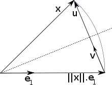

```{r setup, include=FALSE}
knitr::opts_chunk$set(echo = TRUE)
```

# Lab 1 Introduction

The first lab is basically used to get you up to speed with software installation and document preparation which will be used day by day.

Make sure you get everything installed. There are many skills that you will learn:

## R chunks

```{r}
z<-rnorm(30)
z[1:3]
```

## $\LaTeX$

$$P(X=x)=\frac{e^{-\lambda}\lambda^{x}}{x!}$$

## Objects inline

The use of objects made in R chunks can be incorporated in the RMD document.

We made a `z` above -- we may want to see it in the text or at least part of it, just use `"r z[1]"` `r z[1]`

Similarly latex $\LaTeX$.

You can place images in the document using

`{}`

Example Taken from Wikipedia: <https://en.wikipedia.org/wiki/QR_decomposition\#Rectangular_matrix>

{width="70%"}

## More information 

Please check the online books <https://bookdown.org/yihui/rmarkdown/>

<https://bookdown.org/yihui/rmarkdown-cookbook/>


