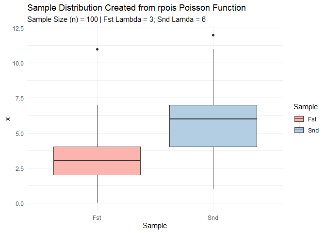
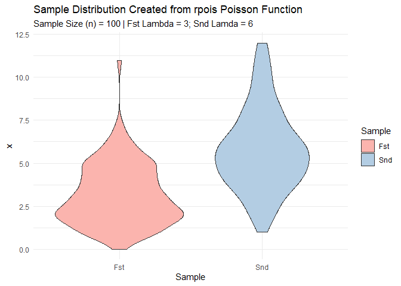

Lab 2 - Distributional Theory
================
Daniel Carpenter
January 2022

-   [1 Discrete Binomial Distribution](#discrete-binomial-distribution)
-   [2 Poisson and Four Basic Distributional Functions: `dpois`,
    `ppois`, `rpois`, and
    `qpois`](#poisson-and-four-basic-distributional-functions-dpois-ppois-rpois-and-qpois)
    -   [2.1 `a` Poisson Calculations](#a-poisson-calculations)
    -   [2.2 `b/c` Data Frame and Base `ggplot` for Boxplots and
        Violins](#bc-data-frame-and-base-ggplot-for-boxplots-and-violins)
    -   [2.3 `b` Create Box Plots](#b-create-box-plots)
    -   [2.4 `c` Create Violin Plots](#c-create-violin-plots)

------------------------------------------------------------------------

# 1 Discrete Binomial Distribution

> *Note* that the discrete binomial distribution is very useful for
> modeling processes in which the binary outcome can be ***either*** a
> success (`1`, `TRUE`) or a failure (`0`, `FALSE`)

### 1.0.1 `LaTex` Formula for Discrete Binomial Distribution

$$
p(X = x\|n, p) = 
  \\begin{pmatrix}
  N \\\\
  k 
  \\end{pmatrix}
p^k(1-p)^{N - k}
$$

### 1.0.2 Function (`dmybin`) to Calculate Discrete Binomial Distribition

``` r
dmybin <- function(X, n, p) {
  
  # Change X to k to be consistent with textbook
  k = X
  
  # Calculate the binomial coefficient (N k)
  binomialCoefficient <- choose(n, X)
  
  # Return the discrete binomial calculation
  return(binomialCoefficient * p^k * (1 - p)^(n - k))
}
```

### 1.0.3 Call and Return Results of the `dmybin` Function

``` r
y.dmybin = dmybin(X=0:4, n=10, p=0.5)
y.dmybin
```

    ## [1] 0.0009765625 0.0097656250 0.0439453125 0.1171875000 0.2050781250

### 1.0.4 Call and Return Results of `base` R Binomial Distribution Function `dbinom`

``` r
y.dbinom = dbinom(x=0:4, size=10, prob=0.5)
y.dbinom
```

    ## [1] 0.0009765625 0.0097656250 0.0439453125 0.1171875000 0.2050781250

------------------------------------------------------------------------

### 1.0.5 Create a Cumulative Probability Function Called `pmybin`

``` r
pmybin <- function(dmybin, x, n, p) {
  
  # Return the Cumulative Probability
  return(sum(dmybin(0:x, n, p)))
}
```

### 1.0.6 Call and Return Results of the `pmybin`

``` r
cumulativeProbability.pmybin <- pmybin(dmybin, x=5, n=10, p=0.5)
cumulativeProbability.pmybin
```

    ## [1] 0.6230469

### 1.0.7 Call and Return Results of `base` R Binomial Function Distribution Function `pbinom`

``` r
cumulativeProbability.pbinom <- pbinom(q = 5, size=10, prob=0.5)
cumulativeProbability.pbinom
```

    ## [1] 0.6230469

### 1.0.8 Create a Binomial Distribution Plot

``` r
x = 0:10

plot(x, 
     y = dbinom(x, size = 10, prob = 0.5),
     type = 'h', # h := histogram like
     main = 'Daniel Carpenter - Binomial Distributon',
     xlab = 'x')
```

<!-- -->

------------------------------------------------------------------------

# 2 Poisson and Four Basic Distributional Functions: `dpois`, `ppois`, `rpois`, and `qpois`

## 2.1 `a` Poisson Calculations

### 2.1.1 Find 𝑃(𝑋 = 4\|𝜆 = 3)

-   What is the probability that there are exactly 4 successes when 3 is
    the average?

``` r
dpois(x = 4, lambda = 3)
```

    ## [1] 0.1680314

### 2.1.2 Find 𝑃(𝑋 ≤ 4\|𝜆 = 3)

-   What is the probability that there are 4 or less successes when 3 is
    the average?

``` r
ppois(q = 4, lambda = 3)
```

    ## [1] 0.8152632

### 2.1.3 Find 𝑃(𝑋 &gt; 4\|𝜆 = 3)

-   What is the probability that there are more than 4 successes when 3
    is the average?

``` r
ppois(q = 4, lambda = 3, lower.tail = FALSE)
```

    ## [1] 0.1847368

### 2.1.4 Find x so that 𝑃(𝑋 ≤ 𝑥\|𝜆 = 3)= 0.9997077

-   How many successes when 3 on average and cumulative probability of
    0.9997077?

``` r
qpois(p = 0.9997077, lambda = 3)
```

    ## [1] 11

### 2.1.5 Create a sample of size 100 from a Poisson distribution that has parameter 𝜆 = 3. Store in an object.

``` r
poissonSample3 <- rpois(n = 100, lambda = 3)
```

### 2.1.6 Make a second sample of size 100 from a Poisson that has parameter 𝜆 = 6, store in an object

``` r
poissonSample6 <- rpois(n = 100, lambda = 6)
```

## 2.2 `b/c` Data Frame and Base `ggplot` for Boxplots and Violins

``` r
if(!require(tidyverse)) install.packages(tidyverse)

# Create data frame with both samples
df <- data.frame(Fst = poissonSample3,
                 Snd = poissonSample6) %>%
  
  # Pivot data into single column for ggplot use
  pivot_longer(cols      = c("Fst", "Snd"),
               names_to  = "Sample",
               values_to = "x")


# Create a base Plot Object for future distribution graphs
basePlot <- ggplot(df,
                   aes(x = Sample,
                       y = x,
                       fill = Sample)) + 
            
            # Color palette and theme
            scale_fill_brewer(palette = "Pastel1") +
            theme_minimal() +
          
            # Title
            labs(title    = 'Sample Distribution Created from rpois Poisson Function',
                 subtitle = 'Sample Size (n) = 100 | Fst Lambda = 3; Snd Lamda = 6')
```

## 2.3 `b` Create Box Plots

``` r
basePlot + geom_boxplot()
```

<!-- -->

## 2.4 `c` Create Violin Plots

``` r
basePlot + geom_violin()
```

<!-- -->
