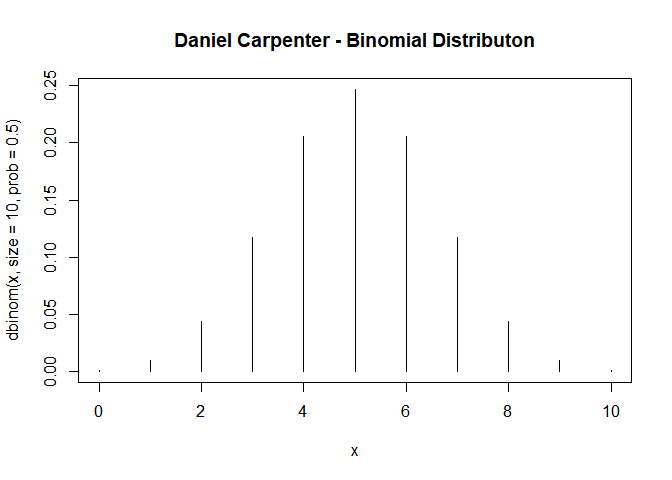
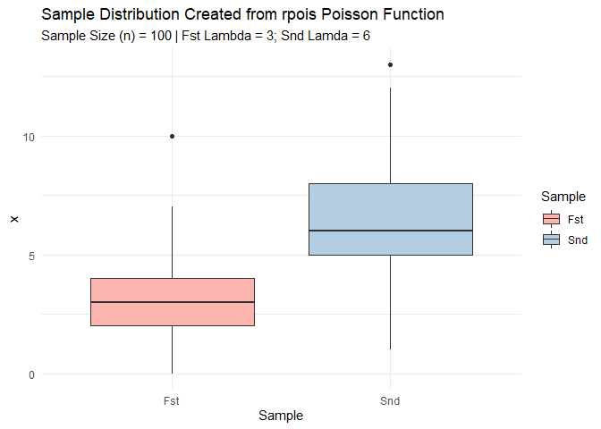
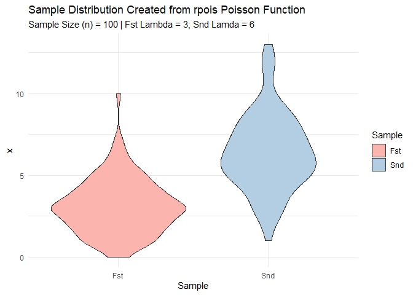
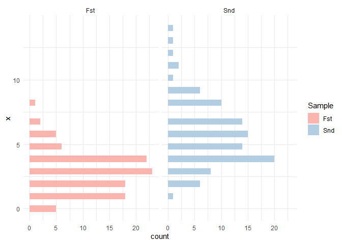

# "Lab 2 - Bayesian Statistics - Distributional Theory"
* Daniel Carpenter
* January 2022

---

# Discrete Binomial Distribution

> *Note* that the discrete binomial distribution is very useful for
> modeling processes in which the binary outcome can be ***either*** a
> success (`1`, `TRUE`) or a failure (`0`, `FALSE`)

### `LaTex` Formula for Discrete Binomial Distribution

$$
p(X = x|n, p) = 
  \\begin{pmatrix}
  N \\\\
  k 
  \\end{pmatrix}
p^k(1-p)^{N - k}
$$

### Function (`dmybin`) to Calculate Discrete Binomial Distribition

    dmybin <- function(X, n, p) {
      
      # Change X to k to be consistent with textbook
      k = X
      
      # Calculate the binomial coefficient (N k)
      binomialCoefficient <- choose(n, X)
      
      # Return the discrete binomial calculation
      return(binomialCoefficient * p^k * (1 - p)^(n - k))
    }

### Call and Return Results of the `dmybin` Function

    y.dmybin = dmybin(X=0:4, n=10, p=0.5)
    y.dmybin

    ## [1] 0.0009765625 0.0097656250 0.0439453125 0.1171875000 0.2050781250

### Call and Return Results of `base` R Binomial Distribution Function `dbinom`

    y.dbinom = dbinom(x=0:4, size=10, prob=0.5)
    y.dbinom

    ## [1] 0.0009765625 0.0097656250 0.0439453125 0.1171875000 0.2050781250

------------------------------------------------------------------------

### Create a Cumulative Probability Function Called `pmybin`

    pmybin <- function(dmybin, x, n, p) {
      
      # Return the Cumulative Probability
      return(sum(dmybin(0:x, n, p)))
    }

### Call and Return Results of the `pmybin`

    cumulativeProbability.pmybin <- pmybin(dmybin, x=5, n=10, p=0.5)
    cumulativeProbability.pmybin

    ## [1] 0.6230469

### Call and Return Results of `base` R Binomial Function Distribution Function `pbinom`

    cumulativeProbability.pbinom <- pbinom(q = 5, size=10, prob=0.5)
    cumulativeProbability.pbinom

    ## [1] 0.6230469

### Create a Binomial Distribution Plot

    x = 0:10

    plot(x, 
         y = dbinom(x, size = 10, prob = 0.5),
         type = 'h', # h := histogram like
         main = 'Daniel Carpenter - Binomial Distributon',
         xlab = 'x')

------------------------------------------------------------------------

# Poisson and Four Basic Distributional Functions: `dpois`, `ppois`, `rpois`, and `qpois`

## `a` Poisson Calculations

### Find 𝑃(𝑋 = 4|𝜆 = 3)

-   What is the probability that there are exactly 4 successes when 3 is
    the average?

<!-- -->

    dpois(x = 4, lambda = 3)

    ## [1] 0.1680314

### Find 𝑃(𝑋 ≤ 4|𝜆 = 3)

-   What is the probability that there are 4 or less successes when 3 is
    the average?

<!-- -->

    ppois(q = 4, lambda = 3)

    ## [1] 0.8152632

### Find 𝑃(𝑋 &gt; 4|𝜆 = 3)

-   What is the probability that there are more than 4 successes when 3
    is the average?

<!-- -->

    ppois(q = 4, lambda = 3, lower.tail = FALSE)

    ## [1] 0.1847368

### Find x so that 𝑃(𝑋 ≤ 𝑥|𝜆 = 3)= 0.9997077

-   How many successes when 3 on average and cumulative probability of
    0.9997077?

<!-- -->

    qpois(p = 0.9997077, lambda = 3)

    ## [1] 11

### Create a sample of size 100 from a Poisson distribution that has parameter 𝜆 = 3. Store in an object.

    poissonSample3 <- rpois(n = 100, lambda = 3)

### Make a second sample of size 100 from a Poisson that has parameter 𝜆 = 6, store in an object

    poissonSample6 <- rpois(n = 100, lambda = 6)

## `b/c` Data Frame and Base `ggplot` for Boxplots and Violins

    if(!require(tidyverse)) install.packages(tidyverse)

    # Create data frame with both samples
    df <- data.frame(Fst = poissonSample3,
                     Snd = poissonSample6) %>%
      
      # Pivot data into single column for ggplot use
      pivot_longer(cols      = c("Fst", "Snd"),
                   names_to  = "Sample",
                   values_to = "x")

    # Create a base Plot Object for future distribution graphs
    basePlot <- ggplot(df,
                       aes(x = Sample,
                           y = x,
                           fill = Sample)) + 
                
                # Color palette and theme
                scale_fill_brewer(palette = "Pastel1") +
                theme_minimal() +
              
                # Title
                labs(title    = 'Sample Distribution Created from rpois Poisson Function',
                     subtitle = 'Sample Size (n) = 100 | Fst Lambda = 3; Snd Lamda = 6')

## `b` Create Box Plots

    basePlot + geom_boxplot()

## `c` Create Violin Plots

    basePlot + geom_violin()

## `d` Create Histogram

    ggplot(df) + 
      geom_histogram(aes(y = x, fill = Sample)) + 
      facet_wrap(~Sample) +
      theme_minimal() +
      scale_fill_brewer(palette = "Pastel1")

    ## `stat_bin()` using `bins = 30`. Pick better value with `binwidth`.

