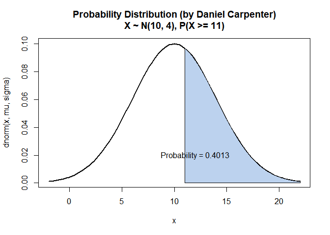
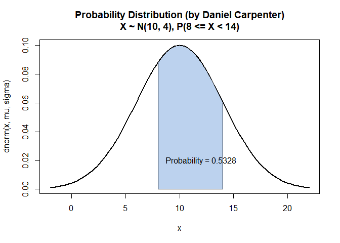
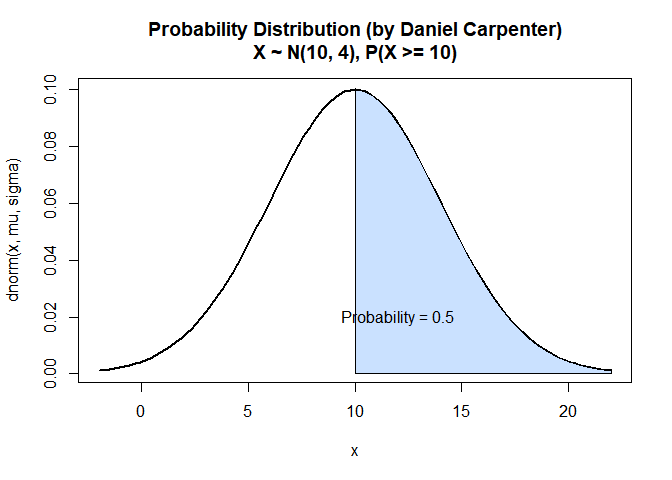

------------------------------------------------------------------------

# Task `1`: Calculating Exact Probability

## Inputs for `mu` and `sigma`

*X* ∼ *N*(*μ* = 10, *σ* = 4)

    mu    = 10
    sigma = 4

## `a.` Find 𝑃(𝑋 ≤ 8)

    pnorm(8, mu, sigma)

    ## [1] 0.3085375

## `b.` Find 𝑃(𝑋 ≥ 11)

    1 - pnorm(11, mu, sigma)

    ## [1] 0.4012937

## `c.` Find 𝑃(8 ≤ 𝑋 &lt; 14)

    # Inputs for upper and lower bound when calculating the area
    upperBound = 14
    lowerBound = 8

    # Calculate the area in between the two bounds
    pnorm(upperBound, mu, sigma) - pnorm(lowerBound, mu, sigma)

    ## [1] 0.5328072

## `d.` Find 𝑃(𝑋 &gt; 10)

    1 - pnorm(10, mu, sigma)

    ## [1] 0.5

------------------------------------------------------------------------

<br>

# Task `2-4`: Plotting Probability

## Probability Function `Myfunction()`

-   *Please note this function is technically task 4, but is placed here
    for repeatability.*

```R
Myfunction = function(mu, sigma, 
                      lowerBound = NA, upperBound = NA, 
                      roundTo = 4, 
                      color = paste0("lightsteelblue", floor(runif(1, min=1, max=4))),
                      returnCMD = FALSE)
{
  
  # Calculate the "xlim" lower and upper bound for the Normal PDF Curve
  curveLowerBound <- mu - 3*sigma
  curveUpperBound <- mu + 3*sigma
  
  # Initialize variables related to output and graph
  title <- ""   # Title of graph
  exactProb = 0 # The exact probability of the questions
  
  # If no provided LOWER AND UPPER Bound (NA as parameter value) then assume none
  if (!(is.na(lowerBound)) & !(is.na(upperBound))) {
    title <- paste0(", P(", lowerBound, " <= X < ",upperBound,")")
    exactProb = pnorm(upperBound, mu, sigma) - pnorm(lowerBound, mu, sigma) # calculate prob 
    
  # If no provided LOWER Bound (NA as parameter value) then assume none
  } else if (is.na(lowerBound)) {
    lowerBound = curveLowerBound
    title <- paste0(", P(X < ",upperBound,")") # Set a dynamic title
    exactProb = pnorm(upperBound, mu, sigma) # calculate prob 
    
  # If no provided UPPER Bound (NA as parameter value) then assume none
  } else if(is.na(upperBound)) {
    upperBound = curveUpperBound
    title <- paste0(", P(X >= ",lowerBound,")")
    exactProb = 1 - pnorm(lowerBound, mu, sigma) # calculate prob 
  }
  
  # Create the line that displays the bell curve (between the CURVE bounds defined above)
  curve(
    
    ## Normally Distributed
    dnorm(x,mu,sigma), 
    
    ## Normally Distributed
    xlim=c(curveLowerBound, curveUpperBound), 
    
    ## Line width
    lwd =2, 
    
    ## Title with descriptive characteristics about function parameters
    main = paste0("Probability Distribution (by Daniel Carpenter)\n",
                  "X ~ N(",mu,", ",sigma,")", title)
  )
  
  # Add the AREA of between the lower and upper bound P(lowerBound<X<=upperBound)
  
    ## X-Axis curve (length does not matter)
    xcurve = seq(lowerBound,upperBound, length=1000)
    
    ## Y-Axis Curve
    ycurve = dnorm(xcurve, mu,sigma)
    
    ## Combine the X and Y curve to form the area (in green)
    polygon(c(lowerBound, xcurve, upperBound), 
            c(0, ycurve, 0), 
            col=color) 
  
  # Add the probability as text
    
    ## Calculate the area (probability)
    area = exactProb
    areaRounded = round(area, roundTo)
    
    ## Place this on the above plot
    text(12,0.02,substitute(paste("Probability = ", areaRounded), 
                            list(areaRounded = areaRounded)))
  
  # Return stats about the Plot
  if (returnCMD) {
    return(list(mu = mu, 
                sigma = sigma,
                prob = areaRounded))
  }
}
```

## `a.` Find 𝑃(𝑋 ≤ 8)

    Myfunction(mu, sigma, upperBound = 8)


## `b.` Find 𝑃(𝑋 ≥ 11)

    Myfunction(mu, sigma, lowerBound = 11)



## `c.` Find 𝑃(8 ≤ 𝑋 &lt; 14)

    Myfunction(mu, sigma, lowerBound = 8, upperBound = 14)



## `d.` Find 𝑃(𝑋 &gt; 10)

    Myfunction(mu, sigma, lowerBound = 10)



------------------------------------------------------------------------

<br>

# Task `5`: Create and Demonstrate Function `mynormplot()`

## `a-f` Create `mynormplot()` Function

    # Get function from above since it is dynamic and can handle the below calculations
    mynormplot <- Myfunction

## `g.` Calculate 𝑃(7 ≤ 𝑋 ≤ 10), where 𝑋 ∼ 𝑁(8,5) with `mynormplot()` Function
```r
mynormplot(
  
  # Stats for Normal Distribution Creation
  mu = 8, 
  sigma = 5, 
  
  # Bounds for Calculating Probability
  lowerBound = 7, 
  upperBound = 10, 
  
  # Round to 6 decimal places
  roundTo = 6, 
  
  # Set color of the prob. area to "Blue"
  color = "Blue",
  
  # Since TRUE, we will return command line output with
  # mean of the normal, the standard deviation and the probability calculated
  returnCMD = TRUE) 
```


    ## $mu
    ## [1] 8
    ## 
    ## $sigma
    ## [1] 5
    ## 
    ## $prob
    ## [1] 0.234681

------------------------------------------------------------------------

<br>

# Task `6`:

Formula for Normal Density using
$\\LaTeX: \\ \\ X \\sim N(\\mu, \\sigma)$

------------------------------------------------------------------------

<br>

# Task `7`:

```r
if(!require(ggplot2)) install.packages("ggplot2")

## Warning in register(): Can't find generic `scale_type` in package ggplot2 to
## register S3 method.

ggplot(data = NULL, aes(c(-10,10))) +
  
  # LHS of the distribution (Red)
  geom_area(stat = "function", 
            fun = dnorm, 
            args = list(mean = 0, sd = 3),
            fill = "red", xlim = c(-10, 0))  + 
  
  # RHS of the distribution (Blue)
  geom_area(stat = "function", 
            fun = dnorm, 
            args = list(mean = 0, sd = 3),
            fill = "blue", xlim = c(0, 10))  + 
  
  # Labels on the chart
  labs(title = "Daniel Carpenter",
        subtitle = "Normal Distribution with ggplot")
```


