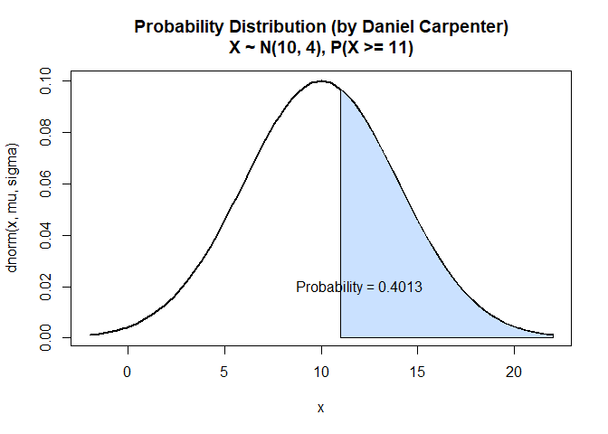

Lab 3 - Probability: Distributional Theory Continued
================
Daniel Carpenter
February 2022

-   [1 Task `1`: Calculating Exact
    Probability](#task-1-calculating-exact-probability)
    -   [1.1 Inputs for `mu` and `sigma`](#inputs-for-mu-and-sigma)
    -   [1.2 `a.` Find 𝑃(𝑋 ≤ 8)](#a-find-𝑃𝑋--8)
    -   [1.3 `b.` Find 𝑃(𝑋 ≥ 11)](#b-find-𝑃𝑋--11)
    -   [1.4 `c.` Find 𝑃(8 ≤ 𝑋 < 14)](#c-find-𝑃8--𝑋--14)
    -   [1.5 `d.` Find 𝑃(𝑋 > 10)](#d-find-𝑃𝑋--10)
-   [2 Task `2-4`: Plotting Probability](#task-2-4-plotting-probability)
    -   [2.1 Probability Function
        `Myfunction()`](#probability-function-myfunction)
    -   [2.2 `a.` Find 𝑃(𝑋 ≤ 8)](#a-find-𝑃𝑋--8-1)
    -   [2.3 `b.` Find 𝑃(𝑋 ≥ 11)](#b-find-𝑃𝑋--11-1)
    -   [2.4 `c.` Find 𝑃(8 ≤ 𝑋 < 14)](#c-find-𝑃8--𝑋--14-1)
    -   [2.5 `d.` Find 𝑃(𝑋 > 10)](#d-find-𝑃𝑋--10-1)
-   [3 Task `5`: Create and Demonstrate Function
    `mynormplot()`](#task-5-create-and-demonstrate-function-mynormplot)
    -   [3.1 `a-f` Create `mynormplot()`
        Function](#a-f-create-mynormplot-function)
    -   [3.2 `g.` Calculate 𝑃(7 ≤ 𝑋 ≤ 10), where 𝑋 ∼ 𝑁(8,5) with
        `mynormplot()`
        Function](#g-calculate-𝑃7--𝑋--10-where-𝑋--𝑁85-with-mynormplot-function)
-   [4 Task `6`:](#task-6)
-   [5 Task `7`:](#task-7)

------------------------------------------------------------------------

# 1 Task `1`: Calculating Exact Probability

## 1.1 Inputs for `mu` and `sigma`

*X* ∼ *N*(*μ* = 10, *σ* = 4)

``` r
mu    = 10
sigma = 4
```

## 1.2 `a.` Find 𝑃(𝑋 ≤ 8)

``` r
pnorm(8, mu, sigma)
```

    ## [1] 0.3085375

## 1.3 `b.` Find 𝑃(𝑋 ≥ 11)

``` r
1 - pnorm(11, mu, sigma)
```

    ## [1] 0.4012937

## 1.4 `c.` Find 𝑃(8 ≤ 𝑋 < 14)

``` r
# Inputs for upper and lower bound when calculating the area
upperBound = 14
lowerBound = 8

# Calculate the area in between the two bounds
pnorm(upperBound, mu, sigma) - pnorm(lowerBound, mu, sigma)
```

    ## [1] 0.5328072

## 1.5 `d.` Find 𝑃(𝑋 > 10)

``` r
1 - pnorm(10, mu, sigma)
```

    ## [1] 0.5

------------------------------------------------------------------------

<br>

# 2 Task `2-4`: Plotting Probability

## 2.1 Probability Function `Myfunction()`

-   *Please note this function is technically task 4, but is placed here
    for repeatability.*

``` r
    Myfunction = function(mu, sigma, 
                          lowerBound = NA, upperBound = NA, 
                          roundTo = 4, 
                          color = paste0("lightsteelblue", floor(runif(1, min=1, max=4))),
                          returnCMD = FALSE)
    {
      
      # Calculate the "xlim" lower and upper bound for the Normal PDF Curve
      curveLowerBound <- mu - 3*sigma
      curveUpperBound <- mu + 3*sigma
      
      # Initialize variables related to output and graph
      title <- ""   # Title of graph
      exactProb = 0 # The exact probability of the questions
      
      # If no provided LOWER AND UPPER Bound (NA as parameter value) then assume none
      if (!(is.na(lowerBound)) & !(is.na(upperBound))) {
        title <- paste0(", P(", lowerBound, " <= X < ",upperBound,")")
        exactProb = pnorm(upperBound, mu, sigma) - pnorm(lowerBound, mu, sigma) # calculate prob 
        
      # If no provided LOWER Bound (NA as parameter value) then assume none
      } else if (is.na(lowerBound)) {
        lowerBound = curveLowerBound
        title <- paste0(", P(X < ",upperBound,")") # Set a dynamic title
        exactProb = pnorm(upperBound, mu, sigma) # calculate prob 
        
      # If no provided UPPER Bound (NA as parameter value) then assume none
      } else if(is.na(upperBound)) {
        upperBound = curveUpperBound
        title <- paste0(", P(X >= ",lowerBound,")")
        exactProb = 1 - pnorm(lowerBound, mu, sigma) # calculate prob 
      }
      
      # Create the line that displays the bell curve (between the CURVE bounds defined above)
      curve(
        
        ## Normally Distributed
        dnorm(x,mu,sigma), 
        
        ## Normally Distributed
        xlim=c(curveLowerBound, curveUpperBound), 
        
        ## Line width
        lwd =2, 
        
        ## Title with descriptive characteristics about function parameters
        main = paste0("Probability Distribution (by Daniel Carpenter)\n",
                      "X ~ N(",mu,", ",sigma,")", title)
      )
      
      # Add the AREA of between the lower and upper bound P(lowerBound<X<=upperBound)
      
        ## X-Axis curve (length does not matter)
        xcurve = seq(lowerBound,upperBound, length=1000)
        
        ## Y-Axis Curve
        ycurve = dnorm(xcurve, mu,sigma)
        
        ## Combine the X and Y curve to form the area (in green)
        polygon(c(lowerBound, xcurve, upperBound), 
                c(0, ycurve, 0), 
                col=color) 
      
      # Add the probability as text
        
        ## Calculate the area (probability)
        area = exactProb
        areaRounded = round(area, roundTo)
        
        ## Place this on the above plot
        text(12,0.02,substitute(paste("Probability = ", areaRounded), 
                                list(areaRounded = areaRounded)))
      
      # Return stats about the Plot
      if (returnCMD) {
        return(list(mu = mu, 
                    sigma = sigma,
                    prob = areaRounded))
      }
    }
```

## 2.2 `a.` Find 𝑃(𝑋 ≤ 8)

``` r
Myfunction(mu, sigma, upperBound = 8)
```

<!-- -->

## 2.3 `b.` Find 𝑃(𝑋 ≥ 11)

``` r
Myfunction(mu, sigma, lowerBound = 11)
```

<!-- -->

## 2.4 `c.` Find 𝑃(8 ≤ 𝑋 &lt; 14)

``` r
Myfunction(mu, sigma, lowerBound = 8, upperBound = 14)
```

<!-- -->

## 2.5 `d.` Find 𝑃(𝑋 &gt; 10)

``` r
Myfunction(mu, sigma, lowerBound = 10)
```

<!-- -->

------------------------------------------------------------------------

<br>

# 3 Task `5`: Create and Demonstrate Function `mynormplot()`

## 3.1 `a-f` Create `mynormplot()` Function

``` r
# Get function from above since it is dynamic and can handle the below calculations
mynormplot <- Myfunction
```

## 3.2 `g.` Calculate 𝑃(7 ≤ 𝑋 ≤ 10), where 𝑋 ∼ 𝑁(8,5) with `mynormplot()` Function

``` r
mynormplot(
  
  # Stats for Normal Distribution Creation
  mu = 8, 
  sigma = 5, 
  
  # Bounds for Calculating Probability
  lowerBound = 7, 
  upperBound = 10, 
  
  # Round to 6 decimal places
  roundTo = 6, 
  
  # Set color of the prob. area to "Blue"
  color = "Blue",
  
  # Since TRUE, we will return command line output with
  # mean of the normal, the standard deviation and the probability calculated
  returnCMD = TRUE) 
```

<!-- -->

    ## $mu
    ## [1] 8
    ## 
    ## $sigma
    ## [1] 5
    ## 
    ## $prob
    ## [1] 0.234681

------------------------------------------------------------------------

<br>

# 4 Task `6`:

Formula for Normal Density using
$\\LaTeX: \\ \\ X \\sim N(\\mu, \\sigma)$

------------------------------------------------------------------------

<br>

# 5 Task `7`:

``` r
if(!require(ggplot2)) install.packages("ggplot2")
```

    ## Warning in register(): Can't find generic `scale_type` in package ggplot2 to
    ## register S3 method.

``` r
ggplot(data = NULL, aes(c(-10,10))) +
  
  # LHS of the distribution (Red)
  geom_area(stat = "function", 
            fun = dnorm, 
            args = list(mean = 0, sd = 3),
            fill = "red", xlim = c(-10, 0))  + 
  
  # RHS of the distribution (Blue)
  geom_area(stat = "function", 
            fun = dnorm, 
            args = list(mean = 0, sd = 3),
            fill = "blue", xlim = c(0, 10))  + 
  
  # Labels on the chart
  labs(title = "Daniel Carpenter",
       subtitle = "Normal Distribution with ggplot")
```

<!-- -->
