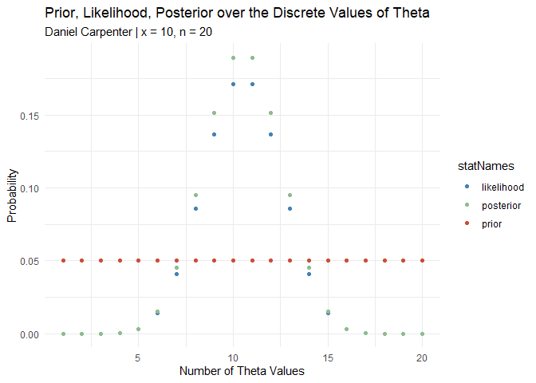

Lab 4 - Bayes Box and R
================
Daniel Carpenter
February 2022

-   [1 Task `1`: Point Estimates
    (*Incorrect*)](#task-1-point-estimates-incorrect)
    -   [1.1 `a.` Classical Point Estimate for
        𝜃](#a-classical-point-estimate-for-𝜃)
    -   [1.2 `b.` Confidence Interval using
        𝜃](#b-confidence-interval-using-𝜃)
-   [2 Task `2`: Calculate/Plot Uniform Prior, Likelihood, and
    Post](#task-2-calculateplot-uniform-prior-likelihood-and-post)
    -   [2.1 `a.` Suppose we take
        `theta = seq(0, 1, length = 20)`](#a-suppose-we-take-theta--seq0-1-length--20)
    -   [2.2 `b.` Plot the prior using
        base R.](#b-plot-the-prior-using-base-r)
    -   [2.3 `c.` Formula for the
        Likelihood](#c-formula-for-the-likelihood)
    -   [2.4 `d.` Plot the Likelihood over Discrete Values of
        𝜃](#d-plot-the-likelihood-over-discrete-values-of-𝜃)
    -   [2.5 `e.` Prior and the Likelihood Plotted
        Together](#e-prior-and-the-likelihood-plotted-together)
    -   [2.6 `f.` Formula and Plot of the
        Posterior](#f-formula-and-plot-of-the-posterior)
-   [3 Task `3`: Bayes Box](#task-3-bayes-box)
    -   [3.1 `a.` Matrix in R that will hold the 5 column
        vectors](#a-matrix-in-r-that-will-hold-the-5-column-vectors)
    -   [3.2 `b.` Rewrite Bayes’ theorem in terms of
        `h = prior * likelihood`](#b-rewrite-bayes-theorem-in-terms-of-h--prior--likelihood)
    -   [3.3 `c.` Plot Prior, Likelihood, and Posterior in
        `ggplot`](#c-plot-prior-likelihood-and-posterior-in-ggplot)
-   [4 Task `4`: Create Function `mybinpost()` to Dynamically Produce
    Above
    Calculations](#task-4-create-function-mybinpost-to-dynamically-produce-above-calculations)
    -   [4.1 `a. - b.` Create Function
        `mybinpost()`](#a---b-create-function-mybinpost)
-   [5 Task `5`: Run `mybinpost()`](#task-5-run-mybinpost)
    -   [5.1 `a.` Test \#1 of `mybinpost()`](#a-test-1-of-mybinpost)
    -   [5.2 `b.` Test \#2 of `mybinpost()`](#b-test-2-of-mybinpost)

------------------------------------------------------------------------

# 1 Task `1`: Point Estimates (*Incorrect*)

## 1.1 `a.` Classical Point Estimate for 𝜃

``` r
# Probability of success given N number of trials
from = 0
to   = 1
n    = 10

theta <- seq(from, to, length = n)

# Point Estimate for Theta
pointEst <- mean(theta)
pointEst
```

    ## [1] 0.5

## 1.2 `b.` Confidence Interval using 𝜃

`i.` Find classical 95% confidence interval using *θ*

``` r
classicalEst <- pointEst + c(-1, 1) * 1.95 * sqrt(pointEst*(1 - pointEst) / n)
classicalEst
```

    ## [1] 0.1916779 0.8083221

`ii.` Interpretation of the Interval above

``` r
print(paste0("We can be 95% confident that the true value of theta will be between ",
             round(classicalEst[1], 4), " and ", round(classicalEst[2], 4), 
             " (rounded to 4 decimal places) if repreated samples were taken."))
```

    ## [1] "We can be 95% confident that the true value of theta will be between 0.1917 and 0.8083 (rounded to 4 decimal places) if repreated samples were taken."

`iii.` How many sample are used to make the interval?

``` r
print(paste0("There are ", n, " number of samples used to make the interval."))
```

    ## [1] "There are 10 number of samples used to make the interval."

`iv.` How many samples are assumed to give the interpretation?

``` r
print(paste0("An infinite number of samples are assumed to give this interpretation"))
```

    ## [1] "An infinite number of samples are assumed to give this interpretation"

------------------------------------------------------------------------

<br>

# 2 Task `2`: Calculate/Plot Uniform Prior, Likelihood, and Post

> Bayesian methods – Bayes’ rule. Assume discrete values of 𝜃 and a
> uniform prior on the values of 𝜃

## 2.1 `a.` Suppose we take `theta = seq(0, 1, length = 20)`

``` r
# Probability of success given N number of trials
from = 0
to   = 1
n    = 20

theta <- seq(from, to, length = n)
```

## 2.2 `b.` Plot the prior using base R.

``` r
# Define some colors for the later plots
red   = 'tomato3'
blue  = 'steelblue'
green = 'darkseagreen'

# NOTE THAT COLORS CONSISTENT FOR PRIOR, LIK, AND POST
# BUT UNABLE TO TELL WHICH TO ASIGN BASED ON GRAPH IN LAB
colorPalette <- c(blue, green, red)
```

``` r
prior = rep(1/n, n)

priorPlot <- plot(x = theta, y = prior, 
                  main = paste0("Uniform Prior on the Values of Theta | Daniel Carpenter\n n = ", n),
                  type = "b", pch = 19, col = red)
```

<!-- -->

## 2.3 `c.` Formula for the Likelihood

### 2.3.1 Formula

$$
likelihood: p(D\|\\theta) = \\frac{p(\\theta\|D)}{p(\\theta) / \\sum\_{\\theta^\*}p(D\|\\theta^\*) \\ p(\\theta^\*)}
$$

### 2.3.2 R Calculations

``` r
# Substitute Dummy Input value for `x`
numSuccesses = round(n / 2)

likelihood  = dbinom(x=numSuccesses, size = n, prob = theta)
```

## 2.4 `d.` Plot the Likelihood over Discrete Values of 𝜃

``` r
likelihoodPlot <- plot(x = theta, y = likelihood, 
                       main = paste0("Likelihood over the Discrete Values of Theta | Daniel Carpenter\n",
                                     "x = ", numSuccesses, ", n = ", n),
                       type = "b", pch = 19, col = blue)
```

<!-- -->

## 2.5 `e.` Prior and the Likelihood Plotted Together

``` r
# Plot the likelihood
plot(x = theta, y = likelihood, 
                     main = paste0("Likelihood and Prior over the Discrete Values of Theta | Daniel Carpenter\n",
                                   "x = ", numSuccesses, ", n = ", n),
     ylab = "Probability",
                     type = "b", pch = 19, col = blue)

# Plot the Prior
lines(x = theta, y = prior, type = "b", pch = 19, col = red)
```

<!-- -->

## 2.6 `f.` Formula and Plot of the Posterior

### 2.6.1 Formula for Posterior

$$
posterior: p(\\theta\|D) = \\frac{p(D\|\\theta) \\ p(\\theta)}{p(D)}
$$

### 2.6.2 Plot of Posterior

``` r
# Calculate the Prior x the Likelihood
h <-  prior * likelihood

# Get the posterior Distribution
posterior = h / sum(h)

# Plot of only the posterior
plot(x = theta, y = posterior,
     main = paste0("Posterior over the Discrete Values of Theta | Daniel Carpenter\n",
                   "x = ", numSuccesses, ", n = ", n),
     type = "b", pch = 19, col = green)
```

<!-- -->

### 2.6.3 Combined Plots

``` r
# Plot the Posterior
plot(x = theta, y = posterior, 
                     main = paste0("Prior, Likelihood, Posterior \nover the Discrete Values of Theta | Daniel Carpenter\n",
                                   "x = ", numSuccesses, ", n = ", n),
                     type = "b", pch = 19, col = green,
     ylab = "Probability")

# Prior
lines(x = theta, y = prior,     type = "b", pch = 19, col = red)

# Likelihood
lines(x = theta, y = likelihood, type = "b", pch = 19, col = blue)
```

<!-- -->

------------------------------------------------------------------------

<br>

# 3 Task `3`: Bayes Box

## 3.1 `a.` Matrix in R that will hold the 5 column vectors

``` r
# Get the length of theta
numRows <- length(theta)

bayesMatrix <- matrix(data = c(theta, prior, likelihood, h, posterior), 
                      nr = numRows, nc = 5, byrow = FALSE)
colnames(bayesMatrix) <- c("theta", "prior", "likelihood", "h", "posterior")

# Print Table
knitr::kable(bayesMatrix)
```

|     theta | prior | likelihood |         h | posterior |
|----------:|------:|-----------:|----------:|----------:|
| 0.0000000 |  0.05 |  0.0000000 | 0.0000000 | 0.0000000 |
| 0.0526316 |  0.05 |  0.0000000 | 0.0000000 | 0.0000000 |
| 0.1052632 |  0.05 |  0.0000101 | 0.0000005 | 0.0000112 |
| 0.1578947 |  0.05 |  0.0003191 | 0.0000160 | 0.0003527 |
| 0.2105263 |  0.05 |  0.0029719 | 0.0001486 | 0.0032848 |
| 0.2631579 |  0.05 |  0.0138838 | 0.0006942 | 0.0153452 |
| 0.3157895 |  0.05 |  0.0409706 | 0.0020485 | 0.0452833 |
| 0.3684211 |  0.05 |  0.0859645 | 0.0042982 | 0.0950134 |
| 0.4210526 |  0.05 |  0.1368842 | 0.0068442 | 0.1512930 |
| 0.4736842 |  0.05 |  0.1713766 | 0.0085688 | 0.1894163 |
| 0.5263158 |  0.05 |  0.1713766 | 0.0085688 | 0.1894163 |
| 0.5789474 |  0.05 |  0.1368842 | 0.0068442 | 0.1512930 |
| 0.6315789 |  0.05 |  0.0859645 | 0.0042982 | 0.0950134 |
| 0.6842105 |  0.05 |  0.0409706 | 0.0020485 | 0.0452833 |
| 0.7368421 |  0.05 |  0.0138838 | 0.0006942 | 0.0153452 |
| 0.7894737 |  0.05 |  0.0029719 | 0.0001486 | 0.0032848 |
| 0.8421053 |  0.05 |  0.0003191 | 0.0000160 | 0.0003527 |
| 0.8947368 |  0.05 |  0.0000101 | 0.0000005 | 0.0000112 |
| 0.9473684 |  0.05 |  0.0000000 | 0.0000000 | 0.0000000 |
| 1.0000000 |  0.05 |  0.0000000 | 0.0000000 | 0.0000000 |

``` r
# Totals for each Column
knitr::kable(colSums(bayesMatrix))
```

|            |          x |
|:-----------|-----------:|
| theta      | 10.0000000 |
| prior      |  1.0000000 |
| likelihood |  0.9047619 |
| h          |  0.0452381 |
| posterior  |  1.0000000 |

## 3.2 `b.` Rewrite Bayes’ theorem in terms of `h = prior * likelihood`

$$
p(\\theta\|D) = \\frac{p(D\|\\theta) \\ p(\\theta)}{\\sum\_{\\theta^\*}p(D\|\\theta^\*) \\ p(\\theta^\*)}  
$$

## 3.3 `c.` Plot Prior, Likelihood, and Posterior in `ggplot`

``` r
## Number of Theta numbers to plot
thetaNumericValues = 1:numRows

## Convert to data fram for plotting
df <- as.data.frame(cbind(bayesMatrix, thetaNumericValues))


if(!require(tidyverse)) install.packages(tidyverse)
df <- df %>%
  
  # Select to only the needed data
  select(-h) %>%
  
  # Pivot y axis variables into single column for ggplot-ing
  pivot_longer(cols      = c("prior", "likelihood", "posterior"),
               values_to = "values",
               names_to  = "statNames")

# Plot it!
basePlot <- ggplot(df,
                   aes(x = thetaNumericValues,
                       y = values,
                       color = statNames)) +
  # Theme and colors
  theme_minimal() +
  scale_color_manual(values = colorPalette) +
  
  # Labels
  labs(title = "Prior, Likelihood, Posterior over the Discrete Values of Theta",
       subtitle = paste0("Daniel Carpenter | x = ", numSuccesses, ", n = ", n),
       x = 'Number of Theta Values', y = 'Probability') +

  # The points
  geom_point()

basePlot 
```

<!-- -->

------------------------------------------------------------------------

<br>

# 4 Task `4`: Create Function `mybinpost()` to Dynamically Produce Above Calculations

## 4.1 `a. - b.` Create Function `mybinpost()`

``` r
mybinpost <- function(n, x, theta, alpha) {
  
  # CALCULATIONS -------------------------------------------
    
    ## Get the length of theta
    numRows <- length(theta)
  
    ## Calculate prior assuming uniform distribution
    prior = rep(1/numRows, numRows)
  
    ## Calculate the likelihood
    likelihood  = dbinom(x=x, size=n, prob=theta)
    
    ## Calculate the Prior x the Likelihood
    h <-  prior * likelihood
    
    ## Get the posterior Distribution
    posterior = h / sum(h) 
    
    ## Consolidate into a matrix with row and column names
    bayesMatrix <- matrix(c(theta, prior, likelihood, h, posterior), 
                        nr = numRows, nc = 5, byrow = FALSE)
    colnames(bayesMatrix) <- c("theta", "prior", "likelihood", "h", "posterior")
    rownames(bayesMatrix)= c(rep("", numRows))

        
  # PLOTTING -----------------------------------------------
    
    ## Number of Theta numbers to plot
    thetaNumericValues = 1:numRows
    
    ## Convert to data frame for ggplot
    df <- as.data.frame(cbind(bayesMatrix, thetaNumericValues))
    
    
    if(!require(tidyverse)) install.packages(tidyverse)
    df <- df %>%
      
      ### Select to only the needed data
      select(-h) %>%
      
      ### Pivot y axis variables into single column for ggplot-ing
      pivot_longer(cols      = c("prior", "likelihood", "posterior"),
                   values_to = "values",
                   names_to  = "statNames")
    
    ## Plot it!
    basePlot <- ggplot(df,
                       aes(x = thetaNumericValues,
                           y = values,
                           color = statNames)) +
      ### Theme and colors
      theme_minimal() +
      scale_color_manual(values = colorPalette) +
      
      ### Labels
      labs(title = "Prior, Likelihood, Posterior over the Discrete Values of Theta",
           subtitle = paste0("Daniel Carpenter | x = ", x, ", n = ", n),
           x = 'Number of Theta Values', y = 'Probability')+ 
      
      ### Create the points
      geom_point()
    
    # Output Plot
    print(basePlot)
    
    
  # BCI & Point Est ------------------------------------------
    
    ## BCI
    cp = cumsum(posterior) # cumulative sum
    L = max(which(cp<alpha/2)) # this gives the max index where  cp < alpha/2
    U = min(which(cp > 1-alpha/2))
    BCI = df$theta[c(L,U)] # close to the desired BCI
    
    ## Bayesian point estimate is the posterior mean
    bayesPointEst <- mean(posterior)
    
    
  # RETURN DATA --------------------------------------------- 
    
    ## Used for latex output of a matrix
    if(!require(xtable)) install.packages(xtable)
    
    ## Return a list of relevant data
    return(list('bayesMatrix'      = bayesMatrix,
                'latexBayesMat'    = xtable(bayesMatrix),
                'numTrials'        = n,
                'numSuccesses'     = x,
                'bayesPointEst'    = bayesPointEst,
                'bayesCredIntvl95' = BCI))
}
```

------------------------------------------------------------------------

<br>

# 5 Task `5`: Run `mybinpost()`

## 5.1 `a.` Test \#1 of `mybinpost()`

``` r
mybinpost(n=20,x=12,theta = seq(0,1,length=50), alpha=0.05)
```

<!-- -->

    ## $bayesMatrix
    ##       theta prior   likelihood            h    posterior
    ##  0.00000000  0.02 0.000000e+00 0.000000e+00 0.000000e+00
    ##  0.02040816  0.02 5.575392e-16 1.115078e-17 2.389454e-16
    ##  0.04081633  0.02 1.929694e-12 3.859387e-14 8.270115e-13
    ##  0.06122449  0.02 2.107964e-10 4.215928e-12 9.034132e-11
    ##  0.08163265  0.02 5.581688e-09 1.116338e-10 2.392152e-09
    ##  0.10204082  0.02 6.785893e-08 1.357179e-09 2.908240e-08
    ##  0.12244898  0.02 5.033942e-07 1.006788e-08 2.157404e-07
    ##  0.14285714  0.02 2.651651e-06 5.303302e-08 1.136422e-06
    ##  0.16326531  0.02 1.085666e-05 2.171332e-07 4.652854e-06
    ##  0.18367347  0.02 3.662145e-05 7.324291e-07 1.569491e-05
    ##  0.20408163  0.02 1.058918e-04 2.117836e-06 4.538221e-05
    ##  0.22448980  0.02 2.699768e-04 5.399537e-06 1.157044e-04
    ##  0.24489796  0.02 6.196326e-04 1.239265e-05 2.655568e-04
    ##  0.26530612  0.02 1.300426e-03 2.600853e-05 5.573256e-04
    ##  0.28571429  0.02 2.525959e-03 5.051918e-05 1.082554e-03
    ##  0.30612245  0.02 4.584289e-03 9.168578e-05 1.964695e-03
    ##  0.32653061  0.02 7.832436e-03 1.566487e-04 3.356758e-03
    ##  0.34693878  0.02 1.267455e-02 2.534909e-04 5.431948e-03
    ##  0.36734694  0.02 1.952132e-02 3.904264e-04 8.366279e-03
    ##  0.38775510  0.02 2.873153e-02 5.746306e-04 1.231351e-02
    ##  0.40816327  0.02 4.054053e-02 8.108107e-04 1.737451e-02
    ##  0.42857143  0.02 5.498463e-02 1.099693e-03 2.356484e-02
    ##  0.44897959  0.02 7.183363e-02 1.436673e-03 3.078584e-02
    ##  0.46938776  0.02 9.054539e-02 1.810908e-03 3.880517e-02
    ##  0.48979592  0.02 1.102556e-01 2.205111e-03 4.725238e-02
    ##  0.51020408  0.02 1.298122e-01 2.596244e-03 5.563381e-02
    ##  0.53061224  0.02 1.478592e-01 2.957184e-03 6.336823e-02
    ##  0.55102041  0.02 1.629642e-01 3.259284e-03 6.984179e-02
    ##  0.57142857  0.02 1.737786e-01 3.475572e-03 7.447654e-02
    ##  0.59183673  0.02 1.792097e-01 3.584194e-03 7.680415e-02
    ##  0.61224490  0.02 1.785786e-01 3.571572e-03 7.653368e-02
    ##  0.63265306  0.02 1.717378e-01 3.434756e-03 7.360191e-02
    ##  0.65306122  0.02 1.591243e-01 3.182487e-03 6.819615e-02
    ##  0.67346939  0.02 1.417336e-01 2.834671e-03 6.074295e-02
    ##  0.69387755  0.02 1.210104e-01 2.420207e-03 5.186159e-02
    ##  0.71428571  0.02 9.867028e-02 1.973406e-03 4.228726e-02
    ##  0.73469388  0.02 7.647551e-02 1.529510e-03 3.277522e-02
    ##  0.75510204  0.02 5.600363e-02 1.120073e-03 2.400156e-02
    ##  0.77551020  0.02 3.844945e-02 7.689891e-04 1.647834e-02
    ##  0.79591837  0.02 2.449745e-02 4.899489e-04 1.049891e-02
    ##  0.81632653  0.02 1.428912e-02 2.857824e-04 6.123909e-03
    ##  0.83673469  0.02 7.489826e-03 1.497965e-04 3.209925e-03
    ##  0.85714286  0.02 3.436539e-03 6.873079e-05 1.472803e-03
    ##  0.87755102  0.02 1.327936e-03 2.655871e-05 5.691152e-04
    ##  0.89795918  0.02 4.069468e-04 8.138937e-06 1.744058e-04
    ##  0.91836735  0.02 8.940784e-05 1.788157e-06 3.831765e-05
    ##  0.93877551  0.02 1.165224e-05 2.330449e-07 4.993819e-06
    ##  0.95918367  0.02 5.885181e-07 1.177036e-08 2.522220e-07
    ##  0.97959184  0.02 2.959650e-09 5.919300e-11 1.268421e-09
    ##  1.00000000  0.02 0.000000e+00 0.000000e+00 0.000000e+00
    ## 
    ## $latexBayesMat
    ## % latex table generated in R 4.1.2 by xtable 1.8-4 package
    ## % Mon Apr 04 08:46:48 2022
    ## \begin{table}[ht]
    ## \centering
    ## \begin{tabular}{rrrrrr}
    ##   \hline
    ##  & theta & prior & likelihood & h & posterior \\ 
    ##   \hline
    ## X & 0.00 & 0.02 & 0.00 & 0.00 & 0.00 \\ 
    ##   X.1 & 0.02 & 0.02 & 0.00 & 0.00 & 0.00 \\ 
    ##   X.2 & 0.04 & 0.02 & 0.00 & 0.00 & 0.00 \\ 
    ##   X.3 & 0.06 & 0.02 & 0.00 & 0.00 & 0.00 \\ 
    ##   X.4 & 0.08 & 0.02 & 0.00 & 0.00 & 0.00 \\ 
    ##   X.5 & 0.10 & 0.02 & 0.00 & 0.00 & 0.00 \\ 
    ##   X.6 & 0.12 & 0.02 & 0.00 & 0.00 & 0.00 \\ 
    ##   X.7 & 0.14 & 0.02 & 0.00 & 0.00 & 0.00 \\ 
    ##   X.8 & 0.16 & 0.02 & 0.00 & 0.00 & 0.00 \\ 
    ##   X.9 & 0.18 & 0.02 & 0.00 & 0.00 & 0.00 \\ 
    ##   X.10 & 0.20 & 0.02 & 0.00 & 0.00 & 0.00 \\ 
    ##   X.11 & 0.22 & 0.02 & 0.00 & 0.00 & 0.00 \\ 
    ##   X.12 & 0.24 & 0.02 & 0.00 & 0.00 & 0.00 \\ 
    ##   X.13 & 0.27 & 0.02 & 0.00 & 0.00 & 0.00 \\ 
    ##   X.14 & 0.29 & 0.02 & 0.00 & 0.00 & 0.00 \\ 
    ##   X.15 & 0.31 & 0.02 & 0.00 & 0.00 & 0.00 \\ 
    ##   X.16 & 0.33 & 0.02 & 0.01 & 0.00 & 0.00 \\ 
    ##   X.17 & 0.35 & 0.02 & 0.01 & 0.00 & 0.01 \\ 
    ##   X.18 & 0.37 & 0.02 & 0.02 & 0.00 & 0.01 \\ 
    ##   X.19 & 0.39 & 0.02 & 0.03 & 0.00 & 0.01 \\ 
    ##   X.20 & 0.41 & 0.02 & 0.04 & 0.00 & 0.02 \\ 
    ##   X.21 & 0.43 & 0.02 & 0.05 & 0.00 & 0.02 \\ 
    ##   X.22 & 0.45 & 0.02 & 0.07 & 0.00 & 0.03 \\ 
    ##   X.23 & 0.47 & 0.02 & 0.09 & 0.00 & 0.04 \\ 
    ##   X.24 & 0.49 & 0.02 & 0.11 & 0.00 & 0.05 \\ 
    ##   X.25 & 0.51 & 0.02 & 0.13 & 0.00 & 0.06 \\ 
    ##   X.26 & 0.53 & 0.02 & 0.15 & 0.00 & 0.06 \\ 
    ##   X.27 & 0.55 & 0.02 & 0.16 & 0.00 & 0.07 \\ 
    ##   X.28 & 0.57 & 0.02 & 0.17 & 0.00 & 0.07 \\ 
    ##   X.29 & 0.59 & 0.02 & 0.18 & 0.00 & 0.08 \\ 
    ##   X.30 & 0.61 & 0.02 & 0.18 & 0.00 & 0.08 \\ 
    ##   X.31 & 0.63 & 0.02 & 0.17 & 0.00 & 0.07 \\ 
    ##   X.32 & 0.65 & 0.02 & 0.16 & 0.00 & 0.07 \\ 
    ##   X.33 & 0.67 & 0.02 & 0.14 & 0.00 & 0.06 \\ 
    ##   X.34 & 0.69 & 0.02 & 0.12 & 0.00 & 0.05 \\ 
    ##   X.35 & 0.71 & 0.02 & 0.10 & 0.00 & 0.04 \\ 
    ##   X.36 & 0.73 & 0.02 & 0.08 & 0.00 & 0.03 \\ 
    ##   X.37 & 0.76 & 0.02 & 0.06 & 0.00 & 0.02 \\ 
    ##   X.38 & 0.78 & 0.02 & 0.04 & 0.00 & 0.02 \\ 
    ##   X.39 & 0.80 & 0.02 & 0.02 & 0.00 & 0.01 \\ 
    ##   X.40 & 0.82 & 0.02 & 0.01 & 0.00 & 0.01 \\ 
    ##   X.41 & 0.84 & 0.02 & 0.01 & 0.00 & 0.00 \\ 
    ##   X.42 & 0.86 & 0.02 & 0.00 & 0.00 & 0.00 \\ 
    ##   X.43 & 0.88 & 0.02 & 0.00 & 0.00 & 0.00 \\ 
    ##   X.44 & 0.90 & 0.02 & 0.00 & 0.00 & 0.00 \\ 
    ##   X.45 & 0.92 & 0.02 & 0.00 & 0.00 & 0.00 \\ 
    ##   X.46 & 0.94 & 0.02 & 0.00 & 0.00 & 0.00 \\ 
    ##   X.47 & 0.96 & 0.02 & 0.00 & 0.00 & 0.00 \\ 
    ##   X.48 & 0.98 & 0.02 & 0.00 & 0.00 & 0.00 \\ 
    ##   X.49 & 1.00 & 0.02 & 0.00 & 0.00 & 0.00 \\ 
    ##    \hline
    ## \end{tabular}
    ## \end{table}
    ## 
    ## $numTrials
    ## [1] 20
    ## 
    ## $numSuccesses
    ## [1] 12
    ## 
    ## $bayesPointEst
    ## [1] 0.02
    ## 
    ## $bayesCredIntvl95
    ## [1] 0.122449 0.244898

## 5.2 `b.` Test \#2 of `mybinpost()`

``` r
mybinpost(n=50, x=25, theta=seq(0,1,length=30), alpha=0.1)
```

<!-- -->

    ## $bayesMatrix
    ##       theta      prior   likelihood            h    posterior
    ##  0.00000000 0.03333333 0.000000e+00 0.000000e+00 0.000000e+00
    ##  0.03448276 0.03333333 1.448220e-23 4.827398e-25 2.546869e-23
    ##  0.06896552 0.03333333 1.957616e-16 6.525388e-18 3.442705e-16
    ##  0.10344828 0.03333333 1.924193e-12 6.413978e-14 3.383926e-12
    ##  0.13793103 0.03333333 9.591436e-10 3.197145e-11 1.686770e-09
    ##  0.17241379 0.03333333 9.149867e-08 3.049956e-09 1.609115e-07
    ##  0.20689655 0.03333333 3.012040e-06 1.004013e-07 5.297036e-06
    ##  0.24137931 0.03333333 4.676292e-05 1.558764e-06 8.223824e-05
    ##  0.27586207 0.03333333 4.117330e-04 1.372443e-05 7.240821e-04
    ##  0.31034483 0.03333333 2.310448e-03 7.701494e-05 4.063202e-03
    ##  0.34482759 0.03333333 8.927372e-03 2.975791e-04 1.569986e-02
    ##  0.37931034 0.03333333 2.503303e-02 8.344342e-04 4.402360e-02
    ##  0.41379310 0.03333333 5.280047e-02 1.760016e-03 9.285600e-02
    ##  0.44827586 0.03333333 8.579599e-02 2.859866e-03 1.508826e-01
    ##  0.48275862 0.03333333 1.089848e-01 3.632827e-03 1.916629e-01
    ##  0.51724138 0.03333333 1.089848e-01 3.632827e-03 1.916629e-01
    ##  0.55172414 0.03333333 8.579599e-02 2.859866e-03 1.508826e-01
    ##  0.58620690 0.03333333 5.280047e-02 1.760016e-03 9.285600e-02
    ##  0.62068966 0.03333333 2.503303e-02 8.344342e-04 4.402360e-02
    ##  0.65517241 0.03333333 8.927372e-03 2.975791e-04 1.569986e-02
    ##  0.68965517 0.03333333 2.310448e-03 7.701494e-05 4.063202e-03
    ##  0.72413793 0.03333333 4.117330e-04 1.372443e-05 7.240821e-04
    ##  0.75862069 0.03333333 4.676292e-05 1.558764e-06 8.223824e-05
    ##  0.79310345 0.03333333 3.012040e-06 1.004013e-07 5.297036e-06
    ##  0.82758621 0.03333333 9.149867e-08 3.049956e-09 1.609115e-07
    ##  0.86206897 0.03333333 9.591436e-10 3.197145e-11 1.686770e-09
    ##  0.89655172 0.03333333 1.924193e-12 6.413978e-14 3.383926e-12
    ##  0.93103448 0.03333333 1.957616e-16 6.525388e-18 3.442705e-16
    ##  0.96551724 0.03333333 1.448220e-23 4.827398e-25 2.546869e-23
    ##  1.00000000 0.03333333 0.000000e+00 0.000000e+00 0.000000e+00
    ## 
    ## $latexBayesMat
    ## % latex table generated in R 4.1.2 by xtable 1.8-4 package
    ## % Mon Apr 04 08:46:48 2022
    ## \begin{table}[ht]
    ## \centering
    ## \begin{tabular}{rrrrrr}
    ##   \hline
    ##  & theta & prior & likelihood & h & posterior \\ 
    ##   \hline
    ## X & 0.00 & 0.03 & 0.00 & 0.00 & 0.00 \\ 
    ##   X.1 & 0.03 & 0.03 & 0.00 & 0.00 & 0.00 \\ 
    ##   X.2 & 0.07 & 0.03 & 0.00 & 0.00 & 0.00 \\ 
    ##   X.3 & 0.10 & 0.03 & 0.00 & 0.00 & 0.00 \\ 
    ##   X.4 & 0.14 & 0.03 & 0.00 & 0.00 & 0.00 \\ 
    ##   X.5 & 0.17 & 0.03 & 0.00 & 0.00 & 0.00 \\ 
    ##   X.6 & 0.21 & 0.03 & 0.00 & 0.00 & 0.00 \\ 
    ##   X.7 & 0.24 & 0.03 & 0.00 & 0.00 & 0.00 \\ 
    ##   X.8 & 0.28 & 0.03 & 0.00 & 0.00 & 0.00 \\ 
    ##   X.9 & 0.31 & 0.03 & 0.00 & 0.00 & 0.00 \\ 
    ##   X.10 & 0.34 & 0.03 & 0.01 & 0.00 & 0.02 \\ 
    ##   X.11 & 0.38 & 0.03 & 0.03 & 0.00 & 0.04 \\ 
    ##   X.12 & 0.41 & 0.03 & 0.05 & 0.00 & 0.09 \\ 
    ##   X.13 & 0.45 & 0.03 & 0.09 & 0.00 & 0.15 \\ 
    ##   X.14 & 0.48 & 0.03 & 0.11 & 0.00 & 0.19 \\ 
    ##   X.15 & 0.52 & 0.03 & 0.11 & 0.00 & 0.19 \\ 
    ##   X.16 & 0.55 & 0.03 & 0.09 & 0.00 & 0.15 \\ 
    ##   X.17 & 0.59 & 0.03 & 0.05 & 0.00 & 0.09 \\ 
    ##   X.18 & 0.62 & 0.03 & 0.03 & 0.00 & 0.04 \\ 
    ##   X.19 & 0.66 & 0.03 & 0.01 & 0.00 & 0.02 \\ 
    ##   X.20 & 0.69 & 0.03 & 0.00 & 0.00 & 0.00 \\ 
    ##   X.21 & 0.72 & 0.03 & 0.00 & 0.00 & 0.00 \\ 
    ##   X.22 & 0.76 & 0.03 & 0.00 & 0.00 & 0.00 \\ 
    ##   X.23 & 0.79 & 0.03 & 0.00 & 0.00 & 0.00 \\ 
    ##   X.24 & 0.83 & 0.03 & 0.00 & 0.00 & 0.00 \\ 
    ##   X.25 & 0.86 & 0.03 & 0.00 & 0.00 & 0.00 \\ 
    ##   X.26 & 0.90 & 0.03 & 0.00 & 0.00 & 0.00 \\ 
    ##   X.27 & 0.93 & 0.03 & 0.00 & 0.00 & 0.00 \\ 
    ##   X.28 & 0.97 & 0.03 & 0.00 & 0.00 & 0.00 \\ 
    ##   X.29 & 1.00 & 0.03 & 0.00 & 0.00 & 0.00 \\ 
    ##    \hline
    ## \end{tabular}
    ## \end{table}
    ## 
    ## $numTrials
    ## [1] 50
    ## 
    ## $numSuccesses
    ## [1] 25
    ## 
    ## $bayesPointEst
    ## [1] 0.03333333
    ## 
    ## $bayesCredIntvl95
    ## [1] 0.1034483 0.2068966
