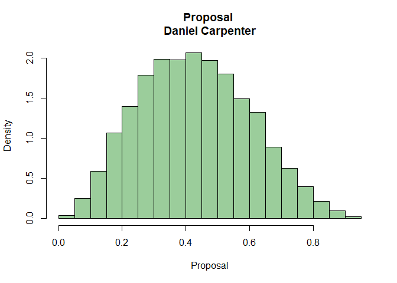
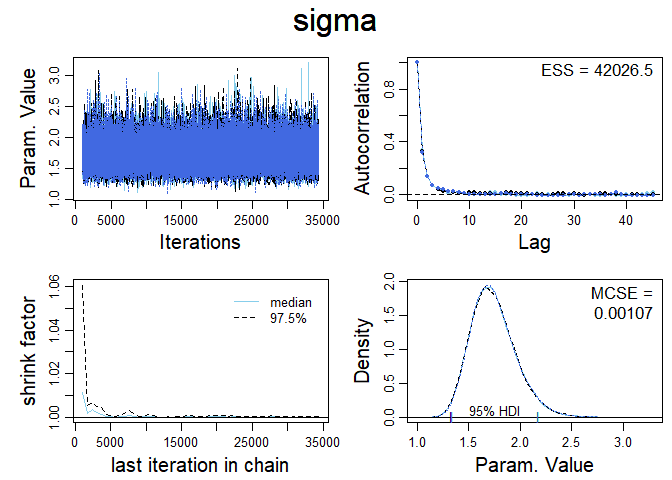
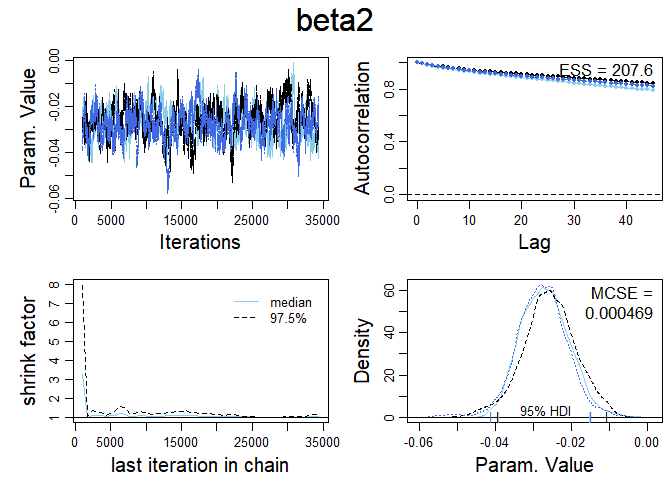
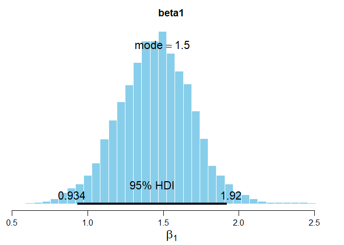

Lab 5 - MCMC
================
Daniel Carpenter
February 2022

-   [Task `1` Two-State Bayes Box & Coin-Die
    Experiment](#task-1-two-state-bayes-box--coin-die-experiment)
    -   [`1.1b. i-ii` Prior for two state Bayes’ box Binomial
        Experiment](#11b-i-ii-prior-for-two-state-bayes-box-binomial-experiment)
    -   [`1.1b. iii` Acceptance and rejection
        set](#11b-iii-acceptance-and-rejection-set)
    -   [`1.2` - Derivation of Algorithm for Coin-Die Bayes
        Box](#12---derivation-of-algorithm-for-coin-die-bayes-box)
-   [Task `2` Coin Die MCMC
    Simulation](#task-2-coin-die-mcmc-simulation)
    -   [`1 a-c` Create Function](#1-a-c-create-function)
    -   [`2` Use output of `cdbox` as input to
        `coindie`](#2-use-output-of-cdbox-as-input-to-coindie)
-   [Task `3` Discrete Simulation using
    MCMC](#task-3-discrete-simulation-using-mcmc)
    -   [`3.1` Overview of Algorithm](#31-overview-of-algorithm)
    -   [`3.2` Create the Function](#32-create-the-function)
-   [Task `4` Discrete Simulation using
    MCMC](#task-4-discrete-simulation-using-mcmc)
-   [Task `5` Continuous Similation using
    MCMC](#task-5-continuous-similation-using-mcmc)
    -   [`Part 1-4` Create Function with Beta
        Proposal](#part-1-4-create-function-with-beta-proposal)
-   [Task `6` Gibbs Sampling via MCMC](#task-6-gibbs-sampling-via-mcmc)
    -   [`6.1` Gibbs Sampling MCMC and
        `OpenBUGS`](#61-gibbs-sampling-mcmc-and-openbugs)
    -   [`6.2-3` - OpenBUGS Model and Pretty Print
        Output](#62-3---openbugs-model-and-pretty-print-output)
    -   [`6.4-6` Basic SLR Model using
        JAGS](#64-6-basic-slr-model-using-jags)
    -   [`6.7` Compare classical tests using the `lm()`
        function](#67-compare-classical-tests-using-the-lm-function)
    -   [`6.8` Adding *b**e**t**a*<sub>2</sub><sup>2</sup> to
        Model](#68-adding-beta2_2-to-model)
    -   [`6.9` Comparison of results](#69-comparison-of-results)

## Task `1` Two-State Bayes Box & Coin-Die Experiment

### `1.1b. i-ii` Prior for two state Bayes’ box Binomial Experiment

-   Make a prior for a two state Bayes’ box that corresponds to an
    acceptance set that has 2 values in it, x=4, n=10 in a Binomial
    experiment. The parameter values are 0.4 and 0.8.

``` r
  # 1 (i-ii)
  # Make a coin-die bbox
  # k = number of faces in the event set E for acceptance of proposal
  # Lik = likelihood for 2 states of theta
  # theta = two states
  # h1 = small relative to h2
  cdbbox<-function(k=1,lik,theta, h1="s")
  { 
    # K=1...6
    # xtable is a library which has functions useful for latex output
    library(xtable)
    
    # rename the first and second components of the likelihood
    lik1<-lik[1]
    lik2<-lik[2]
    
    # We will now make a prior that has the desired characteristics
    # See if you can prove the following
    # if h1 small "s" then ... else ...
    ifelse(h1=="s",
           pi1<-k/6*lik2/(lik1+k/6*lik2), 
           pi1<-lik2/(lik2+k/6*lik1)
    )
    
    # sum of probs is 1
    prior=c(pi1,1-pi1)
    
    #lik<-c(lik1,lik2)
    h<-prior*lik
    
    # Bayes
    post=h/sum(h)
    
    # Make a matrix for the Bayes box
    mat<-cbind(theta,prior,lik,h,post)
    rownames(mat)<-1:length(lik)
    Totals=c(NA,sum(prior),NA,sum(h),sum(post))
    mat2=rbind(mat,Totals)
    
    # Now make some plots useful in explaining the procedure
    # graphics.off()
    # dev.new(noRStudioGD = TRUE)
    layout(matrix(c(1,2),nr=1,nc=2,byrow=TRUE))
    barplot(matrix(c(0.5,0.5),nc=2,nr=1,byrow=TRUE,dimnames=list(c("Coin"),theta)),
            ylim=c(0,1),las=1,main="Proposal\n Uniform")
    barplot(matrix(h,nc=2,nr=1,byrow=TRUE,dimnames=list(c("Coin"),theta)),
            ylim=c(0,max(h)+0.5*max(h)),las=1,main="Proportional to target\n h")
    # Return a list of useful objects
    return(list(bbox=mat2,latex=xtable(mat2,digits=6),mat=mat,h=h,h1=h1,k=k))
  }
  
  # Call function
  cdbbox(k=2,lik=dbinom(x=4,size=10,prob=c(0.4,0.8)),theta=c(0.4,0.8),h1="s")->ans 
```

<!-- -->

``` r
  # Get the bayes box and knit using kable for aesthetics
  knitr::kable(ans$bbox)
```

|        | theta |     prior |       lik |         h | post |
|:-------|------:|----------:|----------:|----------:|-----:|
| 1      |   0.4 | 0.0072628 | 0.2508227 | 0.0018217 | 0.25 |
| 2      |   0.8 | 0.9927372 | 0.0055050 | 0.0054650 | 0.75 |
| Totals |    NA | 1.0000000 |        NA | 0.0072867 | 1.00 |

### `1.1b. iii` Acceptance and rejection set

Accept it with a probability. Need an acceptance and rejection set.
Anything lower than the probability can be in the acceptance set. For
Example, if 4/6, then can accept {1,2,3,4}

``` r
  ## Impoved Graphic
  cdbbox2<-function(k=1,lik,theta, h1="s")
  { 
    # K=1...6
    # xtable is a library which has functions useful for latex output
    library(xtable)
    
    # rename the first and second components of the likelihood
    lik1<-lik[1]
    lik2<-lik[2]
    
    # We will now make a prior that has the desired characteristics
    # See if you can prove the following
    # if h1 small "s" then ... else ...
    ifelse(h1=="s",
           pi1 <- k/6 * lik2 / (lik1 + k/6 * lik2), 
           pi1 <-       lik2 / (lik2 + k/6 * lik1)
    )
    
    # sum of probs is 1
    prior=c(pi1,1-pi1)
    
    #lik<-c(lik1,lik2)
    h<-prior*lik
    
    # Bayes
    post=h/sum(h)
    
    # Make a matrix for the Bayes box
    mat<-cbind(theta,prior,lik,h,post)
    rownames(mat)<-1:length(lik)
    Totals=c(NA,sum(prior),NA,sum(h),sum(post))
    mat2=rbind(mat,Totals)
    
    # Now make some plots useful in explaining the procedure
    # graphics.off()
    # dev.new(noRStudioGD = TRUE)
    layout(matrix(c(1,2),nr=1,nc=2,byrow=TRUE))
    barplot(matrix(c(0.5,0.5),nc=2,nr=1,byrow=TRUE,dimnames=list(c("Coin"),theta)),
            ylim=c(0,1),las=1,main="Proposal Distribution\n (Uniform)",
            col = 'grey20',
            ylab = 'Probabilities',
            xlab = 'Outcome')
    barplot(matrix(h,nc=2,nr=1,byrow=TRUE,dimnames=list(c("Coin"),theta)),
            ylim=c(0,max(h)+0.5*max(h)),las=1,main="Proportional to target\n h",
            col = 'red',
            ylab = 'Probabilities',
            xlab = 'Outcome')
    # Return a list of useful objects
    return(list(bbox=mat2,latex=xtable(mat2,digits=6),mat=mat,h=h,h1=h1,k=k))
  }
  
  # Call Function
  outputOfCdbbox2 <- cdbbox2(k=2,lik=dbinom(x=4,size=10,prob=c(0.4,0.8)),theta=c(0.4,0.8),h1="s") 
```

<!-- -->

### `1.2` - Derivation of Algorithm for Coin-Die Bayes Box

#### `R` Code

``` r
ifelse(h1=="s",pi1<-k/6*lik2/(lik1+k/6*lik2), pi1<-lik2/(lik2+k/6*lik1))
```

#### $\\LaTeX$ Derivation:

$$
\\text{then} \\ p\_{i,1} = \\frac{k}{6} \\times \\frac{lik\_2}{lik\_1 + k \\times lik\_2}, \\\\
\\text{else} \\ p\_{i,1} = \\times \\frac{lik\_2}{lik\_2 + k \\times lik\_1}
$$

------------------------------------------------------------------------

<br>

## Task `2` Coin Die MCMC Simulation

### `1 a-c` Create Function

``` r
coindie<-function(n=100, h=c(1/4,3/4),E2=c(5,6),init=1,...){
  library(xtable)
  dieset<-c()
  dieset[1]<-"E1"
  die<-function(n=1){
  sample(1:6,size=n,replace=TRUE)
  }
  
  coin<-function(n=1){
  sample(1:2,size=n,replace=TRUE)
  }
  face<-c()
  alpha<-c() # holds acceptance probs
  alpha[1]<-1
  post<-c()# post sample
  prop<-c() # vec of proposed states 1s and 2s
  prop[1]=init # initial state
  post[1]=prop[1]
  dice<-c()
  dice[1]<-die()
  
  for(i in 2:n){ # starts at 2 because initial value given above
  prop[i]<-coin()
  alpha[i]=min(1,h[prop[i]]/h[post[i-1]])
  
  dice[i]<-die()
  ifelse(alpha[i]==1,dieset[i]<-"E1",dieset[i]<-"E2")
  # is x an element of set y
  if(alpha[i]==1 | (is.element(dice[i],E2) & alpha[i]!=1)){post[i]<-prop[i]}
  else{post[i]<-post[i-1]}
   }  
  res<-matrix(c(prop,round(alpha,2),dieset,dice,post ),nc=5,nr=n,byrow=FALSE,dimnames=list(1:n,c("proposal","alpha", "E","dice","post")))
  sim<-table(post)/n
  postexact<-h/sum(h)
  barplot(sim,...)
  return(list(iter=res,sim=sim,postexact=postexact,post=post,xtable=xtable(res,dig=1)) )
}
```

#### Call the function, and add better labels to the graph

``` r
  # Call the function
  ans <- coindie(n=10,h=c(0.6,0.4),E2=c(2,3,4,5),
                  
                  # Add X Label to be more descriptive
                  xlab = "Outcome",
                  
                  # Add Y Label to be more descriptive
                  ylab = 'Probability',
                  
                  # Add Title  to be more descriptive
                  main = 'Coin Die Function using MCMC\nDaniel Carpenter',
                  
                  # Add color to indicate post color red
                  col = 'red')
```

<!-- -->

<br>

### `2` Use output of `cdbox` as input to `coindie`

-   Input `h` is the prior times the likelihood of the output created
    from the cdbbox2 function. This function estimates the prior and
    then applies the likelihood to get the outcome
-   Output, shows how the outcome of the experiment changes when using
    an updated prior beliefs.

``` r
# Here, get the value of h to use in this example. This objected created in previous code chunk
# When calling outputOfCdbbox2 <- cdbbox2(k=2,lik=dbinom(x=4,size=10,prob=c(0.4,0.8)),theta=c(0.4,0.8),h1="s") 
h = outputOfCdbbox2$h

ans <- coindie(n=10,h=h,E2=c(2,3,4,5),
               
               # Add X Label to be more descriptive
               xlab = "Outcome",
               
               # Add Y Label to be more descriptive
               ylab = 'Probability',
               
               # Add Title  to be more descriptive
               main = 'Coin Die Function using MCMC\nDaniel Carpenter',
               
               # Add color to indicate post color red
               col = 'red')
```

<!-- -->

------------------------------------------------------------------------

<br>

## Task `3` Discrete Simulation using MCMC

### `3.1` Overview of Algorithm

Core of `simR()`? Take a random sample from the uniform of size 1. If
the proposed value is less than or equal to alpha (or the area at `i`,
`j`), then accept it as the solution. Else, reject it.

### `3.2` Create the Function

``` r
  # This function makes discrete simulations from a posterior with any number of h values
  # n=nu of iterations
  # You can embellish this function
  simR<-function(n=10000, h=c(0.03344302,0.06165627),...){
    alpha<-c() # holds transition probs
    alpha[1]<-1
    u<-c() # holds uniform values
    u[1]<-1
    post<-c()# post sample
    prop<-c() # vec of proposed states 1s and 2s
    prop[1]=1 # initial state
    post[1]=prop[1]
    for(i in 2:n){ # starts at 2 because initial value given above
      # proposal state 
      prop[i]=sample(1:length(h),1,replace=TRUE)
      # calculate alpha
      # notice h[prop[i]] gives the actual value of h
      alpha[i]=min(1,h[prop[i]]/h[post[i-1]])
      # to calculate accepting proposal with prob alpha
      # select a random value from  a uniform (0,1)
      u[i]=runif(1)
      if(u[i]<=alpha[i]){post[i]<-prop[i]}
      else{post[i]<-post[i-1]}
    }
    res<-matrix(c(prop,u,alpha,post ),nc=4,nr=n,byrow=FALSE)
    sim<-table(post)/n
    # windows only works with a pc
    # quartz with macs
    # dev.new(noRStudioGD = TRUE) # or quartz() 
    
    barplot(sim,...)
    postexact<-h/sum(h)
    # The returned output is a list 
    # Use obj$ to obtain whatever interests you
    return(list(iter=res,sim=sim,postexact=postexact,post=post) )
  }

  
  # Create a funciton to establish a Uniform Binomial Experiment
  getH <- function(numThetaValues, x, n) {
    
    ## Form uniform probability
    theta <- seq(0, 1, length = numThetaValues)
    
    ## Calculate prior assuming uniform distribution
    prior = rep(1/numThetaValues, numThetaValues)
    
    ## Calculate the likelihood
    likelihood  = dbinom(x=x, size=n, prob=theta)
    
    ## Calculate the Prior x the Likelihood
    h <-  prior * likelihood
    
    return(h)
  }
  
  
  # Inputs for getH()
  numThetaValues = 40
  x = 4
  n = 10
  
  # Call simROut and add some extras to the plot
  simROut <- simR(n=10000, h=getH(numThetaValues, x, n),
                  
                  # Title
                  main = paste("Histogram of Simulation Output using simR()\n",
                               "Assumes Uniform Prior dist. over ", numThetaValues, 
                               " values of theta.\nProb. ", x, 
                               " with ", n, "bernoulli trials - Daniel Carpenter"),
                  ylab = "Frequency",
                  xlab = "Proposed h's",
                  col = 'lightblue'
                  )
```

<!-- -->

------------------------------------------------------------------------

<br>

## Task `4` Discrete Simulation using MCMC

``` r
# What about different proposal distributions
# Again for the discrete case
simRQ<-function(n=1000,init=1, h=c(1,1),pr=c(1,1)/2,...) {
  
  alpha<-c() # holds transition probs
  alpha[1]<-1
  u<-c() # holds uniform values
  u[1]<-1
  post<-c()# post sample
  prop<-c() # vec of proposed states 1s and 2s etc
  prop[1]=init # initial state
  post[1]=prop[1]
  
  q<-function(x){pr[x]}
  
  for(i in 2:n){ # starts at 2 because initial value given above
    
    #make a sample from the proposal
    sample(1:length(h),1,replace=TRUE,prob=pr)->prop[i]
    
    #Calculate alpha adjusting for the proposal being non uniform
    alpha[i]=min(1,h[prop[i]]*q(post[i-1])/(h[post[i-1]]*q(prop[i])))
    
    # now choose the proposal with probability alpha
    u[i]=runif(1)
    if(u[i]<=alpha[i]){post[i]<-prop[i]}
    else{post[i]=post[i-1]}
  }
  res<-matrix(c(prop,u,alpha,post ),nc=4,nr=n,byrow=FALSE,dimnames=list(1:n,c("prop","u","alpha","post")))
  sim<-table(post)/n
  postexact<-h/sum(h)
  barplot(sim,...)
  tmp<-c()
  ifelse(length(res[,1])>=20,tmp<-res[1:20,],tmp<-res)
  
  return(list(iter=tmp,sim=sim,post=postexact) )
}

# Inputs for getH()
numThetaValues = 11

# Function to create a peak distribution - only for odd dist
makePeak <- function(numThetaValues) {
  peak = round(numThetaValues / 2)  # Peak of distribution
  beg  = 1:(peak-1)                 # up until the peak
  end  = (peak-1):1                 # After the peak
  return(c(beg, peak, end))         # Combine it to make mountain
}
  
prInput = makePeak(numThetaValues)  # proposal input that is a peak distribution (Q)
hInput = getH(numThetaValues, x, n) # Uniform prior

# Call the function and store
simRQOut <- simRQ(n=10000,h=hInput,pr=prInput,
        
        # Title
        main = paste("Hist. Simulation Output - Assumes Uniform Prior \ndist. over ", numThetaValues, 
                     " values of theta. Prob. ", x, 
                     " with ", n, "bernoulli trials. \nUses Peak Proposal Dist. - Daniel Carpenter"),
        ylab = "Frequency",
        xlab = "Proposed h's",
        col = 'tomato3'
)
```

<!-- -->

``` r
# Show first 20 iterations
simRQOut$iter
```

    ##    prop          u     alpha post
    ## 1     1 1.00000000 1.0000000    1
    ## 2     9 0.53054178 1.0000000    9
    ## 3     6 0.33941962 1.0000000    6
    ## 4     3 0.35004519 0.8589935    3
    ## 5     3 0.92478419 1.0000000    3
    ## 6     2 0.72053837 0.1900581    3
    ## 7     6 0.82345889 1.0000000    6
    ## 8     3 0.88534494 0.8589935    6
    ## 9     8 0.46062170 0.2688505    6
    ## 10    4 0.63209908 1.0000000    4
    ## 11    7 0.14080753 0.4456374    7
    ## 12    8 0.18167414 0.4121590    8
    ## 13    6 0.14010601 1.0000000    6
    ## 14    5 0.34722428 1.0000000    5
    ## 15    3 0.48076982 0.5852766    3
    ## 16    5 0.57254765 1.0000000    5
    ## 17    8 0.58426087 0.1831818    5
    ## 18    7 0.66198630 0.4444444    5
    ## 19    3 0.03632441 0.5852766    3
    ## 20    9 0.62414109 0.0625000    3

------------------------------------------------------------------------

<br>

## Task `5` Continuous Similation using MCMC

### `Part 1-4` Create Function with Beta Proposal

-   Adjusts the output to plot Proposal, Prior, Likelihood, and the
    Posterior
-   Default parameters set to problem for ease

``` r
  ### Using a beta proposal
  ### You can change the proposal to whatever you require
  ## a,b are the parameters of the Beta proposal
  ## a=b=1 is a uniform
  simRC<-function(n=10,init=0.5,a=3,b=4,
                  h = function(theta)
                  { prior = dunif(theta)
                      lik = dbinom(x=4,size=10,prob=theta)
                        h = prior * lik
                        return(c('prior'=prior,'lik'=lik,'h'=h))}
                  )
  {
    #dbeta(x, shape1, shape2, ncp = 0, log = FALSE)
    alpha<-c() # holds transition probs
    alpha[1]<-1
    u<-c() # holds uniform values
    u[1]<-1
    lik<-c()     # liklihood sample
    hOfProp<-c() # prior times lik sample
    post<-c()    # post sample
    prop<-c()    # vec of proposed states 1s and 2s
    prop[1]=init # initial state
    lik[1]=prop[1]
    hOfProp[1]=prop[1]
    post[1]=prop[1]

    q = function(x){dbeta(x,a,b)}
    
    for(i in 2:n){ # starts at 2 because initial value given above
      rbeta(1,a,b)->prop[i]
      
      thisH = h(prop[i])
      
      # Store the prior and liklihood for plotting later
      lik[i]     = thisH['lik']
      hOfProp[i] = thisH['h']
      
      alpha[i]=min(1,hOfProp[i] * q(post[i-1]) / (hOfProp[i-1] * q(prop[i])))
      u[i]=runif(1)
      ifelse(u[i]<=alpha[i],post[i]<-prop[i],post[i]<-post[i-1])
    }
    
    res<-matrix(c(prop,u,alpha,post ),nc=4,nr=n,byrow=FALSE,
                dimnames=list(1:n,c("prop","u","alpha","post")))
    
    
    # Function to generally plot a histogram
    myHist <- function(data, nameOnGraph, color, useFreq=FALSE) {
      hist(data, freq=useFreq, 
           main = paste(nameOnGraph, '\nDaniel Carpenter'), 
           xlab = nameOnGraph, col = color)
    }
    
    # Plot the Proposal
    nameOnGraph = 'Proposal'
    color       = 'darkseagreen3'
    myHist(data=prop, nameOnGraph=nameOnGraph, color=color)
    
    # Plot the Estimated Prior
    nameOnGraph = 'Estimated Prior'
    color       = 'grey90'
    myHist(data=u, nameOnGraph=nameOnGraph, color=color)
    
    # Plot the Estimated Likelihood
    nameOnGraph = 'Estimated Likelihood'
    color       = 'lightblue'
    myHist(data=lik, nameOnGraph=nameOnGraph, color=color)
    
    # Plot the Posterior
    nameOnGraph = 'Posterior'
    color       = 'tomato3'
    myHist(data=post, nameOnGraph=nameOnGraph, color=color)
    
    return(list(matrix=res,summary=summary(post)) )
  }
  
  # Call the function - Default parameters adjusted for part 3 (FYI)
  simRCOut <- simRC(n=10000)
```

<!-- --><!-- --><!-- --><!-- -->

``` r
  # Show the summary output
  simRCOut$summary
```

    ##    Min. 1st Qu.  Median    Mean 3rd Qu.    Max. 
    ## 0.04298 0.31283 0.41114 0.41586 0.51565 0.86440

## Task `6` Gibbs Sampling via MCMC

### `6.1` Gibbs Sampling MCMC and `OpenBUGS`

#### What is Gibbs Sampling?

Gibbs sampling is the most popular MCMC algorithm. It allows us to get a
MCMC from a multivariate density. When having access to the full
conditionals, you can use Gibbs sampling to get draws from sophisticated
joint distributions. The process of getting these samples from the joint
distribution are done iteratively.

<br>

#### What is the Gibbs Algorithm?

Assume Bivariate Normal target distribution with correlation *ρ* <br> 1.
Initialize: (*x*<sub>0</sub>,*y*<sub>0</sub>) := (0, 0) and set
*t* := 0  
2. Draw *x*<sub>*t*</sub> from the conditional distribution
*X*<sub>*t*</sub> ∣ (*Y*<sub>*t* − 1</sub>=*y*<sub>*t* − 1</sub>) ∼ *N*(*ρ**y*<sub>*t* − 1</sub>,1−*ρ*<sup>2</sup>).  
3. Draw *y*<sub>*t*</sub> from the conditional distribution
*Y*<sub>*t*</sub> ∣ (*X*<sub>*t*</sub>=*x*<sub>*t*</sub>) ∼ *N*(*ρ**x*<sub>*t*</sub>,1−*ρ*<sup>2</sup>).  
4. Increment *t* := *t* + 1  
5. Return to Step 2, etc.

### `6.2-3` - OpenBUGS Model and Pretty Print Output


### `6.4-6` Basic SLR Model using JAGS

-   See analysis (part `a.` and `b.`) and the trace and history plots
    after code execution.

``` r
# Sampling MCMC model using SLR

# Optional generic preliminaries:
graphics.off() # This closes all of R's graphics windows.
# rm(list=ls())  # Careful! This clears all of R's memory!

# Load the functions used below:
source("DBDA2E-utilities.R") # Must be in R's current working directory.
```

    ## 
    ## *********************************************************************
    ## Kruschke, J. K. (2015). Doing Bayesian Data Analysis, Second Edition:
    ## A Tutorial with R, JAGS, and Stan. Academic Press / Elsevier.
    ## *********************************************************************

``` r
require(rjags)               # Must have previously installed package rjags.

fileNameRoot="JAGS_Lab5_Task6_Ouput_Folder/" # For output file names.
dir.create(fileNameRoot)
```

    ## Warning in dir.create(fileNameRoot): 'JAGS_Lab5_Task6_Ouput_Folder' already
    ## exists

``` r
# Load the data:
myData = read.csv("SPRUCE.csv") # Read data file; must be in curr. work. dir.
y = myData$Height        # The y values are in the column named y.
x = myData$BHDiameter        # The y values are in the column named y.
Ntotal = length(y)  # Compute the total number of flips.
dataList = list(    # Put the information into a list.
  x = x,
  y = y,
  n = Ntotal 
)

# Define the model: (from pretty print OpenBUGS model)
modelString = "
model{
    for( i in 1 : n ) {
        y[i] ~ dnorm(mu[i], tau)
        mu[i] <- beta0 + beta1 * x[i]
    }
    beta0 ~ dnorm(0.0, 1.0E-6)
    beta1 ~ dnorm(0.0, 1.0E-6)
    sigma ~ dunif(0, 1000)
    tau <- pow(sigma,  -2)
}
" # close quote for modelString
writeLines( modelString , con="TEMPmodel.txt" )

# Initialize the chains based on MLE of data.
# Option: Use function that generates random values for each chain:
initsList = list(beta0=0, beta1=0, sigma=10)

# Run the chains:'
jagsModel = jags.model( file="TEMPmodel.txt" , data=dataList , inits=initsList , 
                        n.chains=3 , n.adapt=500 )
```

    ## Compiling model graph
    ##    Resolving undeclared variables
    ##    Allocating nodes
    ## Graph information:
    ##    Observed stochastic nodes: 36
    ##    Unobserved stochastic nodes: 3
    ##    Total graph size: 140
    ## 
    ## Initializing model

``` r
# Don't use the first 500 iterations
update( jagsModel , n.iter=500 )

codaSamples = coda.samples( jagsModel , variable.names=c("beta0", "beta1", "sigma"),
                            n.iter=33340 )
save( codaSamples , file=paste0(fileNameRoot,"Mcmc.Rdata") )

# PLOTS =========================================================

  # Examine the chains -----------------------------------------------
    # Beta 0
    filename = paste0(fileNameRoot,"beta0_diagMCMC")
    diagMCMC( codaObject = codaSamples, parName = c("beta0"))
    saveGraph( file=filename , type="png" )
```

<!-- -->

``` r
    # Beta 1
    filename = paste0(fileNameRoot,"beta1_diagMCMC")
    diagMCMC( codaObject = codaSamples, parName = c("beta1"))
    saveGraph( file=filename , type="png" )
```

<!-- -->

``` r
    # Sigma
    filename = paste0(fileNameRoot,"sigma_diagMCMC")
    diagMCMC( codaObject = codaSamples, parName = c("sigma"))
    saveGraph( file=filename , type="png" )
```

<!-- -->

``` r
  # Example the point Estimates --------------------------------------
    # Beta 0
    openGraph()
    par( mar=c(3.5,0.5,2.5,0.5) , mgp=c(2.25,0.7,0) )
    plotPost( codaSamples[,"beta0"] , main="beta0" , xlab=bquote(beta[0]) )
```

<!-- -->

    ##              ESS     mean   median     mode hdiMass   hdiLow  hdiHigh compVal
    ## beta[0] 3255.398 9.135013 9.154445 9.151447    0.95 6.810013 11.41578      NA
    ##         pGtCompVal ROPElow ROPEhigh pLtROPE pInROPE pGtROPE
    ## beta[0]         NA      NA       NA      NA      NA      NA

``` r
    saveGraph( file=filename , type="png" )
    
    # Beta 1
    openGraph()
    par( mar=c(3.5,0.5,2.5,0.5) , mgp=c(2.25,0.7,0) )
    plotPost( codaSamples[,"beta1"] , main="beta1" , xlab=bquote(beta[1]) )
```

<!-- -->

    ##              ESS     mean    median      mode hdiMass    hdiLow   hdiHigh
    ## beta[1] 3270.691 0.482034 0.4809776 0.4793913    0.95 0.3615536 0.6059358
    ##         compVal pGtCompVal ROPElow ROPEhigh pLtROPE pInROPE pGtROPE
    ## beta[1]      NA         NA      NA       NA      NA      NA      NA

``` r
    saveGraph( file=paste0(fileNameRoot,"beta1_Post") , type="png" )
    
    # Sigma
    openGraph()
    par( mar=c(3.5,0.5,2.5,0.5) , mgp=c(2.25,0.7,0) )
    plotPost( codaSamples[,"sigma"] , main="sigma" , xlab=bquote(sigma) )
```

<!-- -->

    ##            ESS     mean   median     mode hdiMass   hdiLow hdiHigh compVal
    ## sigma 42806.91 1.742712 1.720515 1.698423    0.95 1.340107 2.18759      NA
    ##       pGtCompVal ROPElow ROPEhigh pLtROPE pInROPE pGtROPE
    ## sigma         NA      NA       NA      NA      NA      NA

``` r
    saveGraph( file=paste0(fileNameRoot,"sigma_Post") , type="png" )
    

# Summary of all the models (Bayesian Point interval estimates)
summary(codaSamples)
```

    ## 
    ## Iterations = 1001:34340
    ## Thinning interval = 1 
    ## Number of chains = 3 
    ## Sample size per chain = 33340 
    ## 
    ## 1. Empirical mean and standard deviation for each variable,
    ##    plus standard error of the mean:
    ## 
    ##        Mean      SD  Naive SE Time-series SE
    ## beta0 9.135 1.16793 0.0036930       0.020423
    ## beta1 0.482 0.06218 0.0001966       0.001088
    ## sigma 1.743 0.22141 0.0007001       0.001076
    ## 
    ## 2. Quantiles for each variable:
    ## 
    ##         2.5%    25%   50%    75%  97.5%
    ## beta0 6.7973 8.3643 9.154 9.9179 11.406
    ## beta1 0.3616 0.4403 0.481 0.5231  0.606
    ## sigma 1.3751 1.5860 1.721 1.8738  2.243

<br>

#### **Analysis:** For all variables:

-   Param. Values seem to be around the mean value, which is stationary
-   Autocorrelation drops quickly for *σ*, which provides good
    estimates. However, this does not occur with *β*<sub>0</sub> or
    *β*<sub>1</sub>
-   Shrink factor evens out
-   *σ*’s 3 densities overlay each other, so they are superimposed.
    Slight skewness for *β*’s

### `6.7` Compare classical tests using the `lm()` function

``` r
# Form the linear model using SPRUCE Dataset
est <- lm(Height~BHDiameter, data = myData)

# Get point estimates
summary(est)
```

    ## 
    ## Call:
    ## lm(formula = Height ~ BHDiameter, data = myData)
    ## 
    ## Residuals:
    ##     Min      1Q  Median      3Q     Max 
    ## -3.9394 -0.9763  0.2829  0.9950  2.6644 
    ## 
    ## Coefficients:
    ##             Estimate Std. Error t value Pr(>|t|)    
    ## (Intercept)  9.14684    1.12131   8.157 1.63e-09 ***
    ## BHDiameter   0.48147    0.05967   8.069 2.09e-09 ***
    ## ---
    ## Signif. codes:  0 '***' 0.001 '**' 0.01 '*' 0.05 '.' 0.1 ' ' 1
    ## 
    ## Residual standard error: 1.678 on 34 degrees of freedom
    ## Multiple R-squared:  0.6569, Adjusted R-squared:  0.6468 
    ## F-statistic:  65.1 on 1 and 34 DF,  p-value: 2.089e-09

``` r
# Confidence Intervals
library(s20x)
ciReg(est)
```

    ##             95 % C.I.lower    95 % C.I.upper
    ## (Intercept)        6.86806          11.42562
    ## BHDiameter         0.36020           0.60275

<br>

#### **Analysis:** Point Estimates:

-   Classical estimated mean and standard error’s for *b**e**t**a*
    values fall very close to the Bayesian estimates.

<br>

### `6.8` Adding *b**e**t**a*<sub>2</sub><sup>2</sup> to Model

#### Open Bugs Model Pretty Print Output using *b**e**t**a*<sub>2</sub><sup>2</sup>


<br>

#### Jags Function and Ouptut

``` r
# Sampling MCMC model using SLR with squared value

# Optional generic preliminaries:
graphics.off() # This closes all of R's graphics windows.

fileNameRoot="JAGS_Lab5_Task6.8_Ouput_Folder/" # For output file names.
dir.create(fileNameRoot)
```

    ## Warning in dir.create(fileNameRoot): 'JAGS_Lab5_Task6.8_Ouput_Folder' already
    ## exists

``` r
# Load the data:
# myData = read.csv("SPRUCE.csv") # Read data file; must be in curr. work. dir.
# y = myData$Height        # The y values are in the column named y.
# x = myData$BHDiameter        # The y values are in the column named y.
Ntotal = length(y)  # Compute the total number of flips.
dataList = list(    # Put the information into a list.
  x = x,
  y = y,
  n = Ntotal 
)

# Define the model: (from pretty print OpenBUGS model)
modelString = "
model{
    for( i in 1 : n ) {
        y[i] ~ dnorm(mu[i], tau)
        mu[i] <- beta0 + beta1 * x[i] + beta2 * x[i]^2
    }
    beta0 ~ dnorm(0.0, 1.0E-6)
    beta1 ~ dnorm(0.0, 1.0E-6)
    beta2 ~ dnorm(0.0, 1.0E-6)
    sigma ~ dunif(0, 1000)
    tau <- pow(sigma,  -2)
}

" # close quote for modelString
writeLines( modelString , con="TEMPmodel.txt" )

# Initialize the chains based on MLE of data.
# Option: Use function that generates random values for each chain:
initsList = list(beta0=0, beta1=0, beta2=0, sigma=10)

# Run the chains:'
jagsModel = jags.model( file="TEMPmodel.txt" , data=dataList , inits=initsList , 
                        n.chains=3 , n.adapt=500 )
```

    ## Compiling model graph
    ##    Resolving undeclared variables
    ##    Allocating nodes
    ## Graph information:
    ##    Observed stochastic nodes: 36
    ##    Unobserved stochastic nodes: 4
    ##    Total graph size: 199
    ## 
    ## Initializing model

``` r
# Don't use the first 500 iterations
update( jagsModel , n.iter=500 )

codaSamples = coda.samples( jagsModel , variable.names=c("beta0", "beta1", "beta2", "sigma"),
                            n.iter=33340 )
save( codaSamples , file=paste0(fileNameRoot,"Mcmc.Rdata") )

# PLOTS =========================================================

  # Examine the chains -----------------------------------------------
    # Beta 0
    filename = paste0(fileNameRoot,"beta0_diagMCMC")
    diagMCMC( codaObject = codaSamples, parName = c("beta0"))
    saveGraph( file=filename , type="png" )
```

<!-- -->

``` r
    # Beta 1
    filename = paste0(fileNameRoot,"beta1_diagMCMC")
    diagMCMC( codaObject = codaSamples, parName = c("beta1"))
    saveGraph( file=filename , type="png" )
```

<!-- -->

``` r
    # Beta 2
    filename = paste0(fileNameRoot,"beta2_diagMCMC")
    diagMCMC( codaObject = codaSamples, parName = c("beta2"))
    saveGraph( file=filename , type="png" )
```

<!-- -->

``` r
    # Sigma
    filename = paste0(fileNameRoot,"sigma_diagMCMC")
    diagMCMC( codaObject = codaSamples, parName = c("sigma"))
    saveGraph( file=filename , type="png" )
```

<!-- -->

``` r
  # Example the point Estimates --------------------------------------
    # Beta 0
    openGraph()
    par( mar=c(3.5,0.5,2.5,0.5) , mgp=c(2.25,0.7,0) )
    plotPost( codaSamples[,"beta0"] , main="beta0" , xlab=bquote(beta[0]) )
```

<!-- -->

    ##              ESS      mean    median      mode hdiMass    hdiLow  hdiHigh
    ## beta[0] 182.4726 0.6314634 0.6791542 0.8748363    0.95 -4.149054 5.169781
    ##         compVal pGtCompVal ROPElow ROPEhigh pLtROPE pInROPE pGtROPE
    ## beta[0]      NA         NA      NA       NA      NA      NA      NA

``` r
    saveGraph( file=filename , type="png" )
    
    # Beta 1
    openGraph()
    par( mar=c(3.5,0.5,2.5,0.5) , mgp=c(2.25,0.7,0) )
    plotPost( codaSamples[,"beta1"] , main="beta1" , xlab=bquote(beta[1]) )
```

<!-- -->

    ##             ESS     mean  median     mode hdiMass    hdiLow  hdiHigh compVal
    ## beta[1] 157.565 1.495587 1.48786 1.457981    0.95 0.9743763 2.004898      NA
    ##         pGtCompVal ROPElow ROPEhigh pLtROPE pInROPE pGtROPE
    ## beta[1]         NA      NA       NA      NA      NA      NA

``` r
    saveGraph( file=paste0(fileNameRoot,"beta1_Post") , type="png" )
    
    # Beta 2
    openGraph()
    par( mar=c(3.5,0.5,2.5,0.5) , mgp=c(2.25,0.7,0) )
    plotPost( codaSamples[,"beta2"] , main="beta2" , xlab=bquote(beta[1]) )
```

<!-- -->

    ##              ESS        mean      median        mode hdiMass      hdiLow
    ## beta[1] 169.1425 -0.02815005 -0.02795785 -0.02704407    0.95 -0.04181733
    ##             hdiHigh compVal pGtCompVal ROPElow ROPEhigh pLtROPE pInROPE pGtROPE
    ## beta[1] -0.01392325      NA         NA      NA       NA      NA      NA      NA

``` r
    saveGraph( file=paste0(fileNameRoot,"beta2_Post") , type="png" )
    
    # Sigma
    openGraph()
    par( mar=c(3.5,0.5,2.5,0.5) , mgp=c(2.25,0.7,0) )
    plotPost( codaSamples[,"sigma"] , main="sigma" , xlab=bquote(sigma) )
```

<!-- -->

    ##            ESS    mean   median    mode hdiMass   hdiLow  hdiHigh compVal
    ## sigma 17274.32 1.43745 1.418883 1.38359    0.95 1.091662 1.801545      NA
    ##       pGtCompVal ROPElow ROPEhigh pLtROPE pInROPE pGtROPE
    ## sigma         NA      NA       NA      NA      NA      NA

``` r
    saveGraph( file=paste0(fileNameRoot,"sigma_Post") , type="png" )
    

# Summary of all the models (Bayesian Point interval estimates)
summary(codaSamples)
```

    ## 
    ## Iterations = 1001:34340
    ## Thinning interval = 1 
    ## Number of chains = 3 
    ## Sample size per chain = 33340 
    ## 
    ## 1. Empirical mean and standard deviation for each variable,
    ##    plus standard error of the mean:
    ## 
    ##           Mean       SD  Naive SE Time-series SE
    ## beta0  0.63146 2.343197 7.409e-03      0.1636254
    ## beta1  1.49559 0.258122 8.162e-04      0.0200075
    ## beta2 -0.02815 0.006999 2.213e-05      0.0005181
    ## sigma  1.43745 0.185666 5.871e-04      0.0013616
    ## 
    ## 2. Quantiles for each variable:
    ## 
    ##           2.5%      25%      50%      75%    97.5%
    ## beta0 -4.09856 -0.88326  0.67915  2.17471  5.22462
    ## beta1  0.98844  1.32358  1.48786  1.66561  2.02167
    ## beta2 -0.04246 -0.03277 -0.02796 -0.02345 -0.01453
    ## sigma  1.12857  1.30633  1.41888  1.54788  1.85540

<br>

#### Clasical Methods using `lm()`

``` r
# Form the linear model using SPRUCE Dataset
est2 <- lm(Height ~ BHDiameter + I(BHDiameter^2), data = myData)

# Get point estimates
summary(est2)
```

    ## 
    ## Call:
    ## lm(formula = Height ~ BHDiameter + I(BHDiameter^2), data = myData)
    ## 
    ## Residuals:
    ##     Min      1Q  Median      3Q     Max 
    ## -3.2966 -0.6245 -0.0707  0.7442  3.2541 
    ## 
    ## Coefficients:
    ##                  Estimate Std. Error t value Pr(>|t|)    
    ## (Intercept)      0.860896   2.205022   0.390 0.698731    
    ## BHDiameter       1.469592   0.243786   6.028 8.88e-07 ***
    ## I(BHDiameter^2) -0.027457   0.006635  -4.138 0.000227 ***
    ## ---
    ## Signif. codes:  0 '***' 0.001 '**' 0.01 '*' 0.05 '.' 0.1 ' ' 1
    ## 
    ## Residual standard error: 1.382 on 33 degrees of freedom
    ## Multiple R-squared:  0.7741, Adjusted R-squared:  0.7604 
    ## F-statistic: 56.55 on 2 and 33 DF,  p-value: 2.182e-11

``` r
# Confidence Intervals
ciReg(est2)
```

    ##                 95 % C.I.lower    95 % C.I.upper
    ## (Intercept)           -3.62525           5.34705
    ## BHDiameter             0.97361           1.96558
    ## I(BHDiameter^2)       -0.04096          -0.01396

<br>

### `6.9` Comparison of results

-   Both the classical and the Bayesian estimate are very close to each
    other when comparing mean and standard deviation estimations.
-   Interestingly, the new model including
    *b**e**t**a*<sub>2</sub><sup>2</sup>, sees that the Bayesian
    estimate experiences a high level of autocorrelation with both
    *b**e**t**a*<sub>1</sub> and *b**e**t**a*<sub>2</sub><sup>2</sup>.
