Lab 6 - Gibbs Sampling (MCMC)
================
Daniel Carpenter
March 2022

-   [Task 1 - MCMC given `h`](#task-1---mcmc-given-h)
-   [Task 2 - Bivariate GIBBS
    Sampler](#task-2---bivariate-gibbs-sampler)
-   [Task 3 - Jags Example](#task-3---jags-example)

## Task 1 - MCMC given `h`

> Create a function that carries out MCMC simulation using a vector h
> made of the prior\*likelihood.

``` r
# This function makes discrete simulations from a posterior with any number of h values
# n=nu of iterations
# You can embellish this function
mydmcmc <- function(n=10000, h,...){
  alpha<-c() # holds transition probs
  alpha[1]<-1
  u<-c() # holds uniform values
  u[1]<-1
  post<-c()# post sample
  prop<-c() # vec of proposed states 1s and 2s
  prop[1]=1 # initial state
  post[1]=prop[1]
  
  for(i in 2:n){ # starts at 2 because initial value given above
    # proposal state 
    prop[i]=sample(1:length(h),1,replace=TRUE)
    
    # calculate alpha
    # notice h[prop[i]] gives the actual value of h
    alpha[i]=min(1,h[prop[i]]/h[post[i-1]])
    
    # to calculate accepting proposal with prob alpha
    # select a random value from  a uniform (0,1)
    u[i]=runif(1)
    if(u[i]<=alpha[i]){post[i]<-prop[i]}
    else{post[i]<-post[i-1]}
  }
  res<-matrix(c(prop,u,alpha,post ),nc=4,nr=n,byrow=FALSE)
  sim<-table(post)/n
  # windows only works with a pc
  # quartz with macs
  # dev.new(noRStudioGD = TRUE) # or quartz() 
  
  postexact<-h/sum(h)

  
  # PLOTS ======================================================================
  
    require(tidyverse)
    require(ggplot2)
  
  # Create a simple theme for reuse
  myTheme <- theme_minimal() + theme(text = element_text(color = '#666666'),
                                     panel.grid.major = element_blank())
  
  
  # Make the iter vector a data frame
  iterOut <- as.data.frame(res) %>% 
    mutate(numIterations = row_number()) 
  
    postExactOut <- as.data.frame(postexact) %>%
      mutate(numIterations = row_number()) 
    
  # Simulation output ------------------------------------------------------
  postExactPlot <- ggplot(postExactOut, 
                    aes(x=numIterations, y=postexact)) + 
    
    # COlumn Chart of the Exact posterior we are trying to estimate
    geom_col( fill="darkseagreen3", colour="lightblue4", alpha = 0.6) +
    
    # Theme
    myTheme + 
    
    # Labels
    labs(title = paste("Exact Posterior (Not Estimated)\nAssumes",
                       "Uniform Prior dist. over ", numThetaValues, 
                       " values of theta.\nProb. ", x, 
                       "with", n, "bernoulli trials - Daniel Carpenter"),
         y = "Frequency",
         x = "Proposed h's")
    # Now print the plot
    print(postExactPlot)
    
    
  # Simulation output ------------------------------------------------------
  simPlot <- ggplot(data.frame(sim), 
                    aes(x=post, y = Freq)) + 
    
    # COlumn Chart of the post estimated
    geom_col( fill="lightblue", colour="lightblue4", alpha = 0.6) +
    
    # Theme
    myTheme + 
    
    # Labels
    labs(title = paste("Estimated Posterior | Discrete MCMC Similation Output using simR()\nAssumes",
                       "Uniform Prior dist. over ", numThetaValues, 
                       " values of theta.\nProb. ", x, 
                       "with", n, "bernoulli trials - Daniel Carpenter"),
         y = "Frequency",
         x = "Proposed h's")
    # Now print the plot
    print(simPlot)
    
    
  
  # Trace Plot  ------------------------------------------------------------
    tracePlot <- ggplot(data=iterOut,
           aes(x=numIterations, y=V4)) +
      
      # Add the lines
      geom_line(color='lightblue3', alpha = 0.8) +
      
      # Add some points
      geom_point(color = 'lightblue4', size = 0.25, alpha = 0.1) + 
      
      # Theme and Labels
      myTheme +
      labs(title = "Trace Plot - Est. Posterior",
           subtitle = paste("Assumes Uniform Prior dist. over ", numThetaValues, 
                            " values of theta.\nProb. ", x, 
                            "with", n, "bernoulli trials - Daniel Carpenter"),
           x = "Number of Iterations",
           y = "Posterior Value")
    
    # Now print the aboce plot
    print(tracePlot)
    
    
  # Show Alpha  -------------------------------------------------------------
    alphaPlot <- ggplot(data=iterOut,
           aes(x=numIterations, y=V3)) +
      
      # Add the lines
      geom_line(color='lightblue3', alpha = 0.8) +
      
      # Add some points
      geom_point(color = 'lightblue4', size = 0.25, alpha = 0.1) + 
      
      # Theme and Labels
      myTheme +
      labs(title = "Trace Plot - Est. Alpha",
           subtitle = paste("Assumes Uniform Prior dist. over ", numThetaValues, 
                            " values of theta.\nProb. ", x, 
                            "with", n, "bernoulli trials - Daniel Carpenter"),
           x = "Number of Iterations",
           y = "Alpha Value")
    
    # Now print the plot
    print(alphaPlot)
    
    
  # Show Alpha  -------------------------------------------------------------
    propOut <- ggplot(data=iterOut,
           aes(x=numIterations, y=V1)) +
      
      # Add the lines
      geom_line(color='lightblue3', alpha = 0.8) +
      
      # Add some points
      geom_point(color = 'lightblue4', size = 0.25, alpha = 0.1) + 
      
      # Theme and Labels
      myTheme +
      labs(title = "Trace Plot - The Proposal",
           subtitle = paste("Assumes Uniform Prior dist. over ", numThetaValues, 
                            " values of theta.\nProb. ", x, 
                            "with", n, "bernoulli trials - Daniel Carpenter"),
           x = "Number of Iterations",
           y = "Alpha Value")
    
    # Now print the plot
    print(propOut)
    
    
  # The returned output is a list 
  # Use obj$ to obtain whatever interests you
  return(list(iter=res,sim=sim,postexact=postexact,post=post) )
}


# Create a function to establish a Uniform Binomial Experiment
getH <- function(numThetaValues, x, n) {
  
  ## Form uniform probability
  theta <- seq(0, 1, length = numThetaValues)
  
  ## Calculate prior assuming uniform distribution
  prior = rep(1/numThetaValues, numThetaValues)
  
  ## Calculate the likelihood
  likelihood  = dbinom(x=x, size=n, prob=theta)
  
  ## Calculate the Prior x the Likelihood
  h <-  prior * likelihood
  
  return(h)
}


# Inputs for getH()
numThetaValues = 40
x = 4
n = 10

# Call mydmcmc and add some extras to the plot
mydmcmcOutput <- mydmcmc(n=10000, h=getH(numThetaValues, x, n))
```

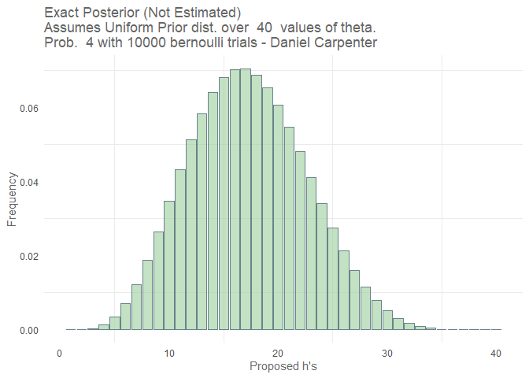<!-- -->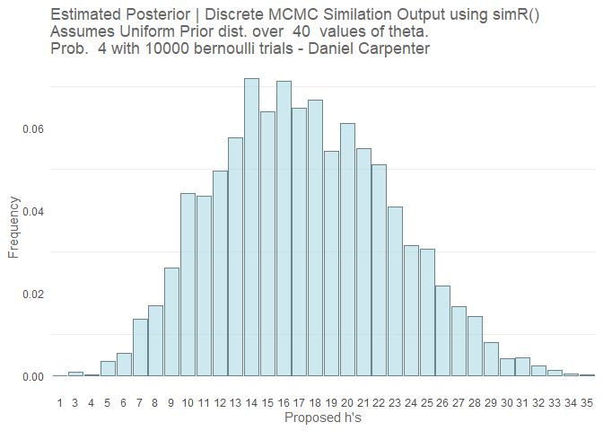<!-- -->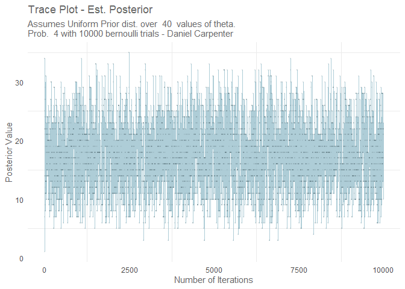<!-- -->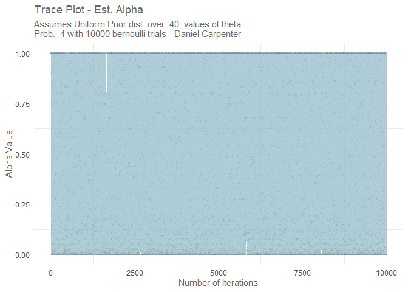<!-- -->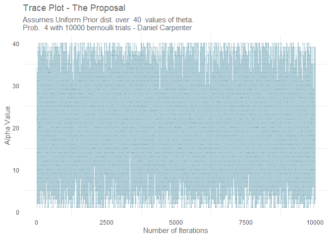<!-- -->

``` r
# Iteration output
head(mydmcmcOutput$iter)
```

    ##      [,1]      [,2]      [,3] [,4]
    ## [1,]    1 1.0000000 1.0000000    1
    ## [2,]   34 0.5322394 1.0000000   34
    ## [3,]    3 0.8845490 0.7419371   34
    ## [4,]   14 0.2938527 1.0000000   14
    ## [5,]    7 0.1492550 0.1897034    7
    ## [6,]   25 0.5426850 1.0000000   25

``` r
# Simulation output
head(mydmcmcOutput$sim) 
```

    ## post
    ##      1      3      4      5      6      7 
    ## 0.0001 0.0009 0.0002 0.0036 0.0055 0.0137

``` r
# Actual Posterior
head(mydmcmcOutput$postexact) 
```

    ## [1] 0.000000e+00 2.190801e-05 2.986975e-04 1.282925e-03 3.424124e-03
    ## [6] 7.025137e-03

``` r
# Estimated Posterior Posterior
head(mydmcmcOutput$post) 
```

    ## [1]  1 34 34 14  7 25

------------------------------------------------------------------------

<br>

## Task 2 - Bivariate GIBBS Sampler

> Make a GIBBS sampler for a Bivariate Normal

-   Adapted from [A simple Gibbs
    sampler](http://www.mas.ncl.ac.uk/~ndjw1/teaching/sim/gibbs/gibbs.html)

``` r
# FUNCTION - Make a GIBBS sampler for a Bivariate Normal ----------------------- 
  myngibbs <- function(n, mu_x, sd_x, mu_y, sd_y, rho) {
    
    # Set a random seed
    set.seed(30)#round(runif(1)*100,0))
    
    # Create a Matrix to hold the Bivariate Normals for X and Y
    resultDistr <- matrix(ncol = 2, nrow = n)
    colnames(resultDistr) <- c("X","Y")
    
    # Now Calculate the Biv. Normals
    x <- 0
    y <- 0
    resultDistr[1, ] <- c(x, y)
    for (i in 2:n) {
      
      # Y|X = x ~ N(. . .)
      x <- rnorm(1, mu_y + rho*(sd_x/sd_y)*(y - mu_x), sqrt( sd_x^2)*(1 - rho^2) )
      y <- rnorm(1, mu_x + rho*(sd_y/sd_x)*(x - mu_y), sqrt( sd_y^2)*(1 - rho^2) )
      resultDistr[i, ] <- c(x, y)
    }
    
    # Give to output options for plotting ease
    require(tidyverse)
    
    # Convert Results distribution to a dataframe for manipulation ease
    df.mat <- as.data.frame(resultDistr)
    
    # Maked a pivoted df for plotting ease
    df.plot <- df.mat %>%
      pivot_longer(cols      = c('X', 'Y'),
                   names_to  = 'variableName',
                   values_to = 'variableValue') %>%
      mutate(iteration = row_number())
    
    
    # PLOTS ====================================================================
      
      require(ggplot2)
      
      # Create a simple theme for reuse
      myTheme <- theme_minimal() + theme(text = element_text(color = '#666666'),
                                         panel.grid.major = element_blank())
    
    
      # What is the correlation from the MCMC output? 
      dec = 3 # num decimal places to round to
      calcCorr <- format(round(cor(df.mat$X, df.mat$Y), dec), nsmall=dec)
      
      # Create titles and subtitles for reuse later on
      titleVar <- 'Bivariate Normal Distribution Created using MCMC'
      
      stats <- list(n=n, 
                    mu_x=mu_x, sd_x=sd_x, 
                    mu_y=mu_y, sd_y=sd_y, 
                    rho=rho, rhoCalculated = calcCorr)
      
      subtitleVar <- paste0('Iterations: ', format(stats$n, big.mark = ','), 
                            '; Intended Correlation: ', format(round(rho, dec), nsmall=dec), 
                            '; Calculated Correlation: ', calcCorr,
                            '- Daniel Carpenter')
      captionVar <- paste0('Note on the Initial Variables:\n',
                                'mu[x] = ', mu_x,    ', mu[y] = ', mu_y,
                           '\nsigma[x] = ', sd_x, ', sigma[y] = ', sd_y)
      
      
      # Violin plots -----------------------------------------------------------
      myViolin <- ggplot(df.plot, aes(x=variableName, y=variableValue, fill=variableName)) +
                    geom_violin() +
                    scale_fill_brewer(palette='Pastel1') +
                    labs(title = paste('Violin Plot |', titleVar), subtitle = subtitleVar,
                         x = '',
                         y = 'Estimated Outcome',
                         caption = captionVar) + 
                    myTheme
      print(myViolin)
      
      # Histogram and Density Plots --------------------------------------------
      myHist <- ggplot(df.plot, aes(x = variableValue, fill=variableName)) +
                  geom_histogram(aes(y = ..density..)) +
                  geom_density(alpha=0) +
                  facet_wrap(nrow = 2, facets = vars(variableName)) + 
                  scale_fill_brewer(palette='Pastel1') +
                  labs(title = paste('Histogram |', titleVar), subtitle = subtitleVar,
                       x = 'Estimated Outcome',
                       y = 'Density',
                       caption = captionVar) + 
                       myTheme
      print(myHist)
      
      # Base Scatter Plot of Y~X -----------------------------------------------

        # Create a slope object
        baseScatter <- ggplot(df.mat, aes(X, Y)) + 
          labs(title = paste('Marginals |', titleVar), subtitle = subtitleVar,
               caption = captionVar)
      
      # Marginal Density -Bivariate Normal Raster Plot --------------------------------
      slopeLine <- geom_smooth(method = 'lm', color = 'white')
      corrAnnotation <- annotate(x=max(df.mat$X)-10, y=0, 
                                 label=paste("Calculated\nCorrelation = ", calcCorr), 
                                 geom="text", size=5, color = 'white')
      myRaster <- baseScatter + 
                    stat_density_2d(
                      geom = "raster",
                      aes(fill = after_stat(density)),
                      contour = FALSE) + 
                    scale_fill_viridis_c() +
                    slopeLine + corrAnnotation + 
                    myTheme
      print(myRaster)
      
      # Marginal Density -Bivariate Normal Raster Plot --------------------------------
              
      # Create a slope object for reuse
      slopeLine <- geom_smooth(method = 'lm', color = '#666666') 
      
      myContour <- baseScatter +                   
                    geom_point(alpha = 0.2, color = 'steelblue') + 
                    geom_density_2d(color='steelblue4', size=0.75, alpha=0.75) + 
                    slopeLine + annotate(x=max(df.mat$X)-10, y=0, 
                                         label=paste("Calculated\nCorrelation = ", calcCorr), 
                                         geom="text", size=5, color = '#666666') + 
                    myTheme
      print(myContour)
      
      myTrace <- ggplot(df.plot, aes(x=iteration, y=variableValue, color=variableName)) +
        geom_line(alpha=0.75) +
        scale_color_brewer(palette='Pastel1') +
        facet_wrap(nrow = 2, facets = vars(variableName)) +
        labs(title = paste('Trace Plot |', titleVar), subtitle = subtitleVar,
             x = 'Iteration of MCMC',
             y = 'Paramter Value',
             caption = captionVar) + 
        myTheme + theme(legend.text = element_blank(), legend.title = element_blank())
      print(myTrace)
    
    # Return the Result Distribution for the Bivariate Normals and stats =======
    return(list('df.matrix' = df.mat, 
                'df.plot'    = df.plot,
                'stats' = stats))
  }

  
# PARAMETERS -------------------------------------------
  
  # Number of Iterations
  n <- 10000 
  
  # Correlation Coefficient
  rho = 0.20
  
  # Values for Mean and Standard Deviation for Y and X
  mu_x = 10; sd_x = 2
  mu_y = 5;  sd_y = 4
  
# Call the function  
results <- myngibbs(n, mu_x, sd_x, mu_y, sd_y, rho)
```

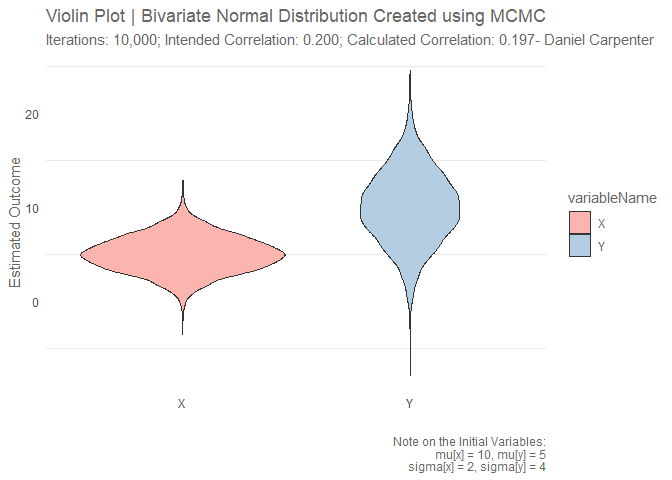<!-- -->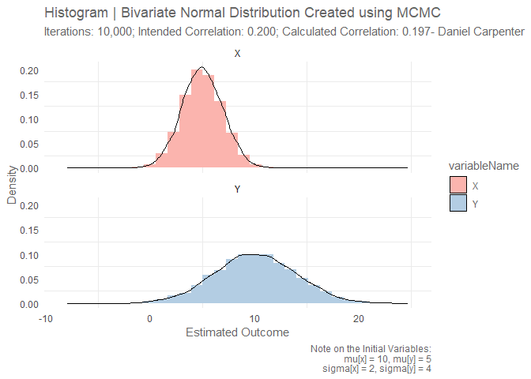<!-- -->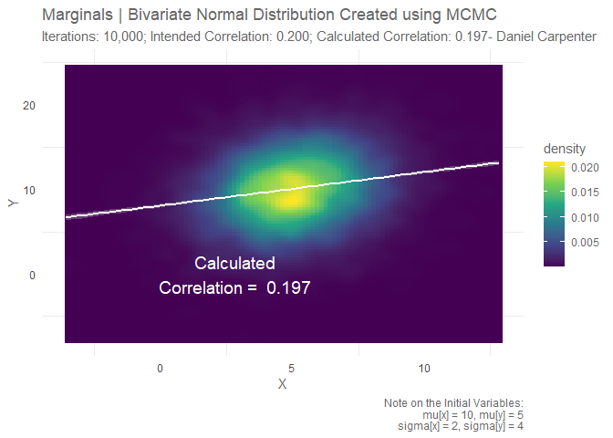<!-- -->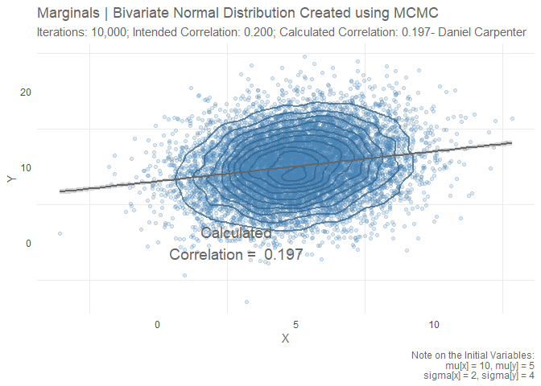<!-- -->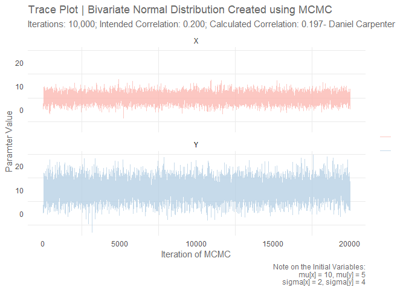<!-- -->

``` r
# Initial Values 
results$stats
```

    ## $n
    ## [1] 10000
    ## 
    ## $mu_x
    ## [1] 10
    ## 
    ## $sd_x
    ## [1] 2
    ## 
    ## $mu_y
    ## [1] 5
    ## 
    ## $sd_y
    ## [1] 4
    ## 
    ## $rho
    ## [1] 0.2
    ## 
    ## $rhoCalculated
    ## [1] "0.197"

``` r
# Show Results of the data (only top few rows)
head(results$df.matrix)
```

    ##          X         Y
    ## 1 0.000000  0.000000
    ## 2 1.526045  7.275291
    ## 3 3.726002 14.380538
    ## 4 8.941133  5.773031
    ## 5 4.789479  6.994334
    ## 6 3.413231 10.419448

------------------------------------------------------------------------

<br>

## Task 3 - Jags Example

> Run and Jags *(Just another GIBBS Sampler)* Example

-   Note copied and pasted into this file for ease of printing output
    when knitting `rmd` file

``` r
# Jags-ExampleScript-lab6.R 

# Optional generic preliminaries:
graphics.off() # This closes all of R's graphics windows.
rm(list=ls())  # Careful! This clears all of R's memory!

# Load the functions used below:
source("DBDA2E-utilities.R") # Must be in R's current working directory.
```

    ## 
    ## *********************************************************************
    ## Kruschke, J. K. (2015). Doing Bayesian Data Analysis, Second Edition:
    ## A Tutorial with R, JAGS, and Stan. Academic Press / Elsevier.
    ## *********************************************************************

``` r
obj = require(rjags)               # Must have previously installed package rjags.
obj
```

    ## [1] TRUE

``` r
fileNameRoot="JAGS_Lab6_Task3_Ouput_Folder/" # For output file names.
dir.create(fileNameRoot)
```

    ## Warning in dir.create(fileNameRoot): 'JAGS_Lab6_Task3_Ouput_Folder' already
    ## exists

``` r
# Define the model:
modelString = "
model {
  y[1:2] ~ dmnorm.vcov(mu[1:2],Sigma[1:2,1:2])
Sigma[1,1]<- 4
Sigma[2,2]<- 16
Sigma[1,2]<- 0.2*2*4
Sigma[2,1]<- 0.2*2*4
mu[1]<-10
mu[2]<-5
}
" # close quote for modelString
writeLines( modelString , con=paste0(fileNameRoot, "TEMPmodel.txt" ))

# Run the chains:
jagsModel = jags.model( file=paste0(fileNameRoot, "TEMPmodel.txt" )  , 
                        n.chains=3 , n.adapt=500 )
```

    ## Compiling model graph
    ##    Resolving undeclared variables
    ##    Allocating nodes
    ## Graph information:
    ##    Observed stochastic nodes: 0
    ##    Unobserved stochastic nodes: 1
    ##    Total graph size: 10
    ## 
    ## Initializing model

``` r
update( jagsModel , n.iter=5000 )
codaSamples = coda.samples( jagsModel , variable.names=c("y[1]","y[2]") ,
                            n.iter=3334 )
save( codaSamples , file=paste0(fileNameRoot,"Mcmc.Rdata") )

# Examine the chains:
# Convergence diagnostics:
diagMCMC( codaObject=codaSamples , parName="y[1]" )
saveGraph( file=paste0(fileNameRoot,"y[1]") , type="jpeg" )
```

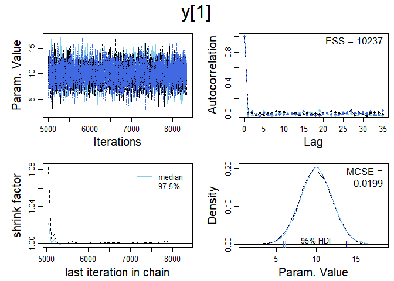<!-- -->

``` r
diagMCMC( codaObject=codaSamples , parName="y[2]" )
saveGraph( file=paste0(fileNameRoot,"y[2]") , type="jpeg" )
```

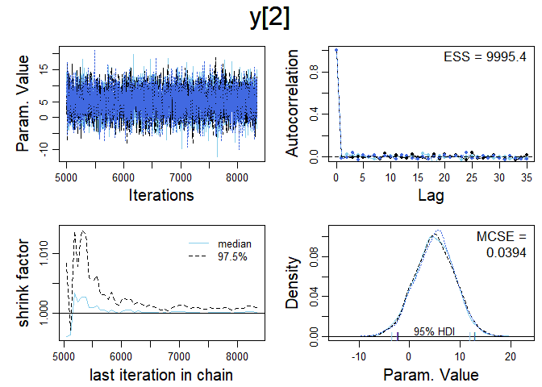<!-- -->

``` r
# Posterior descriptives:
openGraph()
par( mar=c(3.5,0.5,2.5,0.5) , mgp=c(2.25,0.7,0) )
plotPost( codaSamples[,"y[1]"] , main="x[1]" , xlab=bquote(x[1]) )
```

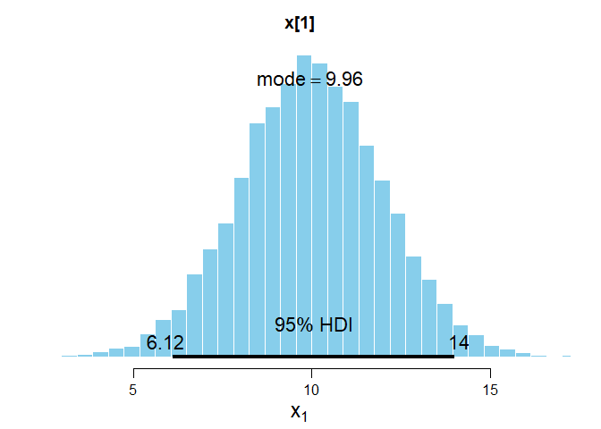<!-- -->

    ##        ESS     mean   median     mode hdiMass   hdiLow  hdiHigh compVal
    ## x[1] 10002 9.979393 9.977744 9.961588    0.95 6.117603 14.01591      NA
    ##      pGtCompVal ROPElow ROPEhigh pLtROPE pInROPE pGtROPE
    ## x[1]         NA      NA       NA      NA      NA      NA

``` r
saveGraph( file=paste0(fileNameRoot,"x[1]") , type="jpeg" )

# Re-plot with different annotations:
openGraph()
plotPost( codaSamples[,"y[2]"] , main="y[2]" , xlab=bquote(y[2]) )
```

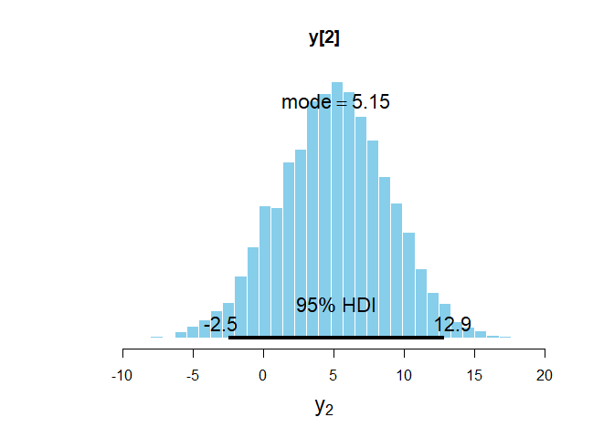<!-- -->

    ##        ESS    mean   median     mode hdiMass    hdiLow  hdiHigh compVal
    ## y[2] 10002 4.96451 5.015687 5.152503    0.95 -2.500882 12.88891      NA
    ##      pGtCompVal ROPElow ROPEhigh pLtROPE pInROPE pGtROPE
    ## y[2]         NA      NA       NA      NA      NA      NA

``` r
saveGraph( file=paste0(fileNameRoot,"y[2]") , type="jpeg" )

# Process the MCMC samples in a specialist package
library(ggmcmc)
s = ggs(codaSamples) # This formats the samples for the package
dev.new()
ggs_density(s)
dev.new()
ggs_pairs(s)
```
