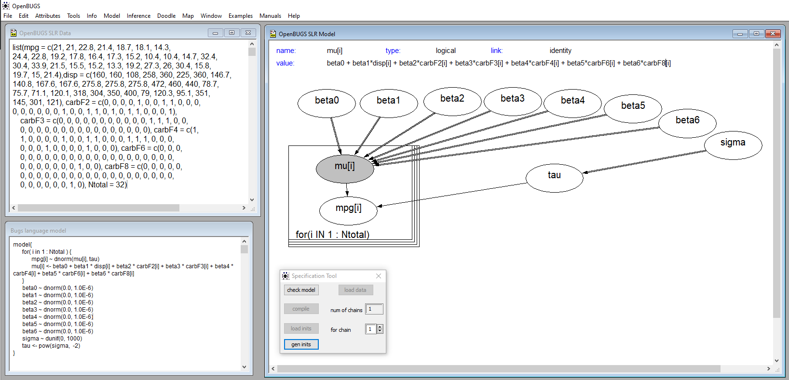

```{r setup, include=FALSE}
knitr::opts_chunk$set(echo = TRUE)
```
> **Goal**: Compare `Classical` and `Bayesian` approaches to estimate linear model containing dummy variables (categorical).  
> Useful techniques in setting up dummy variable via `model.matrix()`


# `Classical Estimation` with Categorical Valiables

## Categorical Variables Overview

In many applications we will need to incorporate categorical variables into our regression.
How is this to be done?

```{r cars}
# Show the Data
data(mtcars)
head(mtcars)

# Show the number of rows in mtcars
dim(mtcars)[1]
```

We will define some variables to be factors

```{r}
# Convert categorical variables to factor class, store in `mycars`
mycars = within(mtcars, {
  cylF<-factor(cyl)
  vsF <- factor(vs)
  amF <- factor(am)
  gearF <- factor(gear)
  carbF <- factor(carb)
})

# See mycars after converting to factor class on cat. vars.
head(mycars)

# Notice how many cars in sample have x number of carbs
table(mycars$carbF)
```


## Using classical methods for Linear Model

```{r classical}
# Create a linear model: How does displacement and the number of carborators effect mpg
# Store in new var
mpglm = lm(mpg~disp + carbF, data =mycars )
summary(mpglm)
```


## Model Matrix and Dummy Variables

We can extract the `design matrix` by using `model.matrix()`:

```{r model}
# Create a model matrix, which converts the linear model object
# into a form which outlines the dummy variables for each factor in carborator
# IOnterpret as:
  # if 1, then it has x number of carborators,
  # Else if all 0, then the base (1 carborators, notice not in the file) is present in car
mm=model.matrix(mpglm)
df = as.data.frame(mm)

lst = as.list(df)
df
```

Also see the data used in the model

```{r frame}
# See that you can also remake the original data frame
df2=model.frame(mpglm)
head(df2)

# Use dput to output the df in the form for JAGS model
# Can use this to encapsulate data and reproduce the data frame
dput(df2)
```

##  Linear Model `LaTeX` Expression

$$ y = \beta_0 + \beta_1 x + \beta_2 carbF2 + \beta_3 carbF3 + \beta_4 carbF4 + \beta_5 carbF6 + \beta_6 carbF8 + \epsilon$$ 

# `Bayesian Estimation` with Categorical Valiables 

## Task 1: `OpenBUGS` Linear Model with `mtcars` dataset
* Make up the model file by using OpenBUGS and creating a doodle in the doodle editor. The model will be a regression (just modify the SLR model to include the dummy variables). Take a picture of the doodle once it checks out and place here using `{width=80%}`

{width=80%}


## Task 2: *Pretty Print* Model into `JAGS` Script 
* Use `pretty print` (this will only work once the model is checked - use the menu!) and paste the model code into the modelString below: Fill in all other needed parameters and summarize the `codaSamples` using summary() -- to run the chunk you will need to remove `eval=FALSE`

### JAGS Script with Pretty Printed Model

```{r}
# Get rid of the intercept
dput(df[,-1])
```

```{r jags,eval=TRUE}
# BE SURE TO GET RID OF EVAL=FALSE
require(rjags)               # Must have previously installed package rjags.


Ntotal = dim(mtcars)[1]
fileNameRoot="categotical" # For output file names. (from using dput)
dataList=list(mpg = c(21, 21, 22.8, 21.4, 18.7, 18.1, 14.3, 
24.4, 22.8, 19.2, 17.8, 16.4, 17.3, 15.2, 10.4, 10.4, 14.7, 32.4, 
30.4, 33.9, 21.5, 15.5, 15.2, 13.3, 19.2, 27.3, 26, 30.4, 15.8, 
19.7, 15, 21.4),disp = c(160, 160, 108, 258, 360, 225, 360, 146.7, 
140.8, 167.6, 167.6, 275.8, 275.8, 275.8, 472, 460, 440, 78.7,
75.7, 71.1, 120.1, 318, 304, 350, 400, 79, 120.3, 95.1, 351,
145, 301, 121), carbF2 = c(0, 0, 0, 0, 1, 0, 0, 1, 1, 0, 0, 0,
0, 0, 0, 0, 0, 0, 1, 0, 0, 1, 1, 0, 1, 0, 1, 1, 0, 0, 0, 1),
    carbF3 = c(0, 0, 0, 0, 0, 0, 0, 0, 0, 0, 0, 1, 1, 1, 0, 0,
    0, 0, 0, 0, 0, 0, 0, 0, 0, 0, 0, 0, 0, 0, 0, 0), carbF4 = c(1,
    1, 0, 0, 0, 0, 1, 0, 0, 1, 1, 0, 0, 0, 1, 1, 1, 0, 0, 0,
    0, 0, 0, 1, 0, 0, 0, 0, 1, 0, 0, 0), carbF6 = c(0, 0, 0,
    0, 0, 0, 0, 0, 0, 0, 0, 0, 0, 0, 0, 0, 0, 0, 0, 0, 0, 0,
    0, 0, 0, 0, 0, 0, 0, 1, 0, 0), carbF8 = c(0, 0, 0, 0, 0,
    0, 0, 0, 0, 0, 0, 0, 0, 0, 0, 0, 0, 0, 0, 0, 0, 0, 0, 0,
    0, 0, 0, 0, 0, 0, 1, 0), Ntotal = Ntotal)


#Define the model: -- >> define this using OPENBUGS <<
modelString = "
model{
	for( i in 1 : Ntotal ) {
		mpg[i] ~ dnorm(mu[i], tau)
		mu[i] <- beta0 + beta1 * disp[i] + beta2 * carbF2[i] + beta3 * carbF3[i] + beta4 * carbF4[i] + beta5 * carbF6[i] + beta6 * carbF8[i]
	}
	beta0 ~ dnorm(0.0, 1.0E-6)
	beta1 ~ dnorm(0.0, 1.0E-6)
	beta2 ~ dnorm(0.0, 1.0E-6)
	beta3 ~ dnorm(0.0, 1.0E-6)
	beta4 ~ dnorm(0.0, 1.0E-6)
	beta5 ~ dnorm(0.0, 1.0E-6)
	beta6 ~ dnorm(0.0, 1.0E-6)
	sigma ~ dunif(0, 1000)
	tau <- pow(sigma,  -2)
}
" # close quote for modelString
writeLines( modelString , con="TEMPmodel.txt" )

# Initialize the chains based on MLE of data.
# Option: Use single initial value for all chains:
#  thetaInit = sum(y)/length(y)
#  initsList = list( theta=thetaInit )

# >> Make sure that initial values are good <<
initsList = list(beta0 = 0, beta1 = 0, beta2=0, beta3=0, beta4=0, betaq5=0, beta6=0, sigma =10)

# Run the chains:
jagsModel = jags.model( file="TEMPmodel.txt" , data=dataList , inits=initsList , 
                        n.chains=3 , n.adapt=500 )
update( jagsModel , n.iter=500 )
codaSamples = coda.samples( jagsModel , variable.names=c("beta0", "beta1", "beta2", 
                                                         "beta3", "beta4", "beta5", "beta6" ,"sigma") ,
                            n.iter=33340 )
save( codaSamples , file=paste0(fileNameRoot,"Mcmc.Rdata") )

summary(codaSamples)
```

### Interpretation of MCMC Results:
* Note that the results of the MCMC output result in a very similar outcome as the classical methods, as seen in the output of `mpglm` object
* The mean value of $\beta_1$ is -0.03484 with a standard deviation of 0.005609
* If the car as two carburetors (`carbF2`, or $\beta_1$), the miles per gallon decreases by -0.03484 miles per gallon.
* There is a probability of 95% that 2 carburetors will decrease a car's miles per gallon by 0.024 to 0.046 (MPG).