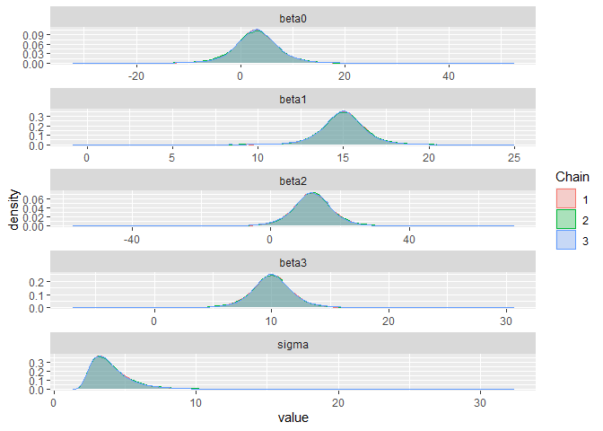
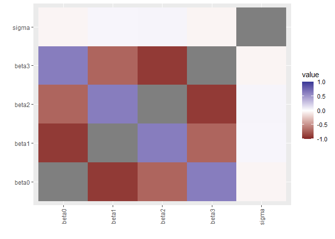

Lab 8 - Dummy variables and ANCOVA
================
Daniel Carpenter
March 2022

-   [Data Overview](#data-overview)
-   [Task 1: Model - (Unequal Salary
    Dataset)](#task-1-model---unequal-salary-dataset)
-   [Task 2: Interpretation - (Unequal Salary
    Dataset)](#task-2-interpretation---unequal-salary-dataset)
    -   [Interpretation of Interaction
        Results:](#interpretation-of-interaction-results)
-   [Task 3: Plot Model (Unequal Salary
    Dataset)](#task-3-plot-model-unequal-salary-dataset)
-   [Task 4: Repeat Task 1-3 on *Equal*
    Dataset](#task-4-repeat-task-1-3-on-equal-dataset)
    -   [Task 1: Model - (Equal Salary
        Dataset)](#task-1-model---equal-salary-dataset)
    -   [Task 2: Interpretation - (Equal Salary
        Dataset)](#task-2-interpretation---equal-salary-dataset)
        -   [Interpretation of Interaction
            Results:](#interpretation-of-interaction-results-1)
    -   [Task 3 Plot Model (Equal Salary
        Dataset](#task-3-plot-model-equal-salary-dataset)

> Use an `interaction` model to predict salary based on wage and
> gender  
> Goal could be to identify discrepencies in linear models, which
> magnify changes over time.

# Data Overview

Source of Data:

-   <https://onlinecourses.science.psu.edu/stat502/node/188>

-   <https://onlinecourses.science.psu.edu/stat502/node/187>

``` r
df = read.csv("salary-unequal.csv")
head(df)
```

    ##   gender salary years
    ## 1   Male     42     1
    ## 2   Male     62     2
    ## 3   Male     92     3
    ## 4   Male    112     4
    ## 5   Male    142     5
    ## 6 Female     80     5

``` r
df2 = read.csv("salary-equal.csv")
head(df2)
```

    ##   gender salary years
    ## 1   Male     78     3
    ## 2   Male     43     1
    ## 3   Male    103     5
    ## 4   Male     48     2
    ## 5   Male     80     4
    ## 6 Female     80     5

<br>

------------------------------------------------------------------------

# Task 1: Model - (Unequal Salary Dataset)

> Analyze Slopes via `Interaction` Variables

``` r
require(rjags)               # Must have previously installed package rjags.
fileNameRoot="tut12" # For output file names.

#df = read.table(file="salary-unequal.txt", sep = "\t", header =TRUE)
df = read.csv("salary-unequal.csv")
df
```

    ##    gender salary years
    ## 1    Male     42     1
    ## 2    Male     62     2
    ## 3    Male     92     3
    ## 4    Male    112     4
    ## 5    Male    142     5
    ## 6  Female     80     5
    ## 7  Female     50     3
    ## 8  Female     30     2
    ## 9  Female     20     1
    ## 10 Female     60     4

``` r
salary = df$salary
gender = df$gender
years = df$years
GM = ifelse(gender == "Male", 1,0)


Ntotal = length(salary)  # Compute the total number of data rows
dataList = list(    # Put the information into a list.
  years = years,
  salary = salary ,
  GM = GM,
  Ntotal = Ntotal 
)

#Define the model:
modelString = "
model{
  for(i in 1:Ntotal)
  {
    mu[i]<- beta0 + beta1*years[i] + beta2*GM[i] + beta3*years[i]*GM[i]
    salary[i] ~ dnorm(mu[i], tau)
  }
  
  beta0 ~ dnorm(0.0, 1.0E-6)
  beta1 ~ dnorm(0.0, 1.0E-6)
  beta2 ~ dnorm(0.0, 1.0E-6)
  beta3 ~ dnorm(0.0, 1.0E-6)
  sigma ~ dunif(0, 1000)
  tau <- pow(sigma,  -2)
}

" # close quote for modelString
writeLines( modelString , con="TEMPmodel.txt" )


#  initsList = list( theta=thetaInit )

initsList = list(beta0 = 0, beta1 = 0, beta2=0, beta3=0, sigma =10)

# Run the chains:
jagsModel = jags.model( file="TEMPmodel.txt" , data=dataList , inits=initsList , 
                        n.chains=3 , n.adapt=500 )
```

    ## Compiling model graph
    ##    Resolving undeclared variables
    ##    Allocating nodes
    ## Graph information:
    ##    Observed stochastic nodes: 10
    ##    Unobserved stochastic nodes: 5
    ##    Total graph size: 69
    ## 
    ## Initializing model

``` r
update( jagsModel , n.iter=500 )
codaSamples = coda.samples( jagsModel , variable.names=c("beta0", "beta1", "beta2" ,"beta3","sigma") ,
                            n.iter=33340 )
save( codaSamples , file=paste0(fileNameRoot,"Mcmc.Rdata") )

summary(codaSamples)
```

    ## 
    ## Iterations = 1001:34340
    ## Thinning interval = 1 
    ## Number of chains = 3 
    ## Sample size per chain = 33340 
    ## 
    ## 1. Empirical mean and standard deviation for each variable,
    ##    plus standard error of the mean:
    ## 
    ##         Mean    SD Naive SE Time-series SE
    ## beta0  3.047 4.913 0.015534        0.08538
    ## beta1 14.982 1.477 0.004671        0.02558
    ## beta2 11.941 6.950 0.021976        0.11997
    ## beta3 10.023 2.101 0.006643        0.03567
    ## sigma  4.167 1.861 0.005884        0.02852
    ## 
    ## 2. Quantiles for each variable:
    ## 
    ##         2.5%     25%    50%    75%  97.5%
    ## beta0 -6.727  0.4024  3.056  5.732 12.765
    ## beta1 12.046 14.1785 14.985 15.783 17.925
    ## beta2 -1.868  8.1736 11.932 15.703 25.639
    ## beta3  5.913  8.8804 10.021 11.167 14.156
    ## sigma  2.164  3.0106  3.730  4.764  8.777

``` r
library(ggmcmc)
s = ggs(codaSamples)
ggs_density(s)
```

<!-- -->

``` r
ggs_crosscorrelation(s)
```

<!-- -->

# Task 2: Interpretation - (Unequal Salary Dataset)

Find parameter point and interval estimates. Interpret them!

``` r
est.lm <- lm(salary ~ years + GM + years:GM)
summary(est.lm)
```

    ## 
    ## Call:
    ## lm(formula = salary ~ years + GM + years:GM)
    ## 
    ## Residuals:
    ##    Min     1Q Median     3Q    Max 
    ##     -3     -3      2      2      2 
    ## 
    ## Coefficients:
    ##             Estimate Std. Error t value Pr(>|t|)    
    ## (Intercept)    3.000      3.317   0.905 0.400572    
    ## years         15.000      1.000  15.000 5.53e-06 ***
    ## GM            12.000      4.690   2.558 0.043001 *  
    ## years:GM      10.000      1.414   7.071 0.000401 ***
    ## ---
    ## Signif. codes:  0 '***' 0.001 '**' 0.01 '*' 0.05 '.' 0.1 ' ' 1
    ## 
    ## Residual standard error: 3.162 on 6 degrees of freedom
    ## Multiple R-squared:  0.9954, Adjusted R-squared:  0.9931 
    ## F-statistic: 430.3 on 3 and 6 DF,  p-value: 2.162e-07

## Interpretation of Interaction Results:

#### 1. If `x` is increased by one unit what happens to the mean value of `y`?

1.  For each year increased, a male is paid the value of *b**e**t**a*3
    (which on the iteration before this was 10.098, it changes since it
    is MCMC) more than a female (thousand dollars? units not known since
    link is broken to data).
2.  E.g., in year 2, a male will make 10.098 × 2 more than the female on
    average.

#### 2. Will the lines ever `intersect` over the range of the data?

1.  No, the lines will never intersect

#### 3. Interpret the slope:

1.  The slope of the interaction term means the amount more that is paid
    to males than females, given years of experience.
2.  The slope of years is the amount paid to males, given years of
    experience.
3.  This should hover around 10. See *b**e**t**a*3 normal density plot
    to get a sense of the potential variation.

#### 4. Use `point interval estimation` (classical medthods) to answer question 1:

1.  For each year increased, a male is paid 10.00 more than a female.

#### 5. Interpret `Bayesian Credibility Intervals`

1.  There is a 95% probability that a male is paid 14.210 or less than a
    female (since MCMC likely to vary from above output).

# Task 3: Plot Model (Unequal Salary Dataset)

Plot the data and the estimating lines

``` r
# Plot salary on years of experience
plot(salary~years)

# List of coefficients from model above (classical)
cf2 = coef(est.lm)

# Plot the slope of each male and female
abline(coef = c(cf2[1],cf2[2]), col="darkseagreen4", lwd =3)
abline(coef = c(cf2[1]+cf2[3], cf2[2]+cf2[4]), col = "steelblue", lwd = 3)
legend("topleft",legend = c("Female","Male"),fill =c("darkseagreen4","steelblue"))
title("Male vs. Female Salaries - Unequal Dataset | Daniel Carpenter")
```

<!-- -->

<br>

------------------------------------------------------------------------

# Task 4: Repeat Task 1-3 on *Equal* Dataset

## Task 1: Model - (Equal Salary Dataset)

> Analyze Slopes via `Interaction` Variables

``` r
fileNameRoot="tut12" # For output file names.

#df.equal = read.table(file="salary-unequal.txt", sep = "\t", header =TRUE)
df.equal = read.csv("salary-equal.csv")
df.equal
```

    ##    gender salary years
    ## 1    Male     78     3
    ## 2    Male     43     1
    ## 3    Male    103     5
    ## 4    Male     48     2
    ## 5    Male     80     4
    ## 6  Female     80     5
    ## 7  Female     50     3
    ## 8  Female     30     2
    ## 9  Female     20     1
    ## 10 Female     60     4

``` r
salary.equal = df.equal$salary
gender.equal = df.equal$gender
years.equal = df.equal$years
GM.equal = ifelse(gender.equal == "Male", 1,0)


Ntotal.equal = length(salary.equal)  # Compute the total number of data rows
dataList = list(    # Put the information into a list.
  years = years.equal,
  salary = salary.equal ,
  GM = GM.equal,
  Ntotal = Ntotal.equal 
)

#Define the model:
modelString = "
model{
  for(i in 1:Ntotal)
  {
    mu[i]<- beta0 + beta1*years[i] + beta2*GM[i] + beta3*years[i]*GM[i]
    salary[i] ~ dnorm(mu[i], tau)
  }
  
  beta0 ~ dnorm(0.0, 1.0E-6)
  beta1 ~ dnorm(0.0, 1.0E-6)
  beta2 ~ dnorm(0.0, 1.0E-6)
  beta3 ~ dnorm(0.0, 1.0E-6)
  sigma ~ dunif(0, 1000)
  tau <- pow(sigma,  -2)
}

" # close quote for modelString
writeLines( modelString , con="TEMPmodel.equal.txt" )


#  initsList = list( theta=thetaInit )

initsList = list(beta0 = 0, beta1 = 0, beta2=0, beta3=0, sigma =10)

# Run the chains:
jagsModel.equal = jags.model( file="TEMPmodel.equal.txt" , data=dataList , inits=initsList , 
                        n.chains=3 , n.adapt=500 )
```

    ## Compiling model graph
    ##    Resolving undeclared variables
    ##    Allocating nodes
    ## Graph information:
    ##    Observed stochastic nodes: 10
    ##    Unobserved stochastic nodes: 5
    ##    Total graph size: 69
    ## 
    ## Initializing model

``` r
update( jagsModel.equal , n.iter=500 )
codaSamples.equal = coda.samples( jagsModel.equal , variable.names=c("beta0", "beta1", "beta2" ,"beta3","sigma") ,
                            n.iter=33340 )
save( codaSamples.equal , file=paste0(fileNameRoot,"Mcmc.Rdata") )

summary(codaSamples.equal)
```

    ## 
    ## Iterations = 1001:34340
    ## Thinning interval = 1 
    ## Number of chains = 3 
    ## Sample size per chain = 33340 
    ## 
    ## 1. Empirical mean and standard deviation for each variable,
    ##    plus standard error of the mean:
    ## 
    ##          Mean     SD Naive SE Time-series SE
    ## beta0  2.9808  8.271 0.026152        0.14036
    ## beta1 15.0050  2.491 0.007875        0.04310
    ## beta2 21.8696 11.814 0.037355        0.20534
    ## beta3  0.1756  3.563 0.011265        0.06077
    ## sigma  7.2196  3.081 0.009741        0.04117
    ## 
    ## 2. Quantiles for each variable:
    ## 
    ##          2.5%    25%     50%    75%  97.5%
    ## beta0 -13.188 -1.666  2.9357  7.563 19.526
    ## beta1  10.040 13.616 15.0147 16.392 19.891
    ## beta2  -1.610 15.393 21.8990 28.401 44.855
    ## beta3  -6.794 -1.778  0.1675  2.143  7.236
    ## sigma   3.785  5.263  6.5052  8.292 14.914

``` r
library(ggmcmc)
s = ggs(codaSamples.equal)
ggs_density(s)
```

<!-- -->

``` r
ggs_crosscorrelation(s)
```

<!-- -->

## Task 2: Interpretation - (Equal Salary Dataset)

Find parameter point and interval estimates. Interpret them!

``` r
est.lm.equal <- lm(salary.equal ~ years.equal + GM + years.equal:GM.equal)
summary(est.lm.equal)
```

    ## 
    ## Call:
    ## lm(formula = salary.equal ~ years.equal + GM + years.equal:GM.equal)
    ## 
    ## Residuals:
    ##    Min     1Q Median     3Q    Max 
    ##  -7.20  -3.00   2.00   2.15   7.60 
    ## 
    ## Coefficients:
    ##                      Estimate Std. Error t value Pr(>|t|)    
    ## (Intercept)             3.000      5.821   0.515 0.624702    
    ## years.equal            15.000      1.755   8.547 0.000141 ***
    ## GM                     21.800      8.232   2.648 0.038114 *  
    ## years.equal:GM.equal    0.200      2.482   0.081 0.938395    
    ## ---
    ## Signif. codes:  0 '***' 0.001 '**' 0.01 '*' 0.05 '.' 0.1 ' ' 1
    ## 
    ## Residual standard error: 5.55 on 6 degrees of freedom
    ## Multiple R-squared:  0.9692, Adjusted R-squared:  0.9538 
    ## F-statistic: 62.93 on 3 and 6 DF,  p-value: 6.318e-05

### Interpretation of Interaction Results:

#### 1. If `x` is increased by one unit what happens to the mean value of `y`?

1.  For each year increased, a male is paid *b**e**t**a*3 (which on the
    iteration before this was 0.1916, it changes since it is MCMC) more
    than a female (thousand dollars? units not known since link is
    broken to data).
2.  E.g., in year 2, a male will make 0.1916 × 2 more than the female on
    average.
3.  This should hover around 0. See *b**e**t**a*3 normal density plot to
    get a sense of the potential variation.

#### 2. Will the lines ever intersect over the range of the data?

1.  No, the lines will never intersect, but they run nearly parallel,
    hence “equal”

#### 3. What meaning does the slope have?

1.  The slope of the interaction term means the amount more that is paid
    to males than females, given years of experience.
2.  The slope of years is the amount paid to males, given years of
    experience.

#### 4. Use `point interval estimation` (classical medthods) to answer question 1:

1.  For each year increased, a male is paid 0.200 more than a female.

#### 5. Interpret BCI’s (Bayesian credible intervals) – these are probability intervals and NOT Confidence Intervals.

1.  There is a 95% probability that a male is paid 0.9383 or less than a
    female (since MCMC likely to vary from above output).

## Task 3 Plot Model (Equal Salary Dataset

Plot the data and the estimating lines

``` r
# Plot salary on years of experience
plot(salary.equal~years.equal)

# List of coefficients from model above (classical)
cf2.equal = coef(est.lm.equal)
cf2.equal
```

    ##          (Intercept)          years.equal                   GM 
    ##                  3.0                 15.0                 21.8 
    ## years.equal:GM.equal 
    ##                  0.2

``` r
# Plot the slope of each male and female
abline(coef = c(cf2.equal[1],cf2.equal[2]), col="darkseagreen4", lwd =3)
abline(coef = c(cf2.equal[1]+cf2.equal[3], cf2.equal[2]+cf2.equal[4]), col = "steelblue", lwd = 3)
legend("topleft",legend = c("Female","Male"),fill =c("darkseagreen4","steelblue"))
title("Male vs. Female Salaries - Equal Dataset | Daniel Carpenter")
```

<!-- -->
