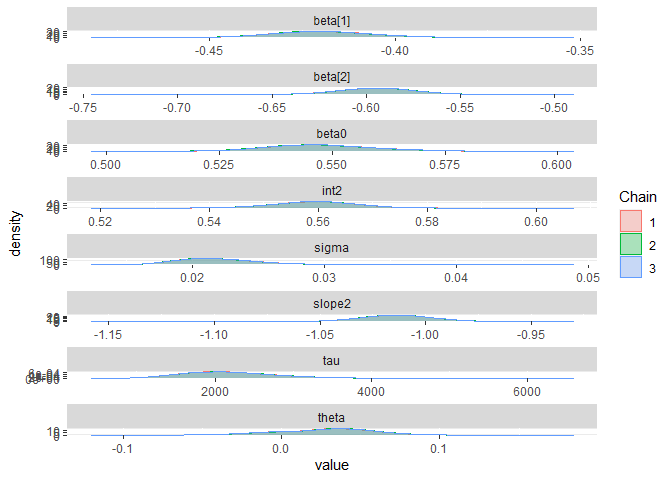

Lab 10: Piece-wise Linear Model
================
Daniel Carpenter
March, 2022

-   [Change Point Regression Models & Lab
    Overview](#change-point-regression-models--lab-overview)
    -   [Overview and Topics](#overview-and-topics)
    -   [The Change Point Model
        Expression](#the-change-point-model-expression)
    -   [Example: Stagnant Water: Change point
        model](#example-stagnant-water-change-point-model)
    -   [Data Overview](#data-overview)
-   [Task 1 - Review Data and 2-Linear
    Pieces](#task-1---review-data-and-2-linear-pieces)
    -   [Plot the data using ggplot](#plot-the-data-using-ggplot)
    -   [Comment on the plot](#comment-on-the-plot)
-   [Task 2 - Create JAGS Model](#task-2---create-jags-model)
    -   [JAGS Model for Piece-wise
        Regression](#jags-model-for-piece-wise-regression)
-   [Task 3 - Create Full-JAGS
    Scripts](#task-3---create-full-jags-scripts)
    -   [Create JAGS Script with Piece-wise
        Regression](#create-jags-script-with-piece-wise-regression)
-   [Task 4 - Retrieve Point Estimates from JAGS
    Model](#task-4---retrieve-point-estimates-from-jags-model)
-   [Task 5 - Plot Piece-Wise Estimates on
    Data](#task-5---plot-piece-wise-estimates-on-data)

# Change Point Regression Models & Lab Overview

## Overview and Topics

-   In this lab we will investigate another class of models which are
    extremely flexible in their application.

-   This topic can be seen as piecewise regression.

## The Change Point Model Expression

*y*<sub>*i*</sub> ∼ *N*(*μ*<sub>*i*</sub>, *σ*<sup>2</sup>)
*μ*<sub>*i*</sub> = *β*<sub>0</sub> + *β*<sub>1</sub>*x*<sub>*i*</sub> + *β*<sub>2</sub>(*x*<sub>*i*</sub> − *θ*)*I*<sub>(1, *x*<sub>*i*</sub> ≥ *θ*, 0 *e**l**s**e*)</sub>

## Example: Stagnant Water: Change point model

*y*<sub>*i*</sub> is the log flow rate down an inclined channel, and
*x*<sub>*i*</sub> is the log height of stagnant surface layers of
different surfactants. The rate of decline in flow rate seems to
suddenly increase around *x* = 0.

## Data Overview

``` r
dataList = list(
  y = c(1.12, 1.12, 0.99, 1.03, 
        0.92, 0.90, 0.81, 0.83, 
        0.65, 0.67, 0.60,  0.59, 
        0.51, 0.44, 0.43, 0.43, 
        0.33, 0.30, 0.25, 0.24, 
        0.13, -0.01, -0.13, -0.14, 
        -0.30, -0.33, -0.46,-0.43, -0.65),
  
  x = c(-1.39, -1.39, -1.08, -1.08, 
        -0.94, -0.80, -0.63, -0.63, 
        -0.25, -0.25, -0.12, -0.12, 
        0.01, 0.11, 0.11, 0.11,  
        0.25, 0.25, 0.34, 0.34, 
        0.44, 0.59, 0.70, 0.70, 
        0.85, 0.85,  0.99, 0.99, 1.19),
  
  N = 29)
```

# Task 1 - Review Data and 2-Linear Pieces

## Plot the data using ggplot

``` r
df = data.frame(x = dataList$x, y=dataList$y)

head(df)
```

    ##       x    y
    ## 1 -1.39 1.12
    ## 2 -1.39 1.12
    ## 3 -1.08 0.99
    ## 4 -1.08 1.03
    ## 5 -0.94 0.92
    ## 6 -0.80 0.90

``` r
library(ggplot2)
basePlot <- ggplot(df, aes(x=x, y=y)) +
              geom_point() +
              geom_smooth(method = 'loess', se = TRUE) + 
              theme_minimal() +
              labs(title = 'Plot of Data',
                   subtitle = 'Daniel Carpenter')
basePlot
```

    ## `geom_smooth()` using formula 'y ~ x'

<!-- -->

## Comment on the plot

# Task 2 - Create JAGS Model

## JAGS Model for Piece-wise Regression

``` r
model {
  for (i in 1:N) {
    y[i]    ~ dnorm(mu[i], tau)
    mu[i]  <- beta0 + beta[1]*x[i] + beta[2]*(x[i] - theta)
            * step(x[i] - theta)
  }
  tau       ~ dgamma(0.001, 0.001)
  beta0     ~ dnorm(0.0, 1.0E-6)
  
  for (j in 1:2) {
    beta[j] ~ dnorm(0.0, 1.0E-6)
  }
  sigma    <- 1/sqrt(tau)
  theta     ~ dunif(-1.3, 1.1)
  
  int2 <- beta0 - beta[1]*theta
  slope2 <- beta[1] + beta[2]
}
```

### `step()` Function

-   In the expression of the analytical model we used
    *I*<sub>(1, *x*<sub>*i*</sub> ≥ *θ*, 0 *e**l**s**e*)</sub>

-   What jags function is used for *I*? `step()`

### A prior is placed on *τ*

What is the mean and variance of the prior distribution for *τ*?

``` r
# What it looks like
curve(dgamma(x, shape = 0.001, rate = 0.001), xlim = c(0, 10))
title(main = 'Daniel Carpenter')
```

<!-- -->

``` r
# Mean
0.001/0.001
```

    ## [1] 1

``` r
# Variance
0.001/0.001^2
```

    ## [1] 1000

``` r
# Variance
```

# Task 3 - Create Full-JAGS Scripts

## Create JAGS Script with Piece-wise Regression

Make a complete Jags script to run the model. You can use the script
below and alter it to fit.

``` r
library(rjags)
#Define the model:
modelString = "
model {
  for (i in 1:N) {
    y[i]    ~ dnorm(mu[i], tau)
    mu[i]  <- beta0 + beta[1]*x[i] + beta[2]*(x[i] - theta)
            * step(x[i] - theta)
  }
  tau       ~ dgamma(0.001, 0.001)
  beta0     ~ dnorm(0.0, 1.0E-6)
  
  for (j in 1:2) {
    beta[j] ~ dnorm(0.0, 1.0E-6)
  }
  sigma    <- 1/sqrt(tau)
  theta     ~ dunif(-1.3, 1.1)
  
  int2 <- beta0 - beta[1]*theta
  slope2 <- beta[1] + beta[2]
}
" # close quote for modelString
writeLines( modelString , con="TEMPmodel.txt" )

initsList = list(tau = 1, beta0 = 2, beta = c(1, 2), theta = 1)

# Run the chains:
jagsModel = jags.model( file="TEMPmodel.txt" , data=dataList , inits=initsList , 
                        n.chains=3 , n.adapt=500 )
```

    ## Compiling model graph
    ##    Resolving undeclared variables
    ##    Allocating nodes
    ## Graph information:
    ##    Observed stochastic nodes: 29
    ##    Unobserved stochastic nodes: 5
    ##    Total graph size: 161
    ## 
    ## Initializing model

``` r
# Show how the model is ran - realSlicer is slow. Conjugate is fast
list.samplers(jagsModel)
```

    ## $`bugs::ConjugateNormal`
    ## [1] "beta[2]"
    ## 
    ## $`bugs::ConjugateNormal`
    ## [1] "beta[1]"
    ## 
    ## $`bugs::ConjugateGamma`
    ## [1] "tau"
    ## 
    ## $`bugs::ConjugateNormal`
    ## [1] "beta0"
    ## 
    ## $`base::RealSlicer`
    ## [1] "theta"

``` r
update( jagsModel , n.iter=500 )
codaSamples = coda.samples( jagsModel , variable.names=c("tau", "sigma",
                                                         'beta', 'beta0', 'theta',
                                                         'int2', 'slope2'),
                            n.iter=33340 )
save( codaSamples , file=paste0("lab10","Mcmc.Rdata") )

# Output of model
summary(codaSamples)
```

    ## 
    ## Iterations = 1001:34340
    ## Thinning interval = 1 
    ## Number of chains = 3 
    ## Sample size per chain = 33340 
    ## 
    ## 1. Empirical mean and standard deviation for each variable,
    ##    plus standard error of the mean:
    ## 
    ##               Mean        SD  Naive SE Time-series SE
    ## beta[1]   -0.41951 1.523e-02 4.815e-05      2.481e-04
    ## beta[2]   -0.59415 2.084e-02 6.589e-05      2.058e-04
    ## beta0      0.54730 1.318e-02 4.167e-05      2.331e-04
    ## int2       0.55938 7.942e-03 2.511e-05      7.156e-05
    ## sigma      0.02209 3.303e-03 1.044e-05      1.633e-05
    ## slope2    -1.01367 1.759e-02 5.561e-05      1.859e-04
    ## tau     2181.92491 6.215e+02 1.965e+00      2.920e+00
    ## theta      0.02791 3.327e-02 1.052e-04      5.901e-04
    ## 
    ## 2. Quantiles for each variable:
    ## 
    ##               2.5%        25%        50%        75%      97.5%
    ## beta[1]   -0.44868 -4.295e-01   -0.41995   -0.40979   -0.38849
    ## beta[2]   -0.63543 -6.079e-01   -0.59410   -0.58050   -0.55293
    ## beta0      0.52230  5.387e-01    0.54666    0.55555    0.57464
    ## int2       0.54352  5.543e-01    0.55944    0.56452    0.57486
    ## sigma      0.01677  1.976e-02    0.02170    0.02399    0.02963
    ## slope2    -1.04870 -1.025e+00   -1.01346   -1.00205   -0.97979
    ## tau     1139.21056  1.738e+03 2124.61676 2562.27472 3557.59303
    ## theta     -0.03810  5.753e-03    0.03007    0.04926    0.08926

``` r
# Plot the model output
library(ggmcmc)
s = ggs(codaSamples)
ggs_density(s)
```

<!-- -->

``` r
ggs_crosscorrelation(s)
```

<!-- -->

# Task 4 - Retrieve Point Estimates from JAGS Model

Run the model and make point and interval estimates.

``` r
su = summary(codaSamples)
su
```

    ## 
    ## Iterations = 1001:34340
    ## Thinning interval = 1 
    ## Number of chains = 3 
    ## Sample size per chain = 33340 
    ## 
    ## 1. Empirical mean and standard deviation for each variable,
    ##    plus standard error of the mean:
    ## 
    ##               Mean        SD  Naive SE Time-series SE
    ## beta[1]   -0.41951 1.523e-02 4.815e-05      2.481e-04
    ## beta[2]   -0.59415 2.084e-02 6.589e-05      2.058e-04
    ## beta0      0.54730 1.318e-02 4.167e-05      2.331e-04
    ## int2       0.55938 7.942e-03 2.511e-05      7.156e-05
    ## sigma      0.02209 3.303e-03 1.044e-05      1.633e-05
    ## slope2    -1.01367 1.759e-02 5.561e-05      1.859e-04
    ## tau     2181.92491 6.215e+02 1.965e+00      2.920e+00
    ## theta      0.02791 3.327e-02 1.052e-04      5.901e-04
    ## 
    ## 2. Quantiles for each variable:
    ## 
    ##               2.5%        25%        50%        75%      97.5%
    ## beta[1]   -0.44868 -4.295e-01   -0.41995   -0.40979   -0.38849
    ## beta[2]   -0.63543 -6.079e-01   -0.59410   -0.58050   -0.55293
    ## beta0      0.52230  5.387e-01    0.54666    0.55555    0.57464
    ## int2       0.54352  5.543e-01    0.55944    0.56452    0.57486
    ## sigma      0.01677  1.976e-02    0.02170    0.02399    0.02963
    ## slope2    -1.04870 -1.025e+00   -1.01346   -1.00205   -0.97979
    ## tau     1139.21056  1.738e+03 2124.61676 2562.27472 3557.59303
    ## theta     -0.03810  5.753e-03    0.03007    0.04926    0.08926

### Interpret the estimates:

-   The mean and standard deviation for each monitored variable can be
    shown above. For example, the mean *μ* of *β*<sub>1</sub> is around
    -0.42 and its standard deviation *σ* is around 1.499e-02  
-   We can also analyze the credibility intervals for each variable. For
    example, there is a 95% probability that *β*<sub>1</sub>’s mean will
    approximately fall between -0.449 and -0.389.  
-   Above values rounded since each MCMC run varies in results (since it
    is an estimation)

# Task 5 - Plot Piece-Wise Estimates on Data

Plot the estimating lines onto the data

``` r
# Create objects using summary stats
beta0  = su$statistics[,'Mean']['beta0']
beta1  = su$statistics[,'Mean']['beta[1]']
beta2  = su$statistics[,'Mean']['beta[2]']
int2   = su$statistics[,'Mean']['int2']
slope2 = su$statistics[,'Mean']['slope2']
theta  = su$statistics[,'Mean']['theta']

# Plot the two estimated linear pieces with the cuttoff point
basePlot + 
  geom_abline(intercept = beta0, slope = beta1)  + # Piece 1  
  geom_abline(intercept = int2,  slope = slope2) + # Piece 2
  geom_vline(xintercept = theta)                 + # Intersection 
  labs(title = 'Plot of data with Piece-Wise Linear Regression Estimates using MCMC')
```

<!-- -->
