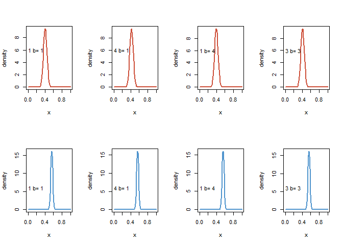
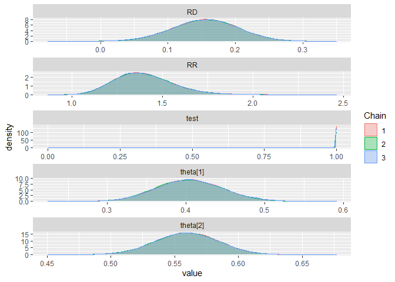
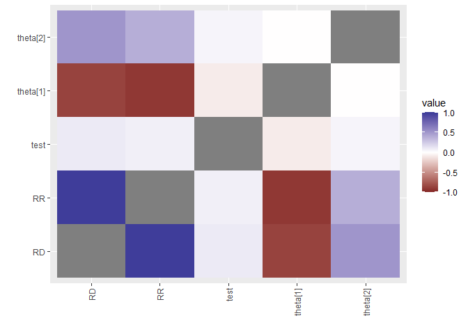
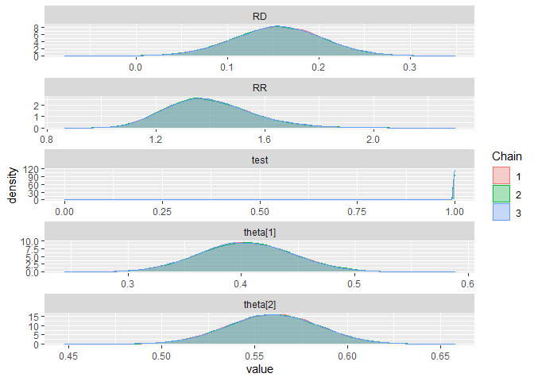
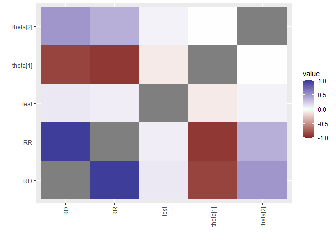
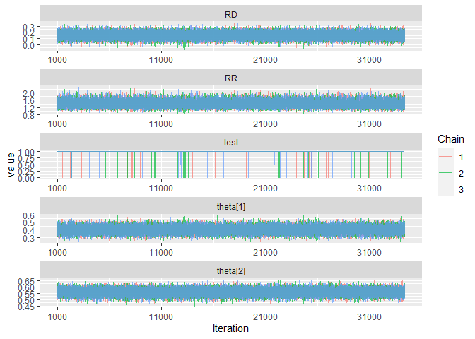

Lab 11: Comparing Binomial Proportions
================
Daniel Carpenter
April 2022

-   [Lab Overview](#lab-overview)
    -   [Reference Book](#reference-book)
    -   [Data Overview](#data-overview)
-   [Task 1 - Analytical Expression of Binomial
    Proportions](#task-1---analytical-expression-of-binomial-proportions)
-   [Task 2 - Plot both Posteriors](#task-2---plot-both-posteriors)
-   [Task 3 - JAGS Model Overview](#task-3---jags-model-overview)
-   [Task 4 - Create Full JAGS
    Script](#task-4---create-full-jags-script)
-   [Task 5 - Interpretation of
    Results](#task-5---interpretation-of-results)
-   [Task 6 - Function for all above
    Calculations](#task-6---function-for-all-above-calculations)

# Lab Overview

## Reference Book

The following problem is taken from page 105
`Bayesian Ideas and Data Analysis: An Introduction for Scientists and Statisticians`

## Data Overview

534 medflies that lived at least 34 days. These are cross classified by
two factors:

    A) whether the fly produced at least 1,000 eggs in the first 30 days of life and
    B) whether the fly lived ata least 44 days

``` r
mat = matrix(c(54,80,224,176), nr = 2,nc=2, byrow = TRUE)
colnames(mat)= c("Long-lived","short-lived")
rownames(mat)= c("High", "Low")
mat
```

    ##      Long-lived short-lived
    ## High         54          80
    ## Low         224         176

These are multinomial data but if we view the Longetivity given
reproductive factor we shall see these as two independent binomials

*y*<sub>1</sub>\|*θ* ∼ *B**i**n*(*n*<sub>1</sub>, *θ*) ⊥ *y*<sub>2</sub>\|*θ*<sub>2</sub> ∼ *B**i**n*(*n*<sub>2</sub>, *θ*<sub>2</sub>)

The data can then be obtained from the above table:

> *n*<sub>1</sub> = 134, *n*<sub>2</sub> = 400, *y*<sub>1</sub> = 54, *y*<sub>2</sub> = 224

# Task 1 - Analytical Expression of Binomial Proportions

Find the conjugate solution – that is find the *analytical* posteriors
for *θ*<sub>1</sub>\|*y*<sub>1</sub> and
*θ*<sub>2</sub>\|*y*<sub>2</sub> using
*θ*<sub>*i*</sub> ∼ *B**e**t**a*(*a*<sub>*i*</sub>, *b*<sub>*i*</sub>)
where *i* ∈ {1, 2}

$$
\\begin{aligned}
&p\\left(\\theta\_{1} \\mid y\_{1}\\right)=\\operatorname{Beta}\\left(a\_{1}+y\_{1}, b\_{1}+n\_{1}-y\_{1}\\right) \\\\
&p\\left(\\theta\_{2} \\mid y\_{2}\\right)=\\operatorname{Beta}\\left(a\_{2}+y\_{2}, b\_{2}+n\_{2}-y\_{2}\\right)
\\end{aligned}
$$

# Task 2 - Plot both Posteriors

> Make plots of the two posteriors in R using

-   *a*<sub>*i*</sub> = 1, *b*<sub>*i*</sub> = 1
-   *a*<sub>*i*</sub> = 4, *b*<sub>*i*</sub> = 1
-   *a*<sub>*i*</sub> = 1, *b*<sub>*i*</sub> = 4
-   *a*<sub>*i*</sub> = 3, *b*<sub>*i*</sub> = 3

``` r
a = c(1, 4, 1, 3)
b = c(1, 1, 4, 3)
n = c(134, 400)
y = c(54, 224)

par(mfrow=c(length(n),length(a))) # layout of plots

# Plot each beta distribution
for (i in 1:length(n)) {
  for (j in 1:length(a)) {
    curve(dbeta(x, a[j]+y[i], b[j]+n[i]-y[i]),
                xlim = c(0,1), lwd=2, col = c('tomato3', 'steelblue3')[i],
                ylab = 'density')
    text(0.1, 6, paste('a=', a[j], 'b=',b[j]))
  }
}
```

<!-- -->

# Task 3 - JAGS Model Overview

Create a jags model for the above problem by correcting and/or
completing the given code. Note that there are some useful logical nodes
made. Comment on them.

``` r
model{
  for(i in 1:2){
  y[i] ~ dbin(theta[i], n[i])

  theta[i] ~ dbeta(1,1)             # Uniform prior now, but change to a and b params
  odds[i] <- theta[i]/(1-theta[i])  # Prob of success / prob of failure
  }
  
  RD   <- theta[2]-theta[1] # Risk difference
  RR   <-theta[2]/theta[1]  # Relative risk
  test <- step(RD)          # Probability that RD is positive
}
```

# Task 4 - Create Full JAGS Script

<!-- Example of : -->
<!-- ```{r logicalnodes, eval=FALSE} -->
<!-- a[i]<-1 -->
<!-- b[i]<-1 -->
<!-- ``` -->

Note monitoring `theta`, `RR`, `OR` and `test`.

``` r
require(rjags)

# alpha and beta
a = 1 
b = 1 

dataList = list(n=n, y=y, a=a, b=b) # Put variables into model's data list

modelString = "
model{
  for(i in 1:2){
  y[i] ~ dbin(theta[i], n[i])

  theta[i] ~ dbeta(a,b)             # beta distribution with hyper params a and b
  odds[i] <- theta[i]/(1-theta[i])  # Prob of success / prob of failure
  }
  
  RD   <- theta[2]-theta[1] # Risk difference
  RR   <-theta[2]/theta[1]  # Relative risk
  test <- step(RD)          # Probability that RD is positive
}
"# close quote for modelString

writeLines( modelString , con="TEMPmodel.txt" )

initsList = list(theta = c(0.4,0.5))

# Run the chains:
jagsModel = jags.model( file="TEMPmodel.txt" , data=dataList , inits=initsList , 
                        n.chains=3 , n.adapt=500 )
```

    ## Compiling model graph
    ##    Resolving undeclared variables
    ##    Allocating nodes
    ## Graph information:
    ##    Observed stochastic nodes: 2
    ##    Unobserved stochastic nodes: 2
    ##    Total graph size: 16
    ## 
    ## Initializing model

``` r
# Show how the model is ran - realSlicer is slow. Conjugate is fast
list.samplers(jagsModel)
```

    ## $`bugs::BinomSlicer`
    ## [1] "theta[2]"
    ## 
    ## $`bugs::BinomSlicer`
    ## [1] "theta[1]"

``` r
update( jagsModel , n.iter=500 )
codaSamples = coda.samples( jagsModel , variable.names=c('theta', 'RR', 'RD', 'test'),
                            n.iter=33340 )
save( codaSamples , file=paste0("lab11","Mcmc.Rdata") )


# Plot the model output
require(ggmcmc)
s = ggs(codaSamples)
d = ggs_density(s); print(d)
```

<!-- -->

``` r
cr = ggs_crosscorrelation(s); print(cr)
```

<!-- -->

# Task 5 - Interpretation of Results

Please give point and interval estimates for the above nodes. Interpret
them.

``` r
# Output of model
summary(codaSamples)
```

    ## 
    ## Iterations = 1001:34340
    ## Thinning interval = 1 
    ## Number of chains = 3 
    ## Sample size per chain = 33340 
    ## 
    ## 1. Empirical mean and standard deviation for each variable,
    ##    plus standard error of the mean:
    ## 
    ##            Mean      SD  Naive SE Time-series SE
    ## RD       0.1554 0.04908 1.552e-04      0.0001990
    ## RR       1.3998 0.16274 5.146e-04      0.0006592
    ## test     0.9992 0.02880 9.105e-05      0.0001052
    ## theta[1] 0.4043 0.04220 1.334e-04      0.0001696
    ## theta[2] 0.5596 0.02489 7.869e-05      0.0001000
    ## 
    ## 2. Quantiles for each variable:
    ## 
    ##            2.5%    25%    50%    75%  97.5%
    ## RD       0.0578 0.1224 0.1559 0.1888 0.2502
    ## RR       1.1210 1.2855 1.3863 1.4995 1.7570
    ## test     1.0000 1.0000 1.0000 1.0000 1.0000
    ## theta[1] 0.3234 0.3754 0.4038 0.4328 0.4881
    ## theta[2] 0.5105 0.5428 0.5597 0.5766 0.6079

### Interpretation:

-   Mean value of `RD` is around 0.16 with a standard deviation of
    around 0.049
-   There is a probability of 95% that `RD` will be between around 0.06
    and 0.25
-   Each variable can be interpreted like I have for `RD`
-   All values rounded and stated as approximately since each MCMC run
    will generate a slightly different estimate.

# Task 6 - Function for all above Calculations

Make a function `mybibin()` that will solve the same type of problem
where the data inputs will be a vector of y’s and a vector of n’s. The
priors will be beta’s and will therefore need a vector of a’s and b’s.
The command line output should be a list of point and interval estimates
for a given *α*. The function should produce analytical posterior, prior
and likelihood plots and MCMC posterior plots of the theta’s and all
other stochastic nodes. Run your function with the same data as given
and *a* = *c*(1, 2), *b* = *c*(1, 2) *a**n**d* *α* = 0.2

How will you change the model code? There are many ways to do this – one
way is to break the model “text” into parts and rejoin them after
changing values. You can use `paste()`

``` r
mybibin = function(y=c(54, 224), n=c(134, 400), alpha=0.05, 
                   a=c(1, 2), b=c(1,2) ) {
  require(ggmcmc)
  require(rjags)
  
  # JAGS MODEL ----------------------------------------------------------------
    dataList = list(n=n, y=y, a=a, b=b) # Put variables into model's data list
    
    modelString = "
    model{
      for(i in 1:2){
      y[i] ~ dbin(theta[i], n[i])
    
      theta[i] ~ dbeta(a[i],b[i])             # beta distribution with hyper params a and b
      odds[i] <- theta[i]/(1-theta[i])  # Prob of success / prob of failure
      }
      
      RD   <- theta[2]-theta[1] # Risk difference
      RR   <- theta[2]/theta[1] # Relative risk
      test <- step(RD)          # Probability that RD is positive
    }
    "# close quote for modelString
    
    writeLines( modelString , con="TEMPmodel.txt" )
    
    initsList = list(theta = c(0.4,0.5))
    
    # Run the chains:
    jagsModel = jags.model( file="TEMPmodel.txt" , data=dataList , inits=initsList , 
                            n.chains=3 , n.adapt=500 )
    
    # Show how the model is ran - realSlicer is slow. Conjugate is fast
    list.samplers(jagsModel)
    
    update( jagsModel , n.iter=500 )
    codaSamples = coda.samples( jagsModel , variable.names=c('theta', 'RR', 'RD', 'test'),
                                n.iter=33340 )
    save( codaSamples , file=paste0("lab11","Mcmc.Rdata") )
    
    
    # Plot the model output
    
      s = ggs(codaSamples)
      
      # Create a density plot
      d = ggs_density(s); print(d)
      
      # Create a Cross Correlation plot
      cr = ggs_crosscorrelation(s); print(cr)
      
      # Create a trace plot
      t = ggs_traceplot(s); print(t)
      
  # Return summary of sampling, the data you inputted, and the density plot
  return(list(
   summary = summary(codaSamples, quantiles = c(alpha/2, 1-alpha/2)),
   data    = dataList,
   density = d
  ))
}

# Call the function
mcmcOutput <- mybibin(alpha = 0.20, a=c(1,1), b=c(1,1))
```

    ## Compiling model graph
    ##    Resolving undeclared variables
    ##    Allocating nodes
    ## Graph information:
    ##    Observed stochastic nodes: 2
    ##    Unobserved stochastic nodes: 2
    ##    Total graph size: 18
    ## 
    ## Initializing model

<!-- --><!-- --><!-- -->

``` r
mcmcOutput$summary # Summary Output    
```

    ## 
    ## Iterations = 1001:34340
    ## Thinning interval = 1 
    ## Number of chains = 3 
    ## Sample size per chain = 33340 
    ## 
    ## 1. Empirical mean and standard deviation for each variable,
    ##    plus standard error of the mean:
    ## 
    ##            Mean      SD  Naive SE Time-series SE
    ## RD       0.1553 0.04857 1.536e-04      0.0001931
    ## RR       1.3992 0.16094 5.089e-04      0.0006414
    ## test     0.9991 0.03048 9.637e-05      0.0001201
    ## theta[1] 0.4045 0.04189 1.324e-04      0.0001669
    ## theta[2] 0.5599 0.02474 7.823e-05      0.0000989
    ## 
    ## 2. Quantiles for each variable:
    ## 
    ##              10%    90%
    ## RD       0.09267 0.2173
    ## RR       1.20520 1.6103
    ## test     1.00000 1.0000
    ## theta[1] 0.35097 0.4586
    ## theta[2] 0.52802 0.5915

``` r
mcmcOutput$data    # The original data used as inputs for jag model
```

    ## $n
    ## [1] 134 400
    ## 
    ## $y
    ## [1]  54 224
    ## 
    ## $a
    ## [1] 1 1
    ## 
    ## $b
    ## [1] 1 1

``` r
mcmcOutput$density # The density summary plot
```

<!-- -->
