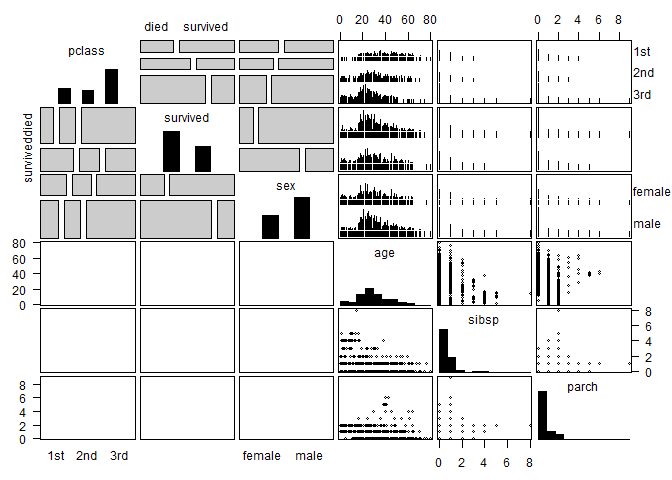
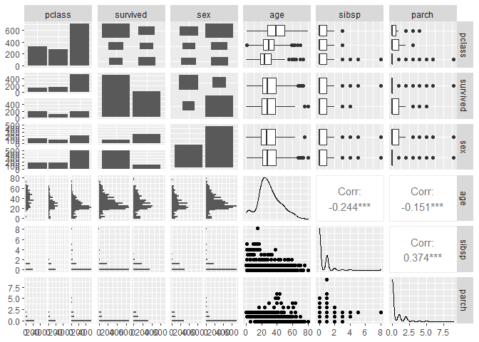
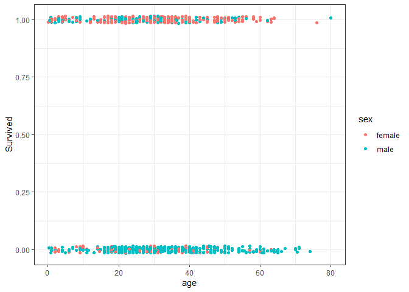
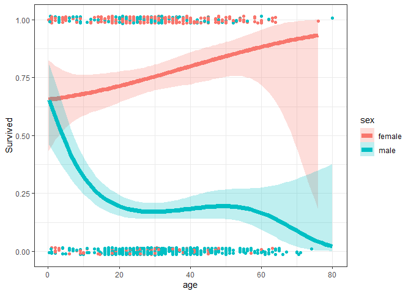
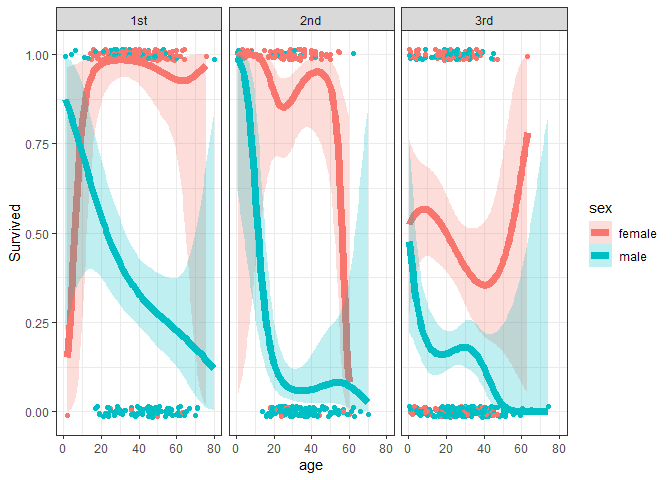
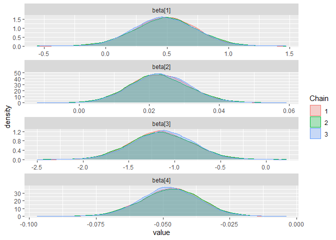
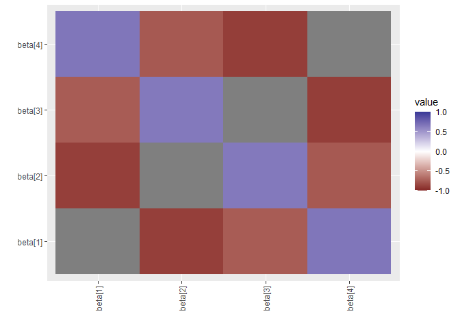

Lab 12: Titanic data
================
Daniel Carpenter
April 2022

# Overview of Course so Far

As you have noticed “the Titanic” has been a theme of the course. The
course has been structured into three parts:

    * Distributional results and basics of R
    * Binomial: a simple model where Bayesian methodology is learnt
    * The GLM: A more advanced application of Bayesian theory

All the skills that you have learnt in pa\`rts 1 and 2 will now be
applied to a logistic regression which is a special case of the GLM.

We will now start to analyze the Titanic data set and you will perfect
this in Assignment 4.

# Lab Overview

## Overview of the Titanic Story

## Summarize the Titanic story by reading the following web page: (<https://www.history.com/this-day-in-history/unsinkable-titanic-sinks>)

In 1912, the Titanic, the largest and fastest boat in the world that
carried 2,200 passengers, sank in the Atlantic. The boat had 16
compartments; if the ship hit an iceberg, the incision must rupture 4 of
the 16 compartments to sink the ship. Propaganda followed, and many
assumed the largest and fastest ship was unsinkable. One night, the ship
soared across the Atlantic and met an iceberg head-on, breaching 5 or
more of the compartments, which caused the boat to sink. The bow
submerged first, then the boat broke in half and fully sank over 13,000
feet to the ocean floor. 700 of the 2,200 passengers died due to
insufficient lifeboats and other precautionary measures. Lifeboats
prioritized women and children, who made up most of the surviving
members.

## Overview of the Titanic dataset

We will use the data set as prepared in the `vcdExtra` package. We will
aslo use the `gpairs` package. Please install.

### Summary of Dataset using `gpairs()`

``` r
require(vcdExtra) # Titanic passenger data
require(gpairs)   # Use the data frame below and use the function gpairs()
require(GGally)
data("Titanicp")
head(Titanicp)
```

    ##   pclass survived    sex     age sibsp parch
    ## 1    1st survived female 29.0000     0     0
    ## 2    1st survived   male  0.9167     1     2
    ## 3    1st     died female  2.0000     1     2
    ## 4    1st     died   male 30.0000     1     2
    ## 5    1st     died female 25.0000     1     2
    ## 6    1st survived   male 48.0000     0     0

``` r
# Huge summary of the dataset
gpairs(Titanicp)
```

<!-- -->

``` r
ggpairs(Titanicp)
```

<!-- -->

Notice that there are a number of categorical variables and a continuous
variable `age`.

<!-- ## Using the R help for the package describe the variables in the Titanicp data set. -->

# Task 2: Interpreting the Data

## Interpret the plots below:

``` r
library(ggplot2)

# 
g = ggplot(Titanicp, aes(x = age, 
                         y=as.numeric(survived =="survived"),
                         color = sex)) + 
  ylab("Survived") + 
  theme_bw() 

# Jitter the plot so that the points are not on top of each other
# Mainly woman who survived, but not exact relationship
JITTER_AMOUNT = 0.015
g = g + geom_point(position = position_jitter(height = JITTER_AMOUNT, width =0))
g
```

    ## Warning: Removed 263 rows containing missing values (geom_point).

<!-- -->

``` r
# Generalized Linear Model - binomial with link logit. Also fit a cubic
# Older woman are more likely to survive, and younger boys are more likely to survive
# Note wide interval likely due to limited sample size
g = g + stat_smooth(method = "glm", 
                    method.args = list(family=binomial("logit")), 
                    formula = y ~ x + I(x^2) + I(x^3), 
                    alpha = 0.25, size = 2.5, 
                    aes(fill = sex))
g
```

    ## Warning: Removed 263 rows containing non-finite values (stat_smooth).

    ## Warning: Removed 263 rows containing missing values (geom_point).

<!-- -->

``` r
# Now break out by class of passenger
# First class females have high likelihood of survival
g = g + facet_wrap(~pclass)
g
```

    ## Warning: Removed 263 rows containing non-finite values (stat_smooth).

    ## Warning: Removed 263 rows containing missing values (geom_point).

<!-- -->

### Interpretation of Plots

-   Most of the individuals who died were older males. However, some
    females died too.

-   Young individuals regardless of age have similar survival rates, but
    males plummit quickly

-   Without consideration of class, females have higher likelihood of
    survival with incraesed age

-   Limited sample size with wider tails in older age groups

-   It appears that 1st class had highest priority for life boats (see
    slope and intercept). Third class had low priority regardless of
    age, but age still negatively impacted likelihood of survival.

# Task 3: Classical analysis using `glm()`

We will perform a logistic regression using glm.

-   Need maximum liklihood estimates (`Estimate`) for the MCMC using glm
-   Interaction used because the survival depends what level of age you
    are at or if you are male or female
-   Note very significant
-   Goes through 4 chains

``` r
clglm = glm(survived ~ sex + age + sex:age,family = "binomial", data = Titanicp)
summary(clglm)
```

    ## 
    ## Call:
    ## glm(formula = survived ~ sex + age + sex:age, family = "binomial", 
    ##     data = Titanicp)
    ## 
    ## Deviance Residuals: 
    ##     Min       1Q   Median       3Q      Max  
    ## -2.0247  -0.7158  -0.5776   0.7707   2.2960  
    ## 
    ## Coefficients:
    ##              Estimate Std. Error z value Pr(>|z|)    
    ## (Intercept)  0.493381   0.254188   1.941 0.052257 .  
    ## sexmale     -1.154139   0.339337  -3.401 0.000671 ***
    ## age          0.022516   0.008535   2.638 0.008342 ** 
    ## sexmale:age -0.046276   0.011216  -4.126 3.69e-05 ***
    ## ---
    ## Signif. codes:  0 '***' 0.001 '**' 0.01 '*' 0.05 '.' 0.1 ' ' 1
    ## 
    ## (Dispersion parameter for binomial family taken to be 1)
    ## 
    ##     Null deviance: 1414.6  on 1045  degrees of freedom
    ## Residual deviance: 1083.4  on 1042  degrees of freedom
    ##   (263 observations deleted due to missingness)
    ## AIC: 1091.4
    ## 
    ## Number of Fisher Scoring iterations: 4

## What are the classical point estimates?

# Task 4: Use the classical model to make data for JAGS

## Complete the code below (one line, `y=`)

## Why not just use the original data?:

-   Get rid of the `NAs`
-   Also the model matrix is easy to handle
-   The original data uses boolean text to describe if the passenger
    survived, so need to convert to binary (1, 0) to model in R

``` r
mat1=model.matrix(clglm)
mat2=model.frame(clglm)
head(mat1)
```

    ##   (Intercept) sexmale     age sexmale:age
    ## 1           1       0 29.0000      0.0000
    ## 2           1       1  0.9167      0.9167
    ## 3           1       0  2.0000      0.0000
    ## 4           1       1 30.0000     30.0000
    ## 5           1       0 25.0000      0.0000
    ## 6           1       1 48.0000     48.0000

``` r
head(mat2)
```

    ##   survived    sex     age
    ## 1 survived female 29.0000
    ## 2 survived   male  0.9167
    ## 3     died female  2.0000
    ## 4     died   male 30.0000
    ## 5     died female 25.0000
    ## 6 survived   male 48.0000

``` r
# Create output
y = with(mat2, ifelse(survived == "survived", 1, 0))

# Data list for MCMC model
dataList=list(y = y, x = mat1[, "age"],sexm = mat1[,"sexmale"], sexmx = mat1[,"sexmale:age"] , n = length(y))
```

# Task 5: Use Classical Estimates as Initial Values in JAGS

## Complete the Jags script below

### Warning

The MCMC sampler is very sensitive to initial values. Within each gibbs
iteration Jags will choose a slice sampler – this will take some time.
You may need to wait a few minutes for the sampling to complete.

``` r
library(rjags)

#Define the model:
modelString = "
model{
    for(i in 1:n) {
      y[i] ~ dbin(theta[i], 1)
      logit(theta[i]) <- beta[1] + beta[2]*x[i] + beta[3]*sexm[i] + beta[4]*sexmx[i]
    }
    
  for(j in 1:4){
    beta[j] ~ dnorm(0,1.0E-3)
  }
}
"
writeLines( modelString , con="TEMPmodel.txt" )

initsList = list(beta = c(0.5,0.02,-1.15,-0.05)) # initial values

# Run the chains:
jagsModel = jags.model( file="TEMPmodel.txt" , data=dataList , inits=initsList , 
                        n.chains=3 , n.adapt=500 )
```

    ## Compiling model graph
    ##    Resolving undeclared variables
    ##    Allocating nodes
    ## Graph information:
    ##    Observed stochastic nodes: 1046
    ##    Unobserved stochastic nodes: 4
    ##    Total graph size: 4721
    ## 
    ## Initializing model

``` r
list.samplers(jagsModel)
```

    ## $`bugs::BinomSlicer`
    ## [1] "beta[4]"
    ## 
    ## $`bugs::BinomSlicer`
    ## [1] "beta[3]"
    ## 
    ## $`bugs::BinomSlicer`
    ## [1] "beta[2]"
    ## 
    ## $`bugs::BinomSlicer`
    ## [1] "beta[1]"

``` r
update( jagsModel , n.iter=500 )
codaSamples = coda.samples( jagsModel , variable.names=c("beta"),
                            n.iter=33340 )
save( codaSamples , file=paste0("lab12","Mcmc.Rdata") )


library(ggmcmc)
s = ggs(codaSamples)
d=ggs_density(s)

print(d)
```

<!-- -->

``` r
cr =  ggs_crosscorrelation(s)
print(cr)
```

<!-- -->

``` r
summary(codaSamples)
```

    ## 
    ## Iterations = 1001:34340
    ## Thinning interval = 1 
    ## Number of chains = 3 
    ## Sample size per chain = 33340 
    ## 
    ## 1. Empirical mean and standard deviation for each variable,
    ##    plus standard error of the mean:
    ## 
    ##             Mean       SD  Naive SE Time-series SE
    ## beta[1]  0.48688 0.251862 7.964e-04      0.0055568
    ## beta[2]  0.02301 0.008493 2.685e-05      0.0001854
    ## beta[3] -1.14104 0.334753 1.058e-03      0.0073898
    ## beta[4] -0.04719 0.011074 3.502e-05      0.0002437
    ## 
    ## 2. Quantiles for each variable:
    ## 
    ##              2.5%      25%      50%      75%    97.5%
    ## beta[1] -0.006719  0.31808  0.48648  0.65634  0.97808
    ## beta[2]  0.006718  0.01725  0.02283  0.02864  0.04008
    ## beta[3] -1.794055 -1.36651 -1.14319 -0.91469 -0.48557
    ## beta[4] -0.069130 -0.05448 -0.04704 -0.03961 -0.02581

# Task 6: Interpretation of JAGS MCMC Results

## Interpret all the Bayesian output

-   All values stated as approximately since each MCMC run will generate
    a slightly different estimate.

### Interpret the point estimates for the betas

*β*<sub>1</sub>: the mean value (*μ*) for *β*<sub>1</sub> is around
0.50952 and the *σ* is 0.257209. I.e., each person could either
survive  
*β*<sub>2</sub>: the mean value (*μ*) for *β*<sub>2</sub> is around
0.02229 and the *σ* is 0.008631 I.e. the older you are, the less likely
you are to survive.  
*β*<sub>3</sub>: the mean value (*μ*) for *β*<sub>3</sub> is around
-1.17196 and the *σ* is 0.344398 I.e. a male is more likely to die than
a female.  
*β*<sub>4</sub>: the mean value (*μ*) for *β*<sub>4</sub> is around
-0.04620 and the *σ* is 0.011349 I.e. if you are a male, your outcomes
worsen even more if as you age

### Interpret the interval estimates for the betas

-   All values stated as approximately since each MCMC run will generate
    a slightly different estimate.

With a probability of 95%, the mean value for: *β*<sub>1</sub> will be
between 0.006657 and 1.01637  
*β*<sub>2</sub> will be between 0.005433 and 0.03958  
*β*<sub>3</sub> will be between -1.860702 and -0.49767  
*β*<sub>4</sub> will be between -0.068774 and -0.02388

### How do you know the MCMC sampler converged to stationarity?

It is likely that the sampler converged since each chain well represents
each other.

### Compare your results with the classical analysis estimates

For each variable, the MCMC estimate represents the classical estimate
nearly exactly
