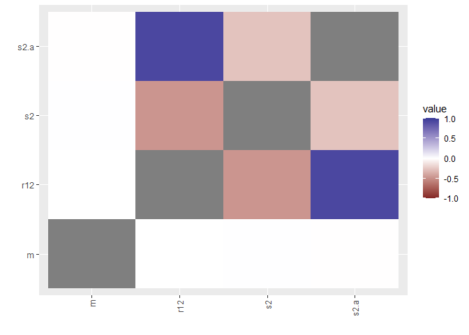
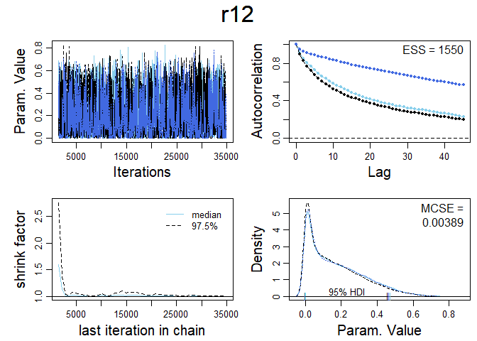
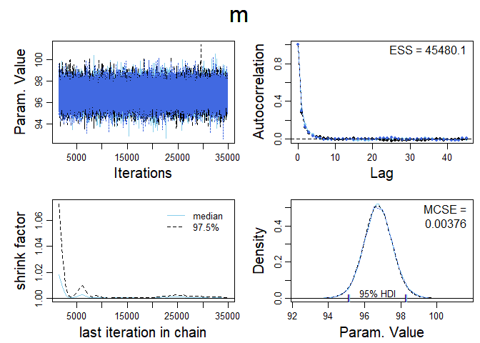
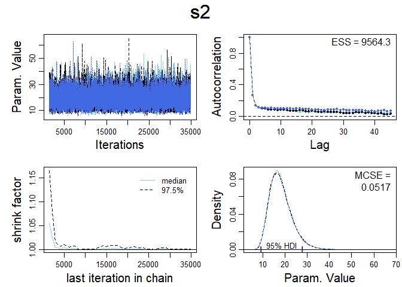
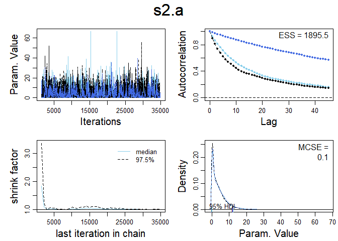

Lab 13: Repeated Measures Data
================
Daniel Carpenter
April 2022

-   [Flexible modeling](#flexible-modeling)
-   [Blood Pressure](#blood-pressure)
-   [Task 1](#task-1)
    -   [Plot the data in base R, you can use the data frame
        `df`:](#plot-the-data-in-base-r-you-can-use-the-data-frame-df)
    -   [Plot the data using ggplot:](#plot-the-data-using-ggplot)
-   [Classical analysis](#classical-analysis)
    -   [Paired samples](#paired-samples)
    -   [repeated aov](#repeated-aov)
-   [Theory](#theory)
    -   [Priors](#priors)
-   [Equivalent model](#equivalent-model)
-   [Expression for correlation](#expression-for-correlation)
    -   [Notice the following results:](#notice-the-following-results)
    -   [Now look at the within
        correlation](#now-look-at-the-within-correlation)
-   [The following is a Jags code to perform the
    simulation](#the-following-is-a-jags-code-to-perform-the-simulation)
    -   [Task 2](#task-2)

# Flexible modeling

One of the big advantages of the Bayesian approach is the huge
flexibiity around the construction of complex models.

# Blood Pressure

Measurements of blood pressure from twenty healthy individuals was
recorded. In this example there are two repeated measurements. This
example comes from pg 308 ff
`Bayesian Modeling Using WinBUGS by Ntzoufras`

``` r
dataList=list(n=20, K=2, 
y=structure(.Data=c(108, 98, 91, 94, 93, 96, 104, 99, 99, 97, 95, 98, 93, 97, 99, 96, 90, 100, 92, 95, 101, 89, 97, 97, 97, 100, 96, 95, 106, 100, 100, 98, 90, 99, 88, 98, 92, 92, 100, 101), 
.Dim = c(20, 2) )
)
dataList$y->y
mat=matrix(y,nr=20,nc=2,byrow=TRUE)
mat = cbind(mat, factor(1:20))
colnames(mat)=c("Fst",  "Snd", "Pat") # Pat = patient
df=as.data.frame(mat)
df
```

    ##    Fst Snd Pat
    ## 1  108  98   1
    ## 2   91  94   2
    ## 3   93  96   3
    ## 4  104  99   4
    ## 5   99  97   5
    ## 6   95  98   6
    ## 7   93  97   7
    ## 8   99  96   8
    ## 9   90 100   9
    ## 10  92  95  10
    ## 11 101  89  11
    ## 12  97  97  12
    ## 13  97 100  13
    ## 14  96  95  14
    ## 15 106 100  15
    ## 16 100  98  16
    ## 17  90  99  17
    ## 18  88  98  18
    ## 19  92  92  19
    ## 20 100 101  20

``` r
df2 = data.frame(Bloodp = c(df$Fst,df$Snd), measurement = rep(c("Fst","Snd"), c(20,20)), patient = factor(rep(df$Pat, 2)))
head(df2)
```

    ##   Bloodp measurement patient
    ## 1    108         Fst       1
    ## 2     91         Fst       2
    ## 3     93         Fst       3
    ## 4    104         Fst       4
    ## 5     99         Fst       5
    ## 6     95         Fst       6

# Task 1

## Plot the data in base R, you can use the data frame `df`:

Use `boxplot()` and reproduce the plot below.

## Plot the data using ggplot:

Use `ggplot()` and reproduce the plot below.

# Classical analysis

This is not a course on classical stats but having some knowledge of the
paradigm is definitely helpful. Again this is included for completeness.

## Paired samples

The two samples violate the standard assumptions of 2 sample t tests
because the samples are *de*pendent. This is addressed by taking the
difference of the samples and testing them with a one sample t test. The
two tests below are equivalent:

``` r
t.test(Bloodp ~ measurement, paired = TRUE, data = df2)
```

    ## 
    ##  Paired t-test
    ## 
    ## data:  Bloodp by measurement
    ## t = -0.30287, df = 19, p-value = 0.7653
    ## alternative hypothesis: true difference in means is not equal to 0
    ## 95 percent confidence interval:
    ##  -3.164227  2.364227
    ## sample estimates:
    ## mean of the differences 
    ##                    -0.4

``` r
t.test(df$Fst-df$Snd)
```

    ## 
    ##  One Sample t-test
    ## 
    ## data:  df$Fst - df$Snd
    ## t = -0.30287, df = 19, p-value = 0.7653
    ## alternative hypothesis: true mean is not equal to 0
    ## 95 percent confidence interval:
    ##  -3.164227  2.364227
    ## sample estimates:
    ## mean of x 
    ##      -0.4

The conclusion in both tests is that we should not reject the NULL
hypothesis of

*H*<sub>0</sub> : *μ*<sub>*F**s**t*</sub> − *μ*<sub>*S**n**d*</sub> = 0
since the pValue is &gt; 0.05. Note also that the confidence interval
contains 0.

## repeated aov

We should obtain the same results as above.

``` r
av = aov(Bloodp ~ measurement + Error(patient/measurement), data = df2)
summary(av)
```

    ## 
    ## Error: patient
    ##           Df Sum Sq Mean Sq F value Pr(>F)
    ## Residuals 19  422.5   22.24               
    ## 
    ## Error: patient:measurement
    ##             Df Sum Sq Mean Sq F value Pr(>F)
    ## measurement  1    1.6    1.60   0.092  0.765
    ## Residuals   19  331.4   17.44

Please note that the pvalues are the same and in this case
*t*<sup>2</sup> = *F*, that is: ( − 0.30287)<sup>2</sup>= 0.0917302

# Theory

We will need to take into account the variablity within the subject and
between subject.

To understand this terminology please read
(<http://www.statsmakemecry.com/smmctheblog/within-subject-and-between-subject-effects-wanting-ice-cream.html>)

There will be correlation between measurements for a particular
individual since blood pressure is measured twice on the same patient.

We want to allow the two random variables *Y*<sub>*i*, 1</sub> and
*Y*<sub>*i*, 2</sub> to have covariance *σ*<sub>*a*</sub><sup>2</sup>

Each datum is the realization of two sources of variablity: 1) between
subject *a*<sub>*i*</sub> (dependent on i) and within subject
*ϵ*<sub>*i**j*</sub>.

This means that we can write each response as

*Y*<sub>*i**j*</sub> = *μ* + *a*<sub>*i*</sub> + *ϵ*<sub>*i**j*</sub>

For a given `i` there can only be two values of `j` , hence the two
samples are paired.

The *a*<sub>*i*</sub> term is called a `random effect` and adds or
subtracts to the overal mean *μ* giving the mean for the
*i*<sup>*t**h*</sup> individual by taking in consideration the between
persons variability.

The following are within and between variability expressions

*ϵ*<sub>*i**j*</sub> ∼ *N*(0, *σ*<sup>2</sup>)
*a*<sub>*i*</sub> ∼ *N*(0, *σ*<sub>*a*</sub><sup>2</sup>)
We could also write the model as

*Y*<sub>*i**j*</sub> ∼ *N*(*μ*<sub>*i**j*</sub>, *σ*<sup>2</sup>)
where
*μ*<sub>*i**j*</sub> = *μ* + *a*<sub>*i*</sub>

and

*a*<sub>*i*</sub> ∼ *N*(0, *σ*<sub>*a*</sub><sup>2</sup>)

Notice that *i* = 1, …, *n* and *j* = 1, 2.

## Priors

We can use uniform priors on sigma and then make logical precision nodes
from these.

Or we can use some low impact gamma densities directy on the `precision`
nodes (taus) and then make logical nodes to form sigmas. (You will need
to do this as one of the tasks below)

# Equivalent model

This is not a requirement for the course because it pre-supposes to much
multivariate distributional knowledge. However it is included for
completeness.

The following bivariate normal is equivalent to the above model.

*Y*<sub>*i*</sub>\|*μ*, *σ*<sup>2</sup> ∼ *N*<sub>2</sub>(*μ*1<sub>2</sub>, *Σ*)
where

# Expression for correlation

## Notice the following results:

*E*(*Y*<sub>*i**j*</sub>) = *μ*
*V**a**r*(*Y*<sub>*i**j*</sub>) = *V**a**r*(*μ* + *a*<sub>*i*</sub> + *ϵ*<sub>*i**j*</sub>) = *V**a**r*(*a*<sub>*i*</sub>) + *V**a**r*(*ϵ*<sub>*i**j*</sub>) = *σ*<sub>*a*</sub><sup>2</sup> + *σ*<sup>2</sup>

*C**o**v*(*Y*<sub>*i*1</sub>, *Y*<sub>*i*, 2</sub>) = *C**o**v*(*μ* + *a*<sub>*i*</sub> + *ϵ*<sub>*i*, 1</sub>, *μ* + *a*<sub>*i*</sub> + *ϵ*<sub>*i*, 2</sub>)
Because of independence we get:

*C**o**v*(*Y*<sub>*i*1</sub>, *Y*<sub>*i*, 2</sub>) = *σ*<sub>*a*</sub><sup>2</sup>

## Now look at the within correlation

$$r\_{12}= Cor(Y\_{i1},Y\_{i,2}) = \\frac{Cov(Y\_{i1},Y\_{i,2})}{\\sigma\_a^2+\\sigma^2}=\\frac{\\sigma\_a^2}{\\sigma\_a^2+\\sigma^2}$$

# The following is a Jags code to perform the simulation

``` r
library(rjags)

#Define the model:
modelString = "
model {
    for  (i  in 1:n) { 
           for (j in 1:K){ 
                     y[i,j] ~ dnorm( mu[i,j], tau )
                     mu[i,j] <- m + a[i]
          }
        a[i]~dnorm( 0, tau.a)
    }       
    # prior distributions
    m ~ dnorm( 0.0, 1.0E-06)
    
  sigma ~ dunif(0,200)
    sigma.a ~ dunif(0,200)
  
  tau<-pow(sigma,-2)
  tau.a<-pow(sigma.a,-2)
 
  s2<-1/tau
  s2.a<-1/tau.a

  # correlation between two measurements
r12 <- s2.a/(s2.a+s2)
    # calculation of residuals 
    for  (i  in 1:n) { 
           for (j in 1:K){ 
            res[i,j]<- y[i,j]-mu[i,j]
    }}
    # Calculation of R2
    R2 <- 1 - pow(  sd(res[1:n,1:K])/sd(y[1:n,1:K]), 2 )
}

"
writeLines( modelString , con="TEMPmodel.txt" )

# close quote for modelStri
#  initsList = list( theta=thetaInit )
initsList = list(m=0.0, sigma=5.0, sigma.a=1.0)

# Run the chains:
jagsModel = jags.model( file="TEMPmodel.txt" , data=dataList , inits=initsList , 
                        n.chains=3 , n.adapt=500 )
#list.samplers(jagsModel)

update( jagsModel , n.iter=1000 )
codaSamples = coda.samples( jagsModel , variable.names=c("r12","m", "s2","s2.a"),
                            n.iter=33330 )
save( codaSamples , file=paste0("lab13","Mcmc.Rdata") )


library(ggmcmc)
s = ggs(codaSamples)
d=ggs_density(s)

print(d)

cr =  ggs_crosscorrelation(s)
print(cr)

summary(codaSamples)
```

## Task 2

### Make a function that will run this model

### Call it `myrepmeasure()`

### Use different priors.

Put low impact priors on the two taus and then make sigma nodes that are
logically reated to the stochastic tau nodes

Example:

``` r
tau ~ dgamma(0.001,0.001)
s2<-pow(tau,-1)
```

You will need to change the code as needed.

### Add some MCMC diagnostics (you could use some of JK’s code)

``` r
myrepmeasure <- function() {
  
  require(rjags)
  
  #Define the model:
  modelString = "
  model {
    for  (i  in 1:n) { 
           for (j in 1:K){ 
                     y[i,j] ~ dnorm( mu[i,j], tau )
                     mu[i,j] <- m + a[i]
          }
        a[i]~dnorm( 0, tau.a)
      }     
    # prior distributions
    m ~ dnorm( 0.0, 1.0E-06)
    
    sigma ~ dunif(0,200)
    sigma.a ~ dunif(0,200)
    
    tau ~ dgamma(0.001,0.001)
    s2<-pow(tau,-1)
    
    # tau<-pow(sigma,-2)
    tau.a<-pow(sigma.a,-2)
   
    # s2<-1/tau
    s2.a<-1/tau.a
  
    # correlation between two measurements
  r12 <- s2.a/(s2.a+s2)
    # calculation of residuals 
    for  (i  in 1:n) { 
           for (j in 1:K){ 
            res[i,j]<- y[i,j]-mu[i,j]
    }}
    # Calculation of R2
    R2 <- 1 - pow(  sd(res[1:n,1:K])/sd(y[1:n,1:K]), 2 )
    
  }
  
  "
  writeLines( modelString , con="TEMPmodel.txt" )
  
  # close quote for modelStri
  #  initsList = list( theta=thetaInit )
  initsList = list(m=0.0, sigma=5.0, sigma.a=1.0)
  
  # Run the chains:
  jagsModel = jags.model( file="TEMPmodel.txt" , data=dataList , inits=initsList , 
                          n.chains=3 , n.adapt=500 )
  #list.samplers(jagsModel)
  
  update( jagsModel , n.iter=1000 )
  codaSamples = coda.samples( jagsModel , variable.names=c("r12","m", "s2","s2.a"),
                              n.iter=33330 )
  save( codaSamples , file=paste0("lab13","Mcmc.Rdata") )
  
  
  # add diagnostics
  source("DBDA2E-utilities.R")
  dir.create('Output//')
  diagMCMC( codaObject=codaSamples , parName="r12" )
  saveGraph( file=paste0('Output//',"r12") , type="png" )

  diagMCMC( codaObject=codaSamples , parName="m" )
  saveGraph( file=paste0('Output//',"m") , type="png" )
  
  diagMCMC( codaObject=codaSamples , parName="s2" )
  saveGraph( file=paste0('Output//',"s2") , type="png" )
  
  diagMCMC( codaObject=codaSamples , parName="s2.a" )
  saveGraph( file=paste0('Output//',"s2.a") , type="png" )
  
  
  library(ggmcmc)
  s = ggs(codaSamples)
  d=ggs_density(s)
  
  print(d)
  
  cr =  ggs_crosscorrelation(s)
  print(cr)
  
  summary(codaSamples)
}
```

### Now run the model

``` r
myrepmeasure()
```

    ## Loading required package: rjags

    ## Loading required package: coda

    ## Linked to JAGS 4.3.0

    ## Loaded modules: basemod,bugs

    ## Compiling model graph
    ##    Resolving undeclared variables
    ##    Allocating nodes
    ## Graph information:
    ##    Observed stochastic nodes: 40
    ##    Unobserved stochastic nodes: 24
    ##    Total graph size: 145
    ## 
    ## Initializing model
    ## 
    ## 
    ## *********************************************************************
    ## Kruschke, J. K. (2015). Doing Bayesian Data Analysis, Second Edition:
    ## A Tutorial with R, JAGS, and Stan. Academic Press / Elsevier.
    ## *********************************************************************

    ## Warning in dir.create("Output//"): 'Output' already exists

    ## Loading required package: dplyr

    ## 
    ## Attaching package: 'dplyr'

    ## The following objects are masked from 'package:stats':
    ## 
    ##     filter, lag

    ## The following objects are masked from 'package:base':
    ## 
    ##     intersect, setdiff, setequal, union

    ## Loading required package: tidyr

    ## 
    ## Attaching package: 'tidyr'

    ## The following object is masked from 'package:runjags':
    ## 
    ##     extract

    ## Loading required package: ggplot2

    ## Registered S3 method overwritten by 'GGally':
    ##   method from   
    ##   +.gg   ggplot2

    ## 
    ## Iterations = 1501:34830
    ## Thinning interval = 1 
    ## Number of chains = 3 
    ## Sample size per chain = 33330 
    ## 
    ## 1. Empirical mean and standard deviation for each variable,
    ##    plus standard error of the mean:
    ## 
    ##         Mean     SD  Naive SE Time-series SE
    ## m    96.7481 0.8019 0.0025359       0.003763
    ## r12   0.1678 0.1530 0.0004837       0.004474
    ## s2   17.9877 5.0546 0.0159848       0.053518
    ## s2.a  3.9252 4.3520 0.0137628       0.123303
    ## 
    ## 2. Quantiles for each variable:
    ## 
    ##           2.5%      25%     50%     75%   97.5%
    ## m    95.169147 96.22323 96.7452 97.2740 98.3315
    ## r12   0.000306  0.03358  0.1305  0.2653  0.5272
    ## s2   10.210579 14.38793 17.2843 20.7952 29.7527
    ## s2.a  0.006145  0.67120  2.6376  5.7079 15.2612

``` r
# Show the diagnostics
knitr::include_graphics('Output//r12.png',  dpi = 3)
```

<!-- -->

``` r
knitr::include_graphics('Output//m.png',    dpi = 3)
```



``` r
knitr::include_graphics('Output//s2.png',   dpi = 3)
```



``` r
knitr::include_graphics('Output//s2.a.png', dpi = 3)
```



#### comment on the quality of the MCMC

-   `s2` Overall quality is good.
    -   The param. value’s trace has a defined range but is decently
        spread.
    -   Appears to have not too much issue with autocorrelation.
    -   Shrink factor is stable.
    -   Chain densities represent each other well
-   `m` Overall quality is okay, see not on shrink factor
    -   The param. value’s trace has a defined range and is close to
        mean.
    -   No issue with autocorrelation.
    -   Shrink factor has some instability which could be an issue.
    -   Chain densities represent each other well
-   `s2.a` Overall quality is not reliable
    -   The param. value’s trace has no defined range and is not close
        to mean
    -   Significant issue with autocorrelation.
    -   Shrink factor stabilizes
    -   Chain densities represent some, but not great
-   see r12 note below

#### comment on what you can conclude from `r12`

-   `r12` Overall quality is not reliable
    -   The param. value’s trace has little defined range and is not
        close to mean
    -   Significant issue with autocorrelation.
    -   Shrink factor stabilizes
    -   Chain densities represent each some, but not great
