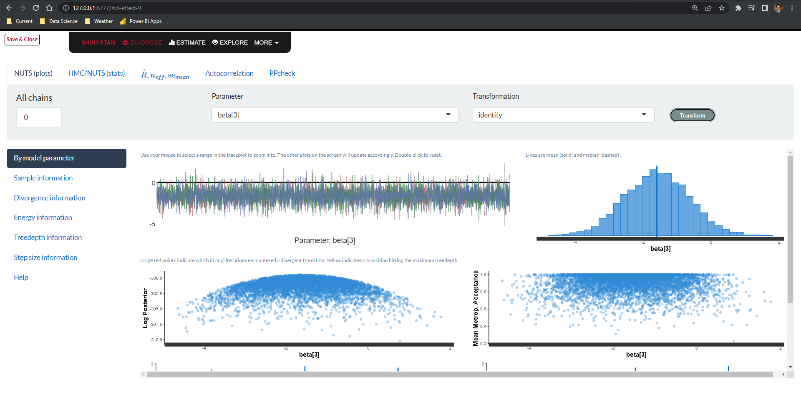
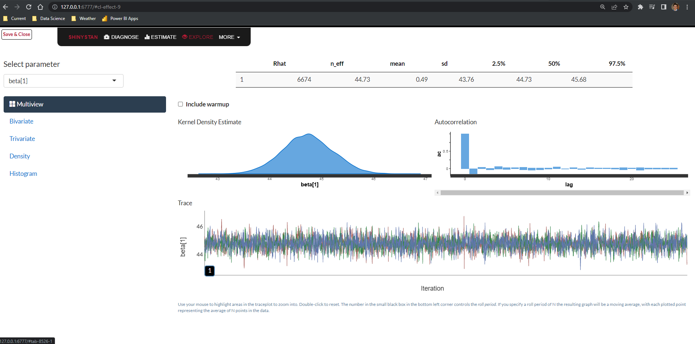

---

```{r setup, include=FALSE}
knitr::opts_chunk$set(echo = TRUE)
```

# Introduction

When conducting Bayesian modeling there is a distinction between the theoretical truth of the expressions used and the ability, given the tools available, to sample from the posterior.

In the case of MLR we have

$$
E(Y) = \eta = X\beta
$$

If the sampler is moving through the space of the $\beta$ parameters ($\beta_0,\beta_1\ldots , \beta_k$) and these are highly correlated then the sampler will jump in small steps and not quickly visit a representative subset of the parameter space.

To get over this we can factor the design matrix $X$ by using the thin QR factorization theorem (as opposed to the "fat" one).


$$X_{n\times (k+1)}=Q_{n\times (k+1)}R_{(k+1)\times (k+1)}$$ Where Q contains orthogonal columns and R is an upper triangular matrix.

To help in the calculation we can define

$$
X = Q^*R^*
$$

where $Q^*=Q \sqrt{n-1}$ and $R^* = R \frac{1}{\sqrt{n-1}}$.

This means that

$$
\eta = X\beta = Q^*R^* \beta = Q^*\theta
$$

where $\theta = R^* \beta$. To estimate $\theta$, however, we do not need to know $\beta$, that is, we will not find $\theta$ from $\beta$ but the reverse. Our regression will be using $\theta$ as the unknown parameters. This will give better sampling characteristics and then we will apply the transformation

$$\beta = (R^*)^{-1}\theta$$

to find the wanted posterior $\beta$ parameters.

## R example

To show you how to the QR factorization works we will use the ddt data set.

First lets make X

```{r}
ddt <- Intro2R::ddt
X <- model.matrix(LENGTH ~ WEIGHT + DDT, ddt)
head(X,2)
```

Now we will use the `qr()` function

```{r}
QR <- qr(X)
Q <- qr.Q(QR)
R <- qr.R(QR)
head(Q)
R

```

Notice that Q has the same dimension as X and has orthogonal columns.

```{r}
dim(X)
dim(Q)
round(t(Q)%*%Q,4)
```

Once we have Q and R we can make $Q^*$ and $R^*$.

We can verify that the factorization is correct

```{r}
head(round(Q%*%R-X,5))
```


## More documentation

Please note that you **MUST** read the following items:

-   <https://mc-stan.org/docs/2_28/stan-users-guide/QR-reparameterization.html>

-   <https://en.wikipedia.org/wiki/QR_decomposition>

[](stanDoc.png)


## A STAN model

Because we wish to carry out a regression in STAN we must use STAN functions.

The basic STAN blocks are **data**, **parameters**, and **model**. We will need extra blocks to carry out our thin QR on the data (**transformed data**) and another block for the transformation of $\theta$ to $\beta$ (**generated quantities**).

## STAN code with extra blocks

Please look at the code below and see how the QR factorization plays out in practice. These tools will really help with making the ampler work more efficiently.


```{r echo=TRUE, message=FALSE, warning=FALSE}
library(rstan)
library(Intro2R)
library(shinystan)


with(ddt, lm(LENGTH ~ SPECIES))->ylm
X <- model.matrix(ylm)# make a design matrix
y <- ddt[,"LENGTH"]


dataslr5 <- list(X = X, y = y, N = length(y),nbetas=dim(X)[2])
```

### `SLR2-Q.stan`

```{stan eval=FALSE, output.var="qmlr"}
data {
  int<lower=0> N;
  int<lower=0> nbetas;
  matrix[N,nbetas] X; // Design matrix
  vector[N] y; // Vector of response values
}

transformed data {
matrix[N, nbetas] Q_ast;
matrix[nbetas, nbetas] R_ast;
matrix[nbetas, nbetas] R_ast_inverse;
// thin and scale the QR decomposition
Q_ast = qr_thin_Q(X) * sqrt(N - 1);
R_ast = qr_thin_R(X) / sqrt(N - 1);
R_ast_inverse = inverse(R_ast);
}


parameters {
  vector[nbetas] theta; // vector of real theta 
  real<lower=0> sigma; // STD
}
model {
  y ~ normal( Q_ast * theta, sigma ); // mvn mean Xbeta
  theta ~ normal(0,100);// mvn 
  sigma ~ gamma(1,1); // univariate
}

generated quantities {
  vector[nbetas] beta;
  beta = R_ast_inverse * theta; // coefficients on x
}
```

```{r fit, eval=FALSE}
options(mc.cores = parallel::detectCores())

fit5 <- stan(file = "SLR2-Q.stan",
             model_name = "Simple Linear Regression matrix Q",
             data = dataslr5,
             chains = 3,
             warmup = 1000,
             iter = 3000,
             pars = c("beta", "sigma")
)

library(shinystan)

afit5 <- as.shinystan(fit5)
shinystan::launch_shinystan(afit5)

```

# Questions

-  Make the above code run and make a screen shot of the posterior histograms of the Diagnostic page, NUTS(Plots) Tab, Parameter: beta[3] all else default. Include the picture in your write up.  





-  Make a screen shot of the Explore page, beta[1], Multiview. Add the picture to your write up

-  Now change the STAN code so that you do not transform the data using the QR transformation. That is the model will use $\beta$ directly. Make copies of the above two pages for the new model.


### `SLR2-Q-1.stan`

```{stan eval=FALSE, output.var="qmlr"}
data {
  int<lower=0> N;   // number of data items
  int<lower=0> K;   // number of predictors
  matrix[N, K] x;   // predictor matrix
  vector[N] y;      // outcome vector
}
transformed data {
  matrix[N, K] Q_ast;
  matrix[K, K] R_ast;
  matrix[K, K] R_ast_inverse;
  // thin and scale the QR decomposition
  Q_ast = qr_thin_Q(x) * sqrt(N - 1);
  R_ast = qr_thin_R(x) / sqrt(N - 1);
  R_ast_inverse = inverse(R_ast);
}
parameters {
  real alpha;           // intercept
  vector[K] theta;      // coefficients on Q_ast
  real<lower=0> sigma;  // error scale
}
model {
  y ~ normal(Q_ast * theta + alpha, sigma);  // likelihood
}
generated quantities {
  vector[K] beta;
  beta = R_ast_inverse * theta; // coefficients on x
}
```

```{r fit2, eval=FALSE}
options(mc.cores = parallel::detectCores())

fit5 <- stan(file = "SLR2-Q-1.stan",
             model_name = "Simple Linear Regression matrix Q 2",
             data = dataslr5,
             chains = 3,
             warmup = 1000,
             iter = 3000,
             pars = c("beta", "sigma")
)

afit6 <- as.shinystan(fit5)
shinystan::launch_shinystan(afit6)

```

Attempted to create model but was unsuccessful since there was little documentation on this.
