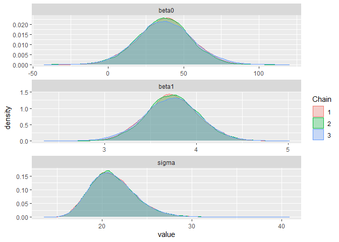
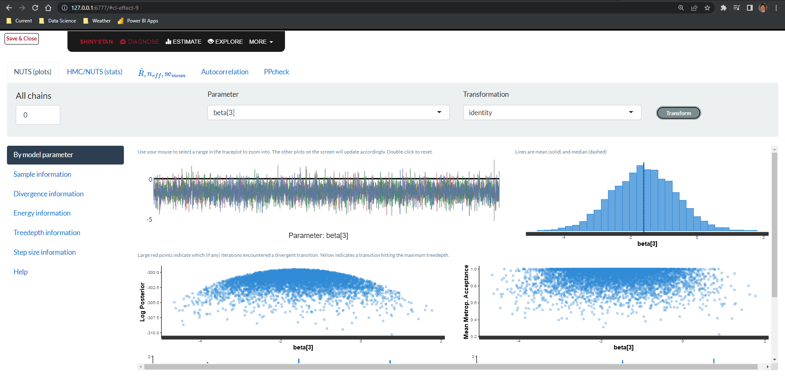

Lab 14: Robust Linear Regression and MCMC
================
Daniel Carpenter
April 2022

-   [MCMC problem](#mcmc-problem)
    -   [Fix](#fix)
    -   [Standardize the variables](#standardize-the-variables)
-   [Task 1](#task-1)
-   [Outliers problem](#outliers-problem)
    -   [Fix](#fix-1)
-   [Task 2](#task-2)
    -   [Make a Jags model that will analyze the following simulated
        data](#make-a-jags-model-that-will-analyze-the-following-simulated-data)
    -   [Make a jags model that will analyze the
        data.](#make-a-jags-model-that-will-analyze-the-data)
    -   [Compare results](#compare-results)
    -   [Summarize what you have
        learnt!!](#summarize-what-you-have-learnt)
-   [QR STAN - Introduction](#qr-stan---introduction)
    -   [R example](#r-example)
    -   [More documentation](#more-documentation)
    -   [A STAN model](#a-stan-model)
    -   [STAN code with extra blocks](#stan-code-with-extra-blocks)
-   [Questions](#questions)

------------------------------------------------------------------------

# MCMC problem

We have learnt a lot about GLM regression. One MCMC problem we may
encounter is strong covariance between parameters. This will cause the
sampler to move slowly through the parameter space and cause strong
autocorrelation for a parameter.

## Fix

One method to fix this is to transform the x and y variables. This may
also help for situations where the size of the x and y metrics are large
for the computer numerics.

## Standardize the variables

Note that

has mean 0 and standard deviation 1.


# Task 1

Prove sample mean of

is 0 and standard deviation is 1.

Sample mean:  

![
E\[Z\]=E\\left\[\\frac{X-\\bar{X}}{S\_{X}}\\right\]=\\frac{1}{S\_{X}}\[E\[X\]-\\bar{X}\]=\\frac{1}{S\_{X}}\[\\bar{X}-\\bar{X}\]=0
](https://latex.codecogs.com/png.image?%5Cdpi%7B110%7D&space;%5Cbg_white&space;%0AE%5BZ%5D%3DE%5Cleft%5B%5Cfrac%7BX-%5Cbar%7BX%7D%7D%7BS_%7BX%7D%7D%5Cright%5D%3D%5Cfrac%7B1%7D%7BS_%7BX%7D%7D%5BE%5BX%5D-%5Cbar%7BX%7D%5D%3D%5Cfrac%7B1%7D%7BS_%7BX%7D%7D%5B%5Cbar%7BX%7D-%5Cbar%7BX%7D%5D%3D0%0A "
E[Z]=E\left[\frac{X-\bar{X}}{S_{X}}\right]=\frac{1}{S_{X}}[E[X]-\bar{X}]=\frac{1}{S_{X}}[\bar{X}-\bar{X}]=0
")

Standard deviation:  

![
\\begin{aligned}
\\operatorname{Var}\\left\[Z^{2}\\right\] &=E\\left\[Z^{2}\\right\]-E^{2}\[Z\] \\\\
&=E\\left\[\\left(\\frac{X-\\bar{X}}{S\_{X}}\\right)^{2}\\right\]-0^{2} \\\\
&=\\frac{1}{S\_{X}^{2}}\\left\[E\\left\[X^{2}\\right\]-2 \\bar{X} E\[X\]+\\bar{X}^{2}\\right\] \\\\
&=\\frac{1}{S\_{X}^{2}}\\left\[\\left\\{E\\left\[X^{2}\\right\]-E^{2}\[X\]\\right\\}+E^{2}\[X\]-2 \\bar{X} E\[X\]+\\bar{X}^{2}\\right\] \\\\
&=\\frac{1}{S\_{X}^{2}}\\left\[\\{\\operatorname{Var}\[X\]\\}+\\bar{X}^{2}-2 \\bar{X}^{2}+\\bar{X}^{2}\\right\] \\\\
&=\\frac{1}{S\_{X}^{2}}\\left\[S\_{X}^{2}+0\\right\] \\\\
&=1
\\end{aligned}
](https://latex.codecogs.com/png.image?%5Cdpi%7B110%7D&space;%5Cbg_white&space;%0A%5Cbegin%7Baligned%7D%0A%5Coperatorname%7BVar%7D%5Cleft%5BZ%5E%7B2%7D%5Cright%5D%20%26%3DE%5Cleft%5BZ%5E%7B2%7D%5Cright%5D-E%5E%7B2%7D%5BZ%5D%20%5C%5C%0A%26%3DE%5Cleft%5B%5Cleft%28%5Cfrac%7BX-%5Cbar%7BX%7D%7D%7BS_%7BX%7D%7D%5Cright%29%5E%7B2%7D%5Cright%5D-0%5E%7B2%7D%20%5C%5C%0A%26%3D%5Cfrac%7B1%7D%7BS_%7BX%7D%5E%7B2%7D%7D%5Cleft%5BE%5Cleft%5BX%5E%7B2%7D%5Cright%5D-2%20%5Cbar%7BX%7D%20E%5BX%5D%2B%5Cbar%7BX%7D%5E%7B2%7D%5Cright%5D%20%5C%5C%0A%26%3D%5Cfrac%7B1%7D%7BS_%7BX%7D%5E%7B2%7D%7D%5Cleft%5B%5Cleft%5C%7BE%5Cleft%5BX%5E%7B2%7D%5Cright%5D-E%5E%7B2%7D%5BX%5D%5Cright%5C%7D%2BE%5E%7B2%7D%5BX%5D-2%20%5Cbar%7BX%7D%20E%5BX%5D%2B%5Cbar%7BX%7D%5E%7B2%7D%5Cright%5D%20%5C%5C%0A%26%3D%5Cfrac%7B1%7D%7BS_%7BX%7D%5E%7B2%7D%7D%5Cleft%5B%5C%7B%5Coperatorname%7BVar%7D%5BX%5D%5C%7D%2B%5Cbar%7BX%7D%5E%7B2%7D-2%20%5Cbar%7BX%7D%5E%7B2%7D%2B%5Cbar%7BX%7D%5E%7B2%7D%5Cright%5D%20%5C%5C%0A%26%3D%5Cfrac%7B1%7D%7BS_%7BX%7D%5E%7B2%7D%7D%5Cleft%5BS_%7BX%7D%5E%7B2%7D%2B0%5Cright%5D%20%5C%5C%0A%26%3D1%0A%5Cend%7Baligned%7D%0A "
\begin{aligned}
\operatorname{Var}\left[Z^{2}\right] &=E\left[Z^{2}\right]-E^{2}[Z] \\
&=E\left[\left(\frac{X-\bar{X}}{S_{X}}\right)^{2}\right]-0^{2} \\
&=\frac{1}{S_{X}^{2}}\left[E\left[X^{2}\right]-2 \bar{X} E[X]+\bar{X}^{2}\right] \\
&=\frac{1}{S_{X}^{2}}\left[\left\{E\left[X^{2}\right]-E^{2}[X]\right\}+E^{2}[X]-2 \bar{X} E[X]+\bar{X}^{2}\right] \\
&=\frac{1}{S_{X}^{2}}\left[\{\operatorname{Var}[X]\}+\bar{X}^{2}-2 \bar{X}^{2}+\bar{X}^{2}\right] \\
&=\frac{1}{S_{X}^{2}}\left[S_{X}^{2}+0\right] \\
&=1
\end{aligned}
")

# Outliers problem

Outliers can be a problem because they may overly influence an analysis
- meaning they might be most responsible for parameter estimates and
dominate the rest of the data in terms of their impact on estimates.

One method to lessen the impact of outliers is to use a distribution on
Y that has large tails.

## Fix

Partial fix: The t-distribution would be a suitable replacement to the
normal.

Read pages 479-487 (Section 17.2)

# Task 2

After reading the above sections do the following:

## Make a Jags model that will analyze the following simulated data

Do this by NOT using a t distribution and NOT using ceneterd variables.
Make sure you diagnose the MCMC

``` r
x = 42:80
set.seed(34) # we will all have the same data
y = 20 + 4*x + rnorm(39,0,20)
xx = 41
yy = 20+4*xx + 60
x = c(xx,x)
y = c(yy, y)
plot(y~x, xlim=range(c(0, x)),ylim=range(c(0,y)))
points(xx,yy,pch=19,cex=3,col="green3")
```

<!-- -->

## Make a jags model that will analyze the data.

See pages 485-486. This time center the data and use a t distribution.
Make sure you diagnose the MCMC. Back transform (transform to original
scale) and then:

### JAGS Model without Overcoming Outlier

``` r
source("DBDA2E-utilities.R") # Must be in R's current working directory.
```

    ## 
    ## *********************************************************************
    ## Kruschke, J. K. (2015). Doing Bayesian Data Analysis, Second Edition:
    ## A Tutorial with R, JAGS, and Stan. Academic Press / Elsevier.
    ## *********************************************************************

``` r
fileNameRoot="JAGS_1/" # For output file names.
dir.create(fileNameRoot)

library(rjags)
Ntotal = length(y)  # Compute the total number of x,y pairs.
dataList = list(    # Put the information into a list.
  x = x,
  y = y ,
  Ntotal = Ntotal 
)

# Define the model:
modelString = "
model{
    for( i in 1 : Ntotal ) {
        y[i] ~ dnorm(mu[i], tau)
        mu[i] <- beta0 + beta1 * x[i]
    }
    beta0 ~ dnorm(0.0, 1.0E-6)
    beta1 ~ dnorm(0.0, 1.0E-6)
    sigma ~ dunif(0, 1000)
    tau <- pow(sigma,  -2)
}
" # close quote for modelString
writeLines( modelString , con="TEMPmodel.txt" )
# Initialize the chains based on MLE of data.
initsList = list(beta0 = 0, beta1 = 0, sigma =10)
# Run the chains:
jagsModel = jags.model( file="TEMPmodel.txt" , data=dataList , inits=initsList , 
                        n.chains=3 , n.adapt=500 )
```

    ## Compiling model graph
    ##    Resolving undeclared variables
    ##    Allocating nodes
    ## Graph information:
    ##    Observed stochastic nodes: 40
    ##    Unobserved stochastic nodes: 3
    ##    Total graph size: 170
    ## 
    ## Initializing model

``` r
update( jagsModel , n.iter=500 )
codaSamples = coda.samples( jagsModel , variable.names=c("beta0", "beta1", "sigma") ,
                            n.iter=33340 )
save( codaSamples , file=paste0(fileNameRoot,"Mcmc.Rdata") )

varName = 'beta0'
diagMCMC( codaObject=codaSamples , parName=varName )
saveGraph( file=paste0(fileNameRoot,varName) , type="png" )
```

<!-- -->

``` r
varName = 'beta1'
diagMCMC( codaObject=codaSamples , parName=varName )
saveGraph( file=paste0(fileNameRoot,varName) , type="png" )
```

<!-- -->

``` r
varName = 'sigma'
diagMCMC( codaObject=codaSamples , parName=varName )
saveGraph( file=paste0(fileNameRoot,varName) , type="png" )
```

<!-- -->

``` r
library(ggmcmc)
s = ggs(codaSamples)
d=ggs_density(s)
print(d)
```

<!-- -->

``` r
cr =  ggs_crosscorrelation(s)
print(cr)
```

<!-- -->

``` r
summary(codaSamples)
```

    ## 
    ## Iterations = 1001:34340
    ## Thinning interval = 1 
    ## Number of chains = 3 
    ## Sample size per chain = 33340 
    ## 
    ## 1. Empirical mean and standard deviation for each variable,
    ##    plus standard error of the mean:
    ## 
    ##         Mean      SD  Naive SE Time-series SE
    ## beta0 37.122 18.1352 0.0573427       0.432755
    ## beta1  3.736  0.2945 0.0009313       0.006994
    ## sigma 21.275  2.5808 0.0081603       0.013329
    ## 
    ## 2. Quantiles for each variable:
    ## 
    ##         2.5%    25%    50%   75%  97.5%
    ## beta0  1.198 25.211 37.207 49.04 72.696
    ## beta1  3.158  3.542  3.734  3.93  4.317
    ## sigma 16.966 19.462 21.016 22.81 27.043

### JAGS Model that Overcomes Outlier

> Overcome outlier by using a distribution with fat tails

``` r
fileNameRoot="JAGS_2/" # For output file names.
dir.create(fileNameRoot)
# Specify the data in a list, for later shipment to JAGS:
dataList = list(
  x = x ,
  y = y 
)
#-----------------------------------------------------------------------------
# THE MODEL.
modelString = "
# Standardize the data:
data {
  Ntotal <- length(y)
  xm <- mean(x)
  ym <- mean(y)
  xsd <- sd(x)
  ysd <- sd(y)
  for ( i in 1:length(y) ) {
    zx[i] <- ( x[i] - xm ) / xsd
    zy[i] <- ( y[i] - ym ) / ysd
  }
}
# Specify the model for standardized data:
model {
  for ( i in 1:Ntotal ) {
    zy[i] ~ dt( zbeta0 + zbeta1 * zx[i] , 1/zsigma^2 , nu )
  }
  # Priors vague on standardized scale:
  zbeta0 ~ dnorm( 0 , 1/(10)^2 )  
  zbeta1 ~ dnorm( 0 , 1/(10)^2 )
  zsigma ~ dunif( 1.0E-3 , 1.0E+3 )
  nu ~ dexp(1/30.0)
  # Transform to original scale:
  beta1 <- zbeta1 * ysd / xsd  
  beta0 <- zbeta0 * ysd  + ym - zbeta1 * xm * ysd / xsd 
  sigma <- zsigma * ysd
}
" # close quote for modelString
# Write out modelString to a text file
writeLines( modelString , con="TEMPmodel.txt" )
#-----------------------------------------------------------------------------
# INTIALIZE THE CHAINS.
# Let JAGS do it...
#-----------------------------------------------------------------------------
# RUN THE CHAINS
parameters = c( "beta0" ,  "beta1" ,  "sigma", 
                "zbeta0" , "zbeta1" , "zsigma", "nu" )

writeLines( modelString , con="TEMPmodel.txt" )

# Run the chains:
jagsModel = jags.model( file="TEMPmodel.txt" , data=dataList , 
                        n.chains=3 , n.adapt=500 )
```

    ## Compiling data graph
    ##    Resolving undeclared variables
    ##    Allocating nodes
    ##    Initializing
    ##    Reading data back into data table
    ## Compiling model graph
    ##    Resolving undeclared variables
    ##    Allocating nodes
    ## Graph information:
    ##    Observed stochastic nodes: 40
    ##    Unobserved stochastic nodes: 4
    ##    Total graph size: 269
    ## 
    ## Initializing model

``` r
update( jagsModel , n.iter=500 )
codaSamples = coda.samples( jagsModel , variable.names=parameters,
                            n.iter=33340 )
save( codaSamples , file=paste0(fileNameRoot,"Mcmc.Rdata") )

varName = 'beta0'
diagMCMC( codaObject=codaSamples , parName=varName )
saveGraph( file=paste0(fileNameRoot,varName) , type="png" )
```

<!-- -->

``` r
varName = 'beta1'
diagMCMC( codaObject=codaSamples , parName=varName )
saveGraph( file=paste0(fileNameRoot,varName) , type="png" )
```

<!-- -->

``` r
varName = 'sigma'
diagMCMC( codaObject=codaSamples , parName=varName )
saveGraph( file=paste0(fileNameRoot,varName) , type="png" )
```

<!-- -->

``` r
library(ggmcmc)
s = ggs(codaSamples)
d=ggs_density(s)
print(d)
```

<!-- -->

``` r
cr =  ggs_crosscorrelation(s)
print(cr)
```

<!-- -->

``` r
summary(codaSamples)
```

    ## 
    ## Iterations = 1001:34340
    ## Thinning interval = 1 
    ## Number of chains = 3 
    ## Sample size per chain = 33340 
    ## 
    ## 1. Empirical mean and standard deviation for each variable,
    ##    plus standard error of the mean:
    ## 
    ##            Mean       SD  Naive SE Time-series SE
    ## beta0  32.68243 18.09559 0.0572176      0.0631490
    ## beta1   3.79968  0.29140 0.0009214      0.0010062
    ## nu     32.89195 29.73153 0.0940099      0.2293294
    ## sigma  19.97364  2.79683 0.0088435      0.0125561
    ## zbeta0 -0.01193  0.06996 0.0002212      0.0002399
    ## zbeta1  0.92042  0.07059 0.0002232      0.0002437
    ## zsigma  0.41387  0.05795 0.0001832      0.0002602
    ## 
    ## 2. Quantiles for each variable:
    ## 
    ##           2.5%      25%      50%      75%    97.5%
    ## beta0  -2.6445 20.56841 32.65371 44.64261  68.5935
    ## beta1   3.2213  3.60692  3.80098  3.99454   4.3677
    ## nu      3.7580 12.04756 23.69106 44.08873 112.6874
    ## sigma  14.8700 18.08777 19.81328 21.69194  25.9364
    ## zbeta0 -0.1483 -0.05848 -0.01201  0.03448   0.1269
    ## zbeta1  0.7803  0.87373  0.92074  0.96762   1.0580
    ## zsigma  0.3081  0.37479  0.41055  0.44948   0.5374

## Compare results

Compared to the first model, the second model differs for

and

by:

-   Use of the T-distribution overcomes the issue with autocorrelation
    drastically
-   The parameter values hover around mean value well

## Summarize what you have learnt!!

-   When you have outlying data, you need to standardize the variables
    so that the outlier does not place too much influence on the
    point-estimates
-   Not doing anything about this will cause a high level of
    autocorrelation
-   By using a distribution with fatter tails (like the t-distribution)
    while standardizing the variables, we can overcome the issue of
    autocorrelation.

# QR STAN - Introduction

When conducting Bayesian modeling there is a distinction between the
theoretical truth of the expressions used and the ability, given the
tools available, to sample from the posterior.

In the case of MLR we have

 = \eta = X\beta
")

If the sampler is moving through the space of the

parameters
()
and these are highly correlated then the sampler will jump in small
steps and not quickly visit a representative subset of the parameter
space.

To get over this we can factor the design matrix

by using the thin QR factorization theorem (as opposed to the “fat”
one).

}=Q_{n\times (k+1)}R_{(k+1)\times (k+1)}")

Where Q contains orthogonal columns and R is an upper triangular matrix.

To help in the calculation we can define


where

and
.

This means that


where
.
To estimate
,
however, we do not need to know
,
that is, we will not find

from

but the reverse. Our regression will be using

as the unknown parameters. This will give better sampling
characteristics and then we will apply the transformation

^{-1}\theta")

to find the wanted posterior

parameters.

## R example

To show you how to the QR factorization works we will use the ddt data
set.

First lets make X

``` r
ddt <- Intro2R::ddt
X <- model.matrix(LENGTH ~ WEIGHT + DDT, ddt)
head(X,2)
```

    ##   (Intercept) WEIGHT DDT
    ## 1           1    732  10
    ## 2           1    795  16

Now we will use the `qr()` function

``` r
QR <- qr(X)
Q <- qr.Q(QR)
R <- qr.R(QR)
head(Q)
```

    ##             [,1]        [,2]         [,3]
    ## [1,] -0.08333333 -0.07055892 -0.013043077
    ## [2,] -0.08333333 -0.05656774 -0.007775982
    ## [3,] -0.08333333 -0.11164413 -0.002481158
    ## [4,] -0.08333333 -0.12985487 -0.004398154
    ## [5,] -0.08333333  0.04492384  0.022335308
    ## [6,] -0.08333333  0.04559009  0.107351709

``` r
R
```

    ##   (Intercept)     WEIGHT        DDT
    ## 1         -12 -12596.583 -292.26000
    ## 2           0   4502.837  -14.00628
    ## 3           0      0.000 1176.35340

Notice that Q has the same dimension as X and has orthogonal columns.

``` r
dim(X)
```

    ## [1] 144   3

``` r
dim(Q)
```

    ## [1] 144   3

``` r
round(t(Q)%*%Q,4)
```

    ##      [,1] [,2] [,3]
    ## [1,]    1    0    0
    ## [2,]    0    1    0
    ## [3,]    0    0    1

Once we have Q and R we can make

and
.

We can verify that the factorization is correct

``` r
head(round(Q%*%R-X,5))
```

    ##      (Intercept) WEIGHT DDT
    ## [1,]           0      0   0
    ## [2,]           0      0   0
    ## [3,]           0      0   0
    ## [4,]           0      0   0
    ## [5,]           0      0   0
    ## [6,]           0      0   0

## More documentation

Please note that you **MUST** read the following items:

-   <https://mc-stan.org/docs/2_28/stan-users-guide/QR-reparameterization.html>

-   <https://en.wikipedia.org/wiki/QR_decomposition>

[](stanDoc.png)

## A STAN model

Because we wish to carry out a regression in STAN we must use STAN
functions.

The basic STAN blocks are **data**, **parameters**, and **model**. We
will need extra blocks to carry out our thin QR on the data
(**transformed data**) and another block for the transformation of

to

(**generated quantities**).

## STAN code with extra blocks

Please look at the code below and see how the QR factorization plays out
in practice. These tools will really help with making the ampler work
more efficiently.

``` r
library(rstan)
library(Intro2R)
library(shinystan)


with(ddt, lm(LENGTH ~ SPECIES))->ylm
X <- model.matrix(ylm)# make a design matrix
y <- ddt[,"LENGTH"]


dataslr5 <- list(X = X, y = y, N = length(y),nbetas=dim(X)[2])
```

### `SLR2-Q.stan`

``` stan
data {
  int<lower=0> N;
  int<lower=0> nbetas;
  matrix[N,nbetas] X; // Design matrix
  vector[N] y; // Vector of response values
}

transformed data {
matrix[N, nbetas] Q_ast;
matrix[nbetas, nbetas] R_ast;
matrix[nbetas, nbetas] R_ast_inverse;
// thin and scale the QR decomposition
Q_ast = qr_thin_Q(X) * sqrt(N - 1);
R_ast = qr_thin_R(X) / sqrt(N - 1);
R_ast_inverse = inverse(R_ast);
}


parameters {
  vector[nbetas] theta; // vector of real theta 
  real<lower=0> sigma; // STD
}
model {
  y ~ normal( Q_ast * theta, sigma ); // mvn mean Xbeta
  theta ~ normal(0,100);// mvn 
  sigma ~ gamma(1,1); // univariate
}

generated quantities {
  vector[nbetas] beta;
  beta = R_ast_inverse * theta; // coefficients on x
}
```

``` r
options(mc.cores = parallel::detectCores())

fit5 <- stan(file = "SLR2-Q.stan",
             model_name = "Simple Linear Regression matrix Q",
             data = dataslr5,
             chains = 3,
             warmup = 1000,
             iter = 3000,
             pars = c("beta", "sigma")
)

library(shinystan)

afit5 <- as.shinystan(fit5)
shinystan::launch_shinystan(afit5)
```

# Questions

-   Make the above code run and make a screen shot of the posterior
    histograms of the Diagnostic page, NUTS(Plots) Tab, Parameter:
    beta\[3\] all else default. Include the picture in your write up.

 

-   Make a screen shot of the Explore page, beta\[1\], Multiview. Add
    the picture to your write up

-   Now change the STAN code so that you do not transform the data using
    the QR transformation. That is the model will use
    
    directly. Make copies of the above two pages for the new model.

### `SLR2-Q-1.stan`

``` stan
data {
  int<lower=0> N;   // number of data items
  int<lower=0> K;   // number of predictors
  matrix[N, K] x;   // predictor matrix
  vector[N] y;      // outcome vector
}
transformed data {
  matrix[N, K] Q_ast;
  matrix[K, K] R_ast;
  matrix[K, K] R_ast_inverse;
  // thin and scale the QR decomposition
  Q_ast = qr_thin_Q(x) * sqrt(N - 1);
  R_ast = qr_thin_R(x) / sqrt(N - 1);
  R_ast_inverse = inverse(R_ast);
}
parameters {
  real alpha;           // intercept
  vector[K] theta;      // coefficients on Q_ast
  real<lower=0> sigma;  // error scale
}
model {
  y ~ normal(Q_ast * theta + alpha, sigma);  // likelihood
}
generated quantities {
  vector[K] beta;
  beta = R_ast_inverse * theta; // coefficients on x
}
```

``` r
options(mc.cores = parallel::detectCores())

fit5 <- stan(file = "SLR2-Q-1.stan",
             model_name = "Simple Linear Regression matrix Q 2",
             data = dataslr5,
             chains = 3,
             warmup = 1000,
             iter = 3000,
             pars = c("beta", "sigma")
)

afit6 <- as.shinystan(fit5)
shinystan::launch_shinystan(afit6)
```

Attempted to create model but was unsuccessful since there was little
documentation on this.
