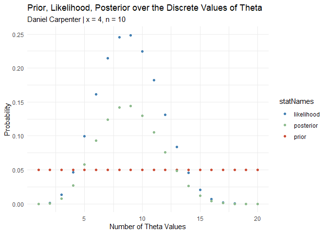
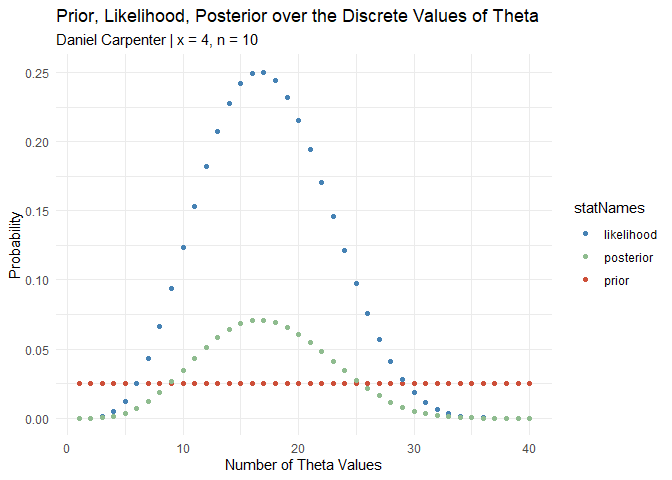
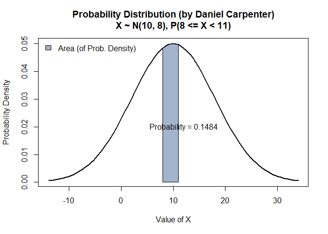
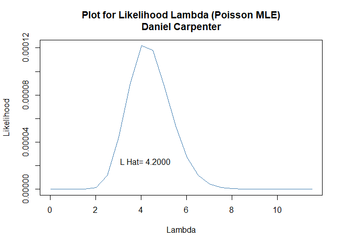
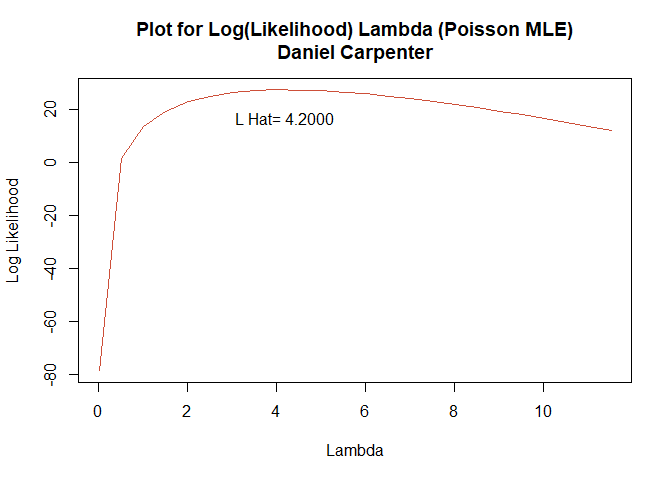
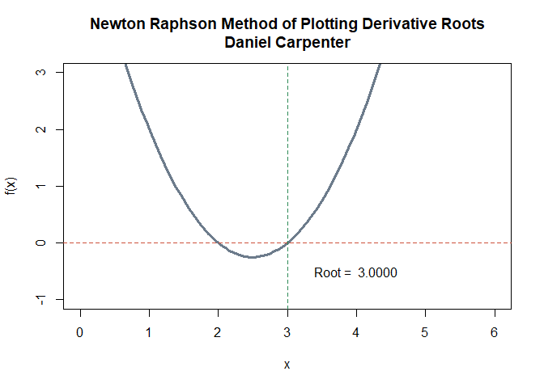
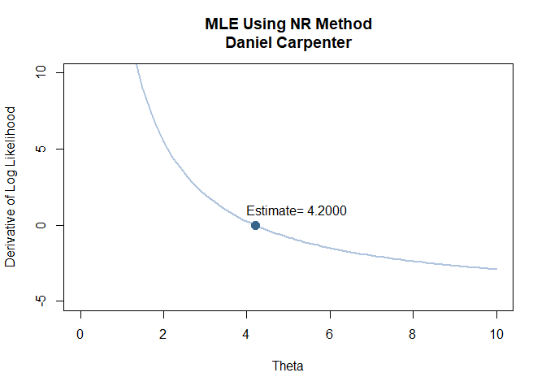

Assignment 1
================
Daniel Carpenter
February 2022

-   [Task `1`: Bayes Box & Pr/Lik/Post Plots
    Function](#task-1-bayes-box--prlikpost-plots-function)
    -   [`a.` Classical Point Estimate for 𝜃 (*Probability of
        Success*)](#a-classical-point-estimate-for-𝜃-probability-of-success)
    -   [`b.` Find classical 95% confidence interval using
        ](#b-find-classical-95-confidence-interval-using-theta)
    -   [`c.` `mycoin()`: Bayes Box and Related
        Data](#c-mycoin-bayes-box-and-related-data)
-   [Task `2`: Variance Proof](#task-2-variance-proof)
-   [Task `3`: MGF Proof](#task-3-mgf-proof)
    -   [`i` Definition of The M.G.F of the Binomial
        Distribution:](#i-definition-of-the-mgf-of-the-binomial-distribution)
    -   [`ii. / iii.` Find the second moment using product
        rule:](#ii--iii-find-the-second-moment-using-product-rule)
-   [Task `4`: Normal Density Function](#task-4-normal-density-function)
    -   [Create Normal Density Function called
        `mynorm()`](#create-normal-density-function-called-mynorm)
    -   [`a.` Call Normal Density Function
        `mynorm()`](#a-call-normal-density-function-mynorm)
-   [Task `5`: Maximum Likelihood Proof and
    Function](#task-5-maximum-likelihood-proof-and-function)
    -   [`5.1.` Find
        
        as a formula](#51-find-hatlambda-as-a-formula)
    -   [`5.2.` Find the second derivative of
        ")
        as a
        formula.](#52-find-the-second-derivative-of-llambda-as-a-formula)
    -   [`5.3/5.4.` Show
        
        is a maximum.](#5354-show-hatlambda-is-a-maximum)
    -   [`5.5.` Make a function called
        `myml(x)`](#55-make-a-function-called-mymlx)
    -   [`5.6.` MLE Does not Account for
        Priors](#56-mle-does-not-account-for-priors)
-   [Task `6`: Un/Biased
    
    Proof](#task-6-unbiased-lambda-proof)
-   [Task `7`: Maximum Likelihood for *Bernoulli*
    Proof](#task-7-maximum-likelihood-for-bernoulli-proof)
-   [Task `8`: Newton Raphson Expression &
    Function](#task-8-newton-raphson-expression--function)
    -   [Newton Rasphson Expression](#newton-rasphson-expression)
    -   [Create `mynr()` Function](#create-mynr-function)
    -   [Call `mynr()` Function](#call-mynr-function)
-   [Task `9`: Maximum Likelihood Using Newton
    Raphson](#task-9-maximum-likelihood-using-newton-raphson)
    -   [Create `mynrml()` Function](#create-mynrml-function)
    -   [Call `mynrml()` Function](#call-mynrml-function)
-   [Task `10`: NR Function without Dervative as
    Parameter](#task-10-nr-function-without-dervative-as-parameter)
    -   [Create `mynrf()` Function](#create-mynrf-function)
    -   [Call `mynrf()` Function](#call-mynrf-function)

------------------------------------------------------------------------

# Task `1`: Bayes Box & Pr/Lik/Post Plots Function

## `a.` Classical Point Estimate for 𝜃 (*Probability of Success*)

``` r
# Function that creates a classical point est
classicalPointEst <- function(n) {
  theta <- seq(0, 1, length = n)
  
  # Point Estimate for Theta
  return(mean(theta))
}

n = 10 # Num Trials
classicalPointEst(n)
```

    ## [1] 0.5

## `b.` Find classical 95% confidence interval using 

``` r
# Function for classical CI est at 95% confidence
classicalConfInt95 <- function(classicalPointEstFun = classicalPointEst, n) {
  # Get the classical point est
  pointEst <- classicalPointEstFun(n)
  
  # Return the classical interval
  return(pointEst + c(-1, 1) * 1.95 * sqrt(pointEst*(1 - pointEst) / n))
}
  
classicalConfInt95(classicalPointEst, n)
```

    ## [1] 0.1916779 0.8083221

## `c.` `mycoin()`: Bayes Box and Related Data

### Create the function `mycoin()`

``` r
mycoin <- mybinpost <- function(n, x, p, prior, alpha) {
  
  # CALCULATIONS -------------------------------------------
    
    ## Get the length of p
    numRows <- length(p)
  
    ## Calculate the likelihood
    likelihood  = dbinom(x=x, size=n, prob=p)
    
    ## Calculate the Prior x the Likelihood
    h <-  prior * likelihood
    
    ## Get the posterior Distribution
    posterior = h / sum(h) 
    
    ## Consolidate into a matrix with row and column names
    bayesMatrix <- matrix(c(p, prior, likelihood, h, posterior), 
                        nr = numRows, nc = 5, byrow = FALSE)
    colnames(bayesMatrix) <- c("p", "prior", "likelihood", "h", "posterior")
    rownames(bayesMatrix)= c(rep("", numRows))
    rbind(bayesMatrix, colSums(bayesMatrix)) # Column totals

        
  # PLOTTING -----------------------------------------------
    
    ## Define some colors for the later plots
      red   = 'tomato3'
      blue  = 'steelblue'
      green = 'darkseagreen'
      colorPalette <- c(blue, green, red) # Consolidate in color palette
    
    ## Number of Theta numbers to plot
    thetaNumericValues = 1:numRows
    
    ## Convert to data frame for ggplot
    df <- as.data.frame(cbind(bayesMatrix, thetaNumericValues))
    
    
    if(!require(tidyverse)) install.packages(tidyverse)
    df <- df %>%
      
      ### Select to only the needed data
      select(-h) %>%
      
      ### Pivot y axis variables into single column for ggplot-ing
      pivot_longer(cols      = c("prior", "likelihood", "posterior"),
                   values_to = "values",
                   names_to  = "statNames")
    
    ## Plot it!
    basePlot <- ggplot(df,
                       aes(x = thetaNumericValues,
                           y = values,
                           color = statNames)) +
      ### Theme and colors
      theme_minimal() +
      scale_color_manual(values = colorPalette) +
      
      ### Labels
      labs(title = "Prior, Likelihood, Posterior over the Discrete Values of Theta",
           subtitle = paste0("Daniel Carpenter | x = ", x, ", n = ", n),
           x = 'Number of Theta Values', y = 'Probability')+ 
      
      ### Create the points
      geom_point()
    
    # Output Plot
    print(basePlot)
    
    
  # BCI & Point Est ------------------------------------------
    
    ## BCI
    cp = cumsum(posterior) # cumulative sum
    L = max(which(cp<alpha/2)) # this gives the max index where  cp < alpha/2
    U = min(which(cp > 1-alpha/2))
    BCI = df$p[c(L,U)] # close to the desired BCI
    
    ## Bayesian point estimate is the posterior mean
    bayesPointEst <- mean(posterior)
    
    
  # CLasical Point Est and Interval 95% CI ----------------
      classicalPointEstimate <- classicalPointEst(n)    
      cCI95 <- classicalConfInt95(classicalPointEst, n)

          
  # RETURN DATA ---------------------------------------------
      
    # Create a folder for the Output to stay organized
    outputFolder <- 'Output/'
    dir.create(outputFolder)
    
    # Create the folder for this task
    task1Folder  <- paste0(outputFolder, 'Task_01/')
    dir.create(task1Folder)
    print(paste0('Please find the Output Files located at ', task1Folder))
    
    ## File name for writing data to current wd
    nameOfFile <- paste("", sum(p),sum(prior),n,x,alpha, sep = "_") # Used this name since unique identifier
    
    ## Write a CSV  
    write.csv(x = as.data.frame(bayesMatrix), 
              file = paste0(task1Folder, "BayesBox", nameOfFile, ".csv"))
      
    ## Write above plot to jpg
    ggsave(filename = paste0(task1Folder, "BayesPlot", nameOfFile, ".jpg"),
           plot     = basePlot,
           height   = 8.5,
           width    = 11)
    
    ## Used for latex output of a matrix
    if(!require(xtable)) install.packages(xtable)
    
    ## Return a list of relevant data
    return(list('bayesMatrix'      = bayesMatrix,
                'bayesPointEst'    = bayesPointEst,
                'bayesCredIntvl95' = BCI,
                'classicalPEst'    = classicalPointEstimate,
                'classicalCI95'    = cCI95))
}
```

### Call the function `mycoin()` with 3 sets of inputs

``` r
mycoin(p = seq(0,1,length=20), prior =rep(1/20, 20), n=10, x=4, alpha = 0.05)
```

    ## [1] "Please find the Output Files located at Output/Task_01/"

<!-- -->

    ## $bayesMatrix
    ##           p prior   likelihood            h    posterior
    ##  0.00000000  0.05 0.000000e+00 0.000000e+00 0.000000e+00
    ##  0.05263158  0.05 1.164980e-03 5.824898e-05 6.744611e-04
    ##  0.10526316  0.05 1.322808e-02 6.614040e-04 7.658353e-03
    ##  0.15789474  0.05 4.654663e-02 2.327331e-03 2.694802e-02
    ##  0.21052632  0.05 9.987822e-02 4.993911e-03 5.782417e-02
    ##  0.26315789  0.05 1.611876e-01 8.059378e-03 9.331900e-02
    ##  0.31578947  0.05 2.142636e-01 1.071318e-02 1.240472e-01
    ##  0.36842105  0.05 2.455630e-01 1.227815e-02 1.421679e-01
    ##  0.42105263  0.05 2.485417e-01 1.242709e-02 1.438924e-01
    ##  0.47368421  0.05 2.247260e-01 1.123630e-02 1.301044e-01
    ##  0.52631579  0.05 1.820281e-01 9.101403e-03 1.053845e-01
    ##  0.57894737  0.05 1.314601e-01 6.573005e-03 7.610839e-02
    ##  0.63157895  0.05 8.355963e-02 4.177982e-03 4.837657e-02
    ##  0.68421053  0.05 4.564195e-02 2.282098e-03 2.642426e-02
    ##  0.73684211  0.05 2.055964e-02 1.027982e-03 1.190293e-02
    ##  0.78947368  0.05 7.102451e-03 3.551226e-04 4.111941e-03
    ##  0.84210526  0.05 1.636405e-03 8.182024e-05 9.473912e-04
    ##  0.89473684  0.05 1.830876e-04 9.154380e-06 1.059980e-04
    ##  0.94736842  0.05 3.595616e-06 1.797808e-07 2.081670e-06
    ##  1.00000000  0.05 0.000000e+00 0.000000e+00 0.000000e+00
    ## 
    ## $bayesPointEst
    ## [1] 0.05
    ## 
    ## $bayesCredIntvl95
    ## [1] 0.0000000 0.2105263
    ## 
    ## $classicalPEst
    ## [1] 0.5
    ## 
    ## $classicalCI95
    ## [1] 0.1916779 0.8083221

``` r
mycoin(p = seq(0,1,length=40), prior =rep(1/40, 40), n=10, x=4, alpha = 0.05)
```

    ## [1] "Please find the Output Files located at Output/Task_01/"

<!-- -->

    ## $bayesMatrix
    ##           p prior   likelihood            h    posterior
    ##  0.00000000 0.025 0.000000e+00 0.000000e+00 0.000000e+00
    ##  0.02564103 0.025 7.767385e-05 1.941846e-06 2.190801e-05
    ##  0.05128205 0.025 1.059019e-03 2.647546e-05 2.986975e-04
    ##  0.07692308 0.025 4.548553e-03 1.137138e-04 1.282925e-03
    ##  0.10256410 0.025 1.214008e-02 3.035019e-04 3.424124e-03
    ##  0.12820513 0.025 2.490731e-02 6.226826e-04 7.025137e-03
    ##  0.15384615 0.025 4.317793e-02 1.079448e-03 1.217839e-02
    ##  0.17948718 0.025 6.650668e-02 1.662667e-03 1.875829e-02
    ##  0.20512821 0.025 9.377851e-02 2.344463e-03 2.645035e-02
    ##  0.23076923 0.025 1.233874e-01 3.084685e-03 3.480157e-02
    ##  0.25641026 0.025 1.534480e-01 3.836200e-03 4.328020e-02
    ##  0.28205128 0.025 1.820087e-01 4.550218e-03 5.133579e-02
    ##  0.30769231 0.025 2.072434e-01 5.181086e-03 5.845328e-02
    ##  0.33333333 0.025 2.276076e-01 5.690190e-03 6.419701e-02
    ##  0.35897436 0.025 2.419499e-01 6.048747e-03 6.824227e-02
    ##  0.38461538 0.025 2.495777e-01 6.239442e-03 7.039370e-02
    ##  0.41025641 0.025 2.502766e-01 6.256914e-03 7.059082e-02
    ##  0.43589744 0.025 2.442896e-01 6.107240e-03 6.890220e-02
    ##  0.46153846 0.025 2.322625e-01 5.806561e-03 6.550992e-02
    ##  0.48717949 0.025 2.151630e-01 5.379075e-03 6.068700e-02
    ##  0.51282051 0.025 1.941846e-01 4.854615e-03 5.477002e-02
    ##  0.53846154 0.025 1.706418e-01 4.266045e-03 4.812974e-02
    ##  0.56410256 0.025 1.458671e-01 3.646679e-03 4.114201e-02
    ##  0.58974359 0.025 1.211168e-01 3.027921e-03 3.416115e-02
    ##  0.61538462 0.025 9.749127e-02 2.437282e-03 2.749754e-02
    ##  0.64102564 0.025 7.587548e-02 1.896887e-03 2.140078e-02
    ##  0.66666667 0.025 5.690190e-02 1.422547e-03 1.604925e-02
    ##  0.69230769 0.025 4.093698e-02 1.023424e-03 1.154633e-02
    ##  0.71794872 0.025 2.809063e-02 7.022657e-04 7.922998e-03
    ##  0.74358974 0.025 1.824590e-02 4.561474e-04 5.146279e-03
    ##  0.76923077 0.025 1.110487e-02 2.776216e-04 3.132141e-03
    ##  0.79487179 0.025 6.245395e-03 1.561349e-04 1.761522e-03
    ##  0.82051282 0.025 3.182448e-03 7.956121e-05 8.976137e-04
    ##  0.84615385 0.025 1.427370e-03 3.568424e-05 4.025915e-04
    ##  0.87179487 0.025 5.386528e-04 1.346632e-05 1.519277e-04
    ##  0.89743590 0.025 1.585643e-04 3.964107e-06 4.472326e-05
    ##  0.92307692 0.025 3.158717e-05 7.896793e-07 8.909202e-06
    ##  0.94871795 0.025 3.094283e-06 7.735709e-08 8.727466e-07
    ##  0.97435897 0.025 5.379075e-08 1.344769e-09 1.517175e-08
    ##  1.00000000 0.025 0.000000e+00 0.000000e+00 0.000000e+00
    ## 
    ## $bayesPointEst
    ## [1] 0.025
    ## 
    ## $bayesCredIntvl95
    ## [1] 0.05128205 0.23076923
    ## 
    ## $classicalPEst
    ## [1] 0.5
    ## 
    ## $classicalCI95
    ## [1] 0.1916779 0.8083221

``` r
mycoin(p = seq(0,1,length=20), prior =rep(1/20, 20), n=10, x=4, alpha = 0.1)
```

    ## [1] "Please find the Output Files located at Output/Task_01/"

<!-- -->

    ## $bayesMatrix
    ##           p prior   likelihood            h    posterior
    ##  0.00000000  0.05 0.000000e+00 0.000000e+00 0.000000e+00
    ##  0.05263158  0.05 1.164980e-03 5.824898e-05 6.744611e-04
    ##  0.10526316  0.05 1.322808e-02 6.614040e-04 7.658353e-03
    ##  0.15789474  0.05 4.654663e-02 2.327331e-03 2.694802e-02
    ##  0.21052632  0.05 9.987822e-02 4.993911e-03 5.782417e-02
    ##  0.26315789  0.05 1.611876e-01 8.059378e-03 9.331900e-02
    ##  0.31578947  0.05 2.142636e-01 1.071318e-02 1.240472e-01
    ##  0.36842105  0.05 2.455630e-01 1.227815e-02 1.421679e-01
    ##  0.42105263  0.05 2.485417e-01 1.242709e-02 1.438924e-01
    ##  0.47368421  0.05 2.247260e-01 1.123630e-02 1.301044e-01
    ##  0.52631579  0.05 1.820281e-01 9.101403e-03 1.053845e-01
    ##  0.57894737  0.05 1.314601e-01 6.573005e-03 7.610839e-02
    ##  0.63157895  0.05 8.355963e-02 4.177982e-03 4.837657e-02
    ##  0.68421053  0.05 4.564195e-02 2.282098e-03 2.642426e-02
    ##  0.73684211  0.05 2.055964e-02 1.027982e-03 1.190293e-02
    ##  0.78947368  0.05 7.102451e-03 3.551226e-04 4.111941e-03
    ##  0.84210526  0.05 1.636405e-03 8.182024e-05 9.473912e-04
    ##  0.89473684  0.05 1.830876e-04 9.154380e-06 1.059980e-04
    ##  0.94736842  0.05 3.595616e-06 1.797808e-07 2.081670e-06
    ##  1.00000000  0.05 0.000000e+00 0.000000e+00 0.000000e+00
    ## 
    ## $bayesPointEst
    ## [1] 0.05
    ## 
    ## $bayesCredIntvl95
    ## [1] 0.05263158 0.21052632
    ## 
    ## $classicalPEst
    ## [1] 0.5
    ## 
    ## $classicalCI95
    ## [1] 0.1916779 0.8083221

``` r
# Assume Prior equaling the length of the p
pr =rep(1/40, 40)
mycoin(p = seq(0,1,length=40), prior = pr, n =10, x=4, alpha=0.05)
```

    ## [1] "Please find the Output Files located at Output/Task_01/"

<!-- -->

    ## $bayesMatrix
    ##           p prior   likelihood            h    posterior
    ##  0.00000000 0.025 0.000000e+00 0.000000e+00 0.000000e+00
    ##  0.02564103 0.025 7.767385e-05 1.941846e-06 2.190801e-05
    ##  0.05128205 0.025 1.059019e-03 2.647546e-05 2.986975e-04
    ##  0.07692308 0.025 4.548553e-03 1.137138e-04 1.282925e-03
    ##  0.10256410 0.025 1.214008e-02 3.035019e-04 3.424124e-03
    ##  0.12820513 0.025 2.490731e-02 6.226826e-04 7.025137e-03
    ##  0.15384615 0.025 4.317793e-02 1.079448e-03 1.217839e-02
    ##  0.17948718 0.025 6.650668e-02 1.662667e-03 1.875829e-02
    ##  0.20512821 0.025 9.377851e-02 2.344463e-03 2.645035e-02
    ##  0.23076923 0.025 1.233874e-01 3.084685e-03 3.480157e-02
    ##  0.25641026 0.025 1.534480e-01 3.836200e-03 4.328020e-02
    ##  0.28205128 0.025 1.820087e-01 4.550218e-03 5.133579e-02
    ##  0.30769231 0.025 2.072434e-01 5.181086e-03 5.845328e-02
    ##  0.33333333 0.025 2.276076e-01 5.690190e-03 6.419701e-02
    ##  0.35897436 0.025 2.419499e-01 6.048747e-03 6.824227e-02
    ##  0.38461538 0.025 2.495777e-01 6.239442e-03 7.039370e-02
    ##  0.41025641 0.025 2.502766e-01 6.256914e-03 7.059082e-02
    ##  0.43589744 0.025 2.442896e-01 6.107240e-03 6.890220e-02
    ##  0.46153846 0.025 2.322625e-01 5.806561e-03 6.550992e-02
    ##  0.48717949 0.025 2.151630e-01 5.379075e-03 6.068700e-02
    ##  0.51282051 0.025 1.941846e-01 4.854615e-03 5.477002e-02
    ##  0.53846154 0.025 1.706418e-01 4.266045e-03 4.812974e-02
    ##  0.56410256 0.025 1.458671e-01 3.646679e-03 4.114201e-02
    ##  0.58974359 0.025 1.211168e-01 3.027921e-03 3.416115e-02
    ##  0.61538462 0.025 9.749127e-02 2.437282e-03 2.749754e-02
    ##  0.64102564 0.025 7.587548e-02 1.896887e-03 2.140078e-02
    ##  0.66666667 0.025 5.690190e-02 1.422547e-03 1.604925e-02
    ##  0.69230769 0.025 4.093698e-02 1.023424e-03 1.154633e-02
    ##  0.71794872 0.025 2.809063e-02 7.022657e-04 7.922998e-03
    ##  0.74358974 0.025 1.824590e-02 4.561474e-04 5.146279e-03
    ##  0.76923077 0.025 1.110487e-02 2.776216e-04 3.132141e-03
    ##  0.79487179 0.025 6.245395e-03 1.561349e-04 1.761522e-03
    ##  0.82051282 0.025 3.182448e-03 7.956121e-05 8.976137e-04
    ##  0.84615385 0.025 1.427370e-03 3.568424e-05 4.025915e-04
    ##  0.87179487 0.025 5.386528e-04 1.346632e-05 1.519277e-04
    ##  0.89743590 0.025 1.585643e-04 3.964107e-06 4.472326e-05
    ##  0.92307692 0.025 3.158717e-05 7.896793e-07 8.909202e-06
    ##  0.94871795 0.025 3.094283e-06 7.735709e-08 8.727466e-07
    ##  0.97435897 0.025 5.379075e-08 1.344769e-09 1.517175e-08
    ##  1.00000000 0.025 0.000000e+00 0.000000e+00 0.000000e+00
    ## 
    ## $bayesPointEst
    ## [1] 0.025
    ## 
    ## $bayesCredIntvl95
    ## [1] 0.05128205 0.23076923
    ## 
    ## $classicalPEst
    ## [1] 0.5
    ## 
    ## $classicalCI95
    ## [1] 0.1916779 0.8083221

------------------------------------------------------------------------

<br>

# Task `2`: Variance Proof

> *THIS SHOWS AN EXAMPLE, SEE PART `ii/iii` OF `TASK 3` FOR FINAL PROOF
> OF
> ")*

**Inputs**

``` r
n = 1000  # Intervals
p = 0.5   # Probability
```

**Variance using raw Definition**
 = \frac{E(X - \mu)^2}{n}")

``` r
varMethod1 <- function(n, p) {
  # Calculate the binomial distribution using parameters n, p, and q
  mu = n * p
  X  = pbinom(q=1-p, size=n, prob=p)
  
  # Calculate the variance of X using above formula 
  variance = (X - mu)^2 / n
  return(format(round(variance, 1), nsmall=1))
}

varMethod1(n, p)
```

    ## [1] "250.0"

**Verify**

**is the above variance**

``` r
varMethod2 <- function(n, p) {
  # Calculate q
  q = 1 - p
  
  # Calculate the variance
  variance2 <- n*p*q
  return(variance2)
}

varMethod2(n, p)
```

    ## [1] 250

------------------------------------------------------------------------

<br>

# Task `3`: MGF Proof

## `i` Definition of The M.G.F of the Binomial Distribution:

=\frac{n !}{x !(n-x) !} p^{x} q^{n-x} \quad \text { with } \quad q=1-p .
")

MGF Given by:

 &=\sum_{x=0}^{n} e^{x t} \frac{n !}{x !(n-x) !} p^{x} q^{n-x} \\
&=\sum_{x=0}^{n} \frac{n !}{x !(n-x) !}\left(p e^{t}\right)^{x} q^{n-x} \\
&=\left(p e^{t}+q\right)^{n}
\end{aligned}
")

Differentiate the MGF with respect to

using the function-of-a-function rule:

}{d t} &=n\left(q+p e^{t}\right)^{n-1} p e^{t} \\
&=n p e^{t}\left(p e^{t}+q\right)^{n-1}
\end{aligned}
")

Now use

to get
")

=n p(p+q)^{n-1}=n p .
")

## `ii. / iii.` Find the second moment using product rule:


}{d t^{2}} &=n p e^{t}\left\{(n-1)\left(p e^{t}+q\right)^{n-2} p e^{t}\right\}+\left(p e^{t}+q\right)^{n-1}\left\{n p e^{t}\right\} \\
&=n p e^{t}\left(p e^{t}+q\right)^{n-2}\left\{(n-1) p e^{t}+\left(p e^{t}+q\right)\right\} \\
&=n p e^{t}\left(p e^{t}+q\right)^{n-2}\left\{q+n p e^{t}\right\} .
\end{aligned}
")

Use

again:

 &=n p(p+q)^{n-2}(n p+q) \\
&=n p(n p+q)
\end{aligned}
")

**Finally we now have derived
=E(X-\mu)^{2}")
(`i`) AND that the variance of

is

where

(`ii.`).**

 &=E\left(x^{2}\right)-\{E(x)\}^{2} \\
&=n p(n p+q)-n^{2} p^{2} \\
&=n p q
\end{aligned}
")

------------------------------------------------------------------------

<br>

# Task `4`: Normal Density Function

## Create Normal Density Function called `mynorm()`

``` r
    mynorm <- function(mu, sigma, 
                       lowerBound = NA, upperBound = NA, 
                       alpha,
                       roundTo = 4, 
                       color = paste0("lightsteelblue", floor(runif(1, min=1, max=4))),
                       returnCMD = TRUE)
    {
      
      # Calculate the "xlim" lower and upper bound for the Normal PDF Curve
      curveLowerBound <- mu - 3*sigma
      curveUpperBound <- mu + 3*sigma
      
      # Initialize variables related to output and graph
      title <- ""   # Title of graph
      exactProb = 0 # The exact probability of the questions
      
      # If no provided LOWER AND UPPER Bound (NA as parameter value) then assume none
      if (!(is.na(lowerBound)) & !(is.na(upperBound))) {
        title <- paste0(", P(", lowerBound, " <= X < ",upperBound,")")
        exactProb = pnorm(upperBound, mu, sigma) - pnorm(lowerBound, mu, sigma) # calculate prob 
        
      # If no provided LOWER Bound (NA as parameter value) then assume none
      } else if (is.na(lowerBound)) {
        lowerBound = curveLowerBound
        title <- paste0(", P(X < ",upperBound,")") # Set a dynamic title
        exactProb = pnorm(upperBound, mu, sigma) # calculate prob 
        
      # If no provided UPPER Bound (NA as parameter value) then assume none
      } else if(is.na(upperBound)) {
        upperBound = curveUpperBound
        title <- paste0(", P(X >= ",lowerBound,")")
        exactProb = 1 - pnorm(lowerBound, mu, sigma) # calculate prob 
      }
      
      # Create the line that displays the bell curve (between the CURVE bounds defined above)
      curve(
        
        ## Normally Distributed
        dnorm(x,mu,sigma), 
        
        ## Normally Distributed
        xlim=c(curveLowerBound, curveUpperBound), 
        
        ## Line width
        lwd =2, 
        
        ## Title with descriptive characteristics about function parameters
        main = paste0("Probability Distribution (by Daniel Carpenter)\n",
                      "X ~ N(",mu,", ",sigma,")", title),
        
        ## X and Y labels
        ylab = 'Probability Density',
        xlab = 'Value of X',
      )

      
      # Add the AREA of between the lower and upper bound P(lowerBound<X<=upperBound)
      
        ## X-Axis curve (length does not matter)
        xcurve = seq(lowerBound,upperBound, length=1000)
        
        ## Y-Axis Curve
        ycurve = dnorm(xcurve, mu,sigma)
        
        ## Combine the X and Y curve to form the area (in green)
        polygon(c(lowerBound, xcurve, upperBound), 
                c(0, ycurve, 0), 
                col=color) 
        
        ## Legend
        legend("topleft", legend="Area (of Prob. Density)", 
               fill=color, bty = "n")
      
      # Add the probability as text
        
        ## Calculate the area (probability)
        area = exactProb
        areaRounded = format(round(area, roundTo), nsmall=roundTo)
        
        ## Place this on the above plot
        text(12,0.02,substitute(paste("Probability = ", areaRounded), 
                                list(areaRounded = areaRounded)))
        
      # Quantiles
        
        ## Alpha (Lower Tail)
        lowerTail = qnorm(p = alpha / 2, 
                          mean = mu, sd = sigma,
                          lower.tail = TRUE)
        
        ## 1 minus alpha (upper tail)
        upperTail = qnorm(p = alpha / 2, 
                          mean = mu, sd = sigma,
                          lower.tail = FALSE)
        
      # Return stats about the Plot
      if (returnCMD) {
        return(list(shadedArea = areaRounded,
                    lowerTail = lowerTail,
                    upperTail = upperTail))
      }
    }
```

## `a.` Call Normal Density Function `mynorm()`

``` r
mynorm(mu=10, sigma=8, 
       lowerBound = 8, upperBound = 11,
       alpha = 0.10)
```

<!-- -->

    ## $shadedArea
    ## [1] "0.1484"
    ## 
    ## $lowerTail
    ## [1] -3.158829
    ## 
    ## $upperTail
    ## [1] 23.15883

------------------------------------------------------------------------

<br>

# Task `5`: Maximum Likelihood Proof and Function

## `5.1.` Find  as a formula

-   Do this by first finding the likelihood function which is shown as
    ")

    =\prod_{i=1}^{n} f_{X}\left(x_{i} ; \lambda\right)=\prod_{i=1}^{n}\left\{\frac{\lambda^{x_{i}}}{x_{i} !} e^{-\lambda}\right\}=\frac{\lambda^{x_{1}+\ldots+x_{n}}}{x_{1} ! \ldots x_{n} !} e^{-n \lambda}
    ")

## `5.2.` Find the second derivative of ") as a formula.

### `5.2.1`: get ")

=\sum_{i=1}^{n} x_{i} \log \lambda-n \lambda-\sum_{i=1}^{n} \log \left(x_{i} !\right)
")

### `5.2.1`: Second derivative of ")

\}
=\sum_{i=1}^{n} \frac{x_{i}}{\lambda}-n=
0 \\ \text{so,}  \ \widehat{\lambda}=\frac{1}{n} 
\sum_{i=1}^{n} x_{i}=\bar{x}
")

## `5.3/5.4.` Show  is a maximum.

-   To check for the maximum, set
    
    when in above derivation.
-   Then check to see if negative

\}
=-\frac{1}{\lambda^{2}} \sum_{i=1}^{n} x_{i}<0 \quad 
\text {where} \ \lambda=\widehat{\lambda}
")

## `5.5.` Make a function called `myml(x)`

-   Draws the graph of 𝐿(𝜆) and 𝑙(𝜆) with the x = vector of data

``` r
myml = function(x) {
  
  # Create lambda vector as a set of values ranging from 0 to 2*max(x)
  lambda=seq(.01,2*max(x),0.5)
  
  # Calculate Poisson MLE
  lambdahat = sum(x)/length(x)
  
  #the likelihood function
  lik <- exp(-length(x)* lambda)*(lambda^sum(x))/prod(factorial(x))
  
  #the loglikelihood function
  loglik <- -length(x)* lambda+sum(x)*log(lambda)+log(prod(factorial(x)))
  
  # Plot the likelihood
  plot(lambda, lik,    
       col = 'steelblue', type = 'l', 
       main = 'Plot for Likelihood Lambda (Poisson MLE)\nDaniel Carpenter',
       xlab = 'Lambda', ylab = 'Likelihood')
  text(x=lambdahat, y=mean(lik), paste('L Hat=',format(round(lambdahat, 4), nsmall=4)))
  
  # Plot the loglikelihood
  plot(lambda, loglik,
       col = 'tomato3', type = 'l', 
       main = 'Plot for Log(Likelihood) Lambda (Poisson MLE)\nDaniel Carpenter',
       xlab = 'Lambda', ylab = 'Log Likelihood')
  text(x=lambdahat, y=mean(loglik), paste('L Hat=',format(round(lambdahat, 4), nsmall=4)))
  
  return(list(lambdahat = lambdahat))
}
```

> Give the output of your function when x = {3,4,3,5,6}.

``` r
x = c(3,4,3,5,6)
myml(x)
```

<!-- --><!-- -->

    ## $lambdahat
    ## [1] 4.2

## `5.6.` MLE Does not Account for Priors

The maximum likelihood estimate does not account for prior information.
We know the prior times the likelihood forms the posterior, which the
M.L. Estimate only uses the likelihood.

------------------------------------------------------------------------

<br>

# Task `6`: Un/Biased  Proof

Prove whether

by proving
 = \lambda"),
for a random variable

∼
"),
 = \lambda")

 &=\sum_{y=0}^{\infty} y \frac{e^{-\lambda} \lambda^{y}}{y !} \\
&=\sum_{y=1}^{\infty} y \frac{e^{-\lambda} \lambda^{y}}{y !} \\
&=\sum_{y=1}^{\infty} \frac{e^{-\lambda} \lambda^{y}}{(y-1) !} \\
&=\lambda e^{-\lambda} \sum_{y=1}^{\infty} \frac{\lambda^{y-1}}{(y-1) !} \\
&=\lambda e^{-\lambda} \sum_{y=0}^{\infty} \frac{\lambda^{y}}{y !} \\
&=\lambda e^{-\lambda} e^{\lambda} \\
&=\lambda
\end{aligned}
")

Therefore,
 = \lambda"),
which indicates that

is not biased.

------------------------------------------------------------------------

<br>

# Task `7`: Maximum Likelihood for *Bernoulli* Proof

Consider

Bernoulli trials with

successes.

=\left(\begin{array}{l}
n \\
X
\end{array}\right) \theta^{X}(1-\theta)^{n-X}
")

Compute the likelihood:
")

=\left(\begin{array}{l}
n \\
X
\end{array}\right) \theta^{X}(1-\theta)^{n-X}
")

Find the log(liklihood):

=\log \left\{\left(\begin{array}{l}
n \\
x
\end{array}\right)\right\}+x \log (\theta)+(n-x) \log (1-\theta)
")

Then, Find the derivative of log(likelihood)

=\frac{x}{\theta}-\frac{n-x}{1-\theta}
")

Set log(likelihood) to


is the candidate. Now take the second derivative:

=-\frac{x}{\theta^{2}}-\frac{n-x}{(1-\theta)^{2}}
")

Above is is always less than 0. Therefore

is the maximum likelihood estimator for
.

------------------------------------------------------------------------

<br>

# Task `8`: Newton Raphson Expression & Function

> Estimate the root of a function and graphs it

## Newton Rasphson Expression

}{f^{\prime}\left(x_{n}\right)}
")

## Create `mynr()` Function

``` r
mynr <- function(f, fdash, x0,
                 tol = 1e-5, n = 1000,
                 dec = 4) 
{
  
  # ROOT CALCULATIONS ---------------------------------------------------------
  
  # Check the initial guess is correct
  fa <- f(x0)
  if (fa == 0.0) {
    approxRoot <- x0
  } else {   # If not the guess, then solve
    for (i in 1:n) {
      x1 <- x0 - (f(x0) / fdash) # Calculate next value x1
      n[i] <- x1 # Store x1
      
      # Once the difference between x0 and x1 becomes sufficiently small, output the results.
      if (abs(x1 - x0) < tol) {
        approxRoot <- tail(n, n=1)
      }
      # If mynr function has not yet reached convergence set x1 as x0 and continue
      x0 <- x1
    }
  }
  
  # PLOTS --------------------------------------------------------------------
  
  # Plot the function
  curve(f, col='slategray4', lwd=3, lty=1, ylab='f(x)',
        xlim=c(approxRoot-3,approxRoot+3), ylim=c(-1,3))
  
  # X Axis
  abline(h=0, col = 'tomato3', lty=2, lwd=1)
  
  # Where function crosses x axis
  abline(v=approxRoot, col = 'seagreen4',  lty=2, lwd=1)
  
  # Plot the root as text, rounded to 4 decimals
  text(x=approxRoot + 1, y = -0.5, paste("Root = ",format(round(approxRoot, dec), nsmall=dec)))
  
  # Title
  title(main = "Newton Raphson Method of Plotting Derivative Roots\nDaniel Carpenter")
  
  # Return the Root Approximation  
  return(list('ApproxRoot' = approxRoot))
}
```

## Call `mynr()` Function

``` r
# Package for computing derivative
if(!require(numDeriv)) install.packages('numDeriv') 

# Inputs
  
  ## Base Function to take derivative of and plot
  f <- function(x) { x^2-5*x+6 } 
  
  ## Initial guess of root
  x0 <- 5 
  
  ## First-order derivative f'(x0)
  fdash <- genD(func = f, x = x0)$D[1] 

# Call Function
mynr(f, fdash, x0)
```

<!-- -->

    ## $ApproxRoot
    ## [1] 3

------------------------------------------------------------------------

<br>

# Task `9`: Maximum Likelihood Using Newton Raphson

## Create `mynrml()` Function

``` r
mynrml <- function(x, x0, 
                   tol = 1e-7, N = 100, dec = 4, a = 0, b = 10) {
  
  loglik.dash <- function(lambda, arg = x) {
    (1/lambda)*sum(arg) - length(arg)
  }
  
  loglik.dashdash <- function(lambda, arg = x) {
    (-1/(lambda^2))*sum(arg)
  }
  
  # Create The Plot
  curve(loglik.dash, col = 'lightsteelblue', 
        lwd = 2, xlim = c(a,b), ylim = c(-5,10), 
        xlab ='Theta', ylab ='Derivative of Log Likelihood', 
        main ='MLE Using NR Method\nDaniel Carpenter')
  
    # Use the Newton Raphson method -----------------------------------------
    
    # First initialize k to 0, the vector containing each iteration, 
    # i, the count of iterations, and x1.
    k <- vector(mode = , length = )
    i <- 1
    x1 <- x0
    
    # implement the loop
    while (i < N) {
      x1 <- x0 - (loglik.dash(lambda = x0) / loglik.dashdash(lambda = x0))
      
      # Store each iterating in k
      k[i] <- x1
      
      # If the sequence of x_i’s converges, i.e. the distance between x_i and x_i+1 
      # is below the pre-specified tolerance level, the loop ends
      if (abs(x1 - x0) < tol) {
        root <- k[length(k)]
        out <- list(Estimate = root)
      } #if the loop isn’t ready to end, iterate
      
      i <- i+1
      x0 <- x1 
    } #If the loop doesn’t end after N iterations, it stops
  
  # Add the MLE Estimate on the graph with text
  points(x0, 0, col = 'steelblue4', pch = 16, cex=1.5)
  text(x0 + 1, 1, paste('Estimate=',format(round(x0, dec), nsmall=dec)))
  
  return(out)
}
```

## Call `mynrml()` Function

``` r
x = c(3,4,3,5,6)
x0 = 3

mynrml(x, x0)
```

<!-- -->

    ## $Estimate
    ## [1] 4.2

------------------------------------------------------------------------

<br>

# Task `10`: NR Function without Dervative as Parameter

## Create `mynrf()` Function

``` r
mynrf <- function(f, x0,
                 tol = 1e-5, n = 1000,
                 dec = 4) 
{
  
  # ROOT CALCULATIONS ---------------------------------------------------------
 
  # Package for computing derivative
  if(!require(numDeriv)) install.packages('numDeriv') 

  ## First-order derivative f'(x0)
  fdash <- genD(func = f, x = x0)$D[1]  
  
  # Check the initial guess is correct
  fa <- f(x0)
  if (fa == 0.0) {
    approxRoot <- x0
  } else {   # If not the guess, then solve
    for (i in 1:n) {
      x1 <- x0 - (f(x0) / fdash) # Calculate next value x1
      n[i] <- x1 # Store x1
      
      # Once the difference between x0 and x1 becomes sufficiently small, output the results.
      if (abs(x1 - x0) < tol) {
        approxRoot <- tail(n, n=1)
      }
      # If mynr function has not yet reached convergence set x1 as x0 and continue
      x0 <- x1
    }
  }
  
  # PLOTS --------------------------------------------------------------------
  
  # Plot the function
  curve(f, col='slategray4', lwd=3, lty=1, ylab='f(x)',
        xlim=c(approxRoot-3,approxRoot+3), ylim=c(-1,3))
  
  # X Axis
  abline(h=0, col = 'tomato3', lty=2, lwd=1)
  
  # Where function crosses x axis
  abline(v=approxRoot, col = 'seagreen4',  lty=2, lwd=1)
  
  # Plot the root as text, rounded to 4 decimals
  text(x=approxRoot + 1, y = -0.5, paste("Root = ",format(round(approxRoot, dec), nsmall=dec)))
  
  # Title
  title(main = "Newton Raphson Method of Plotting Derivative Roots\nDaniel Carpenter")
  
  # Return the Root Approximation  
  return(list('ApproxRoot' = approxRoot))
}
```

## Call `mynrf()` Function

``` r
# Inputs
  
  ## Base Function to take derivative of and plot
  f <- function(x) { x^2-5*x+6 } 
  
  ## Initial guess of root
  x0 <- 5 

# Call Function
mynrf(f, x0)
```

<!-- -->

    ## $ApproxRoot
    ## [1] 3
