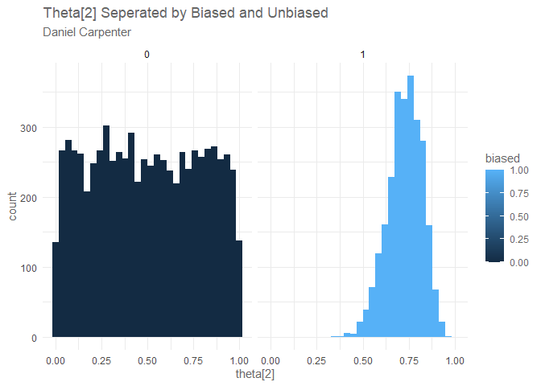
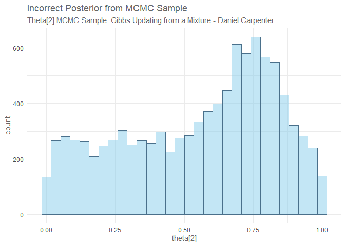
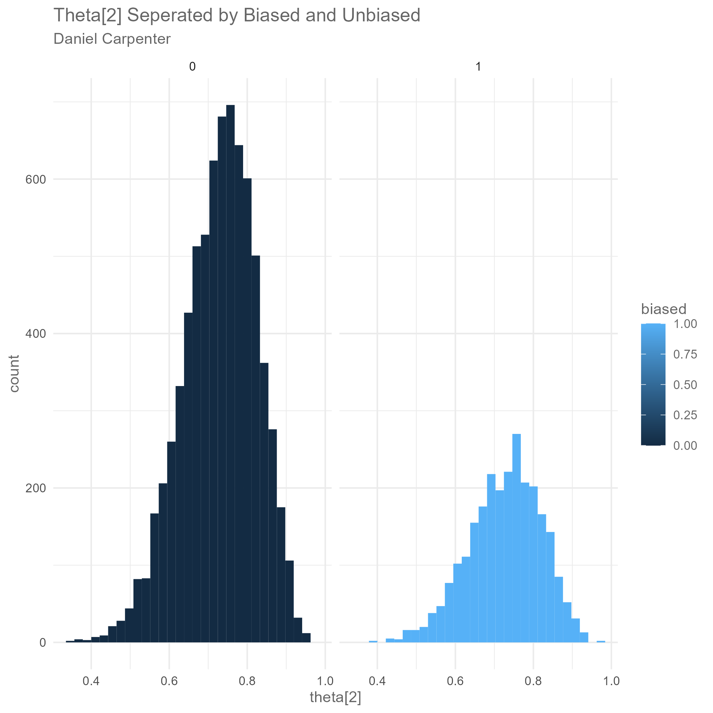

Assignment 2
================
Daniel Carpenter
March 2022

-   [Task `1` - Get `General Posterior` given `Beta Prior` and
    `Binomial Likelihood`](#task-1---get-general-posterior-given-beta-prior-and-binomial-likelihood)
    -   [`a` Bayes Thereom](#a-bayes-thereom)
    -   [`b` General Posterior](#b-general-posterior)
    -   [`c` Plot Prior, Likelihood, and
        Posterior](#c-plot-prior-likelihood-and-posterior)
    -   [`d` `Mybeta()` - Plot Prior, Likelihood, and
        Posterior](#d-mybeta---plot-prior-likelihood-and-posterior)
    -   [`e` Call `Mybeta()` given various
        paramters](#e-call-mybeta-given-various-paramters)
    -   [`f` `Mybeta2()` - Includes `CMD`
        Output](#f-mybeta2---includes-cmd-output)
-   [Task `2` - Mix 2-Beta Distributions as Prior
    Distribution](#task-2---mix-2-beta-distributions-as-prior-distribution)
    -   [`a` Show that mixbeta satisfies the first 2/3 properties of a
        density.](#a-show-that-mixbeta-satisfies-the-first-23-properties-of-a-density)
    -   [`b` `mymix()` - Function to Created Mixed Beta Distribution and
        Plots](#b-mymix---function-to-created-mixed-beta-distribution-and-plots)
    -   [`c` `Mymixplot()`](#c-mymixplot)
    -   [`d` `JAGS` Function with
        `Mixed-Beta Prior`](#d-jags-function-with-mixed-beta-prior)
-   [Task `3` - Create JAGS Model using Mix Betas as
    Prior](#task-3---create-jags-model-using-mix-betas-as-prior)
    -   [`a` `dcat()` Explained](#a-dcat-explained)
    -   [`b-e` Mixed Prior JAGS Function to Asses if Coin is
        Biased](#b-e-mixed-prior-jags-function-to-asses-if-coin-is-biased)
    -   [`f`](#f)
-   [Task `4` - Note that Posterior is
    Incorrect](#task-4---note-that-posterior-is-incorrect)
    -   [`a` Data Structure](#a-data-structure)
    -   [`b` `mcmcT`](#b-mcmct)
    -   [`c` Plots](#c-plots)
    -   [`d` Interpretation of Pick](#d-interpretation-of-pick)
    -   [`e` Incorrect Posterior](#e-incorrect-posterior)
-   [Task `5` - Correct Posterior by using
    Pseudo-Priors](#task-5---correct-posterior-by-using-pseudo-priors)
    -   [`a` Derivation](#a-derivation)
    -   [`b-e` `pseudobin()` - Use Pseudo Priors for
        Prior](#b-e-pseudobin---use-pseudo-priors-for-prior)

------------------------------------------------------------------------

> Goal of Assignment:

-   Use `mix-beta distribution` for a prior in JAGS MCMC model

-   Must use `pseudo prior`, *or the posterior from the first JAGS run*,
    then run model again

-   Then, the posterior distribution will be correct

# Task `1` - Get `General Posterior` given `Beta Prior` and `Binomial Likelihood`

## `a` Bayes Thereom

$$
\\underbrace{p(\\theta \\mid D)}\_{\\text {posterior }}
=\\underbrace{p(D \\mid \\theta)}\_{\\text {likelihood}} \\times
\\underbrace{p(\\theta)}\_{\\text {prior}} 
/ \\underbrace{p(D)}\_{\\text {evidence }}
$$

## `b` General Posterior

> Derive the general posterior result for a Beta prior and Binomial
> likelihood

*Taken from JK’s book - page 132 Doing Bayesian Data Analysis:* <br>

#### Bayes’ rule

*p*(*θ* ∣ *z*, *N*) = *p*(*z*, *N* ∣ *θ*)*p*(*θ*)/*p*(*z*, *N*) <br>

#### Define Bernoulli and beta distributions

$=\\theta^{z}(1-\\theta)^{(N-z)} \\frac{\\theta^{(a-1)}(1-\\theta)^{(b-1)}}{B(a, b)} / p(z, N)$
<br>

#### Rearrange factors

 = *θ*<sup>*z*</sup>(1 − *θ*)<sup>(*N* − *z*)</sup>*θ*<sup>(*a* − 1)</sup>(1 − *θ*)<sup>(*b* − 1)</sup>/\[*B*(*a*, *b*)*p*(*z*, *N*)\]  
<br>

#### Collect Powers

 = *θ*<sup>((*z* + *a*) − 1)</sup>(1 − *θ*)<sup>((*N* − *z* + *b*) − 1)</sup>/\[*B*(*a*, *b*)*p*(*z*, *N*)\]  
<br>
 = *θ*<sup>((*z* + *a*) − 1)</sup>(1 − *θ*)<sup>((*N* − *z* + *b*) − 1)</sup>/*B*(*z* + *a*, *N* − *z* + *b*)
<br>

## `c` Plot Prior, Likelihood, and Posterior

-   Given uniform prior (for a Beta prior and Binomial likelihood)

``` r
source("DBDA2E-utilities.R")  # Load definitions of graphics functions etc.
source("BernBeta.R")          # Load the definition of the BernBeta function

# Specify the prior:
t = 4              # Specify the prior MODE.
n = 10               # Specify the effective prior sample size.
a = 1                # Convert to beta shape parameter a.
b = 1                # Convert to beta shape parameter b.

Prior = c(a,b)       # Specify Prior as vector with the two shape parameters.

# Specify the data:
N = 10                         # The total number of flips.
z = 4                         # The number of heads.
Data = c(rep(0,N-z),rep(1,z))  # Convert N and z into vector of 0's and 1's.


# Plot the three graphs
posterior = BernBeta( priorBetaAB=Prior, Data=Data , plotType="Bars" , 
                      showCentTend="Mode" , showHDI=TRUE , showpD=FALSE )
```

<!-- -->

## `d` `Mybeta()` - Plot Prior, Likelihood, and Posterior

-   Function to Plot Prior, Likelihood, and Posterior
-   Beta prior and Binomial likelihood

``` r
# Create flexible function that plots the Prior, Likelihood, and Posterior
# Given a Beta prior and Binomial likelihood   
Mybeta <- function(alpha = 1, beta = 1, n, x) {

  source("DBDA2E-utilities.R")  # Load definitions of graphics functions etc.
  source("BernBeta.R")          # Load the definition of the BernBeta function
  
  # Specify the prior:
  t = x                          # Specify the prior MODE.
  
  Prior = c(alpha,beta)          # Specify Prior as vector with the two shape parameters.
  
  # Specify the data:
  N = n                          # The total number of flips.
  z = x                          # The number of heads.
  Data = c(rep(0,N-z),rep(1,z))  # Convert N and z into vector of 0's and 1's.
  
  # Make plots for prior, lik, and post  
  posterior = BernBeta( priorBetaAB=Prior, Data=Data , plotType="Bars" , 
                        showCentTend="Mode" , showHDI=TRUE , showpD=FALSE )
}
```

## `e` Call `Mybeta()` given various paramters

``` r
  Mybeta(alpha=2, beta=2, n=10, x=6)
```

<!-- -->

``` r
  Mybeta(alpha=4, beta=2, n=10, x=6)
```

<!-- -->

``` r
  Mybeta(alpha=2, beta=4, n=10, x=6)
```

<!-- -->

``` r
  Mybeta(alpha=20, beta=20, n=10, x=6)
```

<!-- -->

## `f` `Mybeta2()` - Includes `CMD` Output

-   Adjusted function `Mybeta2()` that produces the same plots as
    `mybeta()`
-   but releases command line Bayesian point estimates and BCI’s of
    whatever equal tail size we wish – all estimating `p`

``` r
Mybeta2 <- function(alpha = 1, beta = 1, n, x, alphalevel=0.05) {

  source("DBDA2E-utilities.R")  # Load definitions of graphics functions etc.
  source("BernBeta.R")          # Load the definition of the BernBeta function
  
  # Specify the prior:
  t = x                          # Specify the prior MODE.
  
  Prior = c(alpha,beta)          # Specify Prior as vector with the two shape parameters.
  
  # Specify the data:
  N = n                          # The total number of flips.
  z = x                          # The number of heads.
  Data = c(rep(0,N-z),rep(1,z))  # Convert N and z into vector of 0's and 1's.
  
  # Make plots for prior, lik, and post  
  posterior = BernBeta( priorBetaAB=Prior, Data=Data , plotType="Bars" , 
                        showCentTend="Mode" , showHDI=TRUE , showpD=FALSE )
  
  # Get alpha and beta used to form the posterior distribution
  postAlpha = posterior[1]
  postBeta  = posterior[2]
  
  # Calculate the HDI Tails
  lowerLevel = (alphalevel / 2)
  upperLevel = (1 - alphalevel / 2)
  HDI = qbeta(c(lowerLevel, upperLevel), postAlpha, postBeta)
  
  # Return the Lower and Upper HDI at the given level of alpha
  return(list('lowerHDI' = HDI[1],
              'upperHDI' = HDI[2]))
}
```

-   *Note that that R Markdown will not recreate the graphs since they
    are the same, but the `CMD` output is shown*

``` r
# Call the above function under various parameter scenarios
Mybeta2(alpha = 2, beta=2, n=10, x=4, alphalevel=0.05) 
```

    ## $lowerHDI
    ## [1] 0.1922324
    ## 
    ## $upperHDI
    ## [1] 0.6842224

``` r
Mybeta2(alpha = 2, beta=2, n=10, x=4, alphalevel=0.10) 
```

<!-- -->

    ## $lowerHDI
    ## [1] 0.2239554
    ## 
    ## $upperHDI
    ## [1] 0.6452007

``` r
Mybeta2(alpha = 2, beta=2, n=10, x=3, alphalevel=0.05)
```

    ## $lowerHDI
    ## [1] 0.1385793
    ## 
    ## $upperHDI
    ## [1] 0.6142617

``` r
Mybeta2(alpha = 2, beta=2, n=10, x=3, alphalevel=0.01)
```

<!-- -->

    ## $lowerHDI
    ## [1] 0.09422851
    ## 
    ## $upperHDI
    ## [1] 0.6912766

------------------------------------------------------------------------

<br>

# Task `2` - Mix 2-Beta Distributions as Prior Distribution

## `a` Show that mixbeta satisfies the first 2/3 properties of a density.

### Analytical Assumptions about Mized Betas

#### 1. Two beta distributions with two shape parameters

$$
dbeta1 = dbeta(x, a1, b1) \\\\
dbeta2 = dbeta(x, a2, b2)
$$

#### 2. The sum of w is 1

$$
\\sum\_{-\\infty}^{+\\infty} w = 1
$$

### Explanation of above

1.  *f*(*x*) ≥ 0

-   Answer: The area under a beta distribution is from 0 to 1. Since the
    sum of the weight *w* is 1, the area of both weighted betas will
    be 1.

$$
dbeta(x, a, b)=\\frac{x^{a-1}(1-x)^{b-1}}{B(a, b)} \\geq 0
$$

2.  ∫<sub> − ∞</sub><sup> + ∞</sup>*f*(*x*)*d**x* = 1

-   Answer: If the sum of the weight *w* is 1, and the area under a beta
    distribution must always be 1, then the area from -∞ to +∞ will
    cover that interval and sum to 1, making
    ∫<sub> − ∞</sub><sup> + ∞</sup>*f*(*x*)*d**x* = 1

$$
\\begin{gathered}
\\text { If, } \\int\_{-\\infty}^{\\infty} dbeta(x, a, b) d x = \\int\_{-\\infty}^{\\infty} \\frac{x^{a-1}(1-x)^{b-1}}{B(a, b)} d x=1 \\\\
\\text { Then, } \\int\_{-\\infty}^{\\infty} dbeta(x, a 1, b 1) d x=1 \\\\
\\text { and } \\int\_{-\\infty}^{\\infty} dbeta(x, a 2, b 2) d x=1 \\\\
\\text { Therefore, } \\int\_{-\\infty}^{\\infty} w \* dbeta(x, a 1, b 1) d x=w \* 1 \\\\
\\text { and } \\int\_{-\\infty}^{\\infty}(1-w) \* dbeta(x, a 2, b 2) d x=(1-w) \* 1
\\end{gathered}
$$

## `b` `mymix()` - Function to Created Mixed Beta Distribution and Plots

> Make an R function that will create the mixture density using
> `mixbeta()`

``` r
mymix<- function(x, w, a1,b1, a2,b2) {
    w*dbeta(x, a1, b1) +(1-w)*dbeta(x, a2,b2)
  }
```

## `c` `Mymixplot()`

> Make a function that will plot the mixture

``` r
Mymixplot <- function(w, a1,b1, a2,b2) {
  
  # Using mymix() to estimate mixed beta
  mymix<- function(x, w, a1,b1, a2,b2) {
    w*dbeta(x, a1, b1) +(1-w)*dbeta(x, a2,b2)
  }
  
  # Plot the curve and area with a title
  polygon(curve(mymix(x, w, a1,b1, a2,b2)), col = "skyblue3")
  title('Mixed Beta Plot\nDaniel Carpenter')
}

# Call the above function over various scenarios
Mymixplot(w=0.3, a1=2,b1=4, a2=4,b2=2) 
```

<!-- -->

``` r
Mymixplot(w=0.5, a1=2,b1=4, a2=4,b2=2) 
```

<!-- -->

``` r
Mymixplot(w=0.7, a1=2,b1=4, a2=4,b2=2)
```

<!-- -->

``` r
Mymixplot(w=0.9, a1=2,b1=4, a2=4,b2=2)
```

<!-- -->

## `d` `JAGS` Function with `Mixed-Beta Prior`

### `i` Analytical Posterior

$$
\\underbrace{\\frac{z+a}{N+a+b}}\_{\\text{posterior}} = \\underbrace{\\frac{z}{N}}\_{\\text{data}} \\underbrace{\\frac{N}{N+a+b}}\_{\\text{weight}} + \\underbrace{\\frac{a}{a+b}}\_{\\text{prior}} \\underbrace{\\frac{a+b}{N+a+b}}\_{\\text{weight}} .
$$

### `ii` Posterior Mixing Weight

-   Posterior Mixing Weight is the weights applied to the two beta
    distributions to mix them

### `iii` Use a mixed beta as the prior

*Note that the code below is adapted from JK’s `BernBeta()` function -
adjusted to take mixed beta priors*

``` r
Mymixbeta <- function(w=0.5, n=10, x, a1=1, a2=1, b1=1, b2=1) {
  # Specify the prior:
  t = x                          # Specify the prior MODE.
  
  # Specify the data:
  N = n                          # The total number of flips.
  z = x                          # The number of heads.
  Data = c(rep(0,N-z),rep(1,z))  # Convert N and z into vector of 0's and 1's.
  
  # Create summary values of Data:
  z = sum( Data ) # number of 1's in Data
  N = length( Data ) 
  
  Theta = seq(0.001,0.999,by=0.001)                                                 # points for plotting
  pTheta = w*dbeta(Theta,a1,b1) +(1-w)*dbeta(Theta,a2,b2)                           # prior for plotting
  pThetaGivenData = w*dbeta(Theta, a1+z, b1+N-z) + (1-w)*dbeta(Theta, a2+z, b2+N-z) # posterior for plotting
  pDataGivenTheta = Theta^z * (1-Theta)^(N-z)                                       # likelihood for plotting
  
  
  # Plot Layout
  layout( matrix( c( 1,2,3 ) ,nrow=3 ,ncol=1 ,byrow=FALSE ) ) # 3x1 panels
  par( mar=c(3,3,1,0) , mgp=c(2,0.7,0) , mai=c(0.5,0.5,0.3,0.1) ) # margins
  cexAxis = 1.33
  cexLab = 1.75
  
  # convert plotType to notation used by plot:
  plotType="h"
  dotsize = 5 # how big to make the plotted dots
  barsize = 5 # how wide to make the bar lines   
  
  # y limits for prior and posterior:
  yLim = c(0,1.1*max(c(pTheta,pThetaGivenData)))
  
  
  # Plot the Prior
  plot( Theta , pTheta , type=plotType , 
        pch="." , cex=dotsize , lwd=barsize ,
        xlim=c(0,1) , ylim=yLim , cex.axis=cexAxis ,
        xlab=bquote(theta) , ylab='Mixed Beta' , 
        cex.lab=cexLab ,
        main="Prior (beta) - Daniel Carpenter" , cex.main=1.5 , col="skyblue")
  
  # Plot the likelihood
  plot( Theta , pDataGivenTheta , type=plotType , 
        pch="." , cex=dotsize , lwd=barsize ,
        xlim=c(0,1) , ylim=c(0,1.1*max(pDataGivenTheta)) , cex.axis=cexAxis ,
        xlab=bquote(theta) , ylab=bquote( "p(D|" * theta * ")" ) , 
        cex.lab=cexLab ,
        main="Likelihood (Bernoulli)" , cex.main=1.5 , col="skyblue" )
  
  # Plot the posterior.
  plot( Theta , pThetaGivenData , type=plotType , 
        pch="." , cex=dotsize , lwd=barsize ,
        xlim=c(0,1) , ylim=yLim , cex.axis=cexAxis ,
        xlab=bquote(theta) , ylab='Mixed Beta Posterior' , 
        cex.lab=cexLab ,
        main="Posterior (beta)" , cex.main=1.5 , col="skyblue" )
}

# Call the function and print the prior (mixed beta), likelihood and posterior)
Mymixbeta(w=0.5, n=10, x=4, a1=2, a2=2, b1=4, b2=4)
```

<!-- -->

------------------------------------------------------------------------

<br>

# Task `3` - Create JAGS Model using Mix Betas as Prior

## `a` `dcat()` Explained

-   `dcat()` calculates the categorical likelihood given a categorical
    event vector `x` and the categorical event matrix `prob`

-   Suppose a coin is either “unbiased” or “biased”. In which case the
    chance of a “head” is unknown and is given a uniform prior
    distribution. We assess a prior probability of 0.9 that it is
    “unbiased”, and then observe 15 heads out of 20 tosses.

## `b-e` Mixed Prior JAGS Function to Asses if Coin is Biased

``` r
mypriormix <- function() {

  # Optional generic preliminaries:
  graphics.off() # This closes all of R's graphics windows.
  rm(list=ls())  # Careful! This clears all of R's memory!
  
  
  # Load the functions used below:
  source("DBDA2E-utilities.R") # Must be in R's current working directory.
  require(rjags)               # Must have previously installed package rjags.
  
  fileNameRoot="Assn2Jags/" # For output file names.
  dir.create(fileNameRoot)
  
  # Load the data:
  Ntotal = 10  # Compute the total number of flips.
  dataList = list(x = 15, n = 20)
  
  # Define the model:
  modelString = "
  model {
    x ~ dbin( p, n ) p <- theta[pick] 
    
    # pick is 2 if biased 1 unbiased 
    pick ~ dcat(q[]) # categorical 1 produced prob q[1], etc 
    
    q[1]<-0.9 
    q[2]<-0.1 
    theta[1] <-0.5        # unbiased 
    theta[2] ~ dunif(0,1) # biased
    biased <- pick - 1
  }
  " # close quote for modelString
  writeLines( modelString , con="TEMPmodel.txt" )
  
  # Initialize the chains based on MLE of data.
  initsList = list( pick = 1)
  
  # Run the chains:
  jagsModel = jags.model( file="TEMPmodel.txt" , data=dataList , inits=initsList , 
                          n.chains=3 , n.adapt=500 )
  update( jagsModel , n.iter=500 )
  codaSamples = coda.samples( jagsModel , variable.names=c("theta[2]","biased","theta[1]") ,
                              n.iter=3334 )
  save( codaSamples , file=paste0(fileNameRoot,"Mcmc.Rdata") )
  
  # Examine the chains ----------------------------------------------------------
    
    # Convergence diagnostics:
    filename1 <- paste0(fileNameRoot,"Theta[2]Diag")
    diagMCMC( codaObject=codaSamples , parName="theta[2]" )
    saveGraph( file= filename1, type="jpg" )
    
    
    # Posterior descriptives:
    filename2 <- paste0(fileNameRoot,"Theta[2]Post")
    openGraph(height=3,width=4)
    par( mar=c(3.5,0.5,2.5,0.5) , mgp=c(2.25,0.7,0) )
    plotPost( codaSamples[,"theta[2]"] , main="theta[2]" , xlab=bquote(theta[2]) )
    saveGraph( file=filename2, type="jpg" )
    graphics.off() # this is done to prevent very last graph being displyed in RMD out

    
  # Summary Statistics/Point Estimates
  return(list(su = summary(codaSamples), codaSamples = codaSamples,
              diagGraph = paste0(filename1, '.jpg'), postGraph = paste0(filename2, '.jpg')))
}

mypriormix() -> ans
```

    ## Compiling model graph
    ##    Resolving undeclared variables
    ##    Allocating nodes
    ## Graph information:
    ##    Observed stochastic nodes: 1
    ##    Unobserved stochastic nodes: 2
    ##    Total graph size: 12
    ## 
    ## Initializing model

``` r
# Show Diagnostic graph
knitr::include_graphics(ans$diagGraph)
```

<!-- -->

``` r
# Show Posterior
knitr::include_graphics(ans$postGraph)
```

<!-- -->

``` r
# Point Estimates
ans$su
```

    ## 
    ## Iterations = 1001:4334
    ## Thinning interval = 1 
    ## Number of chains = 3 
    ## Sample size per chain = 3334 
    ## 
    ## 1. Empirical mean and standard deviation for each variable,
    ##    plus standard error of the mean:
    ## 
    ##            Mean     SD Naive SE Time-series SE
    ## biased   0.2702 0.4441 0.004441       0.006300
    ## theta[1] 0.5000 0.0000 0.000000       0.000000
    ## theta[2] 0.5650 0.2702 0.002701       0.003806
    ## 
    ## 2. Quantiles for each variable:
    ## 
    ##             2.5%    25%    50%    75%  97.5%
    ## biased   0.00000 0.0000 0.0000 1.0000 1.0000
    ## theta[1] 0.50000 0.5000 0.5000 0.5000 0.5000
    ## theta[2] 0.03732 0.3511 0.6325 0.7784 0.9687

``` r
head(ans$codaSamples)
```

    ## [[1]]
    ## Markov Chain Monte Carlo (MCMC) output:
    ## Start = 1001 
    ## End = 1007 
    ## Thinning interval = 1 
    ##      biased theta[1]  theta[2]
    ## [1,]      0      0.5 0.4238237
    ## [2,]      0      0.5 0.4791809
    ## [3,]      0      0.5 0.5651325
    ## [4,]      0      0.5 0.3203489
    ## [5,]      0      0.5 0.9216697
    ## [6,]      1      0.5 0.8901893
    ## [7,]      1      0.5 0.6005658
    ## 
    ## [[2]]
    ## Markov Chain Monte Carlo (MCMC) output:
    ## Start = 1001 
    ## End = 1007 
    ## Thinning interval = 1 
    ##      biased theta[1]  theta[2]
    ## [1,]      1      0.5 0.6832375
    ## [2,]      0      0.5 0.4125257
    ## [3,]      0      0.5 0.9184628
    ## [4,]      0      0.5 0.5680756
    ## [5,]      0      0.5 0.9076723
    ## [6,]      0      0.5 0.4719755
    ## [7,]      0      0.5 0.8215983
    ## 
    ## [[3]]
    ## Markov Chain Monte Carlo (MCMC) output:
    ## Start = 1001 
    ## End = 1007 
    ## Thinning interval = 1 
    ##      biased theta[1]   theta[2]
    ## [1,]      0      0.5 0.04053161
    ## [2,]      0      0.5 0.01449225
    ## [3,]      0      0.5 0.02691566
    ## [4,]      0      0.5 0.01313482
    ## [5,]      0      0.5 0.10346145
    ## [6,]      0      0.5 0.77759603
    ## [7,]      0      0.5 0.60270817
    ## 
    ## attr(,"class")
    ## [1] "mcmc.list"

## `f`

-   The coin has a probability of 96.82% that it is biased

------------------------------------------------------------------------

<br>

# Task `4` - Note that Posterior is Incorrect

## `a` Data Structure

> structure of the MCMC data in the file produced by the jags script

``` r
class(ans$codaSamples) # Class is a list
```

    ## [1] "mcmc.list"

``` r
str(ans$codaSamples)   # Structure of the mcmc list
```

    ## List of 3
    ##  $ : 'mcmc' num [1:3334, 1:3] 0 0 0 0 0 1 1 0 0 0 ...
    ##   ..- attr(*, "dimnames")=List of 2
    ##   .. ..$ : NULL
    ##   .. ..$ : chr [1:3] "biased" "theta[1]" "theta[2]"
    ##   ..- attr(*, "mcpar")= num [1:3] 1001 4334 1
    ##  $ : 'mcmc' num [1:3334, 1:3] 1 0 0 0 0 0 0 1 0 0 ...
    ##   ..- attr(*, "dimnames")=List of 2
    ##   .. ..$ : NULL
    ##   .. ..$ : chr [1:3] "biased" "theta[1]" "theta[2]"
    ##   ..- attr(*, "mcpar")= num [1:3] 1001 4334 1
    ##  $ : 'mcmc' num [1:3334, 1:3] 0 0 0 0 0 0 0 0 0 0 ...
    ##   ..- attr(*, "dimnames")=List of 2
    ##   .. ..$ : NULL
    ##   .. ..$ : chr [1:3] "biased" "theta[1]" "theta[2]"
    ##   ..- attr(*, "mcpar")= num [1:3] 1001 4334 1
    ##  - attr(*, "class")= chr "mcmc.list"

## `b` `mcmcT`

> Combine estimates into a data frame

``` r
# Use codaSamples to get the Monitored Variables - show head too
mcmc1 = as.data.frame(ans$codaSamples[[1]]); head(mcmc1)
```

    ##   biased theta[1]  theta[2]
    ## 1      0      0.5 0.4238237
    ## 2      0      0.5 0.4791809
    ## 3      0      0.5 0.5651325
    ## 4      0      0.5 0.3203489
    ## 5      0      0.5 0.9216697
    ## 6      1      0.5 0.8901893

``` r
mcmc2 = as.data.frame(ans$codaSamples[[2]]); head(mcmc2)
```

    ##   biased theta[1]  theta[2]
    ## 1      1      0.5 0.6832375
    ## 2      0      0.5 0.4125257
    ## 3      0      0.5 0.9184628
    ## 4      0      0.5 0.5680756
    ## 5      0      0.5 0.9076723
    ## 6      0      0.5 0.4719755

``` r
mcmc3 = as.data.frame(ans$codaSamples[[3]]); head(mcmc3)
```

    ##   biased theta[1]   theta[2]
    ## 1      0      0.5 0.04053161
    ## 2      0      0.5 0.01449225
    ## 3      0      0.5 0.02691566
    ## 4      0      0.5 0.01313482
    ## 5      0      0.5 0.10346145
    ## 6      0      0.5 0.77759603

``` r
# make mcmcT by combining above
mcmcT = rbind.data.frame(mcmc1,mcmc2,mcmc3)
```

## `c` Plots

> Create plots of biased and unbiased posterior *without* pseudo priors
> used

``` r
require(ggplot2)

# Show biased and unbiased posteriors
ggplot(mcmcT, aes(x = `theta[2]`, fill = biased)) +
  geom_histogram() + # Create a  hist layer
  facet_wrap(~biased) +
  labs(title = 'Theta[2] Seperated by Biased and Unbiased',
  subtitle = 'Daniel Carpenter') +
  theme_minimal() + theme(text = element_text(color = '#666666'))
```

<!-- -->

## `d` Interpretation of Pick

`i.` When the parameter `biased` = 0: `pick` = 1, `ii.` When the
parameter `biased` = 1: `pick` = 2,

## `e` Incorrect Posterior

`i.` When pick = 1, theta\[1\] will be sampled from the posterior, then
`theta[2]` will be sampled from *the posterior of `theta[1]`*  
`ii.` When `pick` = 2, `theta[1]` will be sampled from the posterior  
`iii.` When `pick` = 2, `theta[2]` will be sampled from the posterior of
`theta[1]`  
`iv.` The plot above shows the unbiased and biased values of `theta[2]`.
See that the unbiased (0) follows a uniform posterior and the biased (1)
is shifted rightwards.  
`v.` The light blue plot will likely represent the true underlying
posterior of theta\[2\]  
`vi.` Create a plot which represents the incorrect posterior of
`theta[2]`

``` r
# Show incorrect posterior
ggplot(mcmcT, aes(x = `theta[2]`)) +
  geom_histogram(color = 'skyblue4', fill = 'skyblue', alpha = 0.5) + # Create a  hist layer
  labs(title = 'Incorrect Posterior from MCMC Sample',
  subtitle = 'Theta[2] MCMC Sample: Gibbs Updating from a Mixture - Daniel Carpenter') +
  theme_minimal() + theme(text = element_text(color = '#666666'))
```

<!-- -->

`vii.` The above plot has the shape because it includes both pick 1 and
pick 2, which we instead could sample on the posterior to get a more
informed prior for an additional sample.

------------------------------------------------------------------------

<br>

# Task `5` - Correct Posterior by using Pseudo-Priors

> Must use `pseudo prior`, *or the posterior from the first JAGS run*,
> then run model again  
> Then, the posterior distribution will be correct

## `a` Derivation

-   See JK’s *Inferring a Binomial Probability via Exact Mathematical
    Analysis, page 131*  
-   For a beta density with mean *μ* and standard deviation *σ*, the
    shape parameters are:

$$a=\\mu\\left(\\frac{\\mu(1-\\mu)}{\\sigma^{2}}-1\\right)$$
$$b=(1-\\mu)\\left(\\frac{\\mu(1-\\mu)}{\\sigma^{2}}-1\\right)$$

Derivation

$$\\text { Given } \\mu=\\frac{a}{a+b}, \\sigma^{2}=\\frac{\\mu(1-\\mu)}{a+b+1}, a=\\mu \\kappa, b=(1-\\mu) \\kappa \\text {, and } \\kappa=a+b$$

## `b-e` `pseudobin()` - Use Pseudo Priors for Prior

``` r
# function that will create a list of the hyper-parameter estimates 
# using the summary stats from a previous run of the MCMC sampler
pseudobin <- function(lastPick) {
  
  # Function to get alpha and beta from mean and sigma (for pseudo prior)
  mustoab <- function (mu, sigma) {
    
    # Convert mu and sigma to shapes
    a =     (mu) * (mu*(1 - mu) / (sigma^2)-1)
    b = (1 - mu) * (mu*(1 - mu) / (sigma^2)-1)
    
    return(list(a=a, b=b))
  }
  
  # Get alpha and beta for pseudo prior
  mu = mean(lastPick$`theta[2]`) 
  sd = sqrt(var(lastPick$`theta[2]`)) 
  shapeParamsForPseudo <- mustoab(mu, sd)
  
  # JAGS model ------------------------------------------------------------------
    
    # Optional generic preliminaries:
    graphics.off() # This closes all of R's graphics windows.
    
    # Load the functions used below:
    source("DBDA2E-utilities.R") # Must be in R's current working directory.
    require(rjags)               # Must have previously installed package rjags.
    
    fileNameRoot="Assn2JagsPseudo/" # For output file names.
    dir.create(fileNameRoot)
    
    # Load the data:
    Ntotal = 10  # Compute the total number of flips.
    dataList = list(x = 15, n = 20,
                    alpha = shapeParamsForPseudo$a,
                    beta  = shapeParamsForPseudo$b
                    )
    
    # Define the model:
    modelString = "
      model { 
      x ~ dbin(p,n) 
      p <- theta[pick]
  
      # theta[1] represents fixed unbiased value
      theta[1] <- equals(pick,1)*fixtheta1 + equals(pick,2)*fixtheta1
      theta[2] <- equals(pick,1)*pseudotheta2 + equals(pick,2)*theta2
      
      # pick is 2 if biased 1 unbiased 
      pick ~ dcat(q[]) # categorical 1 produced prob q[1], etc
      
      q[1]<-0.9
      q[2]<-0.1
      fixtheta1 <-0.5     # unbiased; fixed probability 
      
      theta2 ~ dunif(0,1) # true prior of theta[2]
      
      # shape parameters for pseudo prior will be part of dataList
      pseudotheta2 ~ dbeta(alpha,beta)
      biased <- pick - 1
    } 
    " # close quote for modelString
    
    writeLines( modelString , con="TEMPmodel.txt" )
    
    # Initialize the chains based on MLE of data.
    initsList = list( pick = 1)
    
    # Run the chains:
    jagsModel = jags.model( file="TEMPmodel.txt" , data=dataList , inits=initsList , 
                            n.chains=3 , n.adapt=500 )
    update( jagsModel , n.iter=500 )
    codaSamples = coda.samples( jagsModel , variable.names=c("theta[2]","biased","theta[1]") ,
                                n.iter=3334 )
    save( codaSamples , file=paste0(fileNameRoot,"Mcmc.Rdata") )
    
    # Examine the chains ----------------------------------------------------------
    
      # Convergence diagnostics:
      filename1 <- paste0(fileNameRoot,"Theta[2]Diag")
      diagMCMC( codaObject=codaSamples , parName="theta[2]" )
      saveGraph( file= filename1, type="jpg" )
      
      
      # Posterior descriptives:
      filename2 <- paste0(fileNameRoot,"Theta[2]Post")
      openGraph(height=3,width=4)
      par( mar=c(3.5,0.5,2.5,0.5) , mgp=c(2.25,0.7,0) )
      plotPost( codaSamples[,"theta[2]"] , main="theta[2]" , xlab=bquote(theta[2]) )
      saveGraph( file=filename2, type="jpg" )
      graphics.off() # this is done to prevent very last graph being displyed in RMD out
      
    
    # PLOTS - Example codaSamples -------------------------------------------------
    
      # Use codaSamples to get the Monitored Variables - show head too
      mcmc1 = as.data.frame(codaSamples[[1]])
      mcmc2 = as.data.frame(codaSamples[[2]])
      mcmc3 = as.data.frame(codaSamples[[3]])
      
      # make mcmcT by combining above
      mcmcT = rbind.data.frame(mcmc1,mcmc2,mcmc3)
      
      # Get pick 2 and view
      # pick2 = subset(mcmcT, biased == 1) # COMMENT OUT LATER      
      # plot(codaSamples[ ,"theta[2]"])    # COMMENT OUT LATER  
      # with(pick2, hist(`theta[2]`))      # COMMENT OUT LATER
      
      require(ggplot2)
      
      # Show biased and unbiased posteriors
      biasPlot <- ggplot(mcmcT, aes(x = `theta[2]`, fill = biased)) +
                  geom_histogram() + # Create a  hist layer
                  facet_wrap(~biased) +
                  labs(title = 'Theta[2] Seperated by Biased and Unbiased',
                       subtitle = 'Daniel Carpenter') +
                  theme_minimal() + theme(text = element_text(color = '#666666'))
      biasPlot
      
      # Show Posterior
      postPlot <- ggplot(mcmcT, aes(x = `theta[2]`)) +
                    geom_histogram(color = 'skyblue4', fill = 'skyblue', alpha = 0.5) + # Create a  hist layer
                    labs(title = 'Posterior from MCMC Sample',
                         subtitle = 'Theta[2] MCMC Sample: Gibbs Updating from a Mixture - Daniel Carpenter') +
                    theme_minimal() + theme(text = element_text(color = '#666666'))
      postPlot
      
      # Save and print the plots
      dir.create('Plots/')
      fileName1 = 'Plots/biasPlot.png'; ggsave(biasPlot, file=fileName1)
      fileName2 = 'Plots/postPlot.png'; ggsave(postPlot, file=fileName2)
      
      require(knitr) # for kable
      
    return(list(hyperParams = list(alpha = shapeParamsForPseudo$a, beta  = shapeParamsForPseudo$b),
                su = kable(summary(codaSamples)$statistics),
                plot1File = fileName1, plot2File = fileName2))
}      

# Optional plots
# plot(codaSamples[ ,"theta[2]"])  # Some other plots
# with(pick2, hist(`theta[2]`))    # Some other plots

# Get pick 1 and pick 2 from past model
pick1 = subset(mcmcT, biased == 0)
pick2 = subset(mcmcT, biased == 1)

# Use pick 2 of the past model for the pseudo prior
pseudobin(pick2) -> pseudoAns
```

    ## Compiling model graph
    ##    Resolving undeclared variables
    ##    Allocating nodes
    ## Graph information:
    ##    Observed stochastic nodes: 1
    ##    Unobserved stochastic nodes: 3
    ##    Total graph size: 24
    ## 
    ## Initializing model

``` r
# See the hyper parameters
pseudoAns$hyperParams
```

    ## $alpha
    ## [1] 15.79299
    ## 
    ## $beta
    ## [1] 5.991436

``` r
# See the summary stats also
pseudoAns$su
```

|            |      Mean |        SD |  Naive SE | Time-series SE |
|:-----------|----------:|----------:|----------:|---------------:|
| biased     | 0.2593481 | 0.4382989 | 0.0043826 |      0.0062592 |
| theta\[1\] | 0.5000000 | 0.0000000 | 0.0000000 |      0.0000000 |
| theta\[2\] | 0.7264225 | 0.0924527 | 0.0009244 |      0.0010853 |

``` r
# Show the Plots
knitr::include_graphics(pseudoAns$plot1File)
```

<!-- -->

``` r
knitr::include_graphics(pseudoAns$plot2File)
```

<!-- -->

### Interpretation for Problem `b. iii.` and `e`

`b. iii.` The part used is pick 2. Notice the difference between the
posterior of this model vs. this first.  
`e` There are more counts in the first facet since the estimate is less
biased and represents the model better now.
