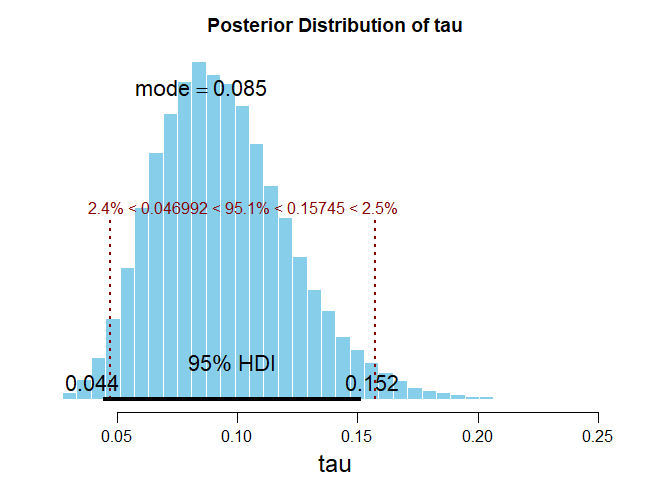
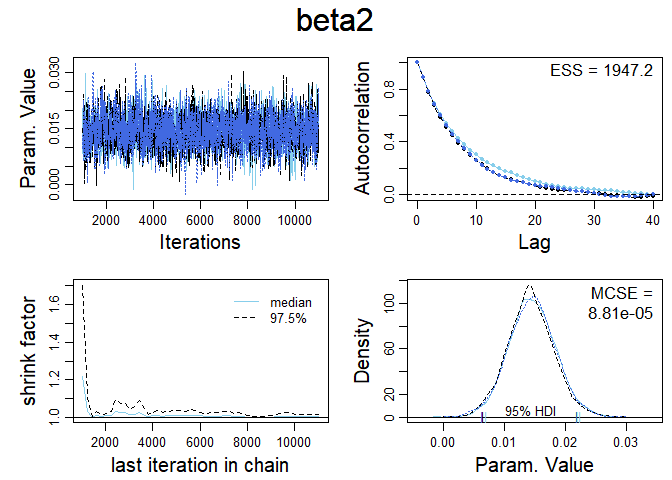

Assignment 4
================
Daniel Carpenter
April 2022

-   [1 Task 1 - GLM](#1-task-1---glm)
    -   [1.1 Overview of Problem](#11-overview-of-problem)
    -   [1.2 `a` Mathematics](#12-a-mathematics)
    -   [1.3 `b` Distribution of Data](#13-b-distribution-of-data)
    -   [1.4 `c-g`](#14-c-g)
    -   [1.5 `h` Formula for Model](#15-h-formula-for-model)
    -   [1.6 `i` Interpreation of
        Results](#16-i-interpreation-of-results)
    -   [1.7 `j` Add `typical.y`](#17-j-add-typicaly)
    -   [1.8 `l` Add
        ](#18-l-add-r2_b)
-   [2 Task 2 -
    Logit/Probit/Centering](#2-task-2---logitprobitcentering)
    -   [2.1 `a` Data](#21-a-data)
    -   [2.2 `b` JAGS Model `Logit`
        (*Centered*)](#22-b-jags-model-logit-centered)
    -   [2.3 `c` Run Jags Model `Logit`
        (*Centered*)](#23-c-run-jags-model-logit-centered)
    -   [2.4 `d` *Non-Centered* Independant
        Var](#24-d-non-centered-independant-var)
    -   [2.5 `e` Interpretation
        (*Non-Centered*)](#25-e-interpretation-non-centered)
    -   [2.6 `f` Pairs Plots](#26-f-pairs-plots)
    -   [2.7 `g` Random vs. Non-Random
        Vars](#27-g-random-vs-non-random-vars)
    -   [2.8 `h` Jags Model using `Probit`
        (*Centered*)](#28-h-jags-model-using-probit-centered)
    -   [2.9 `i` Plot Estimations of `Logit`
        (*Centered*)](#29-i-plot-estimations-of-logit-centered)
-   [3 Task 3 - Titanic / Logistic](#3-task-3---titanic--logistic)
    -   [3.1 `1` Describe Data](#31-1-describe-data)
    -   [3.2 `2` Plots of Data](#32-2-plots-of-data)
    -   [3.3 `3` JAGS Models](#33-3-jags-models)
    -   [3.4 `4` Intepretation of Smallest DIC
        Model](#34-4-intepretation-of-smallest-dic-model)

All questions and parts done completely.

------------------------------------------------------------------------

# 1 Task 1 - GLM

## 1.1 Overview of Problem

### 1.1.1 Soft Drink Delivery Times Problem

-   Goal: estimation of the required time needed by each employee to
    refill an automatic vending machines owned and served by the
    company.
-   For this reason, a small quality assurance study was set-up by an
    industrial engineer of the company.
    -   As the response variable he considered the `total service time`
        (measured in minutes) of each machine, including its stocking
        with beverage products and any required maintenance or
        housekeeping.
    -   After examining the problem, the industrial engineer recommended
        two important variables which affect delivery time:

1.  the `number of cases of stocked products` and  
2.  the `distance walked by the employee` (measured in feet).

A dataset of *25 observations* was collected.

<br>

## 1.2 `a` Mathematics

-   The *linear predictor* of this data are the `cases` and `distance`
    variables  
-   Since the *predicted variable* `time` is interval data, therefore:
    -   The *link* function will be linear
        ")
    -   the *Metric* scale will be used.
    -   Since the Metric scale is used, a typical *noise distribution*
        for Metric scale types of predicted variables is normally
        distributed, or
        
        \~
        ")

### 1.2.1 JAGS Model

``` r
# The JAGS Model
modelString = 
  "
  model {
  
    # model’s likelihood 
    for (i in 1:n) { 
      time[i] ~ dnorm( mu[i], tau ) # stochastic componenent 
      mu[i] <- beta0 + (beta1 * cases[i]) + (beta2 * distance[i]) 
    }
  
    # prior distributions 
    beta0 ~ dnorm(  0.0, 1.0E-4)  
    beta1 ~ dnorm(  0.0, 1.0E-4)  
    beta2 ~ dnorm(  0.0, 1.0E-4) 
    tau   ~ dgamma( 0.01, 0.01 ) 
  }
  "
```

<br>

## 1.3 `b` Distribution of Data

### 1.3.1 Data for Model

``` r
# Data from soft drink experiment. See details below
dataList  = 
  list(n = 25,
       
       # Total Service time (predicted variable)
       # Measure: minutes
       time = c(16.68, 11.5, 12.03, 14.88, 
                13.75, 18.11, 8, 17.83, 79.24, 
                21.5, 40.33, 21, 13.5, 19.75, 
                24, 29, 15.35, 19, 9.5, 35.1,
                17.9, 52.32, 18.75, 19.83, 10.75), 
       
       # Distance an employee walks on foot to the vending machine 
       # (predictor variable 1)
       # Measure: feet
       distance = c(560, 220, 340, 80, 150, 330, 
                    110, 210, 1460, 605, 688, 215,
                    255, 462, 448, 776, 200, 132, 
                    36, 770, 140, 810, 450, 635, 150),
       
       # Number of cases of stocked products to restock
       # (predictor variable 2)
       # Measure: Number of cases of product
       cases = c( 7, 3, 3, 4, 6, 
                  7, 2, 7, 30, 5, 
                  16, 10, 4, 6, 9,
                  10, 6, 7, 3, 17, 
                  10, 26, 9, 8, 4) 
       )
```

### 1.3.2 Examine the Data

``` r
library(tidyverse)
library(ggplot2)

# Boxplots of the data
df.softDrinks <- data.frame(dataList$time, dataList$distance, dataList$cases)
colnames(df.softDrinks) <- c('time', 'distance', 'cases')
df.softDrinks <- df.softDrinks%>%
  pivot_longer(cols      = everything(),
               names_to  = 'name',
               values_to = 'value')

# Show some of the pivoted Dataset
head(df.softDrinks)
```

    ## # A tibble: 6 x 2
    ##   name     value
    ##   <chr>    <dbl>
    ## 1 time      16.7
    ## 2 distance 560  
    ## 3 cases      7  
    ## 4 time      11.5
    ## 5 distance 220  
    ## 6 cases      3

``` r
# Create the distribution of data plot
df.softDrinks %>%
  ggplot(aes(x     = name,
             y     = value)) +
  theme_minimal() +
  
  # Create a violin plot under the boxplot to view tails
  geom_violin(color = 'skyblue3',
               fill  = 'skyblue',
               alpha = 0.5) + 
  
  # Create the box plot
  geom_boxplot(color = 'skyblue4',
               fill  = 'grey99',
               alpha = 0.25) +
  
  # Wrap each variable on the columns
  facet_wrap(~name,
             ncol=3,
             scales = 'free') + 
  labs(title = 'Distribution of Data in Dataset',
       subtitle = 'Daniel Carpenter',
       x = '',
       y = 'Value of Data',
       caption = 'Please note varying scales on y-axis for each small multiple (facet)')
```

<!-- -->

``` r
# Scatter of the data
# Function to see data: how does prediced value compare to the predictor?
getGLMPlot <- function(predictedValue, predictor, methodName = 'glm', ...)
{
  df <- data.frame(predictedValue, predictor)
  colnames(df) <- c('predictedValue', 'predictor')
  
  plot.glm <- df %>% 
    ggplot(aes(y = predictedValue,
               x = predictor)) +
    labs(title    = 'Snapshot of Data',
         subtitle = 'Daniel Carpenter',
         caption = 'This view is only to see how the two variables move together. Does not assume causal or independant relationship.',
         ...) +
    theme_minimal() +
    
    # Points
    geom_point(color = 'steelblue3') +
    
    # Using a GLM smoother
    geom_smooth(method = methodName,
                color = 'grey80',
                linetype = 'dotdash',
                fill = 'grey87')
  
  # print(plot.glm)
  return(plot.glm)
}

# Distance as a predictor
getGLMPlot(predictedValue = dataList$time    , y = 'Time',
           predictor      = dataList$distance, x = 'Distance')
```

<!-- -->

``` r
# Num. Cases as a predictor
getGLMPlot(predictedValue = dataList$time, y = 'Time',
           predictor      = dataList$cases, x = 'Number of Cases')
```

<!-- -->

### 1.3.3 MCMC Model Control Inputs

``` r
# Model Name and Root
fileNameRoot= "Task 1 JAGS Output (Soft Drinks)/" # Directory
modelName   = 'SoftDrinks'      # Name of the model for File Naming


## MCMC Controls
adaptSteps  = 500               # Number of steps to adapt the samplers
burnInSteps = 1000              # Number of steps to burn-in the chains
nChains     = 3                 # nChains should be 2 or more for diagnostics 
nIter       = 10000             # Total Number of iterations to perform


## Parameter Definitions
parameters  = c("tau",          # The parameters to be monitored
                "beta0", 
                "beta1", 
                'beta2') 
```

<br>

## 1.4 `c-g`

### 1.4.1 Function to Run the JAGS Model

``` r
runJagsFunction <- function(modelString, parameters, nIter=10000, # Total iterations
                            initsList   = list( tau   = 1,  # Initial parameter values
                                                beta0 = 1, 
                                                beta1 = 0, 
                                                beta2 = 0 )) {
  
  source("DBDA2E-utilities.R") # Must be in R's current working directory.
  library(rjags)
  
  # Create the directory for the JAGS output
  dir.create(fileNameRoot)
  
  # Create a text file to hold the model string
  writeLines( modelString , con=paste0(modelName, ".txt") )
  
  # Run the Chains:
  jagsModel = jags.model(file     = paste0(modelName, ".txt"), 
                         data     = dataList, 
                         inits    = initsList, 
                         n.chains = nChains,
                         n.adapt  = adaptSteps 
                         )
  
  # Burn-in:
  cat( "Burning in the MCMC chain...\n" )
  update( jagsModel , n.iter=burnInSteps )
  
  # Sample MCMC
  cat( "Sampling final MCMC chain...\n" )
  codaSamples = coda.samples( jagsModel, variable.names=parameters, n.iter=nIter )
  
  # Note the resulting codaSamples object has these indices: 
  #   codaSamples[[ chainIdx ]][ stepIdx , paramIdx ]
  
  # Save the coda samples
  save( codaSamples , file=paste0(fileNameRoot,"Mcmc.Rdata") )
  
  return(codaSamples)
}
```

### 1.4.2 Run Jags Model

``` r
# Run the fun and store
codaSamples <- runJagsFunction(modelString, parameters)
```

    ## 
    ## *********************************************************************
    ## Kruschke, J. K. (2015). Doing Bayesian Data Analysis, Second Edition:
    ## A Tutorial with R, JAGS, and Stan. Academic Press / Elsevier.
    ## *********************************************************************
    ## 
    ## Compiling model graph
    ##    Resolving undeclared variables
    ##    Allocating nodes
    ## Graph information:
    ##    Observed stochastic nodes: 25
    ##    Unobserved stochastic nodes: 4
    ##    Total graph size: 145
    ## 
    ## Initializing model
    ## 
    ## Burning in the MCMC chain...
    ## Sampling final MCMC chain...

``` r
# Diagnostics and Posteriors ----------------------------------------

# Tau
varName = paste0(parameters[1])
diagMCMC( codaObject=codaSamples , parName=varName );
saveGraph( file=paste0(fileNameRoot,varName) , type="png" )
```


``` r
openGraph(); par( mar=c(3.5,0.5,2.5,0.5) , mgp=c(2.25,0.7,0) )
plotPost( codaSamples[,varName] , main=paste0('Posterior Distribution of ', varName) , xlab=paste0(varName), ROPE = c(0.046992, 0.15745)) # from summary(codaSamples)
```



    ##          ESS       mean     median      mode hdiMass     hdiLow   hdiHigh
    ## tau 18573.03 0.09428592 0.09154672 0.0850173    0.95 0.04400614 0.1516954
    ##     compVal pGtCompVal  ROPElow ROPEhigh    pLtROPE   pInROPE    pGtROPE
    ## tau      NA         NA 0.046992  0.15745 0.02386667 0.9508667 0.02526667

``` r
# Beta 0
varName = paste0(parameters[2])
diagMCMC( codaObject=codaSamples , parName=varName );
saveGraph( file=paste0(fileNameRoot,varName) , type="png" )
```


``` r
openGraph(); par( mar=c(3.5,0.5,2.5,0.5) , mgp=c(2.25,0.7,0) )
plotPost( codaSamples[,varName] , main=paste0('Posterior Distribution of ', varName) , xlab=paste0(varName), ROPE = c(0.086928 , 4.64718)) # from summary(codaSamples)
```


    ##            ESS     mean   median     mode hdiMass       hdiLow  hdiHigh compVal
    ## beta0 6779.387 2.339613 2.340939 2.335505    0.95 -0.008300299 4.547927      NA
    ##       pGtCompVal  ROPElow ROPEhigh pLtROPE pInROPE pGtROPE
    ## beta0         NA 0.086928  4.64718  0.0265  0.9492  0.0243

``` r
# Beta 1
varName = paste0(parameters[3])
diagMCMC( codaObject=codaSamples , parName=varName );
saveGraph( file=paste0(fileNameRoot,varName) , type="png" )
```


``` r
openGraph(); par( mar=c(3.5,0.5,2.5,0.5) , mgp=c(2.25,0.7,0) )
plotPost( codaSamples[,varName] , main=paste0('Posterior Distribution of ', varName) , xlab=paste0(varName), ROPE = c(1.263161 , 1.97443)) # from summary(codaSamples)
```


    ##           ESS     mean   median     mode hdiMass   hdiLow  hdiHigh compVal
    ## beta1 2087.95 1.624275 1.623038 1.618365    0.95 1.277098 1.982548      NA
    ##       pGtCompVal  ROPElow ROPEhigh    pLtROPE   pInROPE    pGtROPE
    ## beta1         NA 1.263161  1.97443 0.02173333 0.9516333 0.02663333

``` r
# Beta 2
varName = paste0(parameters[4])
diagMCMC( codaObject=codaSamples , parName=varName );
saveGraph( file=paste0(fileNameRoot,varName) , type="png" )
```


``` r
openGraph(); par( mar=c(3.5,0.5,2.5,0.5) , mgp=c(2.25,0.7,0) )
plotPost( codaSamples[,varName] , main=paste0('Posterior Distribution of ', varName) , xlab=paste0(varName), ROPE = c(0.006817 , 0.02172)) # from summary(codaSamples)
```


    ##            ESS       mean    median       mode hdiMass      hdiLow   hdiHigh
    ## beta2 2150.621 0.01420825 0.0142372 0.01456099    0.95 0.006759328 0.0216797
    ##       compVal pGtCompVal  ROPElow ROPEhigh    pLtROPE   pInROPE    pGtROPE
    ## beta2      NA         NA 0.006817  0.02172 0.02793333 0.9495333 0.02253333

``` r
# graphics.off()

# Density Plots
library(ggmcmc)
s = ggs(codaSamples)
d = ggs_density(s)
print(d)
```


``` r
# Using classical methods (point estimates)
est.softDrink <- glm(time ~ distance + cases, data = dataList)
summary(est.softDrink)
```

    ## 
    ## Call:
    ## glm(formula = time ~ distance + cases, data = dataList)
    ## 
    ## Deviance Residuals: 
    ##     Min       1Q   Median       3Q      Max  
    ## -5.7880  -0.6629   0.4364   1.1566   7.4197  
    ## 
    ## Coefficients:
    ##             Estimate Std. Error t value Pr(>|t|)    
    ## (Intercept) 2.341231   1.096730   2.135 0.044170 *  
    ## distance    0.014385   0.003613   3.981 0.000631 ***
    ## cases       1.615907   0.170735   9.464 3.25e-09 ***
    ## ---
    ## Signif. codes:  0 '***' 0.001 '**' 0.01 '*' 0.05 '.' 0.1 ' ' 1
    ## 
    ## (Dispersion parameter for gaussian family taken to be 10.62417)
    ## 
    ##     Null deviance: 5784.54  on 24  degrees of freedom
    ## Residual deviance:  233.73  on 22  degrees of freedom
    ## AIC: 134.83
    ## 
    ## Number of Fisher Scoring iterations: 2

``` r
# Using Baysian Methods
summary(codaSamples)
```

    ## 
    ## Iterations = 1001:11000
    ## Thinning interval = 1 
    ## Number of chains = 3 
    ## Sample size per chain = 10000 
    ## 
    ## 1. Empirical mean and standard deviation for each variable,
    ##    plus standard error of the mean:
    ## 
    ##          Mean       SD  Naive SE Time-series SE
    ## beta0 2.33961 1.148559 6.631e-03      1.363e-02
    ## beta1 1.62428 0.177715 1.026e-03      3.923e-03
    ## beta2 0.01421 0.003762 2.172e-05      8.248e-05
    ## tau   0.09429 0.028316 1.635e-04      2.048e-04
    ## 
    ## 2. Quantiles for each variable:
    ## 
    ##           2.5%     25%     50%     75%   97.5%
    ## beta0 0.060717 1.58656 2.34094 3.08140 4.63129
    ## beta1 1.274121 1.50892 1.62304 1.73947 1.98030
    ## beta2 0.006613 0.01177 0.01424 0.01666 0.02156
    ## tau   0.047359 0.07404 0.09155 0.11139 0.15763

## 1.5 `h` Formula for Model


## 1.6 `i` Interpreation of Results

### 1.6.1 For each additional `case` stocked by the employee…

a - How much delivery time will be required on average (point estimate)?

-   0.01448 minutes for an additional case stocked

b - How much delivery time will be required on average (interval
estimate) and with what posterior probability?

-   There is a probability of 95% that the delivery time between
    0.007017 and 0.02198 minutes for an additional 100 ft. walked by the
    employee.

<br>

### 1.6.2 For every increase of walking `distance` by 100 feet…

a - What delivery time will be required on average (point estimate)?

-   1.61015 minutes for an additional 100 ft walked by the employee (I
    am assuming that the units for the data is per 100 ft. If it was per
    1 ft. then it would be 1.61015 \* 100)

b - What delivery time will be required on average ( interval  
estimate) and with what posterior probability?

-   There is a probability of 95% that the delivery time between
    1.250213 and 1.96077 minutes for an additional 100 ft. walked by the
    employee. (Note assumption in bullet `a`)

*Estimates above are approximate by nature of MCMC*

------------------------------------------------------------------------

<br>

## 1.7 `j` Add `typical.y`

-   The engineer wished to find a typical or representative delivery
    route.  
-   He suggested the following code chunk.

### 1.7.1 New Jags Model

``` r
# The JAGS Model
modelString2 = 
  "
  model {
  
    # model’s likelihood 
    for (i in 1:n) { 
      time[i] ~ dnorm( mu[i], tau ) # stochastic componenent 
      
      # link and linear predictor 
      # In JAGS, ilogit is logistic. Use logistic since not 0/1 predicted values
      mu[i]     <- beta0 + (beta1 * cases[i]) + (beta2 * distance[i]) 
    }
    
    typical.y <- beta0 + beta1 * mean(cases[]) + beta2 * mean(distance[])
    
    # prior distributions 
    beta0 ~ dnorm(  0.0, 1.0E-4)   
    beta1 ~ dnorm(  0.0, 1.0E-4)   
    beta2 ~ dnorm(  0.0, 1.0E-4) 
    tau   ~ dgamma( 0.01, 0.01 ) 
  }
  "
```

### 1.7.2 Run Jags Model

> Note only *monitoring* `typical.y`

``` r
# Run the fun and store
codaSamples <- runJagsFunction(modelString2, 
                               parameters  = c('typical.y')) # Monitor only R2B typical.y
```

    ## 
    ## *********************************************************************
    ## Kruschke, J. K. (2015). Doing Bayesian Data Analysis, Second Edition:
    ## A Tutorial with R, JAGS, and Stan. Academic Press / Elsevier.
    ## *********************************************************************
    ## 
    ## Compiling model graph
    ##    Resolving undeclared variables
    ##    Allocating nodes
    ## Graph information:
    ##    Observed stochastic nodes: 25
    ##    Unobserved stochastic nodes: 4
    ##    Total graph size: 152
    ## 
    ## Initializing model
    ## 
    ## Burning in the MCMC chain...
    ## Sampling final MCMC chain...

``` r
# Diagnostics and Posteriors ----------------------------------------

# Note not monitoring other parameters to keep the file cleaner.

# Get Plots for typical.y
varName = 'typical.y'
diagMCMC( codaObject=codaSamples , parName=varName );
saveGraph( file=paste0(fileNameRoot,varName) , type="png" )
```


``` r
openGraph(); par( mar=c(3.5,0.5,2.5,0.5) , mgp=c(2.25,0.7,0) )
plotPost( codaSamples[,varName] , main=paste0('Posterior Distribution of ', varName) , xlab=paste0(varName), ROPE = c(21.045328  , 23.7713)) # from summary(codaSamples)
```


    ##             ESS     mean   median     mode hdiMass   hdiLow  hdiHigh compVal
    ## typical.y 30000 22.38709 22.38274 22.28333    0.95 21.00032 23.73998      NA
    ##           pGtCompVal  ROPElow ROPEhigh pLtROPE   pInROPE    pGtROPE
    ## typical.y         NA 21.04533  23.7713  0.0271 0.9482333 0.02466667

``` r
# graphics.off()

# Using Baysian Methods
summary(codaSamples)
```

    ## 
    ## Iterations = 1001:11000
    ## Thinning interval = 1 
    ## Number of chains = 3 
    ## Sample size per chain = 10000 
    ## 
    ## 1. Empirical mean and standard deviation for each variable,
    ##    plus standard error of the mean:
    ## 
    ##           Mean             SD       Naive SE Time-series SE 
    ##      22.387090       0.689104       0.003979       0.003978 
    ## 
    ## 2. Quantiles for each variable:
    ## 
    ##  2.5%   25%   50%   75% 97.5% 
    ## 21.02 21.94 22.38 22.83 23.77

### 1.7.3 Interpretation of `typical.y`:

-   The mean typical outcome of `time` is around 22.3816. I find this
    interesting given the boxplots showing a median value slightly less
    than 20 () created at the top of the file).
-   There is a probability of 95% that the typical outcome of `time` of
    will fall between 21 and 23.7
-   The param. value’s trace has a defined range and hovers around mean
    value.  
-   No issues with autocorrelation, as it drops significantly
    immediately.  
-   Shrink factor stabilizes (good)  
-   Chain densities represent each other well. Slight variation near
    median values.

*Estimates above are approximate by nature of MCMC*

------------------------------------------------------------------------

<br>

## 1.8 `l` Add 

-   
    is the sample variance of `Y`  
-   
    is the variance of the random variable `Y` in the model  
-   
    is the reduction in uncertainty of the response variable Y through
    the model using explanatory variables x

``` r
# The JAGS Model
modelString3 = 
  "
  model {
  
    # model’s likelihood 
    for (i in 1:n) { 
      time[i] ~ dnorm( mu[i], tau ) # stochastic componenent 
      
      # link and linear predictor 
      # In JAGS, ilogit is logistic. Use logistic since not 0/1 predicted values
      mu[i]     <- beta0 + (beta1 * cases[i]) + (beta2 * distance[i]) 
    }
    
    typical.y <- beta0 + beta1 * mean(cases[]) + beta2 * mean(distance[])
    
    # prior distributions 
    beta0 ~ dnorm(  0.0, 1.0E-4)   
    beta1 ~ dnorm(  0.0, 1.0E-4)   
    beta2 ~ dnorm(  0.0, 1.0E-4) 
    tau   ~ dgamma( 0.01, 0.01 ) 
    
        # definition of sigma
        s2<-1/tau
        s <-sqrt(s2)
        
        # calculation of the sample variance
      for (i in 1:n){ c.time[i]<-time[i]-mean(time[]) } 
        sy2 <- inprod( c.time[], c.time[] )/(n-1)
        
        # calculation of Bayesian version R squared
        R2B <- 1 - s2/sy2
    
        # Posterior Probabilities
        p.beta0 <- step( beta0 )
        p.beta1 <- step( beta1 )
        p.beta2 <- step( beta2 )
  }
  "
```

### 1.8.1 Run Jags Model

> Note only *monitoring*
> 

``` r
# Run the fun and store
codaSamples <- runJagsFunction(modelString3, 
                               parameters  = c('beta2', # want to monitor this to get point est
                                               'R2B') # Monitor only R2B
                               )
```

    ## 
    ## *********************************************************************
    ## Kruschke, J. K. (2015). Doing Bayesian Data Analysis, Second Edition:
    ## A Tutorial with R, JAGS, and Stan. Academic Press / Elsevier.
    ## *********************************************************************
    ## 
    ## Compiling model graph
    ##    Resolving undeclared variables
    ##    Allocating nodes
    ## Graph information:
    ##    Observed stochastic nodes: 25
    ##    Unobserved stochastic nodes: 4
    ##    Total graph size: 191
    ## 
    ## Initializing model
    ## 
    ## Burning in the MCMC chain...
    ## Sampling final MCMC chain...

``` r
# Diagnostics and Posteriors ----------------------------------------

# Note not monitoring other parameters to keep the file cleaner.

# Beta 2
varName = paste0(parameters[4])
diagMCMC( codaObject=codaSamples , parName=varName );
saveGraph( file=paste0(fileNameRoot,varName) , type="png" )
```



``` r
openGraph(); par( mar=c(3.5,0.5,2.5,0.5) , mgp=c(2.25,0.7,0) )
plotPost( codaSamples[,varName] , main=paste0('Posterior Distribution of ', varName) , xlab=paste0(varName), ROPE = c(0.006817 , 0.02172)) # from summary(codaSamples)
```


    ##            ESS       mean     median       mode hdiMass      hdiLow    hdiHigh
    ## beta2 1940.156 0.01444428 0.01440761 0.01430633    0.95 0.006542155 0.02203369
    ##       compVal pGtCompVal  ROPElow ROPEhigh pLtROPE   pInROPE    pGtROPE
    ## beta2      NA         NA 0.006817  0.02172  0.0257 0.9412667 0.03303333

``` r
# Plots for R2B
varName = 'R2B'
diagMCMC( codaObject=codaSamples , parName=varName );
saveGraph( file=paste0(fileNameRoot,varName) , type="png" )
```


``` r
openGraph(); par( mar=c(3.5,0.5,2.5,0.5) , mgp=c(2.25,0.7,0) )
plotPost( codaSamples[,varName] , main=paste0('Posterior Distribution of ', varName) , xlab=paste0(varName), ROPE = c(0.911270   , 0.97351)) # from summary(codaSamples)
```


    ##          ESS      mean    median      mode hdiMass   hdiLow  hdiHigh compVal
    ## R2B 17624.98 0.9512988 0.9543983 0.9592636    0.95 0.919116 0.977115      NA
    ##     pGtCompVal ROPElow ROPEhigh    pLtROPE   pInROPE pGtROPE
    ## R2B         NA 0.91127  0.97351 0.02546667 0.9479333  0.0266

``` r
# graphics.off()

# Using Baysian Methods
su = summary(codaSamples)
su
```

    ## 
    ## Iterations = 1001:11000
    ## Thinning interval = 1 
    ## Number of chains = 3 
    ## Sample size per chain = 10000 
    ## 
    ## 1. Empirical mean and standard deviation for each variable,
    ##    plus standard error of the mean:
    ## 
    ##          Mean       SD  Naive SE Time-series SE
    ## R2B   0.95130 0.016247 9.380e-05      1.234e-04
    ## beta2 0.01444 0.003888 2.245e-05      8.821e-05
    ## 
    ## 2. Quantiles for each variable:
    ## 
    ##           2.5%     25%     50%     75%   97.5%
    ## R2B   0.911077 0.94331 0.95440 0.96269 0.97365
    ## beta2 0.006777 0.01189 0.01441 0.01696 0.02231

### 1.8.2 Interpretation of :

-   The mean typical outcome of `time` is around 0.9515  
-   There is a probability of 95% that the typical outcome of `time` of
    will fall between 0.911409 and 0.97363
-   The param. value’s trace has a defined range and hovers around mean
    value but dips low sometimes.  
-   No issues with autocorrelation, as it drops significantly
    immediately.  
-   Shrink factor stabilizes (good)  
-   Chain densities represent each other well.

*Estimates above are approximate by nature of MCMC*

### 1.8.3 Calculate ")

``` r
# Since Beta2 must be distributed normally, here get the mean and sd
mu    = su$statistics[2,1]
sigma = su$statistics[2,2]

# Probability that beta2 > 0.01, given the data
probExact = 1 - pnorm(0.01, mu, sigma)

paste('Probability that beta2 > 0.01, given the data:', round(probExact, 3))
```

    ## [1] "Probability that beta2 > 0.01, given the data: 0.873"

------------------------------------------------------------------------

<br>

# 2 Task 2 - Logit/Probit/Centering


## 2.1 `a` Data

### 2.1.1 Data for Model

``` r
dataList <- list(
                 # Dose exposed to the beetle
                 x = c(1.6907, 1.7242, 1.7552, 1.7842, 
                       1.8113, 1.8369, 1.8610, 1.8839), 
                 
                 # Concentrations of carbon disulphide 
                 n = c(59, 60, 62, 56, 63, 59, 62, 60), 
                 
                 # Number of beetles killed
                 y = c(6, 13, 18, 28, 52, 53, 61, 60)
                 )
```

### 2.1.2 Plots of data

``` r
require(tidyverse)
# Distance as a predictor
getGLMPlot(predictedValue = dataList$y, y = 'Number of beetles killed',
           predictor      = dataList$x, x = 'Dose exposed to the beetle',
           methodName = 'loess')  + # just using this to see the trend
  geom_text(aes(label = paste0('n=', dataList$n)),
                nudge_y = max(dataList$y) * 0.125,
            size = 3,
            color = 'grey40')
```

<!-- -->

## 2.2 `b` JAGS Model `Logit` (*Centered*)

> Model centered Independant variable *dose* (`x`) around it’s mean  
> Uses a Logit Link

-   To help convergence, *centering* causes nearly uncorrelated
    regression coeff’s
-   [See reasoning for centering
    article](https://agabrioblog.onrender.com/tutorial/multiple-linear-regression-jags/multiple-linear-regression-jags/)

### 2.2.1 The JAGS Model for Beetles `Logit` (*Centered*)

``` r
# The JAGS Model
modelName   = 'BeetlesLogitCenter'      # Name of the model for File Naming

modelStringLogitCenter = 
"
model {

  for (i in 1:8) {
  
    # link and linear predictor 
    y[i] ~ dbin(p[i], n[i]) 
    
          
    # In JAGS, ilogit is logistic. Use logistic since not 0/1 predicted values
    logit(p[i]) <- beta0 + ( beta1 * (x[i] - mean(x[])) ) # Note centering around mean
    
    phat[i] <- y[i]/n[i] 
    yhat[i] <- n[i]*p[i] 
  } 
  
  # prior distributions 
  beta0 ~ dnorm(  0.0, 0.001)  
  beta1 ~ dnorm(  0.0, 0.001)  
}
"
```

### 2.2.2 MCMC Model Control Inputs for Beetles `Logit` (*Centered*)

``` r
# Model Name and Root
fileNameRoot= "Task 2 JAGS Output (Beetles)/" # Directory

## MCMC Controls
adaptSteps  = 500               # Number of steps to adapt the samplers
burnInSteps = 1000              # Number of steps to burn-in the chains
nChains     = 3                 # nChains should be 2 or more for diagnostics 


## Parameter Definitions
parameters  = c("beta0", 
                "beta1") 
```

## 2.3 `c` Run Jags Model `Logit` (*Centered*)

``` r
# Run the fun and store
codaSamplesLogitCenter <- runJagsFunction(modelStringLogitCenter, 
                                          parameters =c("beta0", "beta1") , 
                                          nIter=5000, # Total iterations
                                          initsList   = list( beta0 = 0,  # Note initial values
                                                              beta1 = 0 )
                                          )
```

    ## 
    ## *********************************************************************
    ## Kruschke, J. K. (2015). Doing Bayesian Data Analysis, Second Edition:
    ## A Tutorial with R, JAGS, and Stan. Academic Press / Elsevier.
    ## *********************************************************************
    ## 
    ## Compiling model graph
    ##    Resolving undeclared variables
    ##    Allocating nodes
    ## Graph information:
    ##    Observed stochastic nodes: 8
    ##    Unobserved stochastic nodes: 2
    ##    Total graph size: 78
    ## 
    ## Initializing model
    ## 
    ## Burning in the MCMC chain...
    ## Sampling final MCMC chain...

``` r
# Diagnostics and Posteriors ----------------------------------------

# Beta 0
varName = paste0(parameters[1])
diagMCMC( codaObject=codaSamplesLogitCenter , parName=varName );
saveGraph( file=paste0(fileNameRoot,varName) , type="png" )
```


``` r
openGraph(); par( mar=c(3.5,0.5,2.5,0.5) , mgp=c(2.25,0.7,0) )
plotPost( codaSamplesLogitCenter[,varName] , main=paste0('Posterior Distribution of ', varName) , xlab=paste0(varName), ROPE = c(0.4813 , 1.031)) # from summary(codaSamplesLogitCenter)
```


    ##           ESS      mean    median      mode hdiMass   hdiLow  hdiHigh compVal
    ## beta0 7626.42 0.7462544 0.7453588 0.7455784    0.95 0.485633 1.025865      NA
    ##       pGtCompVal ROPElow ROPEhigh pLtROPE   pInROPE    pGtROPE
    ## beta0         NA  0.4813    1.031  0.0254 0.9534667 0.02113333

``` r
# Beta 1
varName = paste0(parameters[2])
diagMCMC( codaObject=codaSamplesLogitCenter , parName=varName );
saveGraph( file=paste0(fileNameRoot,varName) , type="png" )
```


``` r
openGraph(); par( mar=c(3.5,0.5,2.5,0.5) , mgp=c(2.25,0.7,0) )
plotPost( codaSamplesLogitCenter[,varName] , main=paste0('Posterior Distribution of ', varName) , xlab=paste0(varName), ROPE = c(29.1521  , 40.382)) # from summary(codaSamplesLogitCenter)
```


    ##            ESS    mean   median     mode hdiMass   hdiLow  hdiHigh compVal
    ## beta1 7623.902 34.3351 34.22843 33.75276    0.95 28.92134 40.01145      NA
    ##       pGtCompVal ROPElow ROPEhigh    pLtROPE pInROPE    pGtROPE
    ## beta1         NA 29.1521   40.382 0.02853333  0.9504 0.02106667

``` r
# graphics.off()

# Density Plots
library(ggmcmc)
s = ggs(codaSamplesLogitCenter)
d = ggs_density(s)
print(d)
```


``` r
# Using Baysian Methods
summary(codaSamplesLogitCenter)
```

    ## 
    ## Iterations = 1501:6500
    ## Thinning interval = 1 
    ## Number of chains = 3 
    ## Sample size per chain = 5000 
    ## 
    ## 1. Empirical mean and standard deviation for each variable,
    ##    plus standard error of the mean:
    ## 
    ##          Mean     SD Naive SE Time-series SE
    ## beta0  0.7463 0.1381 0.001128        0.00159
    ## beta1 34.3351 2.8586 0.023340        0.03264
    ## 
    ## 2. Quantiles for each variable:
    ## 
    ##          2.5%     25%     50%     75%  97.5%
    ## beta0  0.4805  0.6521  0.7454  0.8383  1.022
    ## beta1 29.0335 32.3415 34.2284 36.2324 40.147

------------------------------------------------------------------------

<br>

## 2.4 `d` *Non-Centered* Independant Var

### 2.4.1 JAGS Model (Non-Centered)

> Model does *not* centered Independant variable `dose`  
> See reasoning for centering on mean above

### 2.4.2 The JAGS Model for Beetles (*not centered*)

``` r
# The JAGS Model
modelName   = 'BeetlesLogitNonCenter'      # Name of the model for File Naming
modelString = 
"
model {

  for (i in 1:8) {
  
    # link and linear predictor 
    y[i] ~ dbin(p[i], n[i]) 
    
          
    # In JAGS, ilogit is logistic. Use logistic since not 0/1 predicted values
    # Note that x is non-centered now since it is not centering around mean
    logit(p[i]) <- beta0 + ( beta1 * x[i] )      # Removed (x[i] - mean(x[]))
    
    phat[i] <- y[i]/n[i] 
    yhat[i] <- n[i]*p[i] 
  } 
  
  # prior distributions 
  beta0 ~ dnorm(  0.0, 0.001)  
  beta1 ~ dnorm(  0.0, 0.001)  
}
"
```

### 2.4.3 Run Jags Model (*Non-Centered*)

-   Note inputs same as last model except for `modelString` changed
    directly above

``` r
# Run the fun and store
codaSamplesLogitNonCenter <- runJagsFunction(modelString, parameters = c("beta0", 
                                                                         "beta1"), 
                                             nIter=5000, # Total iterations
                                             initsList   = list( beta0 = 1, 
                                                                 beta1 = 1 )
                                             )
```

    ## 
    ## *********************************************************************
    ## Kruschke, J. K. (2015). Doing Bayesian Data Analysis, Second Edition:
    ## A Tutorial with R, JAGS, and Stan. Academic Press / Elsevier.
    ## *********************************************************************
    ## 
    ## Compiling model graph
    ##    Resolving undeclared variables
    ##    Allocating nodes
    ## Graph information:
    ##    Observed stochastic nodes: 8
    ##    Unobserved stochastic nodes: 2
    ##    Total graph size: 68
    ## 
    ## Initializing model
    ## 
    ## Burning in the MCMC chain...
    ## Sampling final MCMC chain...

``` r
# Diagnostics and Posteriors ----------------------------------------

# Beta 0
varName = paste0(parameters[1])
diagMCMC( codaObject=codaSamplesLogitNonCenter , parName=varName );
saveGraph( file=paste0(fileNameRoot,varName) , type="png" )
```


``` r
openGraph(); par( mar=c(3.5,0.5,2.5,0.5) , mgp=c(2.25,0.7,0) )
plotPost( codaSamplesLogitNonCenter[,varName] , main=paste0('Posterior Distribution of ', varName) , xlab=paste0(varName), ROPE = c(0.4813 , 1.031)) # from summary(codaSamplesLogitNonCenter)
```


    ##            ESS      mean    median      mode hdiMass    hdiLow   hdiHigh
    ## beta0 9.389888 -48.24429 -48.39767 -48.30737    0.95 -57.23275 -37.67529
    ##       compVal pGtCompVal ROPElow ROPEhigh pLtROPE pInROPE pGtROPE
    ## beta0      NA         NA  0.4813    1.031       1       0       0

``` r
# Beta 1
varName = paste0(parameters[2])
diagMCMC( codaObject=codaSamplesLogitNonCenter , parName=varName );
saveGraph( file=paste0(fileNameRoot,varName) , type="png" )
```


``` r
openGraph(); par( mar=c(3.5,0.5,2.5,0.5) , mgp=c(2.25,0.7,0) )
plotPost( codaSamplesLogitNonCenter[,varName] , main=paste0('Posterior Distribution of ', varName) , xlab=paste0(varName), ROPE = c(29.1521  , 40.382)) # from summary(codaSamplesLogitNonCenter)
```


    ##            ESS     mean   median     mode hdiMass   hdiLow  hdiHigh compVal
    ## beta1 9.275647 27.26354 27.35425 27.28256    0.95 21.12729 32.11023      NA
    ##       pGtCompVal ROPElow ROPEhigh pLtROPE pInROPE pGtROPE
    ## beta1         NA 29.1521   40.382  0.7056  0.2944       0

``` r
# graphics.off()

# Density Plots
library(ggmcmc)
s = ggs(codaSamplesLogitNonCenter)
d = ggs_density(s)
print(d)
```


``` r
# Using Baysian Methods
summary(codaSamplesLogitNonCenter)
```

    ## 
    ## Iterations = 1501:6500
    ## Thinning interval = 1 
    ## Number of chains = 3 
    ## Sample size per chain = 5000 
    ## 
    ## 1. Empirical mean and standard deviation for each variable,
    ##    plus standard error of the mean:
    ## 
    ##         Mean    SD Naive SE Time-series SE
    ## beta0 -48.24 5.447  0.04448          1.886
    ## beta1  27.26 3.058  0.02496          1.055
    ## 
    ## 2. Quantiles for each variable:
    ## 
    ##         2.5%    25%    50%    75%  97.5%
    ## beta0 -56.28 -53.02 -48.40 -45.18 -35.33
    ## beta1  20.00  25.54  27.35  29.97  31.79

## 2.5 `e` Interpretation (*Non-Centered*)

-   Parameter values never hover around the mean  
-   High Autocorrelation occurs and never reduces.  
-   Shrink factor unstable and never settles  
-   Clearly, the model does not converge among the three chains.

<br>

## 2.6 `f` Pairs Plots

> Centered vs. Non-Centered Independant Variables

### 2.6.1 Create the Plots

``` r
require(ggmcmc)
library(GGally)

# Centered Independant Variable
ggs_pairs(ggs(codaSamplesLogitCenter), 
          
          # Change to Contours
          lower = list(continuous =  'density'), 
          
          # Color by Chain and add transparency
          mapping = aes(color = Chain, alpha = 0.2)
          ) + 
  labs(title = 'Pair Plot of Logistic Simulation',
       subtitle = 'Centered Independant Variable | Daniel Carpenter\n') + 
  theme_minimal() + theme(text = element_text(color = 'grey25'))
```

<!-- -->

``` r
# Centered Independent Variable
ggs_pairs(ggs(codaSamplesLogitNonCenter), 
          
          # Change to Contours
          lower = list(continuous =  'density'), 
          
          # Color by Chain and add transparency
          mapping = aes(color = Chain, alpha = 0.2)
          ) + 
  labs(title = 'Pair Plot of Logistic Simulation',
       subtitle = 'Non-Centered Independant Variable | Daniel Carpenter\n') + 
  theme_minimal() + theme(text = element_text(color = 'grey25'))
```

<!-- -->

<br>

### 2.6.2 Pairs - Centering/Non-Centering

#### 2.6.2.1 *Centering* accomplishes…

-   Centering allows for convergence among the chains  
-   Low levels of cross-correlation  
-   Extremely stable results

<br>

## 2.7 `g` Random vs. Non-Random Vars

| Type       | Variables                                                                                |
|:-----------|:-----------------------------------------------------------------------------------------|
| Random     | p                                                                                        
                                                                                                        
                
                                                                                                        
              , y                                                                                       
                                                                                                        
                
                                                                                                        
              , yhat                                                                                    
                                                                                                        
                |
| Not Random | beta0, beta1, phat                                                                       
                                                                                                        
                
                                                                                                        
              ,                                                                                         |

<br>

## 2.8 `h` Jags Model using `Probit` (*Centered*)

### 2.8.1 The JAGS Model for `Probit` Beetles

``` r
# The JAGS Model
modelName   = 'BeetlesProbitNonCenter'      # Name of the model for File Naming

modelString = 
"
model {

  for (i in 1:8) {
  
    # link and linear predictor 
    y[i] ~ dbin(p[i], n[i]) 
    
    # Now using a probit
    probit(p[i]) <- beta0 + ( beta1 * (x[i] - mean(x[])) ) # Note centering around mean
          
    # Note The old logit method
    # logit(p[i]) <- beta0 + ( beta1 * (x[i] - mean(x[])) ) # Note centering around mean
    
    phat[i] <- y[i]/n[i] 
    yhat[i] <- n[i]*p[i] 
  } 
  
  # prior distributions 
  beta0 ~ dnorm(  0.0, 0.001)  
  beta1 ~ dnorm(  0.0, 0.001)  
}
"
```

### 2.8.2 Run Jags Model `Probit` (*Centered*)

``` r
# Run the fun and store
codaSamplesProbitCenter <- runJagsFunction(modelString, 
                                           parameters = c("beta0", "beta1"), 
                                           nIter=5000, # Total iterations
                                           initsList   = list( beta0 = 0,  # Note initial values
                                                               beta1 = 0 )
                                           )
```

    ## 
    ## *********************************************************************
    ## Kruschke, J. K. (2015). Doing Bayesian Data Analysis, Second Edition:
    ## A Tutorial with R, JAGS, and Stan. Academic Press / Elsevier.
    ## *********************************************************************
    ## 
    ## Compiling model graph
    ##    Resolving undeclared variables
    ##    Allocating nodes
    ## Graph information:
    ##    Observed stochastic nodes: 8
    ##    Unobserved stochastic nodes: 2
    ##    Total graph size: 78
    ## 
    ## Initializing model
    ## 
    ## Burning in the MCMC chain...
    ## Sampling final MCMC chain...

``` r
# Diagnostics and Posteriors ----------------------------------------

# Beta 0
varName = paste0(parameters[1])
diagMCMC( codaObject=codaSamplesProbitCenter , parName=varName );
saveGraph( file=paste0(fileNameRoot,varName) , type="png" )
```


``` r
openGraph(); par( mar=c(3.5,0.5,2.5,0.5) , mgp=c(2.25,0.7,0) )
plotPost( codaSamplesProbitCenter[,varName] , main=paste0('Posterior Distribution of ', varName) , xlab=paste0(varName), ROPE = c(0.295   , 0.5969)) # from summary(codaSamplesProbitCenter)
```


    ##            ESS      mean  median      mode hdiMass    hdiLow   hdiHigh compVal
    ## beta0 7899.696 0.4471964 0.44718 0.4451254    0.95 0.3023462 0.6042686      NA
    ##       pGtCompVal ROPElow ROPEhigh    pLtROPE   pInROPE pGtROPE
    ## beta0         NA   0.295   0.5969 0.02493333 0.9486667  0.0264

``` r
# Beta 1
varName = paste0(parameters[2])
diagMCMC( codaObject=codaSamplesProbitCenter , parName=varName );
saveGraph( file=paste0(fileNameRoot,varName) , type="png" )
```


``` r
openGraph(); par( mar=c(3.5,0.5,2.5,0.5) , mgp=c(2.25,0.7,0) )
plotPost( codaSamplesProbitCenter[,varName] , main=paste0('Posterior Distribution of ', varName) , xlab=paste0(varName), ROPE = c(16.947   , 22.7206)) # from summary(codaSamplesProbitCenter)
```


    ##            ESS    mean   median     mode hdiMass   hdiLow  hdiHigh compVal
    ## beta1 7621.078 19.7814 19.74429 19.76643    0.95 16.85145 22.77984      NA
    ##       pGtCompVal ROPElow ROPEhigh    pLtROPE   pInROPE    pGtROPE
    ## beta1         NA  16.947  22.7206 0.02726667 0.9430667 0.02966667

``` r
# graphics.off()

# Density Plots
library(ggmcmc)
s = ggs(codaSamplesProbitCenter)
d = ggs_density(s)
print(d)
```


``` r
# Using Baysian Methods
summary(codaSamplesProbitCenter)
```

    ## 
    ## Iterations = 1501:6500
    ## Thinning interval = 1 
    ## Number of chains = 3 
    ## Sample size per chain = 5000 
    ## 
    ## 1. Empirical mean and standard deviation for each variable,
    ##    plus standard error of the mean:
    ## 
    ##          Mean      SD  Naive SE Time-series SE
    ## beta0  0.4472 0.07771 0.0006345      0.0009156
    ## beta1 19.7814 1.51401 0.0123619      0.0171711
    ## 
    ## 2. Quantiles for each variable:
    ## 
    ##          2.5%     25%     50%     75%   97.5%
    ## beta0  0.2953  0.3942  0.4472  0.5003  0.5991
    ## beta1 16.9025 18.7406 19.7443 20.7702 22.8488

``` r
# Pairs plot
pairs <- ggs_pairs(s, 
                   
                   # Change to Contours
                   lower = list(continuous =  'density'), 
                   
                   # Color by Chain and add transparency
                   mapping = aes(color = Chain, alpha = 0.2)) +
  
                   labs(title = 'Pair Plot of Logistic Simulation',
                        subtitle = 'Non-Centered Independant Variable | Daniel Carpenter\n') + 
                   theme_minimal() + theme(text = element_text(color = 'grey25'))

print(pairs)
```


### 2.8.3 Interpretation of Results (`Probit`)

-   Similar outcome as the `logit` model (in terms of convergence and
    stationarity)  
-   However, significantly different results for the point estimate of
    .

<br>

## 2.9 `i` Plot Estimations of `Logit` (*Centered*)

### 2.9.1 Function to Plot Fit of Coda

``` r
# Rerun with p and yhat
# Rerun model because in past run wanted to see density plots of only beta1 and 2
# Took way too long for the pairs plot so just rerunnning
modelName   = 'BeetlesLogitNonCenter2'      # Name of the model for File Naming
codaSamplesLogitCenter2 <- runJagsFunction(modelStringLogitCenter, 
                                           parameters =c("beta0", "beta1",
                                                         'p','yhat') , 
                                           nIter=5000, # Total iterations
                                           initsList   = list( beta0 = 0,  # Note initial values
                                                               beta1 = 0 )
                                           )
```

    ## 
    ## *********************************************************************
    ## Kruschke, J. K. (2015). Doing Bayesian Data Analysis, Second Edition:
    ## A Tutorial with R, JAGS, and Stan. Academic Press / Elsevier.
    ## *********************************************************************
    ## 
    ## Compiling model graph
    ##    Resolving undeclared variables
    ##    Allocating nodes
    ## Graph information:
    ##    Observed stochastic nodes: 8
    ##    Unobserved stochastic nodes: 2
    ##    Total graph size: 78
    ## 
    ## Initializing model
    ## 
    ## Burning in the MCMC chain...
    ## Sampling final MCMC chain...

``` r
# Function to plot code sample line fit
getLineFitFromCoda <- function(codaSamplesLogitCenter2, # Coda Samples 
                               dataList,               # Actual data (list of y and x)
                               valuesOf) {             # either 'p' or 'yhat'
  
  require(tidyverse)
  require(ggplot)
  require(DescTools) # %like% function
  
  # Create a summary of the codaSample simulations
  codaSummary <- summary(codaSamplesLogitCenter2)
  
  # Actual dataList as a data frame
  actualData <- data.frame(y = dataList$y, 
                           # n = dataList$n, #intentionally do not include n
                           x = dataList$x)
  
  # Coda sample stats and names
  codaStats <- as.data.frame(codaSummary$statistics) %>%
    mutate(statName = rownames(codaSummary$statistics)) %>%
    select(statName, mean = Mean)
  
  # Coda sample quantiles and names
  codaQuantiles <- as.data.frame(codaSummary$quantiles) %>%
    mutate(statName = rownames(codaSummary$quantiles)) %>%
    select(statName,
           lowerTail = `2.5%`,
           upperTail = `97.5%`)
  
  df.codaSummary <- codaStats %>% 
    
    # Join the stats and CI together
    left_join(codaQuantiles, 
              by = 'statName') %>%
    
    # Filter to the parameter based on input
    filter(statName %like% paste0(valuesOf, '%')) %>%
    
    # Rename stat name to the one inputted (get rid of idxs)
    mutate(statName = valuesOf)
  
  # Filter down to the 
  df <- df.codaSummary %>%
    bind_cols(actualData)
  
  
  # ------------------------------------------------------------------------------
  # PLOTS
  # ------------------------------------------------------------------------------
  
  lineSize = 0.75
  
  # Create the colors to map to the legend for easy viewing
  legendMapping = c('Actual Data' = 'tomato3',
                    'Mean Est.'= 'steelblue3',
                    '95% Upper/Lower Tail' = "grey70"
                    )
  
  # If p, then Convert y to % of total since cumulative prob, not nominal values
  if (valuesOf == 'p') { 
    df$y = df$y / max(df$y)
  }
  
  # Create the plot
  plot.fit <- df %>% 
    
    ggplot(aes(x=x)) + 
    
    # Lines ----
    
    ## 95% lower bound
    geom_line(aes(y=lowerTail,  color='95% Upper/Lower Tail'), # map to legend/color
              linetype='dashed', size = lineSize) +   
    
    ## Mean Estimate
    geom_line(aes(y=mean, color = 'Mean Est.'), # map to legend/color
              size = lineSize) +                                    
    
    ## 95% upper bound
    geom_line(aes(y=upperTail, color='95% Upper/Lower Tail'), # map to legend/color
              linetype = 'dashed', size = lineSize) + 
    
    ## Plot the actual data
    geom_point(aes(y=y, color = 'Actual Data'), # map to legend/color
               size = 2, alpha = 0.5) +                              
    
    # Map the colors
    scale_color_manual(name = "", values = legendMapping) + 
    
    # Labels on plot using input
    labs(title = paste('Model Fit of Variable', valuesOf),
         subtitle = paste0('How does the Centered Logit Model fit the Actual Data?\nDaniel Carpenter'),
         y = paste0(valuesOf, '\n'),
         x = 'Dose Concentration') +
    
    # The theme
    theme_minimal() + theme(text = element_text(color = 'grey30'),
                            legend.position = 'top')
    
  
  return(plot.fit)
}
```

### 2.9.2 Get the Line Fit

``` r
# Plot the lines and fit for p
getLineFitFromCoda(codaSamplesLogitCenter2, dataList, valuesOf = 'p')    
```

<!-- -->

``` r
# Plot the lines and fit for yhat
getLineFitFromCoda(codaSamplesLogitCenter2, dataList, valuesOf = 'yhat') 
```

<!-- -->

------------------------------------------------------------------------

<br>

# 3 Task 3 - Titanic / Logistic

## 3.1 `1` Describe Data

### 3.1.1 Get Titanic Data

``` r
require(vcdExtra) # Titanic passenger data
require(knitr) # Titanic passenger data
data("Titanicp")

# Head of data
kable(head(Titanicp))
```

| pclass | survived | sex    |     age | sibsp | parch |
|:-------|:---------|:-------|--------:|------:|------:|
| 1st    | survived | female | 29.0000 |     0 |     0 |
| 1st    | survived | male   |  0.9167 |     1 |     2 |
| 1st    | died     | female |  2.0000 |     1 |     2 |
| 1st    | died     | male   | 30.0000 |     1 |     2 |
| 1st    | died     | female | 25.0000 |     1 |     2 |
| 1st    | survived | male   | 48.0000 |     0 |     0 |

<br>

### 3.1.2 Describe Data

| Variable Name | Description                                                                                                                           |
|:--------------|:--------------------------------------------------------------------------------------------------------------------------------------|
| `pclass`      | Class of Passenger (‘1st’, ‘2nd’, ‘3rd’). 1st is highest class, 3rd is lowest class.                                                  |
| `survived`    | Whether the passenger ‘died’ or ‘survived’ after the Titanic sank                                                                     |
| `sex`         | Sex of the passenger  (male, female) |
| `age`         | passenger age in years (or fractions of a year, for children), a numeric vector; age is missing for 263 of the passengers             |
| `sibsp`       | Number of siblings or spouses aboard; integer: 0:8                                                                                    |
| `parch`       | Number of parents or children aboard; integer: 0:6                                                                                    |

<br>

## 3.2 `2` Plots of Data

### 3.2.1 Plots

``` r
library(ggplot2)

# Overview
ggplot(Titanicp, 
       aes(x     = age,
           color = pclass,
           fill  = pclass)) + 
  
  # Density
  geom_density(alpha = 0.25) + 
  
  # Facets
  facet_grid(cols = vars(sex),
             rows = vars(survived)) +

  labs(title    = 'Titanic Survivor/Death Overview',
       subtitle = 'Daniel Carpenter\n') + 
  
  theme(panel.background = element_blank(),
        panel.grid = element_line(color='grey95'),
        legend.position = 'top')
```

<!-- -->

``` r
# Survived vs not 
g = ggplot(Titanicp, aes(x = age, 
                         y=as.numeric(survived =="survived"),
                         color = sex)) + 
  ylab("Survived") + 
  theme_bw() 

# Jitter the plot so that the points are not on top of each other
# Mainly woman who survived, but not exact relationship
JITTER_AMOUNT = 0.015
g = g + geom_point(position = position_jitter(height = JITTER_AMOUNT, width =0))
g
```

<!-- -->

``` r
# Generalized Linear Model - binomial with link logit. Also fit a cubic
# Older woman are more likely to survive, and younger boys are more likely to survive
# Note wide interval likely due to limited sample size
g = g + stat_smooth(method = "glm", 
                    method.args = list(family=binomial("logit")), 
                    formula = y ~ x + I(x^2) + I(x^3), 
                    alpha = 0.25, size = 2.5, 
                    aes(fill = sex))
g
```

<!-- -->

``` r
# Now break out by class of passenger
# First class females have high likelihood of survival
g = g + facet_wrap(~pclass)
g
```

<!-- -->

``` r
# Pairs Plot
ggpairs(Titanicp)
```

<!-- -->

<br>

### 3.2.2 Interpretation of Plots

-   Most of the individuals who died were older males. However, some
    females died too.

-   Young individuals regardless of age have similar survival rates, but
    males plummit quickly

-   Without consideration of class, females have higher likelihood of
    survival with incraesed age

-   Limited sample size with wider tails in older age groups

-   It appears that 1st class had highest priority for life boats (see
    slope and intercept). Third class had low priority regardless of
    age, but age still negatively impacted likelihood of survival.

<br>

## 3.3 `3` JAGS Models

### 3.3.1 Create 2 Models to Compare

``` r
# Classical methods 
clglm = glm(survived ~ sex + age + sex:age,family = "binomial", data = Titanicp)
summary(clglm)
```

    ## 
    ## Call:
    ## glm(formula = survived ~ sex + age + sex:age, family = "binomial", 
    ##     data = Titanicp)
    ## 
    ## Deviance Residuals: 
    ##     Min       1Q   Median       3Q      Max  
    ## -2.0247  -0.7158  -0.5776   0.7707   2.2960  
    ## 
    ## Coefficients:
    ##              Estimate Std. Error z value Pr(>|z|)    
    ## (Intercept)  0.493381   0.254188   1.941 0.052257 .  
    ## sexmale     -1.154139   0.339337  -3.401 0.000671 ***
    ## age          0.022516   0.008535   2.638 0.008342 ** 
    ## sexmale:age -0.046276   0.011216  -4.126 3.69e-05 ***
    ## ---
    ## Signif. codes:  0 '***' 0.001 '**' 0.01 '*' 0.05 '.' 0.1 ' ' 1
    ## 
    ## (Dispersion parameter for binomial family taken to be 1)
    ## 
    ##     Null deviance: 1414.6  on 1045  degrees of freedom
    ## Residual deviance: 1083.4  on 1042  degrees of freedom
    ##   (263 observations deleted due to missingness)
    ## AIC: 1091.4
    ## 
    ## Number of Fisher Scoring iterations: 4

``` r
# Convert the data to a list and model matrix
mat1=model.matrix(clglm)
mat2=model.frame(clglm)
head(mat1)
```

    ##   (Intercept) sexmale     age sexmale:age
    ## 1           1       0 29.0000      0.0000
    ## 2           1       1  0.9167      0.9167
    ## 3           1       0  2.0000      0.0000
    ## 4           1       1 30.0000     30.0000
    ## 5           1       0 25.0000      0.0000
    ## 6           1       1 48.0000     48.0000

``` r
# Create output
y = with(mat2, ifelse(survived == "survived", 1, 0))

# Data list for MCMC model
dataList=list(y = y, x = mat1[, "age"],sexm = mat1[,"sexmale"], sexmx = mat1[,"sexmale:age"] , n = length(y))

library (rjags)

#Define the first model (more complex): 
modelString1 = 
" 
model {
  for(i in 1:n) { 
    y[i] ~ dbin(theta[i], 1) 
    eta[i]<- beta[1] + beta[2] * x[i] + beta[3] *sexm[i] + beta[4]*sexmx[i]
    
    logit (theta[i]) <- eta[i]
  }
  # L<- -10 
  # U <- 10 
  
  for(j in 1:4) {
    beta[j] ~ dnorm(0, 1.0E-3)
  }
}
"
  
#Define the second model (less complex): 
modelString2 = 
" 
model {
  for(i in 1:n) { 
    y[i] ~ dbin(theta[i], 1) 
    eta[i]<- beta[1] + beta [2] *x[i]
  
    logit(theta[i]) <- eta[i]
  }
  # L<- -10 
  # U <- 10 
  
  for(j in 1:2) {
    beta[j] ~ dnorm (0,1.0E-3)
  }
}
"

writeLines ( modelString1, con="TEMPmodel1.txt" ) 
writeLines ( modelString2, con="TEMPmodel2.txt" )

initsList1 = list (beta = c(0.5,0.02,-1.15,-0.05)) 
initsList2 = list (beta = c(0.5, 0.02))

# JAGS MODEL 1 -----------------------------------------------------------------

# Run the chains model 1: 
jagsModel1 = jags.model( file="TEMPmodel1.txt" , data=dataList , inits=initsList1 , 
                        n.chains=3 , n.adapt=500 )
```

    ## Compiling model graph
    ##    Resolving undeclared variables
    ##    Allocating nodes
    ## Graph information:
    ##    Observed stochastic nodes: 1046
    ##    Unobserved stochastic nodes: 4
    ##    Total graph size: 4721
    ## 
    ## Initializing model

``` r
update( jagsModel1 , n.iter=500 )
codaSamples1 = coda.samples( jagsModel1 , variable.names=c("beta"),
                            n.iter=3333 )
save( codaSamples1 , file=paste0("Model1_","Mcmc.Rdata") )

library(ggmcmc)

# Densities
s1 = ggs(codaSamples1)
d1 = ggs_density(s1)
print(d1)
```

<!-- -->

``` r
# Cross correlations
cr1 =  ggs_crosscorrelation(s1)
print(cr1)
```

<!-- -->

``` r
summary(codaSamples1)
```

    ## 
    ## Iterations = 1001:4333
    ## Thinning interval = 1 
    ## Number of chains = 3 
    ## Sample size per chain = 3333 
    ## 
    ## 1. Empirical mean and standard deviation for each variable,
    ##    plus standard error of the mean:
    ## 
    ##             Mean       SD  Naive SE Time-series SE
    ## beta[1]  0.47427 0.236744 0.0023676      0.0138001
    ## beta[2]  0.02344 0.007969 0.0000797      0.0004701
    ## beta[3] -1.12281 0.327959 0.0032798      0.0205992
    ## beta[4] -0.04781 0.010825 0.0001083      0.0007141
    ## 
    ## 2. Quantiles for each variable:
    ## 
    ##              2.5%      25%      50%      75%    97.5%
    ## beta[1]  0.014530  0.31433  0.46825  0.63611  0.96249
    ## beta[2]  0.007851  0.01808  0.02332  0.02888  0.03942
    ## beta[3] -1.763980 -1.34593 -1.12698 -0.90511 -0.46843
    ## beta[4] -0.070136 -0.05486 -0.04755 -0.04051 -0.02692

``` r
# JAGS MODEL 2 -----------------------------------------------------------------

# Run the chains model 2: 
jagsModel2 = jags.model( file="TEMPmodel2.txt" , data=dataList , inits=initsList2, 
                        n.chains=3 , n.adapt=500 )
```

    ## Compiling model graph
    ##    Resolving undeclared variables
    ##    Allocating nodes
    ## Graph information:
    ##    Observed stochastic nodes: 1046
    ##    Unobserved stochastic nodes: 2
    ##    Total graph size: 2392
    ## 
    ## Initializing model

``` r
update( jagsModel2 , n.iter=500 )
codaSamples2 = coda.samples( jagsModel2 , variable.names=c("beta"),
                            n.iter=3333 )
save( codaSamples2 , file=paste0("Model2_","Mcmc.Rdata") )

# Densities
s2 = ggs(codaSamples2)
d2 = ggs_density(s2)
print(d2)
```

<!-- -->

``` r
# Cross correlations
cr2 =  ggs_crosscorrelation(s2)
print(cr2)
```

<!-- -->

``` r
summary(codaSamples2)
```

    ## 
    ## Iterations = 1001:4333
    ## Thinning interval = 1 
    ## Number of chains = 3 
    ## Sample size per chain = 3333 
    ## 
    ## 1. Empirical mean and standard deviation for each variable,
    ##    plus standard error of the mean:
    ## 
    ##              Mean       SD  Naive SE Time-series SE
    ## beta[1] -0.133106 0.145163 1.452e-03      0.0058654
    ## beta[2] -0.008031 0.004394 4.394e-05      0.0001773
    ## 
    ## 2. Quantiles for each variable:
    ## 
    ##             2.5%      25%       50%       75%     97.5%
    ## beta[1] -0.41923 -0.23010 -0.134366 -0.033164 0.1487766
    ## beta[2] -0.01656 -0.01102 -0.007958 -0.004987 0.0005436

<br>

### 3.3.2 DIC

> Deviance Information Criterion

``` r
# Takes the model 1 and a penality using traditonal DIC
dic1 = dic.samples(jagsModel1, n.iter = 2000, type = 'pD')
dic1
```

    ## Mean deviance:  1088 
    ## penalty 4.193 
    ## Penalized deviance: 1092

``` r
# Takes the model 2 and a penality using traditonal DIC
dic2 = dic.samples(jagsModel2, n.iter = 2000, type = 'pD')
dic2
```

    ## Mean deviance:  1413 
    ## penalty 2.115 
    ## Penalized deviance: 1416

``` r
# Want the smallest DIC model, so you can see 
# First model has the smaller DIC, so use that
diffdic(dic1, dic2)
```

    ## Difference: -323.6654
    ## Sample standard error: 33.46309

## 3.4 `4` Intepretation of Smallest DIC Model

> Using smallest DIC model since that it best

-   All values stated as approximately since each MCMC run will generate
    a slightly different estimate.

### 3.4.1 ’s and Interpretion of Likelihood of Survival

:
the mean value
()
for

is around 0.50952 and the

is 0.257209. I.e., each person could either survive  
:
the mean value
()
for

is around 0.02229 and the

is 0.008631 I.e. the older you are, the less likely you are to
survive.  
:
the mean value
()
for

is around -1.17196 and the

is 0.344398 I.e. a male is more likely to die than a female.  
:
the mean value
()
for

is around -0.04620 and the

is 0.011349 I.e. if you are a male, your outcomes worsen even more if as
you age

### 3.4.2 Interval Estimates

-   All values stated as approximately since each MCMC run will generate
    a slightly different estimate.

With a probability of 95%, the mean value for:  

will be between 0.021934 and 0.98688  

will be between 0.006393 and 0.03890  

will be between -1.802094 and -0.52080  

will be between -0.068479 and -0.02551

### 3.4.3 Convergence

Sampler converged since each chain well represents each other.

### 3.4.4 Compared to Classical Estimates

For each variable, the MCMC estimate represents the classical estimate
nearly exactly
