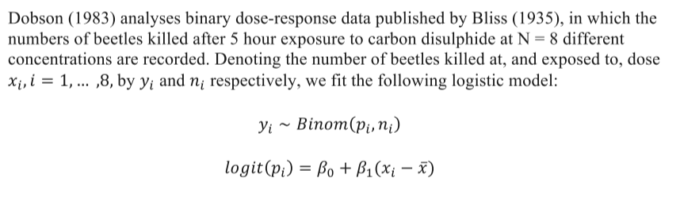

```{r setup, include=FALSE}
knitr::opts_chunk$set(
	echo = TRUE,
	include = TRUE,
	message = FALSE,
	warning = FALSE
)
```


All questions and parts done completely.    

---

# Task 1 - GLM

## Overview of Problem 

### Soft Drink Delivery Times Problem
* Goal: estimation of the required time needed by each employee to refill an automatic vending machines owned and served by the company. 
* For this reason, a small quality assurance study was set-up by an industrial engineer of the company. 
  * As the response variable he considered the `total service time` (measured in minutes) of each machine, including its stocking with beverage products and any required maintenance or housekeeping. 
  * After examining the problem, the industrial engineer recommended two important variables which affect delivery time:  

1. the `number of cases of stocked products` and   
2. the `distance walked by the employee` (measured in feet).  

A dataset of *25 observations* was collected.  

<br>

## `a` Mathematics  

* The *linear predictor* of this data are the `cases` and `distance` variables  
* Since the *predicted variable* `time` is interval data, therefore:
  * The *link* function will be linear $\mu = lin(x)$
  * the *Metric* scale will be used. 
  * Since the Metric scale is used, a typical *noise distribution* for Metric scale types of predicted variables is normally distributed, or $y$ ~ $N(\mu, \sigma)$

### JAGS Model

```{r setupSoftDrinkJAGS}
# The JAGS Model
modelString = 
  "
  model {
  
    # model’s likelihood 
    for (i in 1:n) { 
      time[i] ~ dnorm( mu[i], tau ) # stochastic componenent 
      mu[i] <- beta0 + (beta1 * cases[i]) + (beta2 * distance[i]) 
    }
  
    # prior distributions 
    beta0 ~ dnorm(  0.0, 1.0E-4)  
    beta1 ~ dnorm(  0.0, 1.0E-4)  
    beta2 ~ dnorm(  0.0, 1.0E-4) 
    tau   ~ dgamma( 0.01, 0.01 ) 
  }
  "
```

<br>

## `b` Distribution of Data

### Data for Model
```{r setupSoftDrinkData}
# Data from soft drink experiment. See details below
dataList  = 
  list(n = 25,
       
       # Total Service time (predicted variable)
       # Measure: minutes
       time = c(16.68, 11.5, 12.03, 14.88, 
                13.75, 18.11, 8, 17.83, 79.24, 
                21.5, 40.33, 21, 13.5, 19.75, 
                24, 29, 15.35, 19, 9.5, 35.1,
                17.9, 52.32, 18.75, 19.83, 10.75), 
       
       # Distance an employee walks on foot to the vending machine 
       # (predictor variable 1)
       # Measure: feet
       distance = c(560, 220, 340, 80, 150, 330, 
                    110, 210, 1460, 605, 688, 215,
                    255, 462, 448, 776, 200, 132, 
                    36, 770, 140, 810, 450, 635, 150),
       
       # Number of cases of stocked products to restock
       # (predictor variable 2)
       # Measure: Number of cases of product
       cases = c( 7, 3, 3, 4, 6, 
                  7, 2, 7, 30, 5, 
                  16, 10, 4, 6, 9,
                  10, 6, 7, 3, 17, 
                  10, 26, 9, 8, 4) 
       )
```


### Examine the Data
```{r setupSoftDrinkDataPlots, cache=TRUE}
library(tidyverse)
library(ggplot2)

# Boxplots of the data
df.softDrinks <- data.frame(dataList$time, dataList$distance, dataList$cases)
colnames(df.softDrinks) <- c('time', 'distance', 'cases')
df.softDrinks <- df.softDrinks%>%
  pivot_longer(cols      = everything(),
               names_to  = 'name',
               values_to = 'value')

# Show some of the pivoted Dataset
head(df.softDrinks)

# Create the distribution of data plot
df.softDrinks %>%
  ggplot(aes(x     = name,
             y     = value)) +
  theme_minimal() +
  
  # Create a violin plot under the boxplot to view tails
  geom_violin(color = 'skyblue3',
               fill  = 'skyblue',
               alpha = 0.5) + 
  
  # Create the box plot
  geom_boxplot(color = 'skyblue4',
               fill  = 'grey99',
               alpha = 0.25) +
  
  # Wrap each variable on the columns
  facet_wrap(~name,
             ncol=3,
             scales = 'free') + 
  labs(title = 'Distribution of Data in Dataset',
       subtitle = 'Daniel Carpenter',
       x = '',
       y = 'Value of Data',
       caption = 'Please note varying scales on y-axis for each small multiple (facet)')

# Scatter of the data
# Function to see data: how does prediced value compare to the predictor?
getGLMPlot <- function(predictedValue, predictor, methodName = 'glm', ...)
{
  df <- data.frame(predictedValue, predictor)
  colnames(df) <- c('predictedValue', 'predictor')
  
  plot.glm <- df %>% 
    ggplot(aes(y = predictedValue,
               x = predictor)) +
    labs(title    = 'Snapshot of Data',
         subtitle = 'Daniel Carpenter',
         caption = 'This view is only to see how the two variables move together. Does not assume causal or independant relationship.',
         ...) +
    theme_minimal() +
    
    # Points
    geom_point(color = 'steelblue3') +
    
    # Using a GLM smoother
    geom_smooth(method = methodName,
                color = 'grey80',
                linetype = 'dotdash',
                fill = 'grey87')
  
  # print(plot.glm)
  return(plot.glm)
}

# Distance as a predictor
getGLMPlot(predictedValue = dataList$time    , y = 'Time',
           predictor      = dataList$distance, x = 'Distance')

# Num. Cases as a predictor
getGLMPlot(predictedValue = dataList$time, y = 'Time',
           predictor      = dataList$cases, x = 'Number of Cases')
```


### MCMC Model Control Inputs
```{r, setupSoftDrinkInputs}
# Model Name and Root
fileNameRoot= "Task 1 JAGS Output (Soft Drinks)/" # Directory
modelName   = 'SoftDrinks'      # Name of the model for File Naming


## MCMC Controls
adaptSteps  = 500               # Number of steps to adapt the samplers
burnInSteps = 1000              # Number of steps to burn-in the chains
nChains     = 3                 # nChains should be 2 or more for diagnostics 
nIter       = 10000             # Total Number of iterations to perform


## Parameter Definitions
parameters  = c("tau",          # The parameters to be monitored
                "beta0", 
                "beta1", 
                'beta2') 
```


<br>

## `c-g`  

### Function to Run the JAGS Model
```{r runSoftDrinkJAGS, echo=TRUE}
runJagsFunction <- function(modelString, parameters, nIter=10000, # Total iterations
                            initsList   = list( tau   = 1,  # Initial parameter values
                                                beta0 = 1, 
                                                beta1 = 0, 
                                                beta2 = 0 )) {
  
  source("DBDA2E-utilities.R") # Must be in R's current working directory.
  library(rjags)
  
  # Create the directory for the JAGS output
  dir.create(fileNameRoot)
  
  # Create a text file to hold the model string
  writeLines( modelString , con=paste0(modelName, ".txt") )
  
  # Run the Chains:
  jagsModel = jags.model(file     = paste0(modelName, ".txt"), 
                         data     = dataList, 
                         inits    = initsList, 
                         n.chains = nChains,
                         n.adapt  = adaptSteps 
                         )
  
  # Burn-in:
  cat( "Burning in the MCMC chain...\n" )
  update( jagsModel , n.iter=burnInSteps )
  
  # Sample MCMC
  cat( "Sampling final MCMC chain...\n" )
  codaSamples = coda.samples( jagsModel, variable.names=parameters, n.iter=nIter )
  
  # Note the resulting codaSamples object has these indices: 
  #   codaSamples[[ chainIdx ]][ stepIdx , paramIdx ]
  
  # Save the coda samples
  save( codaSamples , file=paste0(fileNameRoot,"Mcmc.Rdata") )
  
  return(codaSamples)
}
```

### Run Jags Model
```{r runJags1, out.width = "720px", cache=TRUE}
# Run the fun and store
codaSamples <- runJagsFunction(modelString, parameters)

# Diagnostics and Posteriors ----------------------------------------

# Tau
varName = paste0(parameters[1])
diagMCMC( codaObject=codaSamples , parName=varName );
saveGraph( file=paste0(fileNameRoot,varName) , type="png" )

openGraph(); par( mar=c(3.5,0.5,2.5,0.5) , mgp=c(2.25,0.7,0) )
plotPost( codaSamples[,varName] , main=paste0('Posterior Distribution of ', varName) , xlab=paste0(varName), ROPE = c(0.046992, 0.15745)) # from summary(codaSamples)

# Beta 0
varName = paste0(parameters[2])
diagMCMC( codaObject=codaSamples , parName=varName );
saveGraph( file=paste0(fileNameRoot,varName) , type="png" )

openGraph(); par( mar=c(3.5,0.5,2.5,0.5) , mgp=c(2.25,0.7,0) )
plotPost( codaSamples[,varName] , main=paste0('Posterior Distribution of ', varName) , xlab=paste0(varName), ROPE = c(0.086928 , 4.64718)) # from summary(codaSamples)

# Beta 1
varName = paste0(parameters[3])
diagMCMC( codaObject=codaSamples , parName=varName );
saveGraph( file=paste0(fileNameRoot,varName) , type="png" )

openGraph(); par( mar=c(3.5,0.5,2.5,0.5) , mgp=c(2.25,0.7,0) )
plotPost( codaSamples[,varName] , main=paste0('Posterior Distribution of ', varName) , xlab=paste0(varName), ROPE = c(1.263161 , 1.97443)) # from summary(codaSamples)

# Beta 2
varName = paste0(parameters[4])
diagMCMC( codaObject=codaSamples , parName=varName );
saveGraph( file=paste0(fileNameRoot,varName) , type="png" )

openGraph(); par( mar=c(3.5,0.5,2.5,0.5) , mgp=c(2.25,0.7,0) )
plotPost( codaSamples[,varName] , main=paste0('Posterior Distribution of ', varName) , xlab=paste0(varName), ROPE = c(0.006817 , 0.02172)) # from summary(codaSamples)

# graphics.off()

# Density Plots
library(ggmcmc)
s = ggs(codaSamples)
d = ggs_density(s)
print(d)

# Using classical methods (point estimates)
est.softDrink <- glm(time ~ distance + cases, data = dataList)
summary(est.softDrink)

# Using Baysian Methods
summary(codaSamples)
```


## `h` Formula for Model
$$
miles = \beta_0 + \beta_1 \times distance + \beta_2 \times cases + \epsilon
$$

## `i` Interpreation of Results

### For each additional `case` stocked by the employee...   

a - How much delivery time will be required on average (point estimate)? 

* 0.01448 minutes for an additional case stocked  
    
b - How much delivery time will be required on average (interval estimate) and with what posterior   probability?

* There is a probability of 95% that the delivery time between 0.007017 and 0.02198 minutes for an additional 100 ft. walked by the employee.  

<br>

### For every increase of walking `distance` by 100 feet...   
a - What delivery time will be required on average (point estimate)?   

* 1.61015 minutes for an additional 100 ft walked by the employee (I am assuming that the units for the data is per 100 ft. If it was per 1 ft. then it would be 1.61015 * 100)     
    
b - What delivery time will be required on average ( interval  
estimate) and with what posterior probability?

* There is a probability of 95% that the delivery time between 1.250213 and 1.96077 minutes  for an additional 100 ft. walked by the employee. (Note assumption in bullet `a`)  

*Estimates above are approximate by nature of MCMC*


---

<br>

## `j` Add `typical.y`

* The engineer wished to find a typical or representative delivery route.   
* He suggested the following code chunk.  

### New Jags Model
```{r setupNewSoftDrinkJAGS}
# The JAGS Model
modelString2 = 
  "
  model {
  
    # model’s likelihood 
    for (i in 1:n) { 
      time[i] ~ dnorm( mu[i], tau ) # stochastic componenent 
      
      # link and linear predictor 
      # In JAGS, ilogit is logistic. Use logistic since not 0/1 predicted values
      mu[i]     <- beta0 + (beta1 * cases[i]) + (beta2 * distance[i]) 
    }
    
    typical.y <- beta0 + beta1 * mean(cases[]) + beta2 * mean(distance[])
    
    # prior distributions 
    beta0 ~ dnorm(  0.0, 1.0E-4)   
    beta1 ~ dnorm(  0.0, 1.0E-4)   
    beta2 ~ dnorm(  0.0, 1.0E-4) 
    tau   ~ dgamma( 0.01, 0.01 ) 
  }
  "
```

### Run Jags Model
> Note only *monitoring* `typical.y`  

```{r runJags2, cache=TRUE, out.width="720px"}
# Run the fun and store
codaSamples <- runJagsFunction(modelString2, 
                               parameters  = c('typical.y')) # Monitor only R2B typical.y

# Diagnostics and Posteriors ----------------------------------------

# Note not monitoring other parameters to keep the file cleaner.

# Get Plots for typical.y
varName = 'typical.y'
diagMCMC( codaObject=codaSamples , parName=varName );
saveGraph( file=paste0(fileNameRoot,varName) , type="png" )

openGraph(); par( mar=c(3.5,0.5,2.5,0.5) , mgp=c(2.25,0.7,0) )
plotPost( codaSamples[,varName] , main=paste0('Posterior Distribution of ', varName) , xlab=paste0(varName), ROPE = c(21.045328  , 23.7713)) # from summary(codaSamples)

# graphics.off()

# Using Baysian Methods
summary(codaSamples)
```

### Interpretation of `typical.y`:
* The mean  typical outcome of `time` is around 22.3816. I find this interesting given the boxplots showing a median value slightly less than 20 () created at the top of the file).
* There is a probability of 95% that the typical outcome of `time` of will fall between 21 and 23.7
* The param. value’s trace has a defined range and hovers around mean value.  
* No issues with autocorrelation, as it drops significantly immediately.  
* Shrink factor stabilizes (good)  
* Chain densities represent each other well. Slight variation near median values.

*Estimates above are approximate by nature of MCMC*  


---

<br>

## `l` Add $R^{2}_{B}$
* $R^{2}_{B}$ is the sample variance of `Y`  
* $\sigma^2$ is the variance of the random variable `Y` in the model   
* $R^{2}_{B}$ is the reduction in uncertainty of the response variable Y through the model using explanatory variables x  

```{r setup3SoftDrinkJAGS}
# The JAGS Model
modelString3 = 
  "
  model {
  
    # model’s likelihood 
    for (i in 1:n) { 
      time[i] ~ dnorm( mu[i], tau ) # stochastic componenent 
      
      # link and linear predictor 
      # In JAGS, ilogit is logistic. Use logistic since not 0/1 predicted values
      mu[i]     <- beta0 + (beta1 * cases[i]) + (beta2 * distance[i]) 
    }
    
    typical.y <- beta0 + beta1 * mean(cases[]) + beta2 * mean(distance[])
    
    # prior distributions 
    beta0 ~ dnorm(  0.0, 1.0E-4)   
    beta1 ~ dnorm(  0.0, 1.0E-4)   
    beta2 ~ dnorm(  0.0, 1.0E-4) 
    tau   ~ dgamma( 0.01, 0.01 ) 
    
		# definition of sigma
		s2<-1/tau
		s <-sqrt(s2)
		
		# calculation of the sample variance
	  for (i in 1:n){ c.time[i]<-time[i]-mean(time[]) } 
		sy2 <- inprod( c.time[], c.time[] )/(n-1)
		
		# calculation of Bayesian version R squared
		R2B <- 1 - s2/sy2
    
		# Posterior Probabilities
		p.beta0 <- step( beta0 )
		p.beta1 <- step( beta1 )
		p.beta2 <- step( beta2 )
  }
  "
```

### Run Jags Model
> Note only *monitoring* $R^{2}_{B}$  


```{r runJags3, cache=TRUE, out.width="720px"}
# Run the fun and store
codaSamples <- runJagsFunction(modelString3, 
                               parameters  = c('beta2', # want to monitor this to get point est
                                               'R2B') # Monitor only R2B
                               )

# Diagnostics and Posteriors ----------------------------------------

# Note not monitoring other parameters to keep the file cleaner.

# Beta 2
varName = paste0(parameters[4])
diagMCMC( codaObject=codaSamples , parName=varName );
saveGraph( file=paste0(fileNameRoot,varName) , type="png" )

openGraph(); par( mar=c(3.5,0.5,2.5,0.5) , mgp=c(2.25,0.7,0) )
plotPost( codaSamples[,varName] , main=paste0('Posterior Distribution of ', varName) , xlab=paste0(varName), ROPE = c(0.006817 , 0.02172)) # from summary(codaSamples)


# Plots for R2B
varName = 'R2B'
diagMCMC( codaObject=codaSamples , parName=varName );
saveGraph( file=paste0(fileNameRoot,varName) , type="png" )

openGraph(); par( mar=c(3.5,0.5,2.5,0.5) , mgp=c(2.25,0.7,0) )
plotPost( codaSamples[,varName] , main=paste0('Posterior Distribution of ', varName) , xlab=paste0(varName), ROPE = c(0.911270   , 0.97351)) # from summary(codaSamples)

# graphics.off()

# Using Baysian Methods
su = summary(codaSamples)
su
```

### Interpretation of $R2B$:
* The mean  typical outcome of `time` is around 0.9515  
* There is a probability of 95% that the typical outcome of `time` of will fall between 0.911409  and 0.97363
* The param. value’s trace has a defined range and hovers around mean value but dips low sometimes.  
* No issues with autocorrelation, as it drops significantly immediately.  
* Shrink factor stabilizes (good)  
* Chain densities represent each other well.

*Estimates above are approximate by nature of MCMC*  


### Calculate $P(\beta_2 > 0.01|D)$
```{r}
# Since Beta2 must be distributed normally, here get the mean and sd
mu    = su$statistics[2,1]
sigma = su$statistics[2,2]

# Probability that beta2 > 0.01, given the data
probExact = 1 - pnorm(0.01, mu, sigma)

paste('Probability that beta2 > 0.01, given the data:', round(probExact, 3))

```

---

<br>

# Task 2 - Logit/Probit/Centering



## `a` Data

### Data for Model
```{r setupBeetleData}
dataList <- list(
                 # Dose exposed to the beetle
                 x = c(1.6907, 1.7242, 1.7552, 1.7842, 
                       1.8113, 1.8369, 1.8610, 1.8839), 
                 
                 # Concentrations of carbon disulphide 
                 n = c(59, 60, 62, 56, 63, 59, 62, 60), 
                 
                 # Number of beetles killed
                 y = c(6, 13, 18, 28, 52, 53, 61, 60)
                 )
```

### Plots of data
```{r beetlePlots}
require(tidyverse)
# Distance as a predictor
getGLMPlot(predictedValue = dataList$y, y = 'Number of beetles killed',
           predictor      = dataList$x, x = 'Dose exposed to the beetle',
           methodName = 'loess')  + # just using this to see the trend
  geom_text(aes(label = paste0('n=', dataList$n)),
                nudge_y = max(dataList$y) * 0.125,
            size = 3,
            color = 'grey40')
  
```

## `b` JAGS Model `Logit` (*Centered*)
> Model centered Independant variable *dose* (`x`) around it's mean  
> Uses a Logit Link  

* To help convergence, *centering* causes nearly uncorrelated regression coeff's
* [See reasoning for centering article](https://agabrioblog.onrender.com/tutorial/multiple-linear-regression-jags/multiple-linear-regression-jags/)  

### The JAGS Model for Beetles `Logit` (*Centered*)
```{r beetleJAGS}
# The JAGS Model
modelName   = 'BeetlesLogitCenter'      # Name of the model for File Naming

modelStringLogitCenter = 
"
model {

  for (i in 1:8) {
  
    # link and linear predictor 
    y[i] ~ dbin(p[i], n[i]) 
    
          
    # In JAGS, ilogit is logistic. Use logistic since not 0/1 predicted values
    logit(p[i]) <- beta0 + ( beta1 * (x[i] - mean(x[])) ) # Note centering around mean
    
    phat[i] <- y[i]/n[i] 
    yhat[i] <- n[i]*p[i] 
  } 
  
  # prior distributions 
  beta0 ~ dnorm(  0.0, 0.001)  
  beta1 ~ dnorm(  0.0, 0.001)  
}
"
```

### MCMC Model Control Inputs for Beetles `Logit` (*Centered*)
```{r, setupBeetleInputs}
# Model Name and Root
fileNameRoot= "Task 2 JAGS Output (Beetles)/" # Directory

## MCMC Controls
adaptSteps  = 500               # Number of steps to adapt the samplers
burnInSteps = 1000              # Number of steps to burn-in the chains
nChains     = 3                 # nChains should be 2 or more for diagnostics 


## Parameter Definitions
parameters  = c("beta0", 
                "beta1") 
```

## `c` Run Jags Model `Logit` (*Centered*)
```{r runBeetlesJags1, echo=TRUE, out.width = "720px", cache=TRUE}
# Run the fun and store
codaSamplesLogitCenter <- runJagsFunction(modelStringLogitCenter, 
                                          parameters =c("beta0", "beta1") , 
                                          nIter=5000, # Total iterations
                                          initsList   = list( beta0 = 0,  # Note initial values
                                                              beta1 = 0 )
                                          )


# Diagnostics and Posteriors ----------------------------------------

# Beta 0
varName = paste0(parameters[1])
diagMCMC( codaObject=codaSamplesLogitCenter , parName=varName );
saveGraph( file=paste0(fileNameRoot,varName) , type="png" )

openGraph(); par( mar=c(3.5,0.5,2.5,0.5) , mgp=c(2.25,0.7,0) )
plotPost( codaSamplesLogitCenter[,varName] , main=paste0('Posterior Distribution of ', varName) , xlab=paste0(varName), ROPE = c(0.4813 , 1.031)) # from summary(codaSamplesLogitCenter)

# Beta 1
varName = paste0(parameters[2])
diagMCMC( codaObject=codaSamplesLogitCenter , parName=varName );
saveGraph( file=paste0(fileNameRoot,varName) , type="png" )

openGraph(); par( mar=c(3.5,0.5,2.5,0.5) , mgp=c(2.25,0.7,0) )
plotPost( codaSamplesLogitCenter[,varName] , main=paste0('Posterior Distribution of ', varName) , xlab=paste0(varName), ROPE = c(29.1521  , 40.382)) # from summary(codaSamplesLogitCenter)

# graphics.off()

# Density Plots
library(ggmcmc)
s = ggs(codaSamplesLogitCenter)
d = ggs_density(s)
print(d)

# Using Baysian Methods
summary(codaSamplesLogitCenter)
```

---

<br>

## `d` *Non-Centered* Independant Var

### JAGS Model (Non-Centered)
> Model does *not* centered Independant variable `dose`   
> See reasoning for centering on mean above    

### The JAGS Model for Beetles (*not centered*)
```{r beetleJAGS2}
# The JAGS Model
modelName   = 'BeetlesLogitNonCenter'      # Name of the model for File Naming
modelString = 
"
model {

  for (i in 1:8) {
  
    # link and linear predictor 
    y[i] ~ dbin(p[i], n[i]) 
    
          
    # In JAGS, ilogit is logistic. Use logistic since not 0/1 predicted values
    # Note that x is non-centered now since it is not centering around mean
    logit(p[i]) <- beta0 + ( beta1 * x[i] )      # Removed (x[i] - mean(x[]))
    
    phat[i] <- y[i]/n[i] 
    yhat[i] <- n[i]*p[i] 
  } 
  
  # prior distributions 
  beta0 ~ dnorm(  0.0, 0.001)  
  beta1 ~ dnorm(  0.0, 0.001)  
}
"
```

### Run Jags Model (*Non-Centered*) 
* Note inputs same as last model except for `modelString` changed directly above

```{r runBeetlesJags2, echo=TRUE, out.width = "720px", cache=TRUE}
# Run the fun and store
codaSamplesLogitNonCenter <- runJagsFunction(modelString, parameters = c("beta0", 
                                                                         "beta1"), 
                                             nIter=5000, # Total iterations
                                             initsList   = list( beta0 = 1, 
                                                                 beta1 = 1 )
                                             )


# Diagnostics and Posteriors ----------------------------------------

# Beta 0
varName = paste0(parameters[1])
diagMCMC( codaObject=codaSamplesLogitNonCenter , parName=varName );
saveGraph( file=paste0(fileNameRoot,varName) , type="png" )

openGraph(); par( mar=c(3.5,0.5,2.5,0.5) , mgp=c(2.25,0.7,0) )
plotPost( codaSamplesLogitNonCenter[,varName] , main=paste0('Posterior Distribution of ', varName) , xlab=paste0(varName), ROPE = c(0.4813 , 1.031)) # from summary(codaSamplesLogitNonCenter)

# Beta 1
varName = paste0(parameters[2])
diagMCMC( codaObject=codaSamplesLogitNonCenter , parName=varName );
saveGraph( file=paste0(fileNameRoot,varName) , type="png" )

openGraph(); par( mar=c(3.5,0.5,2.5,0.5) , mgp=c(2.25,0.7,0) )
plotPost( codaSamplesLogitNonCenter[,varName] , main=paste0('Posterior Distribution of ', varName) , xlab=paste0(varName), ROPE = c(29.1521  , 40.382)) # from summary(codaSamplesLogitNonCenter)

# graphics.off()

# Density Plots
library(ggmcmc)
s = ggs(codaSamplesLogitNonCenter)
d = ggs_density(s)
print(d)

# Using Baysian Methods
summary(codaSamplesLogitNonCenter)
```


## `e` Interpretation (*Non-Centered*)  
* Parameter values never hover around the mean  
* High Autocorrelation occurs and never reduces.  
* Shrink factor unstable and never settles  
* Clearly, the model does not converge among the three chains.  

<br>

## `f` Pairs Plots
> Centered vs. Non-Centered Independant Variables

### Create the Plots

```{r, pairs, cache=TRUE}
require(ggmcmc)
library(GGally)

# Centered Independant Variable
ggs_pairs(ggs(codaSamplesLogitCenter), 
          
          # Change to Contours
          lower = list(continuous =  'density'), 
          
          # Color by Chain and add transparency
          mapping = aes(color = Chain, alpha = 0.2)
          ) + 
  labs(title = 'Pair Plot of Logistic Simulation',
       subtitle = 'Centered Independant Variable | Daniel Carpenter\n') + 
  theme_minimal() + theme(text = element_text(color = 'grey25'))


# Centered Independent Variable
ggs_pairs(ggs(codaSamplesLogitNonCenter), 
          
          # Change to Contours
          lower = list(continuous =  'density'), 
          
          # Color by Chain and add transparency
          mapping = aes(color = Chain, alpha = 0.2)
          ) + 
  labs(title = 'Pair Plot of Logistic Simulation',
       subtitle = 'Non-Centered Independant Variable | Daniel Carpenter\n') + 
  theme_minimal() + theme(text = element_text(color = 'grey25'))

```

<br>

### Pairs - Centering/Non-Centering

#### *Centering* accomplishes...  
* Centering allows for convergence among the chains  
* Low levels of cross-correlation  
* Extremely stable results  

<br>

## `g` Random vs. Non-Random Vars

Type       | Variables
-----------|-------------
Random     | p[i], y[i], yhat[i]
Not Random | beta0, beta1, phat[i], 

<br>

## `h` Jags Model using `Probit` (*Centered*)

### The JAGS Model for `Probit` Beetles
```{r beetleJAGS3}
# The JAGS Model
modelName   = 'BeetlesProbitNonCenter'      # Name of the model for File Naming

modelString = 
"
model {

  for (i in 1:8) {
  
    # link and linear predictor 
    y[i] ~ dbin(p[i], n[i]) 
    
    # Now using a probit
    probit(p[i]) <- beta0 + ( beta1 * (x[i] - mean(x[])) ) # Note centering around mean
          
    # Note The old logit method
    # logit(p[i]) <- beta0 + ( beta1 * (x[i] - mean(x[])) ) # Note centering around mean
    
    phat[i] <- y[i]/n[i] 
    yhat[i] <- n[i]*p[i] 
  } 
  
  # prior distributions 
  beta0 ~ dnorm(  0.0, 0.001)  
  beta1 ~ dnorm(  0.0, 0.001)  
}
"
```

### Run Jags Model `Probit` (*Centered*)
```{r runBeetlesJags3, echo=TRUE, out.width = "720px", cache=TRUE}
# Run the fun and store
codaSamplesProbitCenter <- runJagsFunction(modelString, 
                                           parameters = c("beta0", "beta1"), 
                                           nIter=5000, # Total iterations
                                           initsList   = list( beta0 = 0,  # Note initial values
                                                               beta1 = 0 )
                                           )


# Diagnostics and Posteriors ----------------------------------------

# Beta 0
varName = paste0(parameters[1])
diagMCMC( codaObject=codaSamplesProbitCenter , parName=varName );
saveGraph( file=paste0(fileNameRoot,varName) , type="png" )

openGraph(); par( mar=c(3.5,0.5,2.5,0.5) , mgp=c(2.25,0.7,0) )
plotPost( codaSamplesProbitCenter[,varName] , main=paste0('Posterior Distribution of ', varName) , xlab=paste0(varName), ROPE = c(0.295   , 0.5969)) # from summary(codaSamplesProbitCenter)

# Beta 1
varName = paste0(parameters[2])
diagMCMC( codaObject=codaSamplesProbitCenter , parName=varName );
saveGraph( file=paste0(fileNameRoot,varName) , type="png" )

openGraph(); par( mar=c(3.5,0.5,2.5,0.5) , mgp=c(2.25,0.7,0) )
plotPost( codaSamplesProbitCenter[,varName] , main=paste0('Posterior Distribution of ', varName) , xlab=paste0(varName), ROPE = c(16.947   , 22.7206)) # from summary(codaSamplesProbitCenter)

# graphics.off()

# Density Plots
library(ggmcmc)
s = ggs(codaSamplesProbitCenter)
d = ggs_density(s)
print(d)

# Using Baysian Methods
summary(codaSamplesProbitCenter)

# Pairs plot
pairs <- ggs_pairs(s, 
                   
                   # Change to Contours
                   lower = list(continuous =  'density'), 
                   
                   # Color by Chain and add transparency
                   mapping = aes(color = Chain, alpha = 0.2)) +
  
                   labs(title = 'Pair Plot of Logistic Simulation',
                        subtitle = 'Non-Centered Independant Variable | Daniel Carpenter\n') + 
                   theme_minimal() + theme(text = element_text(color = 'grey25'))

print(pairs)
```

### Interpretation of Results (`Probit`)
* Similar outcome as the `logit` model (in terms of convergence and stationarity)  
* However, significantly different results for the point estimate of $\beta_1$.  

<br>

## `i` Plot Estimations of `Logit` (*Centered*)

### Function to Plot Fit of Coda
```{r logitCenterFit, cache=TRUE}
# Rerun with p and yhat
# Rerun model because in past run wanted to see density plots of only beta1 and 2
# Took way too long for the pairs plot so just rerunnning
modelName   = 'BeetlesLogitNonCenter2'      # Name of the model for File Naming
codaSamplesLogitCenter2 <- runJagsFunction(modelStringLogitCenter, 
                                           parameters =c("beta0", "beta1",
                                                         'p','yhat') , 
                                           nIter=5000, # Total iterations
                                           initsList   = list( beta0 = 0,  # Note initial values
                                                               beta1 = 0 )
                                           )

# Function to plot code sample line fit
getLineFitFromCoda <- function(codaSamplesLogitCenter2, # Coda Samples 
                               dataList,               # Actual data (list of y and x)
                               valuesOf) {             # either 'p' or 'yhat'
  
  require(tidyverse)
  require(ggplot)
  require(DescTools) # %like% function
  
  # Create a summary of the codaSample simulations
  codaSummary <- summary(codaSamplesLogitCenter2)
  
  # Actual dataList as a data frame
  actualData <- data.frame(y = dataList$y, 
                           # n = dataList$n, #intentionally do not include n
                           x = dataList$x)
  
  # Coda sample stats and names
  codaStats <- as.data.frame(codaSummary$statistics) %>%
    mutate(statName = rownames(codaSummary$statistics)) %>%
    select(statName, mean = Mean)
  
  # Coda sample quantiles and names
  codaQuantiles <- as.data.frame(codaSummary$quantiles) %>%
    mutate(statName = rownames(codaSummary$quantiles)) %>%
    select(statName,
           lowerTail = `2.5%`,
           upperTail = `97.5%`)
  
  df.codaSummary <- codaStats %>% 
    
    # Join the stats and CI together
    left_join(codaQuantiles, 
              by = 'statName') %>%
    
    # Filter to the parameter based on input
    filter(statName %like% paste0(valuesOf, '%')) %>%
    
    # Rename stat name to the one inputted (get rid of idxs)
    mutate(statName = valuesOf)
  
  # Filter down to the 
  df <- df.codaSummary %>%
    bind_cols(actualData)
  
  
  # ------------------------------------------------------------------------------
  # PLOTS
  # ------------------------------------------------------------------------------
  
  lineSize = 0.75
  
  # Create the colors to map to the legend for easy viewing
  legendMapping = c('Actual Data' = 'tomato3',
                    'Mean Est.'= 'steelblue3',
                    '95% Upper/Lower Tail' = "grey70"
                    )
  
  # If p, then Convert y to % of total since cumulative prob, not nominal values
  if (valuesOf == 'p') { 
    df$y = df$y / max(df$y)
  }
  
  # Create the plot
  plot.fit <- df %>% 
    
    ggplot(aes(x=x)) + 
    
    # Lines ----
    
    ## 95% lower bound
    geom_line(aes(y=lowerTail,  color='95% Upper/Lower Tail'), # map to legend/color
              linetype='dashed', size = lineSize) +   
    
    ## Mean Estimate
    geom_line(aes(y=mean, color = 'Mean Est.'), # map to legend/color
              size = lineSize) +                                    
    
    ## 95% upper bound
    geom_line(aes(y=upperTail, color='95% Upper/Lower Tail'), # map to legend/color
              linetype = 'dashed', size = lineSize) + 
    
    ## Plot the actual data
    geom_point(aes(y=y, color = 'Actual Data'), # map to legend/color
               size = 2, alpha = 0.5) +                              
    
    # Map the colors
    scale_color_manual(name = "", values = legendMapping) + 
    
    # Labels on plot using input
    labs(title = paste('Model Fit of Variable', valuesOf),
         subtitle = paste0('How does the Centered Logit Model fit the Actual Data?\nDaniel Carpenter'),
         y = paste0(valuesOf, '\n'),
         x = 'Dose Concentration') +
    
    # The theme
    theme_minimal() + theme(text = element_text(color = 'grey30'),
                            legend.position = 'top')
    
  
  return(plot.fit)
}
```

### Get the Line Fit
```{r runFunFit, cache=TRUE}
# Plot the lines and fit for p
getLineFitFromCoda(codaSamplesLogitCenter2, dataList, valuesOf = 'p')    

# Plot the lines and fit for yhat
getLineFitFromCoda(codaSamplesLogitCenter2, dataList, valuesOf = 'yhat') 
```


---

<br>

# Task 3 - Titanic / Logistic

## `1` Describe Data 

### Get Titanic Data
```{r, titanicData}
require(vcdExtra) # Titanic passenger data
require(knitr) # Titanic passenger data
data("Titanicp")

# Head of data
kable(head(Titanicp))
```

<br>

### Describe Data

Variable Name | Description
--------------|-------------
`pclass`      | Class of Passenger ('1st', '2nd', '3rd'). 1st is highest class, 3rd is lowest class.
`survived`    | Whether the passenger 'died' or 'survived' after the Titanic sank
`sex`         | Sex of the passenger $\in$ (male, female)
`age`         | passenger age in years (or fractions of a year, for children), a numeric vector; age is missing for 263 of the passengers
`sibsp`       | Number of siblings or spouses aboard; integer: 0:8
`parch`       | Number of parents or children aboard; integer: 0:6

<br>

## `2` Plots of Data 

### Plots
```{r ggplots, cache=TRUE}
library(ggplot2)

# Overview
ggplot(Titanicp, 
       aes(x     = age,
           color = pclass,
           fill  = pclass)) + 
  
  # Density
  geom_density(alpha = 0.25) + 
  
  # Facets
  facet_grid(cols = vars(sex),
             rows = vars(survived)) +

  labs(title    = 'Titanic Survivor/Death Overview',
       subtitle = 'Daniel Carpenter\n') + 
  
  theme(panel.background = element_blank(),
        panel.grid = element_line(color='grey95'),
        legend.position = 'top')


# Survived vs not 
g = ggplot(Titanicp, aes(x = age, 
                         y=as.numeric(survived =="survived"),
                         color = sex)) + 
  ylab("Survived") + 
  theme_bw() 

# Jitter the plot so that the points are not on top of each other
# Mainly woman who survived, but not exact relationship
JITTER_AMOUNT = 0.015
g = g + geom_point(position = position_jitter(height = JITTER_AMOUNT, width =0))
g

# Generalized Linear Model - binomial with link logit. Also fit a cubic
# Older woman are more likely to survive, and younger boys are more likely to survive
# Note wide interval likely due to limited sample size
g = g + stat_smooth(method = "glm", 
                    method.args = list(family=binomial("logit")), 
                    formula = y ~ x + I(x^2) + I(x^3), 
                    alpha = 0.25, size = 2.5, 
                    aes(fill = sex))
g

# Now break out by class of passenger
# First class females have high likelihood of survival
g = g + facet_wrap(~pclass)
g

# Pairs Plot
ggpairs(Titanicp)
```

<br>

### Interpretation of Plots

* Most of the individuals who died were older males. However, some females died too.  

* Young individuals regardless of age have similar survival rates, but males plummit quickly  

* Without consideration of class, females have higher likelihood of survival with incraesed age  

* Limited sample size with wider tails in older age groups  

* It appears that 1st class had highest priority for life boats (see slope and intercept). Third class had low priority regardless of age, but age still negatively impacted likelihood of survival.   

<br>

## `3` JAGS Models

### Create 2 Models to Compare

```{r rJags, cache=TRUE}
# Classical methods 
clglm = glm(survived ~ sex + age + sex:age,family = "binomial", data = Titanicp)
summary(clglm)

# Convert the data to a list and model matrix
mat1=model.matrix(clglm)
mat2=model.frame(clglm)
head(mat1)

# Create output
y = with(mat2, ifelse(survived == "survived", 1, 0))

# Data list for MCMC model
dataList=list(y = y, x = mat1[, "age"],sexm = mat1[,"sexmale"], sexmx = mat1[,"sexmale:age"] , n = length(y))

library (rjags)

#Define the first model (more complex): 
modelString1 = 
" 
model {
  for(i in 1:n) { 
    y[i] ~ dbin(theta[i], 1) 
    eta[i]<- beta[1] + beta[2] * x[i] + beta[3] *sexm[i] + beta[4]*sexmx[i]
    
    logit (theta[i]) <- eta[i]
  }
  # L<- -10 
  # U <- 10 
  
  for(j in 1:4) {
    beta[j] ~ dnorm(0, 1.0E-3)
  }
}
"
  
#Define the second model (less complex): 
modelString2 = 
" 
model {
  for(i in 1:n) { 
    y[i] ~ dbin(theta[i], 1) 
    eta[i]<- beta[1] + beta [2] *x[i]
  
    logit(theta[i]) <- eta[i]
  }
  # L<- -10 
  # U <- 10 
  
  for(j in 1:2) {
    beta[j] ~ dnorm (0,1.0E-3)
  }
}
"

writeLines ( modelString1, con="TEMPmodel1.txt" ) 
writeLines ( modelString2, con="TEMPmodel2.txt" )

initsList1 = list (beta = c(0.5,0.02,-1.15,-0.05)) 
initsList2 = list (beta = c(0.5, 0.02))

# JAGS MODEL 1 -----------------------------------------------------------------

# Run the chains model 1: 
jagsModel1 = jags.model( file="TEMPmodel1.txt" , data=dataList , inits=initsList1 , 
                        n.chains=3 , n.adapt=500 )

update( jagsModel1 , n.iter=500 )
codaSamples1 = coda.samples( jagsModel1 , variable.names=c("beta"),
                            n.iter=3333 )
save( codaSamples1 , file=paste0("Model1_","Mcmc.Rdata") )

library(ggmcmc)

# Densities
s1 = ggs(codaSamples1)
d1 = ggs_density(s1)
print(d1)

# Cross correlations
cr1 =  ggs_crosscorrelation(s1)
print(cr1)

summary(codaSamples1)


# JAGS MODEL 2 -----------------------------------------------------------------

# Run the chains model 2: 
jagsModel2 = jags.model( file="TEMPmodel2.txt" , data=dataList , inits=initsList2, 
                        n.chains=3 , n.adapt=500 )

update( jagsModel2 , n.iter=500 )
codaSamples2 = coda.samples( jagsModel2 , variable.names=c("beta"),
                            n.iter=3333 )
save( codaSamples2 , file=paste0("Model2_","Mcmc.Rdata") )

# Densities
s2 = ggs(codaSamples2)
d2 = ggs_density(s2)
print(d2)

# Cross correlations
cr2 =  ggs_crosscorrelation(s2)
print(cr2)

summary(codaSamples2)
```

<br>

### DIC
> Deviance Information Criterion   
 

```{r DIC, cache=TRUE}

# Takes the model 1 and a penality using traditonal DIC
dic1 = dic.samples(jagsModel1, n.iter = 2000, type = 'pD')
dic1

# Takes the model 2 and a penality using traditonal DIC
dic2 = dic.samples(jagsModel2, n.iter = 2000, type = 'pD')
dic2

# Want the smallest DIC model, so you can see 
# First model has the smaller DIC, so use that
diffdic(dic1, dic2)
```   

## `4` Intepretation of Smallest DIC Model
> Using smallest DIC model since that it best  

* All values stated as approximately since each MCMC run will generate a slightly different estimate.

### $\beta$'s and Interpretion of Likelihood of Survival
$\beta_1$: the mean value ($\mu$) for $\beta_1$ is around  0.50952 and the $\sigma$ is 0.257209. I.e., each person could either survive   
$\beta_2$: the mean value ($\mu$) for $\beta_2$ is around  0.02229 and the $\sigma$ is 0.008631 I.e. the older you are, the less likely you are to survive.   
$\beta_3$: the mean value ($\mu$) for $\beta_3$ is around -1.17196 and the $\sigma$ is 0.344398 I.e. a male is more likely to die than a female.   
$\beta_4$: the mean value ($\mu$) for $\beta_4$ is around -0.04620 and the $\sigma$ is 0.011349 I.e. if you are a male, your outcomes worsen even more if as you age    

### Interval Estimates
* All values stated as approximately since each MCMC run will generate a slightly different estimate.

With a probability of 95%, the mean value for:  
$\beta_1$ will be between  0.021934 and  0.98688  
$\beta_2$ will be between  0.006393 and  0.03890  
$\beta_3$ will be between -1.802094 and  -0.52080   
$\beta_4$ will be between -0.068479 and  -0.02551   

### Convergence
Sampler converged since each chain well represents each other.

### Compared to Classical Estimates
For each variable, the MCMC estimate represents the classical estimate nearly exactly
