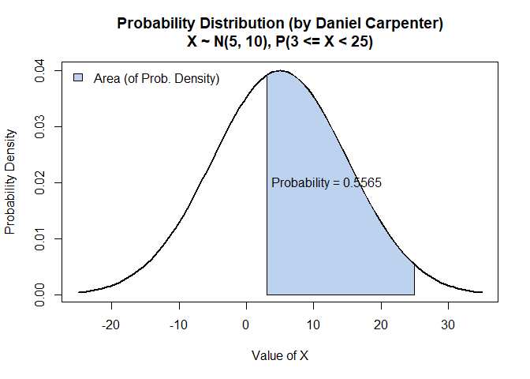

Exam 1
================
Daniel Carpenter
April 2022

-   [](#section)
-   [See Answers to Questions Below:](#see-answers-to-questions-below)
    -   [Basic Distributional
        Properties](#basic-distributional-properties)
    -   [Bayes Rules Proofs](#bayes-rules-proofs)
    -   [Coin Die Simululation](#coin-die-simululation)
    -   [SLR in Jags and OpenBUGS](#slr-in-jags-and-openbugs)

# 

# See Answers to Questions Below:

------------------------------------------------------------------------

<br>

## Basic Distributional Properties

> Suppose that X∼Pois(λ=4) where λ is the average number of particles
> leaving an unstable nucleus per second.

### Find P(X≥8) using an R function

``` r
x = 8
1-ppois(x-1, lambda = 4) # x - 1 since discrete
```

    ## [1] 0.05113362

### Find P(X=2)

``` r
dpois(2, lambda = 4) # dpois() since exact probability
```

    ## [1] 0.1465251

### Make a plot of the distribution of X for X=0 up to X=30

``` r
# Function to plot the poisson distribution (discrete)
myPoisPlot <- function(x, lambdaValue) {
  theTitle = paste('Poisson Distribution: Lambda = ', lambdaValue, 'Over Discrete Values of x\nDaniel Carpenter')
  
  probx <- dpois(x, lambda = lambdaValue)
  names(probx) <- x
  
  barplot(probx, col = paste0("lightsteelblue", floor(runif(1, min=1, max=4))), 
          main = theTitle, xlab ='Discrete Values of x', ylab ='Probability given Lambda')
}

myPoisPlot(x=0:30, lambdaValue=4)
```

<!-- -->

The following is for the case where Y∼N(μ=6,σ=10) \* Normally
distributed with mean of 6 and standard deviation of 10

``` r
mu    = 6
sigma = 10
```

### Find P(Y≤3) using an R function

``` r
pnorm(3, mu, sigma)
```

    ## [1] 0.3820886

### Find P(5≤Y\<8) using R

``` r
# Inputs for upper and lower bound when calculating the area
upperBound = 8
lowerBound = 5

# Calculate the area in between the two bounds
pnorm(upperBound, mu, sigma) - pnorm(lowerBound, mu, sigma)
```

    ## [1] 0.1190875

### Make an R function `mynorm(a, b, mu)`

> Plot the area between a and b where b\>a and below the density curve
> when Y is distributed as follows, Y∼N(μ,σ=10) and display a 4 dec
> estimate of the area. Make sure your name appears on the plot.

``` r
mynorm <- function(lowerBound = NA, upperBound = NA, mu, sigma=10)
{
  # Round to this many decimal places on the plot
  roundTo = 4
  
  # Color of the plot
  color = paste0("lightsteelblue", floor(runif(1, min=1, max=4)))
  
  # Calculate the "xlim" lower and upper bound for the Normal PDF Curve
  curveLowerBound <- mu - 3*sigma
  curveUpperBound <- mu + 3*sigma
  
  # Initialize variables related to output and graph
  title <- ""   # Title of graph
  exactProb = 0 # The exact probability of the questions
  
  # If no provided LOWER AND UPPER Bound (NA as parameter value) then assume none
  if (!(is.na(lowerBound)) & !(is.na(upperBound))) {
    title <- paste0(", P(", lowerBound, " <= X < ",upperBound,")")
    exactProb = pnorm(upperBound, mu, sigma) - pnorm(lowerBound, mu, sigma) # calculate prob 
    
  # If no provided LOWER Bound (NA as parameter value) then assume none
  } else if (is.na(lowerBound)) {
    lowerBound = curveLowerBound
    title <- paste0(", P(X < ",upperBound,")") # Set a dynamic title
    exactProb = pnorm(upperBound, mu, sigma) # calculate prob 
    
  # If no provided UPPER Bound (NA as parameter value) then assume none
  } else if(is.na(upperBound)) {
    upperBound = curveUpperBound
    title <- paste0(", P(X >= ",lowerBound,")")
    exactProb = 1 - pnorm(lowerBound, mu, sigma) # calculate prob 
  }
  
  # Create the line that displays the bell curve (between the CURVE bounds defined above)
  curve(
    
    ## Normally Distributed
    dnorm(x,mu,sigma), 
    
    ## Normally Distributed
    xlim=c(curveLowerBound, curveUpperBound), 
    
    ## Line width
    lwd =2, 
    
    ## Title with descriptive characteristics about function parameters
    main = paste0("Probability Distribution (by Daniel Carpenter)\n",
                  "X ~ N(",mu,", ",sigma,")", title),
    
    ## X and Y labels
    ylab = 'Probability Density',
    xlab = 'Value of X',
  )

  
  # Add the AREA of between the lower and upper bound P(lowerBound<X<=upperBound)
  
    ## X-Axis curve (length does not matter)
    xcurve = seq(lowerBound,upperBound, length=1000)
    
    ## Y-Axis Curve
    ycurve = dnorm(xcurve, mu,sigma)
    
    ## Combine the X and Y curve to form the area (in green)
    polygon(c(lowerBound, xcurve, upperBound), 
            c(0, ycurve, 0), 
            col=color) 
    
    ## Legend
    legend("topleft", legend="Area (of Prob. Density)", 
           fill=color, bty = "n")
  
  # Add the probability as text
    
    ## Calculate the area (probability)
    area = exactProb
    areaRounded = format(round(area, roundTo), nsmall=roundTo)
    
    ## Place this on the above plot
    text(12,0.02,substitute(paste("Probability = ", areaRounded), 
                            list(areaRounded = areaRounded)))
}
```

#### Call your function with the following parameters `mynorm(3,25,5)`, `mynorm(0,20,5)`, `mynorm(-6,10, 5)`

``` r
mynorm( 3, 25, 5)
```

<!-- -->

``` r
mynorm( 0, 20, 5)
```

<!-- -->

``` r
mynorm(-6, 10, 5)
```

<!-- -->

------------------------------------------------------------------------

<br>

## Bayes Rules Proofs

### Proof of Beta Posterior

*Adapted from JK’s book - page 132 Doing Bayesian Data Analysis:* <br>

If
")
and
"),
prove that
")
through proof below:

 \propto p(\theta) p(x \mid \theta) = \frac{1}{B(\alpha, \beta)} \theta^{\alpha-1}(1-\theta)^{\beta-1}\left(\begin{array}{l}n \\ x\end{array}\right) \theta^{x}(1-\theta)^{n-x}")

Note Bayes’ rule  
}_{Posterior} \propto \underbrace{p(\theta)}_{Prior} \underbrace{p(x \mid \theta)}_{Lik.} = \frac{p(x, n \mid \theta) p(\theta)}{p(x, n)} = p(\theta \mid x, n)")
<br>

Define Bernoulli and beta distributions  
^{(n-x)}}_{Bernoulli \ Lik.} \underbrace{\frac{\theta^{(\alpha-1)}(1-\theta)^{(\beta-1)}}{B(\alpha, \beta)}}_{Beta \ Prior} / p(x, n)")
<br>

Rearrange factors  
 p(x, n)} \theta^{(\alpha-1)} (1-\theta)^{(\beta-1)} \theta^{x}(1-\theta)^{(n-x)}")
<br>

} \theta^{(\alpha-1)} (1-\theta)^{(\beta-1)} \left(\begin{array}{l}\frac{1}{p(x, n)}\end{array}\right)\theta^{x}(1-\theta)^{(n-x)}")
<br>

By definition of the binomial coefficient, which we arrive at the
solution:  
} \theta^{(\alpha-1)} (1-\theta)^{(\beta-1)} \left(\begin{array}{l}n \\ x\end{array}\right) \theta^{x}(1-\theta)^{(n-x)}")
<br>

------------------------------------------------------------------------

<br>

### Proof of Bayes Rule w/2 Discrete Events

Prove Bayes Rule for the case of two discrete events:
=\frac{p(A) p(B \mid A)}{p(B)}"),
assuming:
=\frac{p(A \cap B)}{p(B)}")

Below framework taken from pg. 101 from JK’s *Doing Bayesian Data
Analysis*:

1.  From the definition of conditional probability (*JK pg. 92*):  
    =\frac{p(B, A)}{p(B)}")

2.  Do some algebra - Multiply both sides by
    "):  
     p(B)=p(B, A)")

3.  With definition:
    =\frac{p(B, A)}{p(A)}"),
    we get:  
     p(A)=p(B, A)")

4.  Since steps (2) and (3) are equal to
    "),
    we can assume:  
     p(B)=p(B \mid A) p(A)")

5.  Divide by
    ")
    to get:  
    =\frac{p(B \mid A) p(A)}{p(B)}")

6.  You could also show a solution where the denominator is in terms of
    "):  
    =\frac{p(B \mid A) p(A)}{\sum_{A^{*}} p\left(B \mid A^{*}\right) p\left(A^{*}\right)}")

Note that steps 5 and 6 are equivalent to `Bayes Theorem`. Therefore,
=\frac{P(A, B)}{P(B)} \equiv \frac{P(A \text { and } B)}{P(B)} \equiv \frac{P(A \cap B)}{P(B)} = \frac{P(B \mid A) P(A)}{P(B)}"),
or Bayes Theorem

------------------------------------------------------------------------

<br>

## Coin Die Simululation

Code for Coin Die Simulation:

``` r
coindie<-function(n=100, h=c(1/4,3/4),E2=c(5,6),init=1,...) {
  if(!require(xtable)) install.packages(xtable)
  dieset<-c()
  dieset[1]<-"E1"
  
  die<-function(n=1) {
    sample(1:6,size=n,replace=TRUE)
  }
  
  coin<-function(n=1) {
    sample(1:2,size=n,replace=TRUE)
  }
  
  face<-c()
  alpha<-c() # holds acceptance probs
  alpha[1]<-1
  post<-c()# post sample
  prop<-c() # vec of proposed states 1s and 2s
  prop[1]=init # initial state
  post[1]=prop[1]
  dice<-c()
  dice[1]<-die()
  
  for(i in 2:n) { # starts at 2 because initial value given above
    prop[i]<-coin()
    alpha[i]=min(1,h[prop[i]]/h[post[i-1]])
    
    dice[i]<-die()
    
    ifelse(alpha[i]==1,dieset[i]<-"E1",dieset[i]<-"E2")
    
    # is x an element of set y
    if(alpha[i]==1 | (is.element(dice[i],E2) & alpha[i]!=1)){post[i]<-prop[i]}
    else { post[i]<-post[i-1] }
  }  
  res<-matrix(c(prop,round(alpha,2),dieset,dice,post ),nc=5,nr=n,byrow=FALSE,dimnames=list(1:n,c("proposal","alpha", "E","dice","post")))
  sim<-table(post)/n
  postexact<-h/sum(h)
  
  # Plots
  layout(matrix(1:2, nr=1,nc=2))
  plot(post,type ="l",...)
  names(h)=c("1", "2")
  barplot(h)
  
  # Return the iterations, simulation, posterior exact and the estimate, and a table of the res
  return(list(iter=res,sim=sim,postexact=postexact,post=post,xtable=xtable(res,dig=1)) )
}

set.seed(25) # Set seed

# Call the function
coindie(n=10,h=c(0.6,0.4),E2=c(3,4,5,6)) ->ans
```

<!-- -->

``` r
# Shoe the Results
ans$it
```

    ##    proposal alpha  E    dice post
    ## 1  "1"      "1"    "E1" "5"  "1" 
    ## 2  "2"      "0.67" "E2" "4"  "2" 
    ## 3  "1"      "1"    "E1" "1"  "1" 
    ## 4  "2"      "0.67" "E2" "1"  "1" 
    ## 5  "2"      "0.67" "E2" "3"  "2" 
    ## 6  "2"      "1"    "E1" "4"  "2" 
    ## 7  "1"      "1"    "E1" "3"  "1" 
    ## 8  "1"      "1"    "E1" "4"  "1" 
    ## 9  "2"      "0.67" "E2" "2"  "1" 
    ## 10 "1"      "1"    "E1" "5"  "1"

### When the `coindie` function is called above what is the acceptance set?

-   The initial acceptance set is E1, and it finishes at E1.

### There are 10 iterations above. From the table of output `ans$it` how many times does the sampler move from state 1 to 2?

``` r
POST_COLUMN = 1 # Column number that the post are in
post <- ans$it[,POST_COLUMN] # Get the states from the iterations

from1to2 = 0 # track the state changes from 1 to 2
for (i in 1:(length(post) - 1)) {
  
  # If the proposal changes from 1 to 2 (not 2 to 1), then count it
  if ((post[i] == 1) & (post[i+1] == 2)) {
    from1to2 = from1to2 + 1
  } 
}

paste('Specifically, the sampler moves from *state one* to *state two*', from1to2, 'times')
```

    ## [1] "Specifically, the sampler moves from *state one* to *state two* 3 times"

``` r
countOfChanges  = 0 # track the total number of changes
for (i in 1:(length(post) - 1)) {
  
  # If any state change occurs, then count it
  if (post[i] != post[i+1]) {
    countOfChanges = countOfChanges + 1
  } 
}

paste('The total number of times the sampler changes states is', countOfChanges, 'times')
```

    ## [1] "The total number of times the sampler changes states is 6 times"

### Write down the formula for the acceptance probability.

Note below is from page 33 of *Teaching MCMC* by Stewart & Stewart:


where

is the probability of accepting state

given that the sampler is at state
.

------------------------------------------------------------------------

<br>

## SLR in Jags and OpenBUGS

### SLR OpenBUGS Model

-   Make a DAG using the doodle bug editor in `OpenBUGS` for the simple
    linear regression model.
    

### Check model in OpenBUGS, then use pretty print and place the code in model below

``` r
require(rjags)               # Must have previously installed package rjags.

fileNameRoot="Exam1" # For output file names.
x=-20:19
set.seed(33)
y=10+20*x + rnorm(40,0,15)

Ntotal = length(y)  # Compute the total number of x,y pairs.
dataList = list(    # Put the information into a list.
  x = x,
  y = y ,
  Ntotal = Ntotal 
)

# Define the model:
modelString = "
model{
    for( i in 1 : Ntotal ) {
        y[i] ~ dnorm(mu[i], tau)
        mu[i] <- beta0 + beta1 * x[i]
    }
    beta0 ~ dnorm(0.0, 1.0E-6)
    beta1 ~ dnorm(0.0, 1.0E-6)
    sigma ~ dunif(0, 1000)
    tau <- pow(sigma,  -2)
}
" # close quote for modelString
writeLines( modelString , con="TEMPmodel.txt" )

# Initialize the chains based on MLE of data.
initsList = list(beta0 = 0, beta1 = 0, sigma =10)

# Run the chains:
jagsModel = jags.model( file="TEMPmodel.txt" , data=dataList , inits=initsList , 
                        n.chains=3 , n.adapt=500 )
```

    ## Compiling model graph
    ##    Resolving undeclared variables
    ##    Allocating nodes
    ## Graph information:
    ##    Observed stochastic nodes: 40
    ##    Unobserved stochastic nodes: 3
    ##    Total graph size: 170
    ## 
    ## Initializing model

``` r
update( jagsModel , n.iter=500 )
codaSamples = coda.samples( jagsModel , variable.names=c("beta0", "beta1", "sigma") ,
                            n.iter=33340 )
save( codaSamples , file=paste0(fileNameRoot,"Mcmc.Rdata") )
```

### Summarize the MCMC Estimation:

``` r
su = summary(codaSamples)
su
```

    ## 
    ## Iterations = 1001:34340
    ## Thinning interval = 1 
    ## Number of chains = 3 
    ## Sample size per chain = 33340 
    ## 
    ## 1. Empirical mean and standard deviation for each variable,
    ##    plus standard error of the mean:
    ## 
    ##        Mean    SD Naive SE Time-series SE
    ## beta0 11.91 2.130 0.006734      0.0066697
    ## beta1 20.06 0.185 0.000585      0.0005845
    ## sigma 13.41 1.603 0.005068      0.0071646
    ## 
    ## 2. Quantiles for each variable:
    ## 
    ##         2.5%   25%   50%   75% 97.5%
    ## beta0  7.733 10.49 11.91 13.32 16.09
    ## beta1 19.694 19.94 20.06 20.18 20.42
    ## sigma 10.719 12.28 13.25 14.37 17.00

### Give a 95% Bayesian credible interval for  and interpret it:

-   There is 95% probability that
    
    is between 19.69 and 20.43
-   You could also interpret as: There is a 95% probability that a
    one-unit increase in
    
    (or `x`) will increase `y` by a range between 19.69 and 20.43.
-   The above estimates for
    
    will change on each MCMC run, so I have rounded them for approximate
    values

The following is the data used in the above SLR analysis.

``` r
x=-20:19
set.seed(33)
y=10+20*x + rnorm(40,0,15)
y=round(y,1)
df = data.frame(x=x,y=y)
head(df)
```

    ##     x      y
    ## 1 -20 -392.0
    ## 2 -19 -370.6
    ## 3 -18 -334.8
    ## 4 -17 -332.4
    ## 5 -16 -342.3
    ## 6 -15 -282.5

### Plot the MCMC SLR Estimation (Slope, Intercept, and Original Data)

-   Using the simulated data in the above code chunk and the `ggplot2`
    package,
-   make a plot of the points `y` vs `x`, and
-   add the estimating line from the point estimates you found from the
    Bayesian model.

``` r
beta0  = su$statistics[,'Mean']['beta0'] # Get the slope     from the summary estimates
beta1  = su$statistics[,'Mean']['beta1'] # Get the intercept from the summary estimates

require(ggplot2)
```

    ## Loading required package: ggplot2

``` r
# Plot the slope and intercept (from MCMC estimates) over the original data
ggplot(df, aes(x=x,y=y)) + 
  
  # Add points from the original dataset
  geom_point() + 
  
  # Now plot the estimation from the MCMC using beta0 (intercept) and beta1 (slope)
  geom_abline(intercept = beta0, slope= beta1, color = 'steelblue2') +
  
  # Labels and Theme
  labs(title    = "Plot the MCMC SLR Estimation (Slope, Intercept, and Original Data)",
       subtitle = 'Daniel Carpenter') +
  theme_minimal()
```

<!-- -->
