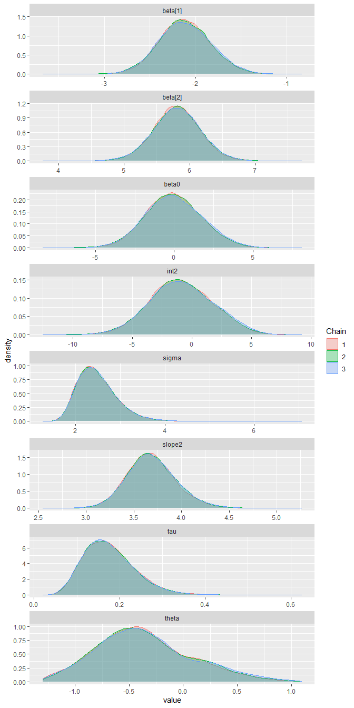

Comprehensive Final Exam
================
Daniel Carpenter
May 2022

-   [Question 1](#question-1)
    -   [1. (a) General Posterior](#1-a-general-posterior)
    -   [1. (d) If a further experiment is made after the first using
        the same coin, this time with n = 20, x = 12, what prior should
        the researcher use in the absence of any other information than
        what is given in this
        problem?](#1-d-if-a-further-experiment-is-made-after-the-first-using-the-same-coin-this-time-with-n--20-x--12-what-prior-should-the-researcher-use-in-the-absence-of-any-other-information-than-what-is-given-in-this-problem)
    -   [1. (e) Find the posterior after the second sequential
        experiment.](#1-e-find-the-posterior-after-the-second-sequential-experiment)
    -   [1. (f) The researcher now wishes to plot the posterior (that
        which is formed from the two experiments). Fill in the gaps of
        the code so that the correct plot is
        created.](#1-f-the-researcher-now-wishes-to-plot-the-posterior-that-which-is-formed-from-the-two-experiments-fill-in-the-gaps-of-the-code-so-that-the-correct-plot-is-created)
-   [Question 2 - Probability](#question-2---probability)
    -   [2. a) P(X \> 0.7\|α = 2,
        
        = 3)](#2-a-px--07α--2-beta--3)
    -   [2. b) P(X \< 0.2\|α = 1,
        
        = 1)](#2-b-px--02α--1-beta--1)
    -   [2. c) Find the value of X with lower tail probability 0.04. X ∼
        Beta(5,
        4)](#2-c-find-the-value-of-x-with-lower-tail-probability-004-x--beta5-4)
    -   [2. d) Find the equal tail interval that contains 95% of the
        distribution, X ∼ Beta(4,
        8)](#2-d-find-the-equal-tail-interval-that-contains-95-of-the-distribution-x--beta4-8)
    -   [2. e) Generate a random sample of X values of size 20 with X ∼
        Beta(5,
        7)](#2-e-generate-a-random-sample-of-x-values-of-size-20-with-x--beta5-7)
-   [Question 3 - Interpret
    Posteriors](#question-3---interpret-posteriors)
    -   [3. a) Give the 95% HDI for
        
        the probability of a
        success.](#3-a-give-the-95-hdi-for-theta-the-probability-of-a-success)
    -   [3. b) What is the posterior probability that
        
        \< 0.5](#3-b-what-is-the-posterior-probability-that-theta--05)
    -   [3. c) If H0 :
        
        = 0.5 should we reject it (the NULL),
        yes/no?](#3-c-if-h0--theta--05-should-we-reject-it-the-null-yesno)
    -   [3. d) The posterior probability that
        
        lies in (0.203, 0.413) is 0.90. True or
        False?](#3-d-the-posterior-probability-that-theta-lies-in-0203-0413-is-090-true-or-false)
    -   [3. e) What does ROPE stand for?](#3-e-what-does-rope-stand-for)
-   [Question 4 - GLM](#question-4---glm)
    -   [4. a) Link function?](#4-a-link-function)
    -   [4. b) What numerical values will replace the y
        variable?](#4-b-what-numerical-values-will-replace-the-y-variable)
    -   [4. c) High impact priors?](#4-c-high-impact-priors)
    -   [4. d) Interpret Point/Interval
        Estimates](#4-d-interpret-pointinterval-estimates)
-   [Question 5 - Exponential Family](#question-5---exponential-family)
    -   [5. a) Show
         = b^{\prime}(\theta)")](#5-a-show-ey--bprimetheta)
    -   [5. b) Show
         = b^{\prime \prime}(\theta) a(\phi)")](#5-b-show-vy--bprime-primetheta-aphi)
    -   [5. c) Show that the `Binomial` distribution belongs to the
        `exponential`
        family](#5-c-show-that-the-binomial-distribution-belongs-to-the-exponential-family)
    -   [5. d) Show
         = np")](#5-d-show-ey--np)
    -   [5. e) Show
         = np(1−p)")](#5-e-show-vy--np1p)
    -   [

         = n p (1 - p)")

        ](#-vy--n-p-1---p)
-   [Question 6 - Derive Evidence](#question-6---derive-evidence)
-   [Question 7 - 2 State MCMC](#question-7---2-state-mcmc)
    -   [7. a) Find the value of `A`](#7-a-find-the-value-of-a)
    -   [7. b) Find the value of `B`](#7-b-find-the-value-of-b)
    -   [7. c) Find the value of `C`](#7-c-find-the-value-of-c)
    -   [7. d) Formula for the acceptance
        probability](#7-d-formula-for-the-acceptance-probability)
-   [Question 8 - SLR JAGS](#question-8---slr-jags)
    -   [8. a) SLR Doodle Bug](#8-a-slr-doodle-bug)
    -   [8. b) JAGS Code](#8-b-jags-code)
    -   [8. c) Logical Node?](#8-c-logical-node)
    -   [8. d) Linear Predictors?](#8-d-linear-predictors)
-   [Question 9 - Change Point
    Regression](#question-9---change-point-regression)
    -   [9. b) JAGS Piecewise](#9-b-jags-piecewise)
-   [Question 10 - Centering Data](#question-10---centering-data)
    -   [10. a) Plot data](#10-a-plot-data)
    -   [10. b) 2 SLR Jags Models](#10-b-2-slr-jags-models)
    -   [10. c) Posterior Density Plots](#10-c-posterior-density-plots)
    -   [10. d) Differing Intervals
        Interpretation](#10-d-differing-intervals-interpretation)
    -   [10. e) Classical estimates of the two
        models](#10-e-classical-estimates-of-the-two-models)

------------------------------------------------------------------------

<br>

# Question 1

## 1. (a) General Posterior

*Adapted from JK’s book - page 132 Doing Bayesian Data Analysis:* <br>

If
")
and
"),
prove that
")
through proof below:

 \propto p(\theta) p(x \mid \theta) = \frac{1}{B(\alpha, \beta)} \theta^{\alpha-1}(1-\theta)^{\beta-1}\left(\begin{array}{l}n \\ x\end{array}\right) \theta^{x}(1-\theta)^{n-x}")

Note Bayes’ rule  
}_{Posterior} \propto \underbrace{p(\theta)}_{Prior} \underbrace{p(x \mid \theta)}_{Lik.} = \frac{p(x, n \mid \theta) p(\theta)}{p(x, n)} = p(\theta \mid x, n)")
<br>

Define Bernoulli and beta distributions  
^{(n-x)}}_{Bernoulli \ Lik.} \underbrace{\frac{\theta^{(\alpha-1)}(1-\theta)^{(\beta-1)}}{B(\alpha, \beta)}}_{Beta \ Prior} / p(x, n)")
<br>

Rearrange factors  
 p(x, n)} \theta^{(\alpha-1)} (1-\theta)^{(\beta-1)} \theta^{x}(1-\theta)^{(n-x)}")
<br>

} \theta^{(\alpha-1)} (1-\theta)^{(\beta-1)} \left(\begin{array}{l}\frac{1}{p(x, n)}\end{array}\right)\theta^{x}(1-\theta)^{(n-x)}")
<br>

By definition of the binomial coefficient, which we arrive at the
**solution**:  
} \theta^{(\alpha-1)} (1-\theta)^{(\beta-1)} \left(\begin{array}{l}n \\ x\end{array}\right) \theta^{x}(1-\theta)^{(n-x)}")
<br>

------------------------------------------------------------------------

<br>

## 1. (b) If  =  = 1 what prior distribution does this correspond to?

-   Shape 1 and Shape two with values of 1 create a `uniform`
    distribution.

## 1. (c) Suppose she uses  =  = 5 for the prior what is the posterior distribution?

-   Mixing a beta-prior and bernoulli likelihood Creates a `Beta` prior
    and posterior\`

-   n=10, x=4,
    
    =
    
    = 5

``` r
# These need to be in your document directory to load
source("DBDA2E-utilities.R")  # Load definitions of graphics functions etc.
source("BernBeta.R")          # Load the definition of the BernBeta function

# Specify the prior:
t = 4              # Specify the prior MODE.
n = 10             # Specify the effective prior sample size.
a = 5              # Convert to beta shape parameter a.
b = 5              # Convert to beta shape parameter b.

Prior = c(a,b)     # Specify Prior as vector with the two shape parameters.

# Specify the data:
N = 10                        # The total number of flips.
x = 4                         # The number of heads.
Data = c(rep(0,N-x),rep(1,x)) # Convert N and z into vector of 0's and 1's.


# Plot the three graphs, and >> VIEW THE POSTERIOR <<:
posterior = BernBeta( priorBetaAB=Prior, Data=Data , plotType="Bars" , 
                      showCentTend="Mode" , showHDI=TRUE , showpD=FALSE )
```

<!-- -->

## 1. (d) If a further experiment is made after the first using the same coin, this time with n = 20, x = 12, what prior should the researcher use in the absence of any other information than what is given in this problem?

-   Since there is no additional information, use hyper parameters
    
    =
    
    = 1 for this experiment.
-   In question 1(f) we will mix the betas to get a more informed result

## 1. (e) Find the posterior after the second sequential experiment.

-   Mixing a beta-prior and bernoulli likelihood Creates a
    `Beta posterior`
-   n=20, x=12,
    
    =
    
    = 1

``` r
# These need to be in your document directory to load
source("DBDA2E-utilities.R")  # Load definitions of graphics functions etc.
source("BernBeta.R")          # Load the definition of the BernBeta function

# Specify the prior:
t = 12              # Specify the prior MODE.
n = 20             # Specify the effective prior sample size.
a = 1              # Convert to beta shape parameter a.
b = 1              # Convert to beta shape parameter b.

Prior = c(a,b)     # Specify Prior as vector with the two shape parameters.

# Specify the data:
N = 20                        # The total number of flips.
x = 12                         # The number of heads.
Data = c(rep(0,N-x),rep(1,x)) # Convert N and z into vector of 0's and 1's.


# Plot the three graphs, and >> VIEW THE POSTERIOR <<:
posterior2 = BernBeta( priorBetaAB=Prior, Data=Data , plotType="Bars" , 
                       showCentTend="Mode" , showHDI=TRUE , showpD=FALSE )
```

<!-- -->

## 1. (f) The researcher now wishes to plot the posterior (that which is formed from the two experiments). Fill in the gaps of the code so that the correct plot is created.

### Mixed beta Calculation:

 + (1-w) \times dbeta(x, a2,b2)
")

### Mixed Beta function

``` r
Mymixbeta <- function(w=0.5, n=10, x, a1=1, a2=1, b1=1, b2=1) {
  # Specify the prior:
  t = x                          # Specify the prior MODE.
  
  # Specify the data:
  N = n                          # The total number of flips.
  z = x                          # The number of heads.
  Data = c(rep(0,N-z),rep(1,z))  # Convert N and z into vector of 0's and 1's.
  
  # Create summary values of Data:
  z = sum( Data ) # number of 1's in Data
  N = length( Data ) 
  
  Theta = seq(0.001,0.999,by=0.001)                                                 # points for plotting
  pTheta = w*dbeta(Theta,a1,b1) +(1-w)*dbeta(Theta,a2,b2)                           # prior for plotting
  pThetaGivenData = w*dbeta(Theta, a1+z, b1+N-z) + (1-w)*dbeta(Theta, a2+z, b2+N-z) # posterior for plotting
  pDataGivenTheta = Theta^z * (1-Theta)^(N-z)                                       # likelihood for plotting
  
  
  # Plot Layout
  layout( matrix( c( 1,2,3 ) ,nrow=3 ,ncol=1 ,byrow=FALSE ) ) # 3x1 panels
  par( mar=c(3,3,1,0) , mgp=c(2,0.7,0) , mai=c(0.5,0.5,0.3,0.1) ) # margins
  cexAxis = 1.33
  cexLab = 1.75
  
  # convert plotType to notation used by plot:
  plotType="h"
  dotsize = 5 # how big to make the plotted dots
  barsize = 5 # how wide to make the bar lines   
  
  # y limits for prior and posterior:
  yLim = c(0,1.1*max(c(pTheta,pThetaGivenData)))
  
  
  # Plot the Prior
  plot( Theta , pTheta , type=plotType , 
        pch="." , cex=dotsize , lwd=barsize ,
        xlim=c(0,1) , ylim=yLim , cex.axis=cexAxis ,
        xlab=bquote(theta) , ylab='Mixed Beta' , 
        cex.lab=cexLab ,
        main="Prior (beta) - Daniel Carpenter" , cex.main=1.5 , col="skyblue")
  
  # Plot the likelihood
  plot( Theta , pDataGivenTheta , type=plotType , 
        pch="." , cex=dotsize , lwd=barsize ,
        xlim=c(0,1) , ylim=c(0,1.1*max(pDataGivenTheta)) , cex.axis=cexAxis ,
        xlab=bquote(theta) , ylab=bquote( "p(D|" * theta * ")" ) , 
        cex.lab=cexLab ,
        main="Likelihood (Bernoulli)" , cex.main=1.5 , col="skyblue" )
  
  # Plot the posterior.
  plot( Theta , pThetaGivenData , type=plotType , 
        pch="." , cex=dotsize , lwd=barsize ,
        xlim=c(0,1) , ylim=yLim , cex.axis=cexAxis ,
        xlab=bquote(theta) , ylab='Mixed Beta Posterior' , 
        cex.lab=cexLab ,
        main="Posterior (beta)" , cex.main=1.5 , col="skyblue" )
}

# Call the function and print the prior (mixed beta), likelihood and posterior)
Mymixbeta(w=0.5, n=20, x=12, a1=1, a2=1, b1=5, b2=5)
```

<!-- -->

<!-- ### 1. f, i) A = ... -->
<!-- ### 1. f, ii) B = ... -->

------------------------------------------------------------------------

<br>

# Question 2 - Probability

## 2. a) P(X \> 0.7\|α = 2,  = 3)

``` r
pbeta(q = 0.7, 
      shape1 = 2, shape2 = 3,
      lower.tail = FALSE) # >
```

    ## [1] 0.0837

## 2. b) P(X \< 0.2\|α = 1,  = 1)

``` r
pbeta(q = 0.2, 
      shape1 = 1, shape2 = 1,
      lower.tail = TRUE) # <
```

    ## [1] 0.2

## 2. c) Find the value of X with lower tail probability 0.04. X ∼ Beta(5, 4)

``` r
qbeta(p = 0.04, 
      shape1 = 5, shape2 = 4, 
      lower.tail = TRUE) # <
```

    ## [1] 0.2739266

## 2. d) Find the equal tail interval that contains 95% of the distribution, X ∼ Beta(4, 8)

``` r
alphaCI = 0.05 / 2  # 2.5% upper/lower
a = 4 # shape 1 
b = 8 # shape 2

# Upper tail 97.5%
upperTail = qbeta(p = alphaCI, 
                  shape1=a, shape2=b, 
                  lower.tail = FALSE) # <

# Lower tail 2.5%
lowerTail = qbeta(p = alphaCI, 
                  shape1=a, shape2=b, 
                  lower.tail = TRUE) # >
# Equal tail interval: 95% confidence between 2.5% and 97.5%
paste0('There is a ', (1 - alphaCI * 2) * 100, '% Probability that the value will fall between ', 
      round(lowerTail, 3),' and ', round(upperTail, 3))
```

    ## [1] "There is a 95% Probability that the value will fall between 0.109 and 0.61"

## 2. e) Generate a random sample of X values of size 20 with X ∼ Beta(5, 7)

``` r
randBetaDist <- rbeta(n = 20, 
                      shape1 = 5,
                      shape2 = 7)

# Print the data
library(knitr)
kable(randBetaDist)
```

|         x |
|----------:|
| 0.4894074 |
| 0.2980459 |
| 0.6436076 |
| 0.3092375 |
| 0.5896615 |
| 0.6643829 |
| 0.6308936 |
| 0.2119625 |
| 0.3140222 |
| 0.2703963 |
| 0.5026362 |
| 0.3362534 |
| 0.6083700 |
| 0.5858480 |
| 0.4687701 |
| 0.4072835 |
| 0.7100258 |
| 0.2199426 |
| 0.5482064 |
| 0.5088132 |

------------------------------------------------------------------------

<br>

# Question 3 - Interpret Posteriors

## 3. a) Give the 95% HDI for  the probability of a success.

-   There is a probability of 95% that the value will fall between 0.184
    and 0.433

## 3. b) What is the posterior probability that  \< 0.5

-   The posterior probability that
    
    \< 0.5 is
    %

## 3. c) If H0 :  = 0.5 should we reject it (the NULL), yes/no?

-   Yes, we should reject it because 0.5 falls outside the 95% and 90%
    HDI

## 3. d) The posterior probability that  lies in (0.203, 0.413) is 0.90. True or False?

-   It is `TRUE` that there is a probability of 90% that the value will
    fall between 0.203 and 0.413

## 3. e) What does ROPE stand for?

-   ROPE stands for “Region Of Practical Equivalence”.
-   In bayesian analysis, if the ROPE is entirely within the HDI for
    
    then we should reject the NULL for practical purposes.

------------------------------------------------------------------------

<br>

# Question 4 - GLM

## 4. a) Link function?

-   There is a logit link function used. Model:

 = log (\frac{\theta}{(1 − \theta)})
")

## 4. b) What numerical values will replace the y variable?

-   The value of y is transformed onto a new scale, and that transformed
    value is modeled as a linear combination of predictors.
-   Maps theta *from* `0-1` *to* the real value between
    
    and
    

## 4. c) High impact priors?

-   No, they are `low` impact priors
-   It means that the prior distribution will not impact the posterior
    significantly

## 4. d) Interpret Point/Interval Estimates

### 4. d, 1)  Point Estimate

-   The point estimate for
    
    is -0.75905 with a standard deviation of 0.199376.
-   I.e. a male is more likely to die than a female.

### 4. d, 2)  Interval Estimate

-   There is a 95% probability that the values of
    
    will fall between 0.025778 and 0.6118

------------------------------------------------------------------------

<br>

# Question 5 - Exponential Family

The exponential family can be defined as any density of the following
form:

=\exp \left(\frac{y \theta-b(\theta)}{a(\phi)}+c(y, \phi)\right)
")

<br>

## 5. a) Show  = b^{\prime}(\theta)")

### Sum of distribution is 1

dy = 1 \\
")

### Differentiate above equation

dy = \frac{d}{d\theta} 1 = 0
")

### Take inside the integral


### Differentiate with  being the exponential

}{a(\phi)} \ 
\exp \left(\frac{y \theta-b(\theta)}{a(\phi)}
+ c(y, \phi)\right)
")

### Replace with  since it is the expontial

}{a(\phi)} \ f
")

### Plug  into above 

}{a(\phi)} \end{bmatrix} \ f \ dy = 0
")

### Distribute 

f}{a(\phi)} \end{bmatrix} \ f \ dy = 0
")

### Multiply by ") to get rid of it

f \ dy= 0
")

### Writing above in terms of E(Y)

 - b^{\prime}(\theta) \ \int_yf \ dy= 0
")

### *Solution*: Therefore, the expected value of Y ") is ")

 = b^{\prime}(\theta)
")

------------------------------------------------------------------------

<br>

## 5. b) Show  = b^{\prime \prime}(\theta) a(\phi)")

### From the prior proof above

}{a(\phi)} \end{bmatrix} \ f
")

### Get the second derivative of above

}{a(\phi)} \ f
+ \frac{y -b^{\prime}(\theta)}{a(\phi)} \ f^{\prime}
")

### Replace above  with  from prior proof (two above points)

}{a(\phi)} \ f
+ \begin{bmatrix} \frac{y -b^{\prime}(\theta)}{a(\phi)} \end{bmatrix}^2 \ f
")

### Note sum is 1 for all densities


### Take 2nd dertivative using above notes to get 0


### Plug  into above equation

}{a(\phi)} \ f
+ \begin{bmatrix} \frac{y -b^{\prime}(\theta)}{a(\phi)} \end{bmatrix}^2 \ f
\end{pmatrix} \
dy = 0
")

### Simplify prior equation and isolate }{a(\phi)}")

}{a(\phi)} \ 
\int_y f \ dy
+ \int_y  \frac{(y -b^{\prime}(\theta))^2}{a(\phi)^2} 
\ f \ dy = 0
")

### Plug expected value ") from prior proof knowledge that ") = ")

}{a(\phi)} 
+     \frac{1}{a(\phi)^2} \ 
\int_y (y - E(Y))^2
\ f \ dy = 0
")

### Subsititute Variance  for )^2")

}{a(\phi)} 
+     \frac{1}{a(\phi)^2} \ 
\sigma^2 = 0
")

### Simplify by Multiplying by ")

 \ a(\phi) + \sigma^2 = 0
")

### *Solution*: Therefore, we get see that the variance  is ")

 = \sigma^2 = b^{\prime \prime}a(\phi)
")

------------------------------------------------------------------------

<br>

## 5. c) Show that the `Binomial` distribution belongs to the `exponential` family

### Given the binomial definition, rearrange:

 &=\left(\begin{array}{c}
n \\ y
\end{array}\right) p^{y}(1-p)^{n-y} \\
&=\left(\begin{array}{c}
n \\ y
\end{array}\right)(1-p)^{n}\left(\frac{p}{1-p}\right)^{y} \\
\end{aligned}
")

### Therefore we see it is apart of the exponential family

 = 
\left(\begin{array}{l} n \\ y
\end{array}\right)(1-p)^{n} \exp \left(\log \left(\frac{p}{1-p}\right) y\right)
")

------------------------------------------------------------------------

<br>

## 5. d) Show  = np")

### Using the definition of a Moment Generating Function

=\frac{n !}{y !(n-y) !} p^{y} q^{n-y} \quad \text { with } \quad q=1-p .
")

### MGF Given by:

 &=\sum_{y=0}^{n} e^{y t} \frac{n !}{y !(n-y) !} p^{y} q^{n-y} \\
&=\sum_{y=0}^{n} \frac{n !}{y !(n-y) !}\left(p e^{t}\right)^{y} q^{n-y} \\
&=\left(p e^{t}+q\right)^{n}
\end{aligned}
")

### Differentiate the MGF with respect to  using the function-of-a-function rule:

}{d t} &=n\left(q+p e^{t}\right)^{n-1} p e^{t} \\
&=n p e^{t}\left(p e^{t}+q\right)^{n-1}
\end{aligned}
")

### *Solution*: Now use  to get "), which is = 

 &=n p(p+q)^{n-1} \\
&=n p 
\end{aligned}
")

------------------------------------------------------------------------

<br>

## 5. e) Show  = np(1−p)")

### Find the second moment using product rule:


}{d t^{2}} &=n p e^{t}\left\{(n-1)\left(p e^{t}+q\right)^{n-2} p e^{t}\right\}+\left(p e^{t}+q\right)^{n-1}\left\{n p e^{t}\right\} \\
&=n p e^{t}\left(p e^{t}+q\right)^{n-2}\left\{(n-1) p e^{t}+\left(p e^{t}+q\right)\right\} \\
&=n p e^{t}\left(p e^{t}+q\right)^{n-2}\left\{q+n p e^{t}\right\} .
\end{aligned}
")

### Use  again:

 &=n p(p+q)^{n-2}(n p+q) \\
&=n p(n p+q)
\end{aligned}
")

### Derive =E(Y-\mu)^{2}"), in turn this means that  = np(1 - p)")

> You could also write it as
>  = n p q")
> where
> 

 &=E\left(y^{2}\right)-\{E(Y)\}^{2} \\
&=n p(n p+q)-n^{2} p^{2} \\
&=n p q \\
\end{aligned}
")

### *Solution*: Knowing that , we know  = n p (1 - p)") from above 

## 

 = n p (1 - p)")

<br>

# Question 6 - Derive Evidence

*Some of the derivation below may look similar to question 1 (a):*
<br>  
*Adapted from JK’s book - page 132 Doing Bayesian Data Analysis:* <br>

If
")
and
"),
prove that
")
through proof below:

 \propto p(\theta) p(x \mid \theta) = \frac{1}{B(\alpha, \beta)} \theta^{\alpha-1}(1-\theta)^{\beta-1}\left(\begin{array}{l}n \\ x\end{array}\right) \theta^{x}(1-\theta)^{n-x}")

Note Bayes’ rule  

}_{Posterior} \propto 
\underbrace{p(\theta)}_{Prior} \underbrace{p(x \mid \theta)}_{Lik.} 
\ / \underbrace{p(x)}_{Evidence} 
= \frac{p(x, n \mid \theta) p(\theta)}{p(x, n)} / p(x) = p(\theta \mid x, n) / p(x)
")

<br>

Define Bernoulli and beta distributions  
^{(n-x)}}_{Bernoulli \ Lik.} \underbrace{\frac{\theta^{(\alpha-1)}(1-\theta)^{(\beta-1)}}{B(\alpha, \beta)}}_{Beta \ Prior} / p(x, n) / p(x)")
<br>

Rearrange factors  
 p(x, n)} \theta^{(\alpha-1)} (1-\theta)^{(\beta-1)} \theta^{x}(1-\theta)^{(n-x)} / p(x)")
<br>

} \theta^{(\alpha-1)} (1-\theta)^{(\beta-1)} \left(\begin{array}{l}\frac{1}{p(x, n)}\end{array}\right)\theta^{x}(1-\theta)^{(n-x)} / p(x)")
<br>

By definition of the binomial coefficient, which we arrive at the
solution *in terms of `posterior`*:  

}_{Posterior} = 
\frac{\frac{1}{B(\alpha, \beta)} \theta^{(\alpha-1)} (1-\theta)^{(\beta-1)} \left(\begin{array}{l}n \\ x\end{array}\right) \theta^{x}(1-\theta)^{(n-x)}} 
{\underbrace{p(x)}_{Evidence}}
")

<br>

***Final Solution***: By rearranging to be *in terms of the `evidence`*

}_{Evidence} = \frac{\frac{1}{B(\alpha, \beta)} \theta^{(\alpha-1)} (1-\theta)^{(\beta-1)} \left(\begin{array}{l}n \\ x\end{array}\right) \theta^{x}(1-\theta)^{(n-x)}} {\underbrace{p(\theta \mid x)}_{Posterior}}
")

------------------------------------------------------------------------

<br>

# Question 7 - 2 State MCMC

## 7. a) Find the value of `A`

-   Since the die landed on 6, and 6 is
    
    `E1` (current acceptance set), then
-   Reject the proposal of 2 and stay at state 1
-   Therefore, `A` = State `1`

## 7. b) Find the value of `B`

-   Since we are at state `2` and the proposal state is state `1`, the
    value of alpha (or `B`) is `0.67`

## 7. c) Find the value of `C`

-   Since the die landed on 6, and 6 is
    
    `E2` (current acceptance set), then
-   Accept the proposal and change to at state 1
-   Therefore, `C` = State `1`

## 7. d) Formula for the acceptance probability

Note below is from page 33 of *Teaching MCMC* by Stewart & Stewart:


where

is the probability of accepting state

given that the sampler is at state
.

------------------------------------------------------------------------

<br>

# Question 8 - SLR JAGS

## 8. a) SLR Doodle Bug


## 8. b) JAGS Code

> Jags code for the model using uniform’s on the sigma’s

-   The data came as a data frame of x and y values with a total of n
    rows

``` r
model{
    for( i in 1 : n ) {
        y[i] ~ dnorm(mu[i], tau)
        mu[i] <- beta0 + beta1 * x[i]
    }
    beta0 ~ dnorm(0.0, 1.0E-6)
    beta1 ~ dnorm(0.0, 1.0E-6)
    sigma ~ dunif(0, 1000)
    tau <- pow(sigma,  -2)
}
```

## 8. c) Logical Node?

-   `tau` is considered a logical node,
-   Because `tau` is logically related to `sigma`
-   `tau` is a function of sigma.

## 8. d) Linear Predictors?

The linear predictor variables are:


------------------------------------------------------------------------

<br>

# Question 9 - Change Point Regression

``` r
dataList = list(x = c(-10, -9, -8, -7, -6, -5, -4, -3, -2, -1, 0, 1, 2, 
3, 4, 5, 6, 7, 8, 9, 10), y = c(21.72, 20.41, 14.06, 14.6, 13.8, 
10.4, 8.22, 6.79, 4.92, 0.45, 4.57, 1.95, 10.14, 13.28, 21.88, 
18.88, 22.91, 23.53, 34.99, 35.07, 39.17), N = 21)
```

``` r
df = data.frame(x = dataList$x, y=dataList$y)
head(df)
```

    ##     x     y
    ## 1 -10 21.72
    ## 2  -9 20.41
    ## 3  -8 14.06
    ## 4  -7 14.60
    ## 5  -6 13.80
    ## 6  -5 10.40

``` r
library(ggplot2)
basePlot <- ggplot(df, aes(x=x, y=y)) +
              geom_smooth(method = 'loess', se = TRUE, 
                          color = 'steelblue3', fill = 'grey90', alpha = 0.5) + 
              geom_point(color ='tomato3', alpha = 0.5, size = 3) +
              theme_minimal() +
              labs(title = 'Plot of Data',
                   subtitle = 'Daniel Carpenter')
basePlot
```

<!-- -->

## 9. b) JAGS Piecewise

### 9. b,i) Jags Code

``` r
library(rjags)
#Define the model:
modelString = "
model {
  for (i in 1:N) {
    y[i]    ~ dnorm(mu[i], tau)
    mu[i]  <- beta0 + beta[1]*x[i] + beta[2]*(x[i] - theta)
            * step(x[i] - theta)
  }
  tau       ~ dgamma(0.001, 0.001)
  beta0     ~ dnorm(0.0, 1.0E-6)
  
  for (j in 1:2) {
    beta[j] ~ dnorm(0.0, 1.0E-6)
  }
  sigma    <- 1/sqrt(tau)
  theta     ~ dunif(-1.3, 1.1)
  
  int2 <- beta0 - beta[1]*theta
  slope2 <- beta[1] + beta[2]
}
" # close quote for modelString
writeLines( modelString , con="TEMPmodel.txt" )

initsList = list(tau = 1, beta0 = 2, beta = c(1, 2), theta = 1)

# Run the chains:
jagsModel = jags.model( file="TEMPmodel.txt" , data=dataList , inits=initsList , 
                        n.chains=3 , n.adapt=500 )
```

    ## Compiling model graph
    ##    Resolving undeclared variables
    ##    Allocating nodes
    ## Graph information:
    ##    Observed stochastic nodes: 21
    ##    Unobserved stochastic nodes: 5
    ##    Total graph size: 165
    ## 
    ## Initializing model

``` r
update( jagsModel , n.iter=500 )
codaSamples = coda.samples( jagsModel , variable.names=c("tau", "sigma",
                                                         'beta', 'beta0', 'theta',
                                                         'int2', 'slope2'),
                            n.iter=33340 )
save( codaSamples , file=paste0("FinalExamJags","Mcmc.Rdata") )
```

### 9. b,ii) Interpret Summary Output

``` r
# Uncomment to see some diagnostics - left here because high autocorrelation
# diagMCMC( codaObject=codaSamples , parName="beta0" )
# diagMCMC( codaObject=codaSamples , parName="beta[1]" )
# diagMCMC( codaObject=codaSamples , parName="int2" )
# diagMCMC( codaObject=codaSamples , parName="slope2" )

# Quick check
library(ggmcmc)
s = ggs(codaSamples)
ggs_density(s)
```

<!-- -->

``` r
# Output of model
su = summary(codaSamples)
su
```

    ## 
    ## Iterations = 1001:34340
    ## Thinning interval = 1 
    ## Number of chains = 3 
    ## Sample size per chain = 33340 
    ## 
    ## 1. Empirical mean and standard deviation for each variable,
    ##    plus standard error of the mean:
    ## 
    ##             Mean     SD  Naive SE Time-series SE
    ## beta[1] -2.11610 0.2878 0.0009101      0.0052203
    ## beta[2]  5.80429 0.3670 0.0011604      0.0047173
    ## beta0   -0.03299 1.8007 0.0056938      0.0336505
    ## int2    -0.87171 2.6439 0.0083599      0.0504985
    ## sigma    2.49377 0.4544 0.0014369      0.0023305
    ## slope2   3.68820 0.2610 0.0008253      0.0028760
    ## tau      0.17601 0.0600 0.0001897      0.0002979
    ## theta   -0.35613 0.4397 0.0013904      0.0074103
    ## 
    ## 2. Quantiles for each variable:
    ## 
    ##             2.5%     25%      50%      75%   97.5%
    ## beta[1] -2.66999 -2.3101 -2.12318 -1.92573 -1.5355
    ## beta[2]  5.07492  5.5667  5.80521  6.04378  6.5297
    ## beta0   -3.47302 -1.2610 -0.07798  1.16685  3.5780
    ## int2    -5.97417 -2.6779 -0.94293  0.93422  4.3215
    ## sigma    1.79235  2.1718  2.43145  2.74680  3.5561
    ## slope2   3.20662  3.5128  3.67466  3.85070  4.2412
    ## tau      0.07908  0.1325  0.16915  0.21201  0.3113
    ## theta   -1.11506 -0.6674 -0.40226 -0.08898  0.6087

#### Interpret the value of theta using both the point estimate and 95% BCI

-   Point estimate: the mean value of theta is -0.35806 with a standard
    deviation of 0.44068
-   Inteval estimate: There is a 95% probability that the value of theta
    will fall between -1.12416 and 0.6013
-   Above values rounded since each MCMC run varies in results (since it
    is an estimation)

### 9. b,iii) Plot Estimating Lines over Data

``` r
# Create objects using summary stats
beta0  = su$statistics[,'Mean']['beta0']
beta1  = su$statistics[,'Mean']['beta[1]']
beta2  = su$statistics[,'Mean']['beta[2]']
int2   = su$statistics[,'Mean']['int2']
slope2 = su$statistics[,'Mean']['slope2']
theta  = su$statistics[,'Mean']['theta']

# Plot the two estimated linear pieces with the cuttoff point
basePlot + 
  
  # Piece 1
  geom_abline(intercept = beta0, slope = beta1 , 
              linetype = 'dotdash', size = 1, color = 'grey40')  +  
  
  
  # Piece 2
  geom_abline(intercept = int2,  slope = slope2, 
              linetype = 'dotdash', size = 1, color = 'grey40') + # Piece 2
  geom_vline(xintercept = theta)                 + # Intersection 
  labs(title = 'Plot of data with Piece-Wise Linear Regression Estimates using MCMC')
```

<!-- -->

### Final Remarks on Enhancements to model

-   Note the intercept of the second piece may or may not reflect the
    data (See graph)
-   Note high autocorelation among the variables.
-   Centering will not fix this issue, but I anticipate that a potential
    enhancement to the model would be to determine a fix for the
    intercept issue.

------------------------------------------------------------------------

<br>

# Question 10 - Centering Data

Below shows the data

``` r
# For x and y
x=50:80
set.seed(24)
y=10+2*x+rnorm(31,0,10)

# For xx and yy (notice centered around 0)
xx=-15:15
set.seed(24)
yy=10+2*xx+rnorm(31,0,10)
```

## 10. a) Plot data

``` r
df2 = data.frame(x=x, 
                y=y,
                
                xx=xx,
                yy=yy)
head(df2)
```

    ##    x        y  xx        yy
    ## 1 50 104.5412 -15 -25.45881
    ## 2 51 117.3659 -14 -12.63415
    ## 3 52 118.1962 -13 -11.80377
    ## 4 53 110.1637 -12 -19.83627
    ## 5 54 126.4746 -11  -3.52540
    ## 6 55 122.6602 -10  -7.33978

``` r
require(ggplot2)
ggplot(df2) +
  
  # Emphasize the x and y axis
  geom_hline(aes(yintercept = 0), size = 1, color = 'grey60') +
  geom_vline(aes(xintercept = 0), size = 1, color = 'grey60') + 
  
  # Two grouping
  geom_point(aes(x=x,  y=y ), color ='darkseagreen', alpha = 0.75, size = 3) +
  geom_point(aes(x=xx, y=yy), color ='steelblue3',    alpha = 0.75, size = 3) +
  
  theme_minimal() +
  labs(title = 'Plot of Data',
       subtitle = 'Daniel Carpenter')
```

<!-- -->

## 10. b) 2 SLR Jags Models

### This is the base function for each SLR Model to run

``` r
MyJagsSLR <- function(y, x ) {
  
  Ntotal = length(y)  # Compute the total number of x,y pairs.
  dataList = list(    # Put the information into a list.
    x = x,
    y = y ,
    Ntotal = Ntotal 
  )
  
  modelStringSLR = "
  model{
      for( i in 1 : Ntotal ) {
          y[i] ~ dnorm(mu[i], tau)
          mu[i] <- beta0 + beta1 * x[i]
      }
      beta0 ~ dnorm(0.0, 1.0E-6)
      beta1 ~ dnorm(0.0, 1.0E-6)
      sigma ~ dunif(0, 1000)
      tau <- pow(sigma,  -2)
  }
  " # close quote for modelString
  writeLines( modelStringSLR , con="slrModel.txt" )
  
  # Initialize the chains based on MLE of data.
  initsList = list(beta0 = 0, beta1 = 0, sigma =10)
  
  # Run the chains:
  jagsModel = jags.model( file="slrModel.txt" , data=dataList , inits=initsList , 
                          n.chains=3 , n.adapt=500 )
  update( jagsModel , n.iter=500 )
  codaSamples = coda.samples( jagsModel , variable.names=c("beta0", "beta1", "sigma") ,
                              n.iter=33340 )
  
  return(list('codaSamples' = codaSamples,
              'summary'     = summary(codaSamples)
              )
        )
}
```

### 10. b, i) Jags Model 1

``` r
# Call SLR Jags model (for x and y)
codaSamples1 <- MyJagsSLR(y=y, x=x)
```

    ## Compiling model graph
    ##    Resolving undeclared variables
    ##    Allocating nodes
    ## Graph information:
    ##    Observed stochastic nodes: 31
    ##    Unobserved stochastic nodes: 3
    ##    Total graph size: 134
    ## 
    ## Initializing model

``` r
# Retrieve the summary stats (for x and y)
codaSamples1$summary
```

    ## 
    ## Iterations = 1001:34340
    ## Thinning interval = 1 
    ## Number of chains = 3 
    ## Sample size per chain = 33340 
    ## 
    ## 1. Empirical mean and standard deviation for each variable,
    ##    plus standard error of the mean:
    ## 
    ##         Mean     SD  Naive SE Time-series SE
    ## beta0 15.737 9.7588 0.0308569       0.314148
    ## beta1  1.886 0.1488 0.0004706       0.004806
    ## sigma  7.453 1.0371 0.0032793       0.005776
    ## 
    ## 2. Quantiles for each variable:
    ## 
    ##         2.5%   25%    50%    75%  97.5%
    ## beta0 -3.356 9.217 15.733 22.338 35.016
    ## beta1  1.593 1.786  1.887  1.985  2.178
    ## sigma  5.751 6.719  7.345  8.062  9.808

### 10. b, ii) Jages Model 2

``` r
# Call SLR Jags model (for xx and yy)
codaSamples2 <- MyJagsSLR(y=yy, x=xx)
```

    ## Compiling model graph
    ##    Resolving undeclared variables
    ##    Allocating nodes
    ## Graph information:
    ##    Observed stochastic nodes: 31
    ##    Unobserved stochastic nodes: 3
    ##    Total graph size: 134
    ## 
    ## Initializing model

``` r
# Retrieve the summary stats (for xx and yy)
codaSamples2$summary
```

    ## 
    ## Iterations = 1001:34340
    ## Thinning interval = 1 
    ## Number of chains = 3 
    ## Sample size per chain = 33340 
    ## 
    ## 1. Empirical mean and standard deviation for each variable,
    ##    plus standard error of the mean:
    ## 
    ##        Mean    SD  Naive SE Time-series SE
    ## beta0 8.342 1.348 0.0042633      0.0042374
    ## beta1 1.887 0.151 0.0004774      0.0004755
    ## sigma 7.465 1.040 0.0032874      0.0047396
    ## 
    ## 2. Quantiles for each variable:
    ## 
    ##        2.5%   25%   50%   75%  97.5%
    ## beta0 5.676 7.453 8.345 9.230 11.004
    ## beta1 1.590 1.787 1.886 1.985  2.186
    ## sigma 5.755 6.731 7.351 8.070  9.821

## 10. c) Posterior Density Plots

``` r
library(ggmcmc)

# Density Plots 
ggs_density(ggs(codaSamples1$codaSamples)) # (for x  and y )
```

<!-- -->

``` r
ggs_density(ggs(codaSamples2$codaSamples)) # (for xx and yy)
```

<!-- -->

## 10. d) Differing Intervals Interpretation

### Explain why the intervals for  are so different.

-   Since the `xx` and `yy` dataset are centered around 0, it allows
    for:
    -   convergence among the chains
    -   Low levels of cross-correlation
    -   Extremely stable results
-   It is obvious that the `x` and `y` model is not centered (visually
    and from the summary results.)
-   To overcome this, we could just make a Jags script to center the
    data around 0

### Make reference to the density plots also.

-   For the non-centered model:
    -   You can see that there are “fatter” tails for the non-centered
        model. Not stationary.
    -   Chains do not represent each other as well as the centered model

## 10. e) Classical estimates of the two models

### Use the function `lm()` and make classical 95% confidence interval estimates for the

``` r
# Non-centered data
est.nonCenter <- lm(y  ~ x , data = df2) 
summary(est.nonCenter)
```

    ## 
    ## Call:
    ## lm(formula = y ~ x, data = df2)
    ## 
    ## Residuals:
    ##     Min      1Q  Median      3Q     Max 
    ## -14.656  -4.718   1.471   4.614  17.237 
    ## 
    ## Coefficients:
    ##             Estimate Std. Error t value Pr(>|t|)    
    ## (Intercept)  15.7178     9.3954   1.673    0.105    
    ## x             1.8867     0.1432  13.176 9.05e-14 ***
    ## ---
    ## Signif. codes:  0 '***' 0.001 '**' 0.01 '*' 0.05 '.' 0.1 ' ' 1
    ## 
    ## Residual standard error: 7.131 on 29 degrees of freedom
    ## Multiple R-squared:  0.8569, Adjusted R-squared:  0.8519 
    ## F-statistic: 173.6 on 1 and 29 DF,  p-value: 9.052e-14

``` r
# Centered data
est.centered  <- lm(yy ~ xx, data = df2) 
summary(est.centered)
```

    ## 
    ## Call:
    ## lm(formula = yy ~ xx, data = df2)
    ## 
    ## Residuals:
    ##     Min      1Q  Median      3Q     Max 
    ## -14.656  -4.718   1.471   4.614  17.237 
    ## 
    ## Coefficients:
    ##             Estimate Std. Error t value Pr(>|t|)    
    ## (Intercept)   8.3525     1.2808   6.521 3.85e-07 ***
    ## xx            1.8867     0.1432  13.176 9.05e-14 ***
    ## ---
    ## Signif. codes:  0 '***' 0.001 '**' 0.01 '*' 0.05 '.' 0.1 ' ' 1
    ## 
    ## Residual standard error: 7.131 on 29 degrees of freedom
    ## Multiple R-squared:  0.8569, Adjusted R-squared:  0.8519 
    ## F-statistic: 173.6 on 1 and 29 DF,  p-value: 9.052e-14

### Compare to bayesian estimates

-   The models come up with same results, which is concerning!
-   Proves the point that you could get bad results without centering
    your data
